## 第一章 职业道德

职业道德是每一名从业人员在职业活动中必须遵守的行为准则，它揭示了从业人员与服务对象、职业与职工、职业与职业之间一种最为广阔的社会关系。

【知识要点】

1. 公民道德建设基本内容。 
2. 职业道德的基本知识。


### 第一节 职业道德基本知识


#### 知识点1：公民道德建设的总体要求是什么

>  以习近平新时代中国特色社会主义思想为指导，紧紧围绕进行伟大斗争、建设伟大工程、推进伟大事业、实现伟大梦想着眼构筑中国精神、中国价值、中国力量，促进全体人民在理想信念、价值理念、道德观念上紧密团结在一起，在全民族牢固树立中国特色社会主义共同理想，在全社会大力弘扬社会主义核心价值观，积极倡导富强民主文明和谐、自由平等公正法治、爱国敬业诚信友善，全面推进<u>社会公德、职业道德、家庭美德、个人品德</u>建设，持续强化教育引导、实践养成、制度保障，不断提升公民道德素质，促进人的全面发展，培养和造就担当民族复兴大任的时代新人。


#### 知识点2：公民道德建设要做到哪6个坚持

> 1. 坚持马克思主义道德观、社会主义道德观，倡导共产主义道德，以为人民服务为核心，以集体主义为原则，以爱祖国、爱人民、爱劳动、爱科学、爱社会主义为基本要求，始终保持公民道德建设的社会主义方向。
> 2. 坚持以社会主义核心价值观为引领，将国家、社会、个人层面的价值要求，贯穿于道德建设各方面，以主流价值建构道德规范、强化道德认同、指引道德实践，引导人们明大德、守公德、严私德。
> 3. 坚持在继承传统中创新发展，自觉传承中华传统美德，继承我们党领导人民在长期实践中形成的优良传统和革命道德，适应新时代改革开放和社会主义市场经济发展要求，积极推动创造性转化、创新性发展，不断增强道德建设的时代性实效性。
> 4. 坚持提升道德认知与推动道德实践相结合，尊重人民群众的主体地位，激发人们形成善良的道德意愿、道德情感，培育正确的道德判断和道德责任，提高道德实践能力尤其是自觉实践能力，引导人们向往和追求讲道德、尊道德、守道德的生活。
> 5. 坚持发挥社会主义法治的促进和保障作用，以法治承载道德理念、鲜明道德导向、弘扬美德义行，把社会主义道德要求体现在立法、执法、司法、守法之中，.以法治的力量引导人们向上向善。
> 6. 坚持积极倡导与有效治理并举，遵循道德建设规律，把先进性要求与广泛性要求结合起来，坚持重在建设、立破并举，发挥榜样示范引领作用，加大突出问题整治力度，树立新风正气，祛除歪风邪气。


#### 知识点3：==公民道德建设的重点任务有哪些==

> 1. 筑牢理想<u>信念</u>之基。
> 2. 培育和践行社会主义核心<u>价值观</u>。
> 3. 传承中华传统<u>美德</u>。
> 4. 弘扬<u>民族精神和时代精神</u>。


#### 知识点4：如何深化道德教育引导

> 1. 把立德树人贯穿于<u>学校</u>教育全过程。
> 2. 用良好<u>家教</u>家风涵育道德品行。
> 3. 以<u>先进模范</u>引领道德风尚。
> 4. 以正确<u>舆论</u>营造良好道德环境。
> 5. 以优秀<u>文艺作品</u>陶冶道德情操。
> 6. 发挥各类阵地<u>道德教育</u>作用。
> 7. 抓好<u>重点群体</u>的教育引导。


#### 知识点5：加强公民道德建设有哪4个看力点

> 要把==社会公德、职业道德、家庭美德、个人品德==建设作为着力点。
>
> 1. 推动践行以<u>文明礼貌、助人为乐、爱护公物、保护环境、遵纪守法</u>为主要内容的社会公德，鼓励人们在社会上做一个好公民。
> 2. 推动践行以<u>爱岗敬业、诚实守信、办事公道、热情服务、奉献社会</u>为主要内容的职业道德，鼓励人们在工作中做一个好建设者。
> 3. 推动践行以<u>尊老爱幼、男女平等、夫妻和睦、勤俭持家、邻里互助</u>为主要内容的家庭美德，鼓励人们在家庭里做一个好成员。
> 4. 推动践行以<u>爱国奉献、明礼遵规、勤劳善良、宽厚正直、自强自律</u>为主要内容的个人品德，鼓励人们在日常生活中养成好品行。
>


#### 知识点6：什么是职业道德

>  ​	职业道德是道德体系中一个重要的组成部分，是指从事一定职业劳动的人们，在特定的工作和劳动中以其内心信念和特殊社会手段来维系的，以==善恶==进行评价的心理意识、行为原则和行为规范的总和。它是人们在从事职业的过程中形成的一种<u>内在的、非强制性</u>的约束机制。它是==职业范围==内的<u>特殊道德要求</u>，是一般社会道德在职业生活中的具体体现。


#### 知识点7：==职业道德有什么特征==

> 1. 职业性
>
>    职业道德必须通过从业人员在职业活动中体现。
>
> 2. 普遍性
>
>    职业道德具有从业人员共同遵守基本职业道德行为规范的普遍性特征。爱岗敬业、忠于职守、诚实守信、团队合作、遵守职业纪律、遵守所在国法律、勤俭节约、奉献社会等精神，都具有职业道德的普遍特征。
>
> 3. 自律性
>    职业道德具有自我约束、控制的特征。这也是职业道德与法律、纪律的区别之所在，因为法律、纪律是通过命令或强制的方式来实现对公民行为的约束，而自我约束、控制职业行为的这种自律性则是职业道德的显著特征。
>
> 4. 他律性
>    职业道德具有舆论影响的特征。从业人员在职业生涯中随时都受到所从事职业领域的职业道德舆论的影响。
>
> 5. 行业性和多样性
>    职业道德是与社会职业分工紧密联系的，各行各业都有适合自身行业特点的职业道德规范。正因为职业道德具有多行业性，因而表现出形式的多样性。
>
> 6. 继承性和相对稳定性
>    职业道德反映职业关系时往往与社会风俗、民族传统文化相联系，许多职业道德跨越了国界和历史时代作为人类职业精神文明文化被传承了下来，并相对稳定。
>
> 7. 实践性
>    从业人员与职业道德相关的知识、情感、意志、信念、觉悟、行为规范等都必须通过职业的实践活动，在自己的职业行为中表现出来，并且接受行业职业道德的评价和自我评价，使职业道德形成理论与实践的紧密结合体。


#### 知识点8：什么是职业道德行为规范

> ​	职业道德行为规范是从业人员在职业活动中必须遵守的<u>符合人民根本利益</u>的<u>职业行为准则</u>。它包含职业道德基本行为规范和职业道德特殊行为规范。《新时代公民道德建设实施纲要》提出，爱岗敬业、诚实守信、办事公道、热情服务、奉献社会是从业人员职业道德规范的主要内容。


#### 知识点9：公民基本道德行为规范与职业道德行为规范有什么关系

> ​	公民基本道德行为规范包含了职业道德行为规范，两者是包含与被包含的关系。
> 从业人员在职业行为中必须做到：第一，遵守公民基本道德行为规范；第二，遵守职业道德基本行为规范；第三，遵守具有从业人员自身职业特点的职业道德行为规范（包括本行业职业道德规范和所在岗位的职业道德规范）。


#### 知识点10：如何正确处理个人、集体、国家三者之间的关系

> ​	正确处理个人、集体和国家三者之间的关系，这既是增强职业<u>责任</u>感的要求，也是职业<u>道德</u>的要求。在我们国家，个人利益、集体利益和国家利益是<u>根本一致</u>的。但是，由于职业的不同，工作的岗位不同，工作的地区不同和工作单位的所有制不同，不同从业人员之间客观上存在一些利益差别。这些差别的存在，就会产生个人利益、集体利益和国家利益之间的矛盾。一个具有高尚职业道德的人，在三者发生矛盾的时候，应该把国家利益和集体利益放在第一位，把个人利益放在第二位，使个人利益服从国家利益和集体利益，在必要的时候牺牲个人利益。这种境界既是高尚职业道德的表现，也是强烈职业责任心的表现。


#### 知识点11：==职业责任的特点及其与职业道德的关系是什么==

> ​	职业责任有<u>差异性</u>、<u>独立性</u>和<u>强制性</u>等特点。职业道德和职业责任在人们的职业生活中是<u>相互联系</u>、<u>相互作用</u>的，以什么样的思想、感情、态度、作风、行为来对待本职工作，既是职业责任的问题，也是职业道德的问题。事实证明：职业道德水平高的人，都具有强烈的职业责任感；反之，缺乏职业道德的人，必然是个缺乏职业责任感的人。


#### 知识点12：==什么是职业纪律==

> ​	职业纪律是指在特定的职业范围内从事某种职业的人们必须共同遵守的行为准则。


### 第二节 职业守则

【知识要点】

1. 职业标准与职业资格。
2. 消防设施操作员职业守则。


#### 知识点1：职业如何分类

> 1. 职业分类的含义
>    职业分类是指以<u>工作性质的==同一性==为基本原则</u>，对社会职业进行的系统划分与归类。<u>职业分类作为制定==职业标准==的依据</u>，是促进人力资源科学化、规范化管理的重要基础性工作。
>
> 2. 职业类型划分
>    目前，《中华人民共和国职业分类大典（2022年版）》将我国职业划分为以下==八==大类：
>
>    ​	第一大类，包含党的机关、国家机关、群众团体和会组织、企事业单位负责人；
>    ​	第二大类，包含专业技术人员；
>    ​	第三大类，包含办事人员和有关人员；
>    ​	第四大类，包含社会生产服务和生活服务人员；
>    ​	第五大类，包含农、林、牧、渔业生产及辅助人员；
>    ​	第六大类，包含生产制造及有关人员；
>    ​	第七大类，包含军队人员；
>    ​	第八大类，包含不便分类的其他从业人员。其中，以职业活动所涉及的经济领域、知识领域以及所提供的产品和服务种类为主要参照，将职业划分为79个中类。


#### 知识点2：什么是职业资格

> ​	职业资格是对从事某一职业所具备的学识、技术、能力的基本要求。我国职业资格包括==专业==技术人员职业资格和==技能==人员职业资格两类，按照==资格性质==又分为（统一考试，注册，必须持证上岗）==准入类==职业资格和（不一定需要持证上岗）==水平评价类==职业资格。


#### 知识点3：什么是准入类职业资格

> ​	准入类职业资格，其所涉职业（工种）必须<u>关系公共利益</u>或<u>涉及国家安全、公共安全、人身健康、生命财产安全</u>，且必须有<u>法律法规或国务院决定</u>作为依据，如消防设施操作员。


#### 知识点4：什么是消防设施操作员

> ​	消防设施操作员是从事建（构）筑物消防设施运行、操作和维修、保养、检测等工作的人员。


#### 知识点5：消防设施操作员国家职业技能标准包括哪些内容

> ​	消防设施操作员国家职业技能标准经人力资源社会保障部、应急管理部批准，于2019年5月颁布施行。该标准以“<u>职业活动</u>为导向、职业==技能==为核心”为指导思想，对消防设施操作员从业人员的职业活动==内容==进行规范细致描述，对各等级从业人员的技能水平和理论知识水平进行了明确规定。
>
> ​	消防设施操作员职业一共设==五==个等级，其中，消防设施监控操作职业方向分为五级初级工、四级/中级工、三级/高级工、二级/技师；消防设施检测维修保养职业方向分为四级/中工、三级/高级工、二级/技师、一级/高级技师。该标准包括职业概况、基本要求、工作要求和权重表4个方面的内容，含有设施监控、设施操作、设施保养、设施维修、设施检测、技术管理和培训==6==个职业功能。


#### 知识点6：==消防设施操作员职业守则是什么==

> 1. 以人为本，生命至上。
> 2. 忠于职守，严守规程。
> 3. 钻研业务，精益求精。
> 4. 临危不乱，科学处置。


## 第二章 消防工作概述

消防是火灾==预防==和==灭火==救援等的统称。火灾是一种不受时间、空间限制，发生频率很高的灾害。随着人类用火的发展，以防范和治理火灾为目的的消防工作（古称“火政”）也应运而生。消防工作是国民经济和社会发展的重要组成部分，关系人民群众安居乐业，关系改革发展稳定大局，涉及全社会的安全和稳定。


### 第一节 消防工作的性质和任务

【知识要点】

1. 消防工作的性质。
2. 消防工作的目的及特点。
3. 消防工作的任务。


#### 知识点1：消防工作的性质是什么

> ​	我国消防工作是一项由==政府==（国务院）<u>统一领导</u>、==部门==<u>依法监管</u>、==单位==<u>全面负责</u>、==公民==<u>积极参与</u>、==专业队伍==<u>与社会各方面协同</u>、群防群治地预防和减少火灾危害，开展应急救援的公共消防安全的专门性工作。


#### 知识点2：开展消防工作的目的是什么

> ​	开展消防工作是为了<u>预防火灾和减少火灾危害</u>，<u>加强应急救援工作，保护人身、财产安全，维护公共安全</u>。


#### 知识点3：==消防工作具有哪些特点==

> ​	消防工作的长期实践表明，其具有以下特点：==社会性、行政（强制）性、经常性、技术性==。


#### 知识点4：消防工作的社会性体现在哪些方面

> ​	消防工作具有==广泛==的社会性，涉及社会的<u>各个领域</u>，要真正在全社会做到预防火灾发生、减少火灾危害，必须按照<u>政府统一领导、部门依法监管、单位全面负责、公民积极参与的原则</u>，依靠社会各界的力量和全体公民共同参与，实行群防群治。


#### 知识点5：消防工作的行政性体现在哪些方面

> ​	消防工作是一项<u>地方性和专门性很强</u>的行政工作，是政府履行==社会管理==和==公共服务==职能的<u>重要内容</u>。消防工作的许多具体工作，如城乡消防规划，城乡公共消防基础设施、消防装备的建设，多种形式消防队伍的建立与发展，消防经费的保障，特大火灾的组织扑救以及消防安全监管等，都必须依靠地方各级人民政府和有关职能部门，各级人民政府必须加强对消防工作的领导。


#### 知识点6：消防工作为什么具有经常性

> ​	人们在生产、生活、工作和学习中都需要用火，稍有疏漏，就有可能酿成火灾，这决定了消防工作具有经常性。


#### 知识点7：科学技术发展对于消防工作有什么重要意义

> ​	科学技术的进步，推动了经济社会的发展，消防工作要与经济社会同步发展，就必须充分应用科学技术，鼓励、支持消防科学研究和技术创新，推广使用先进的消防和应急救援技术、设备，树立先进的消防安全理念，采用现代科学技术预防和扑救火灾，提升火灾预防和消防救援能力。


#### 知识点8：消防工作包含哪些任务

> 1. 做好火灾预防工作。
> 2. 做好灭火及综合性救援工作。
>
> ​	消防工作的中心任务是==防范火灾发生==，一旦发生火灾要做到“灭得了”，最大限度地减少火灾造成的人员伤亡和财产损失，全力保障人民群众安居乐业和社会安全发展。


#### 知识点9：要从哪些方面做好火灾预防工作

> 1. 科学制定消防法规和技术规范。
> 2. 积极做好消防发展、建设规划。
> 3. 全面落实消防安全责任。
> 4. 着力加强消防管理。
> 5. 开展全民消防宣传教育。
> 6. 依法开展消防监督管理。
> 7. 对火灾事故开展调查与统计。


#### 知识点10：如何做好消防发展、建设规划

> ​	在制定消防==发展规划==时，要切实把<u>消防工作</u>纳入国家、地方政府各个时期经济社会发展的总体规划，<u>同步建设</u>，<u>同步发展</u>，防止严重滞后，<u>保障经济社会安全发展</u>。
>
> ​	在编制城乡消防建设规划过程中，要按照<u>省、市、县、乡</u>建设总体规划，对消防安全布局、消防站、消防供水、消防车通道、消防通信、消防装备等内容制定近期、中期、远期消防安全建设规划，报请<u>同级人民政府</u>批准，并纳入总体规划同步实施，要同步加强城乡公共消防设施建设，政府市政建设部门要将城乡公共消防设施建设纳入市政建设。


#### 知识点11：如何开展全民消防宣传教育

> ​	<u>各级人民政府</u>应当组织开展<u>经常性</u>的消防宣传教育，提高公民的消防安全意识。<u>机关、团体、企业、事业等单位</u>，应当加强对<u>本单位</u>人员的消防宣传教育。
> ​	应急管理部门及消防救援机构应当加强消防法律、法规的宣传，并督促、指导、协助有关单位做好消防宣传教育工作。
> ​	教育、人力资源行政主管部门和学校、有关职业培训机构应当将消防知识纳人教育、教学、培训的内容。<br>	新闻、广播、电视等有关单位，应当有针对性地面向社会进行消防宣传教育。
> ​	工会、共产主义青年团、妇女联合会等团体应当结合各自工作对象的特点，组织开展消防宣传教育。
> ​	<u>村民委员会、居民委员会应当协助人民政府以及公安机关、应急管理等部门</u>，加强消防宣传教育。


#### 知识点12：各部门实施消防监督管理的职责是什么

> ​	依据《中华人民共和国消防法》的规定，==国务院应急管理部门==对<u>全国</u>的消防工作实施<u>监督管理</u>。==县级以上地方人民政府应急管理部门==门对<u>本行政区域内</u>的消防工作实施<u>监督管理</u>，并由本级人民政府消防救援机构负责实施。==军事设施==的消防工作，由<u>其主管单位监督管理，消防救援机构协助</u>；==矿井地下部分、核电厂、海上石油天然气设施==的消防工作，由其<u>主管单位监督管理</u>。==县级以上人民政府其他有关部门==在各自的职责范围内，依照《中华人民共和国消防法》和其他相关法律、法规的规定做好消防工作。法律、行政法规对森林、草原的消防工作另有规定的，从其规定。


#### 知识点13：地方人民政府应当履行哪些灭火救援职责

> ​	县级以上地方人民政府应当组织有关部门针对本行政区域内的火灾特点制定<u>应急预案</u>，建立应急反应和处置机制，为火灾扑救和应急救援工作提供<u>人员、装备等保障</u>。


#### 知识点14：火灾扑救过程中，现场总指挥有权决定哪些事项

> 1. 使用各种水源。
> 2. 截断电力、可燃气体和可燃液体的输送，限制用火用电
> 3. 划定警戒区，实行局部交通管制。
> 4. 利用临近建筑物和有关设施。
> 5. 为了抢救人员和重要物资，防止火势蔓延，拆除或者破损毗邻火灾现场的建筑物、构筑物或者设施等。
> 6. 调动供水、供电、供气、通信、医疗救护、交通运输、环境保护等有关单位协助灭火救援。


### 第二节 消防工作的方针和原则

【知识要点】

1. 消防工作的方针及其重要意义。
2. 消防工作的原则及其重点内容。
3. 消防安全责任制及社会单位消防工作 “四个能力”相关内容。


#### 知识点1：==消防工作的方针是什么==

> ​	消防工作贯彻“==预防为主、防消结合==”的方针。


#### 知识点2：如何理解“预防为主”

> ​	“预防为主”就是在消防工作的指导思想上，要立足于防患于未然，把火灾<u>预防</u>的工作作为==重点==，放在首位，积极贯彻落实各项防火措施，力求做到<u>不发生火灾</u>。


#### 知识点3：如何做到“防消结合”

> ​	“防消结合”就是把同火灾做斗争的两个基本手段一一预防火灾和扑救火灾结合起来。在消防工作中，要把火灾==预防放在首位==，积极贯彻落实各项防火措施，力求防止火灾的发生。同时，要切实<u>做好扑救火灾的各项准备工作</u>，一旦发生火灾，能够及时发现、有效扑救，最大限度地减少人员伤亡和财产损失。


#### 知识点4：如何理解消防工作方针的重要意义

> ​	消防工作贯彻“预防为主、防消结合”的方针。这一方针科学、准确地阐明了“防”和“消”的辩证关系，反映了人类同火灾做斗争的客观规律，也体现了我国消防工作注重抓住主动权的特色，为我国消防安全形势持续稳定发挥了根本<u>指引作用</u>，是指导消防工作的<u>行动指南</u>。


#### 知识点5：消防工作的原则是什么

> ​	消防工作按照==政府统一领导、部门依法监管、单位全面负责、公民积极参与==的原则，实行消防安全==责任==制，建立健全社会化的消防工作网络。


#### 知识点6：如何理解消防工作的原则

> ​	政府、部门、单位、公民4个方面都是消防工作的==主体==，只有各司其职、各负其责，才能保证消防工作顺利开展。
> ​	“政府统一领导”是做好消防工作的==核心==，是指政府应当从总体上指挥、部署、规划、支持和协调全国或本行政区域的消防工作。
> ​	“部门依法监管”是做好消防工作的==关键==，要求政府有关部门对消防工作齐抓共管，政府各部门在各自的职责范围内切实加大执法力度，依法加强监管。<br>	“单位全面负责”是做好消防工作的==根本==，是指各单位要全面落实消防安全==责任==制，建立并落实消防安全自我管理、自我检查、自我整改机制，做好各项消防工作，确保<u>本单位消防安全</u>。单位是社会消防管理的基本单元，其对消防安全和致灾因素的管理能力，反映了社会消防安全管理水平，在很大程度上决定了一个城市、一个地区的<u>消防安全形势</u>。
> ​	“公民积极参与”是做好消防工作的==基础==，也是党的群众路线在消防工作中的体现。消防工作的具体任务广泛地存在于全社会各行各业的生产、生活之中，要完全实现消防管理的最佳安全目标，就需要公民的广泛参与，否则消防工作社会化将是一句空话。


#### 知识点7：政府对消防工作的统一领导体现在哪些方面

> ​	政府对消防工作的统一领导体现在两个方面：一是<u>国务院领导全国</u>的消防工作；二是<u>地方各级人民政府负责本行政区域内</u>的消防工作。各级人民政府应当将消防工作纳入国民经济和社会发展计划，保障<u>消防工作与经济社会发展相适应</u>。


#### 知识点8：制定《消防安全责任制实施办法》的目的是什么

> ​	为深入贯彻《中华人民共和国消防法》《中华人民共和国安全生产法》和党中央、国务院关于安全生产及消防安全的重要决策部署，按照政府统一领导、部门依法监管、单位全面负责、公民积极参与的原则，坚持党政同责、一岗双责、齐抓共管、失职追责，进一步健全消防安全责任制，提高公共消防安全水平，预防火灾和减少火灾危害，保障人民群众生命财产安全，制定《消防安全责任制实施办法》。


#### 知识点9：如何划分政府消防安全主体责任

> ​	地方各级人民政府负责本行政区域内的消防工作，政府主要负责人为==第一责任人==，分管负责人为==主要责任人==，班子其他成员对分管范围内的消防工作负==领导责任==。


#### 知识点10：如何划分社会单位消防安全主体责任

> ​	机关、团体、企业、事业等单位是消防安全的责任主体，==法定代表人、主要负责人或实际控制人==是本单位、本场所消防安全==责任人==，对本单位、本场所消防安全==全面负责==。消防安全==重点单位==应当确定<u>消防安全管理人</u>，组织实施本单位的消防安全管理工作。


#### 知识点11：==机关、团体、企业、事业等单位应当落实哪些消防安全职责==

> 1. 明确各级、各岗位消防<u>安全责任人</u>及其<u>职责</u>，制定本单位的<u>消防安全制度、消防安全操作规程、灭火和应急疏散预案</u>。定期组织开展灭火和应急疏散<u>演练</u>，进行消防工作检查考核，保证各项规章制度落实。
> 2. 保证防火检查巡查、消防设施器材维护保养、建筑消防设施检测、火灾隐患整改、专职或志愿消防队和微型消防站建设等消防工作所需<u>资金</u>的投入。生产经营单位安全费用应当保证适当比例用于消防工作。
> 3. 按照<u>相关标准（GB，HB）</u>配备消防设施、器材，设置消防安全标志，定期<u>检验维修</u>，对建筑消防设施==每年至少进行一次==全面检测，确保<u>完好有效</u>。设有消防控制室的，实行==24==小时值班制度，每班不少于==2==人，并==持证==上岗。
> 4. 保障疏散通道、安全出口、消防车通道畅通，保证防火防烟分区、防火间距符合消防技术标准。人员密集场所的门窗不得设置影响逃生和灭火救援的<u>障碍物</u>。保证建筑构件、建筑材料和室内装修装饰材料等符合消防技术标准。
> 5. 定期开展防火检查、巡查，及时消除火灾隐患。
> 6. 根据需要建立专职或志愿消防队、微型消防站，加强队伍建设，定期组织训练演练，加强消防装备配备和灭火药剂储备，建立与公安消防队联勤联动机制，提高扑救初起火灾能力。
> 7. 消防法律、法规、规章以及政策文件规定的其他职责。


#### 知识点12：如何确定消防安全重点单位

> ​	县级以上地方人民政府消防救援机构<u>应当将发生火灾可能性较大</u>以及发生火灾<u>可能造成重大的人身伤亡或者财产损失的单位</u>，确定为本行政区域内的消防安全==重点==单位，并由应急管理部门报<u>本级人民政府</u>备案。


#### 知识点13：消防安全重点单位应当落实哪些消防安全职责

> ​	消防安全重点单位除应当履行机关、团体、企业、事业等单位消防安全职责外，<u>还应当履行以下消防安全职责</u>。
>
> 1. 明确承担消防安全管理工作的==机构==和==消防安全管理人==并报知当地公安消防部门（报案），组织实施本单位消防安全管理。消防安全管理人应当经过消防培训。
> 2. 建立消防==档案==，确定消防安全==重点部位==，设置防火标志，实行严格管理。
> 3. 安装、使用电器产品、燃气用具和敷设电气线路、管线必须符合相关标准和用电、用气安全管理规定，并<u>定期维护</u>保养、检测。
> 4. 组织员工进行岗前消防安全培训，<u>定期组织</u>消防安全培训和疏散<u>演练</u>。
> 5. 根据需要<u>建立微型消防站</u>，积极参与消防安全区域联防联控，提高自防自救能力。
> 6. 积极应用消防远程监控、电气火灾监测、物联网技术等技防物防措施。


#### 知识点14：哪些场所属于公众聚集场所

> ​	公众聚集场所是指宾馆、饭店、商场、集贸市场、客运车站候车室、客运码头候船厅、民用机场航站楼、体育场馆、会堂以及公共娱乐场所等。


#### 知识点15：公众聚集场所投入使用、营业前应当落实哪些消防安全职责

> ​	公众聚集场所<u>投入使用、营业前</u>，消防安全检查实行==告知承诺管理==。公众聚集场所在投入使用、营业前，建设单位或者使用单位应当向场所所在地的==县级以上地方人民政府消防救援机构==申请<u>消防安全检查</u>，做出场所符合消防技术标准和管理规定的承诺，提交规定的材料，并对其承诺和材料的真实性==负责==。消防救援机构对申请人提交的材料进行审查；申请材料齐全、符合法定形式的，应当予以许可。<br>	消防救援机构应当根据消防技术标准和管理规定，及时对做出承诺的公众聚集场所进行==核查==。申请人选择不采用告知承诺方式办理的，消防救援机构应当自受理申请之日起==10==个工作日内，根据消防技术标准和管理规定，对该场所进行检查。经检查符合消防安全要求的，应当予以许可。公众聚集场所未经消防救援机构许可的，不得投入使用、营业。消防安全检查的具体办法，由==国务院应急管理部门==制定。


#### 知识点16：举办大型群众性活动应当落实哪些消防安全职责

> ​	举办大型群众性活动，承办人应当依法向==公安机关==申请<u>安全许可</u>，制定灭火和应急疏散预案并组织演练，明确消防安全责任分工，确定消防<u>安全管理人员</u>，保持消防设施和消防<u>器材配置齐全</u>、完好有效，保证疏散通道、安全出口、疏散指示标志、应急照明和消防车通道符合消防技术标准和管理规定。


#### 知识点17：生产、储存、经营易燃易爆危险品的场所设置有什么要求

> ​	生产、储存、经营易燃易爆危险品的场所不得与居住场所设置在同一建筑物内，并应当与居住场所保持安全距离。


#### 知识点18：社会单位消防工作的4个能力是什么

> 1. 检查消除火灾隐患能力。
> 2. 扑救初起火灾能力。
> 3. 组织人员疏散逃生能力。
> 4. 消防宣传教育培训能力。


#### 知识点19：哪些场所属于人员密集场所

> ​	人员密集场所是指公众聚集场所，医院的门诊楼、病房楼，学校的教学楼、图书馆、食堂和集体宿舍，养老院，福利院，托儿所，幼儿园，公共图书馆的阅览室，公共展览馆、博物馆的展示厅，劳动密集型企业的生产加工车间和员工集体宿舍，旅游、宗教活动场所等。
>
> ​	人员密集场所室内装修、装饰，应当按照消防技术标准的要求，使用==不燃、难燃==材料。


#### 知识点20：对违反《中华人民共和国消防法》规定行为设定了哪些行政处罚

> ​	对违反《中华人民共和国消防法》规定行为的处罚设定了警告、罚款、责令停止施工（停止使用、停产停业、停止执业）、没收违法所得、拘留、吊销相应资质资格==6==类行政处罚。


#### 知识点21：公民在消防工作中有哪些权利和义务

> 1. 任何==单位==和==个人==都有维护消防安全、保护消防设施、预防火灾、报告火警的义务。任何==单位==和==成年人==都有参加有组织的<u>灭火</u>工作的义务。
> 2. 任何==单位==、==个人==不得损坏、挪用或者擅自拆除、停用消防设施、器材，不得埋压、圈占、遮挡消火栓或者占用防火间距，不得占用、堵塞、封闭疏散通道、安全出口、消防车通道。人员密集场所的门窗不得设置<u>影响逃生和灭火救援的障碍物</u>。
> 3. 任何人发现火灾都应当立即报警。任何==单位==、==个人==都应当==无偿==为报警<u>提供便利</u>，不得==阻拦==报警。严禁==谎报==火警。
> 4. 火灾扑灭后，发生火灾的单位和相关人员应当按照消防救援机构的要求<u>保护现场</u>，接受事故调查，如实提供与火灾有关的情况。
> 5. 任何单位和个人都有权对住房和城乡建设主管部门、消防救援机构及其工作人员在执法中的违法行为进行检举、控告。收到检举、控告的机关，应当按照职责及时查处。


## 第三章 燃烧和火灾基本知识

​	世界上每年都会发生大量各类火灾，造成无法估量的损失，科学开展防火、灭火工作，能够有效遏制火灾发生，减少火灾造成的生命、财产和资源损失。


### 第一节 燃烧基础知识

【知识要点】

1. 燃烧的定义和本质。
2. 燃烧的不同类型及相关作用原理。
3. 燃烧产物的定义、类型及危害。


#### 知识点1：什么是燃烧

> ​	燃烧是指==可燃物==与==氧化剂（助燃物）==作用发生的==放热反应==，通常伴有<u>火焰</u>、<u>发光</u>和（或）<u>发烟</u>现象。燃烧可分为==有焰燃烧==（气相燃烧）和==无焰燃烧==（异相燃烧）。通常看到的明火都是有焰燃烧；有些==固体==发生表面燃烧时，有发光、发热的现象，但是没有火焰产生，这种燃烧方式则是<u>无焰燃烧</u>。


#### 知识点2：如何判断物质是否发生了燃烧反应

> ​	物质是否发生了燃烧反应，可根据发生==化学反应==、==放出热量==、==发出光亮==这<u>3</u>个特征来判断。


#### 知识点3：燃烧发生的条件是什么

> ​	燃烧过程的<u>发生</u>和<u>发展</u>必须==同时==具备==可燃物==、==助燃物==、==引火源==<u>3</u>个<u>必要条件</u>，通常称为“<u>燃烧三要素</u>”。但要导致燃烧发生，不仅需要满足三要素条件，而且需要三者达到==一定量==的要求，并且存在==相互作用==的过程。因此，燃烧的充分条件可以进一步表述为：具备足够数量或浓度的可燃物，具备足够数量或浓度的助燃物，具备足够能量的引火源。


#### 知识点4：什么是可燃物

> ​	<u>凡是能与空气中的氧或其他氧化剂起燃烧化学反应的物质称为可燃物</u>，简单来说，可燃物就是可以燃烧的物品。按化学组成不同，可燃物可分为<u>有机</u>可燃物和<u>无机</u>可燃物；按物理状态不同，可燃物可以分为==固体==可燃物、==气体==可燃物和==液体==可燃物。


#### 知识点5：什么是助燃物

> ​	<u>助燃物也称氧化剂，是指能与可燃物质发生燃烧反应的物质</u>，通常燃烧过程中的助燃物<u>主要是氧</u>。此外，某些物质也可作为燃烧反应的助燃物，如氯、氟、氯酸钾等。


#### 知识点6：什么是引火源

> ​	<u>引火源也称点火源，是使物质开始燃烧的==外部==热源（能源）</u>，常见的引火源主要有明火、电弧、电火花、雷击、高温以及自燃引火源。


#### 知识点7：什么是链式反应（==有焰燃烧==）

> ​	当某种可燃物受热，该可燃物的分子会发生热解作用从而产生==自由基==。自由基是一种高度活泼的化学形态，能与其他的自由基和分子反应，使燃烧持续进行下去，这就是燃烧的链式反应。<u>简单来说，燃烧的过程放出热量，使剩余可燃物达到燃点，又导致更剧烈的燃烧</u>。


#### 知识点8：燃烧有哪些类型

> 1. 按照燃烧<u>发生瞬间</u>所具有特点的不同，燃烧可分为==起火==和==爆炸==两种类型。
> 2. 按照<u>燃烧物形态</u>不同，燃烧可分为==固体可燃物燃烧==、==液体可燃物燃烧==以及==气体可燃物燃烧==。


#### 知识点9：什么是起火

> ​	起火又称着火，是最常见的燃烧现象，可燃物起火一般分为==引燃==和==自燃==两种方式，以<u>出现火焰</u>为主要特征。


#### 知识点10：什么是引燃

> ​	由==外部引火源==（如明火、电火花、高温炙烤等）作用于可燃物引起燃烧的现象，称为<u>引燃</u>（又称点燃）。引燃发生后，<u>一般</u>在可燃物靠近引火源处<u>出现火焰</u>，然后以一定的燃烧速率逐渐扩大到可燃物的其他部分，大部分火灾都是通过引燃的方式发生的。
> ​	外部引火源要达到一定的温度，与可燃物接触才会发生引燃，在规定的试验条件下，应用外部引火源使可燃物表面起火并持续燃烧一定时间所需的==最低==温度称为==燃点==。


#### 知识点11：什么是自燃

> ​	在通常条件下，一般可燃物质和空气接触都会发生缓慢的氧化过程，同时不断向四周散热，析出的热量增多，不能全部散发掉就会<u>积累</u>起来，使温度逐步升高，当达到这种物质燃烧的最低温度，也就是该物质的着火点时，就会自行燃烧起来，这就是自燃。简单来说，自燃就是可燃物在空气中==没有外部引火源==的作用，靠==自热==或==外热==而发生燃烧的现象。<br>	根据热源的不同，物质自燃分为自热自燃和受热自燃两种。
> ​	可燃物被外部热源**间接**加热达到一定温度时，未与明火直接接触就发生燃烧，这种现象叫作==受热自燃==。
> ​	例如，可燃物靠近取暖设备时，有可能被加热到一定温度被“烤”着火；沥青在熬炼过程中，因达到一定温度而着火，都属于受热自燃现象。<br>	可燃物在没有外部热源直接作用的情况下，由于其内部的物理作用（如吸附、辐射等）、化学作用（如氧化、分解、聚合等）或生物作用（如发酵、腐败等）而发热，热量积聚导致升温，当可燃物达到一定温度时，未与明火直接接触而发生燃烧，这种现象叫作==自热自燃==。
> ​	<u>煤堆、干草堆、堆积的油纸油布、黄磷等</u>的自燃都属于自热自燃现象。
> ​	自燃点是指在规定的条件下可燃物发生自燃的最低温度。<u>可燃物的自燃点越低，发生火灾的危险性就越大</u>。可燃物的自燃点，与物质的物理状态、测定方法、测定条件等因素有关。


#### 知识点12：哪些物质容易发生自燃

> 1. 氧化放热物质
>
>    **油脂**类物质、**煤炭**等物质能与空气中的氧气发生氧化反应放热，当散热条件不好时，内部热量积累，导致温度上升，当达到物质的自燃点时，就会发生自燃。一些自燃点低的物质，如**黄磷**、**烷基铝**、**直接还原铁**等，在常温下也能与空气中的氧快速反应，发生自燃，储存不当极易引起火灾或爆炸。
>
> 2. 分解放热物质
>
>    <u>常温</u>下能分解放热的物质，如**硝化棉**、**硝酸甘油**等物质，由于分子结构中含氧，所以在分解放热过程中<u>不需外界氧气参加反应</u>，在一定的蓄热条件下，温度逐渐上升，最后会发生自燃。
>
> 3. 聚合放热物质
>
>    化工生产中使用的一些物质具有很强的==化学活性==，如**聚苯乙烯**、**甲基丙烯酸甲酯**等，在一定条件下会==自动聚合==成高分子聚合物，反应过程大都伴随放热，如果聚合热不能散发出体系外，就会使聚合反应速度==剧增==，发生冲料或自燃爆炸。
>
> 4. 吸附放热物质
>
>    **炭粉**之类的物质，如**活性炭**、**木炭**等。在刚制成或风选、粉碎时，这些活性较强，暴露在空气中，会对空气中的各种气体成分产生物理或化学==吸附==，其中吸附氧时，除了产生==吸附热==外，吸附的氧还会与碳发生==氧化反应==，进一步发热，如果蓄热条件好，吸附热和氧化热的共同作用会使物质的温度升高至自燃点，从而发生自燃。
>
> 5. 发酵放热物质
>
>    一些植物纤维类物质，如**稻草**、**籽棉**、**树叶**、**锯末**等，由于内部微生物或酵素的作用，引起==发酵==，产生不稳定的分解产物，这些活性很强的含有==不饱和键的物质==，与空气中的氧反应释放热量，从而使内部温度不断升高，达到自燃温度会自燃起火。
>
> 6. 遇水自燃活性物质
>
>    一些==活性==物质，如**碱金属**、**锌粉**等，遇水或潮湿空气中的水分便会发生==水解反应==，产生可燃气体并释放热量，引起自燃。
>
> 7. 混合接触自燃物质
>
>    ==强氧化剂==与==强还原剂==相混合、==强酸==与==氧化性盐==混合接触或者物质混合接触后产生生具有分解爆炸特性或强氧化性的不稳定产物，都能燃烧或爆炸。


#### 知识点13：固体可燃物有哪几种燃烧方式

> ​	根据各类可燃固体的燃烧方式和燃烧特性，其燃烧大致可分为==4==种形式。
>
> 1. ==蒸发燃烧==
>
>    可熔化的可燃性固体受热后==熔融蒸发==，蒸气与氧气混合发生燃烧，称为蒸发燃烧，如<u>石蜡、松香、硫、钾、磷、沥青</u>等的燃烧，均为蒸发燃烧。
>
> 2. ==分解燃烧==
>
>    可燃固体经火源加热发生==热分解==，分解出的**可燃挥发物质与氧气发生燃烧反应**，称为分解燃烧，如<u>木材、纸张、煤、合成橡胶</u>等的燃烧，均为分解燃烧。
>
> 3. ==表面燃烧==
>
>    可燃固体经火源加热，在被加热的==表面上吸附氧气==与可燃物质直接作用发生的燃烧，称为表面燃烧。表面燃烧是一种==无焰==的燃烧。表面燃烧在这个过程中可燃物受热不发生热分解和相变，如<u>木炭、焦炭、铁、铜</u>等的燃烧，均为表面燃烧。
>
> 4. ==阴燃==
>
>    可燃固体在==空气不流通==、==加热温度较低==或==湿度较大==的条件下，分解出的可燃挥发物质较少或散逸较快，发生只冒烟而无火焰的燃烧现象称为阴燃，又称熏烟燃烧。常见易发生阴燃的物质有成捆堆放的<u>棉、麻、纸张以及锯末</u>等。
>
> ​	上述4种固体可燃物燃烧形式的划分并==不是绝对==的，有些固体可燃物往往包含**两种或两种以上**的燃烧形式，如在适当条件下，<u>木材、棉、麻、纸张</u>等的燃烧会明显存在**分解燃烧、表面燃烧、阴燃**等形式。


#### 知识点14：液体可燃物燃烧有哪几种特殊现象

> ​	易燃、可燃液体在燃烧过程中，并不是液体本身在燃烧，而是液体受热时蒸发出来的**蒸气被分解**、氧化达到燃点而燃烧，即**蒸发燃烧**。常见的液体燃烧主要有以下3类特殊现象。
>
> 1. ==闪燃==
>
>    闪燃是指可燃液体挥发的蒸气与空气混合达到一定浓度时遇明火发生==一闪即灭==的燃烧，或者将可燃固体加热到一定温度后，遇明火发生一闪即灭的燃烧现象。液体发生闪燃的原因是<u>易燃或可燃液体在闪燃温度下蒸发较慢，蒸气仅能维持一霎间的燃烧，无法维持稳定的燃烧，因而一闪即灭</u>。闪燃是引起火灾事故的先兆之一，易燃或可燃液体表面产生闪燃的最低温度称为==闪点==。
>
>    **闪点是衡量液体火灾危险性的核心指标**‌
>
>    - **甲类液体**‌：闪点 < 28℃（如汽油、乙醇、丙酮），‌**火灾危险性最大**‌。
>    - ‌**乙类液体**‌：28℃ ≤ 闪点 < 60℃（如煤油、松节油）。
>    - ‌**丙类液体**‌：闪点 ≥ 60℃（如柴油、润滑油），‌**火灾危险性相对较小**‌。
>
> 2. ==沸溢==
>
>    **重质石油**产品中**含有水分且黏度较大**，燃烧过程中产生**热波**向**液体深层运动**，水受热汽化不易挥发，形成膨账气体使液面沸腾，沸腾的水蒸气带着燃烧的油向空中飞溅，这种现象称为沸溢。常见易发生沸溢的油品有<u>原油、重油、渣油</u>等。以原油为例，其含有的水分以**乳化水**和**水垫**两种形式存在。在开采运输过程中，原油中的水由于强力搅拌成细小的水珠悬浮于油中而形成乳化水放置久后，油水分离，水因密度大而沉降在底部形成水垫。
>
>    发生沸溢的时刻与原油的<u>种类、水分含量</u>有关，根据试验，含有1%水分的石油，经45~60min燃烧就会发生沸溢。
>
>    沸溢过程说明，沸溢形成必须具备==3==个条件：
>
>    1. 原油具有形成热波的特性；
>    2. 原油中含有乳化水；
>    3. 原油黏度较大。
>
> 3. ==喷溅==
>
>    在重质油品的燃烧进行过程中，当热波达到**水垫**时，水垫的水大量蒸发，蒸气体积迅速膨胀，把水垫上面的液体层抛向空中，**向罐外喷射**，这种现象叫喷溅。
>
>    一般情况下，发生喷溅的时刻要比发生沸溢晚得多，喷溅发生的时刻与油层<u>厚度、热波移动速度以及油的燃烧线速度</u>有关。


#### 知识点15：可燃气体有哪几种燃烧方式

> ​	可燃气体的燃烧不需像固体、液体那样经过熔化、分解、蒸发等过程，而是在**常温常压**下就能与氧化剂相互混合扩散，当混合气体达到一定浓度后，遇到引火源即可 发生燃烧或爆炸，因此，可燃气体的燃烧速率**大于**固体和液体的。根据燃烧前可燃气体与氧气混合情况的不同，其燃烧方式分为==扩散燃烧==和==预混燃烧==。
>
> 1. 扩散燃烧
>
>    **可燃气体**或**蒸气**与气体氧化剂互相扩散，边混合边燃烧的现象，称为扩散燃烧。只要控制得当，稳定的扩散燃烧**不易**造成火灾，即使引发火灾也较易扑救。
>
> 2. 预混燃烧
>
>    **可燃气体**、**蒸气**或**粉尘**==预先==同空气（或氧气）混合，遇火源产生带有冲击力的燃烧，称为预混燃烧，此类燃烧**通常会引起爆炸**，又称**爆炸式燃烧或动力燃烧**。预混燃烧一般发生在**封闭体系**中或在混合气体向周围扩散的速度远**小于**燃烧速度的散开体系中。


#### 知识点16：什么是燃烧产物

> ​	由燃烧或热解作用而产生的**全部物质**，称为燃烧产物。燃烧产物有==完全燃烧产物==和==不完全燃烧产物==之分。大部分可燃物属于有机化合物，它们主要由<u>碳、氢、氧、氮、硫、磷</u>等元素组成，燃烧生成的气体一般有<u>一氧化碳、氰化氢、二氧化碳、丙烯醛、氯化氢、二氧化硫</u>等。其中完全燃烧产物是指可燃物中的<u>碳被氧化生成二氧化碳气体、氢被氧化生成液态水、硫被氧化生成二氧化硫气体</u>等；而燃烧生成的<u>一氧化碳、氨气、醇类、醛类、醚类</u>等是不完全燃烧产物。


#### 知识点17：不同物质的燃烧产物有什么特征

> ​	按照构成状态可将物质分为==纯净物==和==混合物==。由一种物质构成的==物质==称为纯净物，由不同物质构成的物质称为混合物。
>
> 1. 单质的燃烧产物
>
>    单质是仅由**一种元素**构成的纯净物，如常见的<u>碳、氢、硫</u>等。单质在空气中完全燃烧，其产物为构成该单质元素的氧化物，如<u>二氧化碳、水、二氧化硫</u>等。一些单质在空气中燃烧还会生成不完全燃烧产物，最常见的不完全燃烧产物是<u>一氧化碳</u>，它能进一步燃烧生成<u>二氧化碳</u>。
>
> 2. 化合物的燃烧产物
>
>    化合物是由**两种或两种以上**==元素==组成的纯净物。其中，高分子化合物受热后会产生==热裂解==，生成许多不同类型的有机化合物，并能进一步燃烧。有些不完全燃烧产物能与空气形成爆炸性混合物，导致火势的突变。
>
> 3. 合成有机高分子材料的燃烧产物
>
>    合成有机高分子材料属**混合物**，其中最常见的是<u>塑料、合成橡胶和合成纤维</u>，此外还包含<u>薄膜、胶黏剂和涂料</u>等。该类物质以<u>煤、石油、天然气</u>为原料制得，在燃烧过程中伴有热裂解，会分解产生许多**有毒或有刺激性**的气体，如<u>氯化氢、光气、氰化氢及氧化氮</u>等。
>
> 4. 木材的燃烧产物
>
>    木材是一种由<u>碳、氢、氧</u>等元素组成的泥合物，在受热后发生==热裂解==反应，生成小分子产物。在200°C左右开始生成<u>二氧化碳、水蒸气、甲酸、乙酸、一氧化碳</u>等产物。


#### 知识点18：燃烧产物有什么危害

> 燃烧产物的危害主要有==毒性==和==减光性==。
>
> 1. 毒性
>
>    燃烧产物中含有大量的有毒成分，均会对人体产生不同程度的危害，如<u>一氧化碳、氰化氢、二氧化硫</u>等，火灾中大多数的遇难者都是由于吸入毒性气体致死的。
>
> 2. 减光性
>
>    除毒性之外，燃烧产生的烟气还具有一定的减光性。烟气会大大**降低能见度**，并产生刺激使肉眼难以睁开，进而严重影响人们的视线，使人们不能辦别火势发展方向，难以寻找安全疏散路线。


#### 知识点19：什么是爆炸

> ​	爆炸是一种极为迅速的**物理或化学**的能量释放过程，是在较短时间和较小空间内，能量从一种形式向另一种或几种形式转化并伴有强烈**机械效应**的过程。爆炸过程往往释放出大量能量，产生高温，并放出大量气体，在周围介质中造成高压的化学学反应或状态变化，破坏性极强。


#### 知识点20：引起爆炸的直接原因有哪些

> 1. ==物料==原因
>
>    在生产过程中使用的原料、中间体和产品大多是有火灾、爆炸危险性的可燃物。
>
>    易燃易爆物品**过量堆放**，**缺乏安全防护措施**，产品下机后**不待冷却便入库堆积**，**不按规定**流程、用量、比例投放物料以及物料外溢，生产过程中产生的粉尘或可燃气体达到==爆炸极限==等原因，均会造成爆炸。
>
> 2. 作业行为原因
>
>    在生产作业过程中，<u>违规操作、不当操作、用火不慎，不按科学态度指挥生产、盲目施工、超负荷运转</u>等，导致生产中出现**超温、超压**等异常现象，均可能造成爆炸。
>
> 3. 生产设备原因
>
>    因<u>选材不当、材料质量缺陷、结构设计不合理、零部件选配不当</u>等原因，导致设备不能满足生产工艺的要求，或由于**腐蚀、超温、超压**等因素导致设备出现破损、失灵等现象，均可能导致生产过程中发生爆炸。
>
> 4. 生产工艺原因
>
>    在生产过程中，物料的添加、加热方式不当，对引火源、化学反应控制不当等，均可能导致出现**超温、超压**现象，致使引燃引爆物料。此外，<u>人为纵火、停水停电、自然灾害</u>等因素也能引发爆炸。


#### 知识点21：常见的爆炸引火源有哪些

> ​	引火源是发生爆炸的必要条件之一，常见引起爆炸的引火源主要有<u>机械火源、热火源、电火源及化学火源</u>。
>
> 1. 机械火源
>
>    <u>撞击、摩擦</u>都可能产生高温或火花，成为爆炸的起因。
>
> 2. 热火源
>
>    常见的热火源主要有<u>高温热表面和日光照射</u>。
>
> 3. 电火源
>
>    常见的电火源主要有==电火花==、==静电火花==以及==雷电==。
>
>    1. 电火花。<u>电气开关合闸、断开，或由于电气设备短路、过载、接触不良</u>等因素，均可能产生电火花、电弧或危险温度。
>    2. 静电火花。<u>在一定条件下两种不同物质（其中至少有一种为电介质）相互接触、摩擦</u>，就可能产生静电并积聚起来产生**高电压**。在工业生产过程中，<u>撕裂、剥离、拉伸、撞击、粉碎、筛分、滚压、搅拌、输送、喷涂和过滤物料，还有气体、液体的流动、溅泼、喷射</u>等各种操作，都可能产生静电。若静电能量积聚发出火花，则可能成为火源，引起爆炸。
>    3. 雷电。自然界中雷电所产生的火花温度极高，甚至可熔化金属，也是引起爆炸事故的因素之一。
>
> 4. 化学火源
>
>    化学火源有**明火、化学反应热**等。
>
>    其中，明火主要是指生产过程中的<u>加热用火、维修用火以及其他火源</u>，明火可能引起可燃物料的燃烧和爆炸。
>
>    此外，常见的<u>烟头、烟肉飞火、机动车辆排气管喷火</u>都属于明火。


#### 知识点22：什么是最小点火能量

> ​	能引起爆炸混合物起爆的==最小能量==称为最小点火能量，低于该能量，混合物就不能发生爆炸，最小点火能量的单位是==mJ==。


#### 知识点23：依据物质产生爆炸的原因和性质，爆炸可以分为哪几类

> ​	依据物质产生爆炸的原因和性质，通常将爆炸分为==物理爆炸、化学爆炸、核爆炸==，其中最常见的是**物理爆炸和化学爆炸**。


#### 知识点24：什么是物理爆炸

> ​	物理爆炸是由物理变化（**温度、体积和压力**等因素）引起的，在爆炸的前后，爆炸物质的性质及化学成分均==不改变==。发生物理爆炸时，气体或蒸气等介质潜藏的能量在瞬间释放出来，会造成巨大的破坏和伤害，常见的<u>锅炉爆炸、氧气钢瓶爆炸</u>等都是典型的物理爆炸。


#### 知识点25：什么是化学爆炸

> ​	化学爆炸是指由于物质**急剧氧化或分解**产生温度、压力增加或两者同时增加而形成的爆炸现象。化学爆炸前后，物质的化学成分和性质均==发生了本质的变化==。化学爆炸具有**反应速度快、放出大量气体、释放大量热量**3个基本要素。


#### 知识点26：常见的化学爆炸有哪些

> ​	化学爆炸能**直接造成火灾**，具有很大的危险性。常见的化学爆炸主要有各种<u>炸药</u>的爆炸及<u>气体、液体蒸气、粉尘与空气混合后</u>产生的爆炸。


#### 知识点27：什么是炸药爆炸

> ​	炸药是能在极短时间内剧烈燃烧（即爆炸）的物质，是在一定的外界能量的作用下，由自身能量发生爆炸的物质。绝大多数炸药**本身含有氧**，不需要外界提供氧就能爆炸，但炸药爆炸需要外界引火源引起。<br>	炸药爆炸时，反应速度极快，能释放出大量的热能并产生高温高压气体，一旦失去控制，将会对周围物质造成巨大破坏。炸药的破坏作用主要有3种类型：
>
> 1. 一是高温、高压、高能量密度的爆炸产物直接膨胀冲击，破坏范围主要局限在爆炸中心的附近；
> 2. 二是冲击波的作用，是爆炸时起主要破坏作用的因素，离爆炸中心越近，破坏作用越强；
> 3. 三是爆炸产生碎片的分散杀伤作用。


#### 知识点28：可燃气体爆炸有哪些类型

> ​	可燃气体爆炸是指物质以**气体、蒸气**状态所发生的爆炸，威力相对较小。按爆炸原理，气体爆炸包括==混合气体爆炸和气体单分解==爆炸两种。
>
> 1. 混合气体爆炸
>
>    混合气体爆炸是指可燃气体（或液体蒸气）和助燃性气体的混合物在引火源作用下发生的爆炸，该种爆炸较为常见。可燃气体与空气组成的混合气体遇火源能发生爆炸的**浓度范围**称为==爆炸极限==。
>
> 2. 气体单分解爆炸
>
>    气体单分解爆炸是指**单一**气体在一定压力作用下发生**分解**反应并产生大量反应热，使气态物膨账而引起的爆炸。能使单一气体发生爆炸的**最低压力值**称为==临界压力==。


#### 知识点29：什么是粉尘爆炸

> ​	粉尘爆炸是指==悬浮==于空气中的可燃粉尘触及明火或电火花等引火源时发生的爆炸现象。粉尘爆炸事故在近几年屡有发生，极易造成严重后果。
>
> 爆炸性粉尘环境的分区核心依据是**粉尘云出现频率和持续时间**：
>
> 1. **20区**：粉尘云连续存在或年累计时间≥1000小时，属最高危险等级。
> 2. **21区**：正常运行中偶尔出现粉尘云（年累计10~1000小时）。
> 3. **22区**：仅在异常情况下短暂存在粉尘云（年累计≤10小时）


#### 知识点30：粉尘爆炸需具备什么条件

> 粉坐爆炸一般应具备3个条件：
>
> 1. 一是粉尘本身是可燃的；
> 2. 二是粉尘必须悬浮在空气中，且其浓度处于爆炸极限范围；
> 3. 三是有一定能量的引火源。


#### 知识点31：粉尘爆炸有什么特点

> 1. 粉尘爆炸压力**上升和下降速度都较缓慢**，能在较长时间内均保持较高压力，并释放大量能量，导致爆炸的破坏性较大。
> 2. 有的粉尘爆炸会随着发生状态的延续，**反应速度和爆炸压力呈现跳跃式加快和升高**，**具有离起爆点越远破坏越严重的特点**。
> 3. 粉尘初始爆炸产生的气浪会使沉积**粉尘扬起**，形成爆炸性混合物，引发二次爆炸。二次爆炸往往比初次爆炸**压力更大，破坏更严重**，在连续化生产系统中，二次爆炸甚至可能连续出现，形成连锁爆炸。
> 4. 粉尘爆炸所需的**点火能量大、引爆时间长、过程复杂**，可以通过专业仪器装置探测爆炸的前兆，及时采取措施预防爆炸的发生。
>


#### 知识点32：影响粉尘爆炸的因素有哪些

> 1. 粉尘的种类
>
>    不同种类的粉尘具有不同的物理、化学性质，导致不同粉尘燃烧爆炸特性的差异。粉尘颗粒的尺寸也是粉尘爆炸的重要影响因素，**颗粒越细小**，**爆炸危险性越大**。
>
> 2. 粉尘浓度
>
>    粉尘处于爆炸极限范围内，在一定粒径条件下，**浓度越高，着火温度越低**。
>
> 3. 环境条件
>
>    粉尘所处环境中的**水分**能抑制粉尘的爆炸性能。但环境的温度和压力升高，粉尘爆炸的危险性也随之增加。
>
> 4. 各类气体的含量
>
>    当粉尘和空气的混合物中混入一定量可燃气体时，会导致其**最小点火能量和爆炸下限降低**，同时爆炸压力和升压速度升高，粉尘的爆炸危险性会显著增加；相反，当混合物中混入一定量的==惰性==气体时，会降低环境中**氧气含量，导致粉尘爆炸的浓度范围缩小，爆炸的压力和升压速度降低，削弱粉尘的爆炸性能**。
>
> 5. 其他因素
>
>    引火源强度、点火方式、容器大小等因素，均会对粉尘爆炸产生影响。


#### 知识点33：什么是爆炸极限

> ​	可燃的气体、蒸气或粉尘与空气混合后，遇火会发生爆炸的**最高或最低的浓度**，称为爆炸浓度极限，简称爆炸极限。能引起爆炸的最高浓度称为爆炸上限，能引起爆炸的最低浓度称为爆炸下限，爆炸上限和爆炸下限之间的间隔称为爆炸极限范围。<br>	不同的物质由于其理化性质不同，其爆炸极限也不同。即使是**同一种物质，在不同的外界条件**下，其爆炸极限也不同。通常，在氧气中的爆炸极限范围要比在空气中的爆炸极限范围大。
> ​	气体和液体的爆炸极限通常用==体积分数（%）==表示。粉尘爆炸极限通常用单位体积中所含粉尘的==质量（g/m）==表示，由于沉降等原因，实际情况下**很难达到爆炸上限**，因此，**通常只应用粉尘的爆炸下限**，爆炸下限越低的粉尘，
> 爆炸的危险性越大。


#### 知识点34：爆炸极限对于消防工作有什么意

> ​	爆炸极限是评估可燃的气体、蒸气或粉尘等物质火灾危险性的==重要参数==，一般来说==爆炸下限越低或爆炸极限范围越大，可燃物的火灾爆炸后险性就越大==。通过可燃物火灾爆炸危险性的大小，还可以进一步评估该类物质生产、储存场所火灾危险性的大小；根据生产、储存可燃物质场所的火灾危险性大小，还可以确定建筑物耐火等级、防火间距等，进而科学选用电气设备，设置建筑消防设施并配备充足的灭火救援力量。<br>	在生产、储存、运输、使用过程中，要**依据可燃物的爆炸极限，确定可燃物的爆炸危险性，采取科学的防火防爆措施，保证操作安全**。


#### 知识点35：影响可燃气体爆炸极限的因素有哪些

> ​	除了助燃物条件的影响外，对于同种可燃气体，其爆炸极限主要受以下4方面因素的影响。
>
> 1. 引火源能量
>
>    引燃混合气体的**引火源能量越大，可燃混合气体的爆炸极限范围越大，爆炸危险性越大**。
>
> 2. 初始压力
>
>    混合气体**初始压力越大，爆炸极限范围越大**，爆炸危险性也就越大。值得注意的是，对于干燥的一氧化碳和空气的混合气体而言，压力增大，其爆炸极限范围**反而缩小**。
>
> 3. 初始温度
>
>    混合气体**初始温度越高，其爆炸极限范围越大**，爆炸危险性越大。
>
> 4. 情性气体
>
>    混合气体中**加入情性气体，其爆炸极限范围变小**，一般上限降低，下限变化比较复杂。当加入的情性气体超过一定量以后，任何比例的混合气体均不能发生爆炸。


### 第二节 火灾基础知识

【知识要点】

1. 火灾的定义和分类。
2. 引发火灾的常见原因及火灾引发的危害。


#### 知识点1：什么是火灾

> 火灾是指在==时间==或==空间==上失去控制的**燃烧**所造成的灾害。


#### 知识点2：火灾有哪些分类

> 1. 按照可燃物的类型和燃烧特性，火灾分为A、B、C、D、E、F 6类。
>
>    A类火灾：固体物质火灾，如<u>木材、棉、毛、麻、纸张</u>等。
>    B类火灾：液体或可熔化固体物质火灾，如<u>汽油、煤油、原油、甲醇、乙醇、沥青、石蜡</u>等。<br>C类火灾：气体火灾，如<u>煤气、天然气、甲烷、乙烷、氢气、乙炔</u>等。
>    D类火灾：金属火灾，如<u>钾、钠、镁、钛、锆、锂</u>等。
>    E类火灾：带电火灾，物体带电燃烧的火灾，如<u>变压器</u>等设备的电气火灾等。
>    F类火灾：烹饪器具内的烹饪物（如<u>动植物油脂</u>）火灾。
>
> 2. 按照火灾事故所造成的灾害损失程度，火灾分为==特别重大火灾、重大火灾、较大火灾和一般火灾==4个等级。
>
>    1. 特别重大火灾：==造成30人以上死亡，或者100人以上重伤，或者1亿元以上直接财产损失==的火灾。
>    2. 重大火灾：==造成10人以上30人以下死亡，或者50人以上100人以下重伤，或者5000万元以上1亿元以下直接财产损失==的火灾。
>    3. 较大火灾：==造成了人以上10人以下死亡，或者10人以上50人以下重伤，或者1000万元以上5000万元以下直接财产损失==的火灾。
>    4. 一般火灾：==造成了人以下死亡，或者10人以下重伤，或者1000万元以下直按财产损失==的火灾。
>
>    注：“以上”包括本数，“以下”不包括本数。


#### 知识点3：引发火灾的常见原因有哪些

> 1. 电气
> 
>    电气设备过负荷、电气线路接头接触不良、电气线路短路等是引起电气火灾的直接原因。电气设备故障、电气设备设置使用不当等，是造成电气火灾的间接原因。例如，<u>将纸或布等可燃物覆盖在设备上影响其散热、在易燃易爆的车间内使用非防爆型的电气设备</u>等。
> 
> 2. 涉嫌放火
> 
>    涉嫌放火主要指人为放火引起的火灾，当事人为达到某种目的，以放火为手段，故意为之，引发火灾。此类行为通常经过策划准备，因而火灾发展迅速，后果严重。
> 
> 3. 自燃
> 
>    自燃性物质大量堆积于闷热、潮 湿环境中，体系内部产生的热量难以散发，大量聚积，在无任何外来火源作用的情况下最终发生自燃。例如，<u>大量木材堆积引发自燃、硝化棉大量堆积引发自燃</u>等。
> 
> 4. 静电
> 
>    气候干燥的秋冬季节容易产生静电，静电荷积累过多，产生放电火花，易引燃可燃物，发生火灾。例如，加油站违规接打手机引发火灾、油罐倒罐过程中静电引发火灾等。
> 
> 5. 雷击
> 
>    雷击指打雷时电流通过人、畜、树木、建筑物等而造成杀伤或破坏，雷电可以直接作用在建筑物上，通过热效应、机械效应、电效应等引发火灾，也可能通过雷击时产生的高电压，烧毁电力系统的相关设备，引发短路，引起火灾或爆炸。
> 
> 6. 无焰火源
> 
>    烟蒂、蚊香等引发的火灾均属于无焰火源火灾，棉、麻、毛织物、纸张等疏松物质可以被无焰火源的能量点燃，引发火灾。


#### 知识点4：火灾会引发哪些危害
> 
> 1. 危害生命安全
> 
>    建筑物内可燃物在起火燃烧时产生高温高热，会对人的肌体造成严重伤害，甚至致人休克、死亡。建材料燃烧过程中释放出有毒气体，被困人员吸入有毒气体后会出现呼吸困难、头痛、恶心、神经系统紊乱等症状，威胁生命安全。建筑物经过燃烧，超出承重构件的耐火极限，会导致建筑整体或部分坍塌，造成人员被砸、压伤亡。
> 
> 2. 造成经济损失
>    火灾造成的经济损失主要以建筑火灾为主。火灾可能直接导致建筑物整体破坏坍塌，烧毁建筑物内的财物，同时建筑火灾产生的流动烟气，将使远离火焰的财物，特别是精密电器、纺织物等受到侵蚀，在对建筑火灾进行扑救的过程中，使用的水、干粉、泡沫等灭火剂，不仅本身是一种资源损耗，也将使建筑内的财物遭受水渍、污染等损失。建筑火灾发生后，建筑
>    修复重建、人员善后安置、生产经营停业等也会造成巨大的间接经济损失。
> 
> 3. 破坏文明成果
> 
>    一些历史保护建筑、文化遗址一旦发生火灾，除了会造成人员伤亡和财产损失外，大量文物面临被烧毁的威胁，这将给人类文明成果造成无法挽回的损失。
> 
> 4. 影响社会稳定
> 
>    当一些重点单位、建筑以及学校、医院、宾馆、办公楼等公共场所发生群死群伤恶性火灾，或涉及粮食、能源、资源等国计民生的重要工业建筑发生火灾时，极易在民众中造成心理恐慌，形成负面效应，影响社会和谐稳定。
> 
> 5. 破坏生态环境
> 
>    火灾还会严重破坏生态环境，如森林火灾的发生，会使大量的动植物死亡、环境恶化、气候异常、水土流失，导致生态平衡被破坏，引发饥荒和疾病流行，威胁人类的生存和发展。


### 第三节 火灾的发生和发展过程
> 
> 【知识要点】
> 
> 1. 火灾蔓延的方式。
> 2. 建筑火灾发展不同阶段的特点。
> 3. 建筑火灾烟气流动的规律和特点。
> 4. 建筑火灾发展过程中的特殊现象。
> 


#### 知识点1：火灾蔓延的方式有哪些

> 
> ​	火灾蔓延通过热传播进行，主要方式为==热传导、热辐射和热对流==。
> 
> 1. 热传导又称导热，是==固体==中热量传递的主要方式，其实质是物质中大量的分子热运动互相撞击，而使能量从物体的**高温部分传至低温部分**，或由高温物体传给低温物体的过程。
> 
>    通过热传导方式曼延扩大的火灾，热量必须经==导热性==能好的建筑构件或设备传导，使火灾蔓延至相邻建筑空间，其规模是**有限**的。
> 
> 2. 热辐射是指物体通过==电磁波==直接向外传递热量的现象。热量总是丛高温物体向低温物体辐射，温度越高，辐射越强，直至两者**温度渐趋平衡**。
> 
>    热辐射不仅是建筑物内燃烧蔓延的==主要方式之一==，也是**相邻**建筑物间火灾蔓延的==主要方式==。相邻建筑物间保持一定的防火间距，主要是为了预防着火建筑在一定时间内通过热辐射引燃相邻建筑。
> 
> 3. 热对流只能发生在流体（==气体和液体==）之中，是指流体中质点发生相对位移而引起的、由空间的一处向另一处传播热能的现象。
> 
>    1. **气体对流**。气体对流使热气流流动，加热可燃物质致其燃烧，使火势蔓延扩大，同时周围的冷空气迅速流入燃烧区助长燃烧，且气体对流方向的改变，也会使火势蔓延方 向随之发生变化。
>    2. **液体对流**。一部分液体受热以后，因体积增大、相对密度减小而上升，温度较低的部分则下降，液体就在这种运动的同时进行着热的传播，最后使整个液体被加热。


#### 知识点2：建筑火灾发展有哪些阶段
> 
> ​	建筑火灾最初发生在室内的某个房间或某个部位，然后由此蔓延到相邻的房间或区域，波及整个楼层，最后蔓延到整个建筑物，其发展主要经过以下==4==个阶段。
> 
> 1. 火灾初期
> 
>    天花板下的热烟气层很薄，并向四周蔓延。当烟气层进一步加厚，到达门、窗上部时，烟气通过通风口向外蔓延。
> 
> 2. 轰燃前
> 
>    随着烟气层的厚度增加，热烟气的温度也进一步升高，其辐射热将加热室内的可燃物，此时热烟气从门上部缝隙向外扩散，而冷空气从门底部缝隙补充进室内，烟气进一步蔓延。
> 
> 3. 轰燃（==瞬间的现象==）
> 
>    随着火势的发展扩大，天花板层的气体温度可达480°C，大大增强了对室内可燃物的辐射强度，使可燃物的表面温度上升，释放出热解气。当上层温度达到590°C时，热解气被引燃，产生轰燃。通常，在大空间或高顶棚房间内或者可燃物很少时，不易发生轰燃。
> 
> 4. 轰燃后
> 
>    轰燃后，室内的所有可燃物都开始燃烧，并释放出更多的热量。


#### 知识点3：烟气流动的驱动力有哪些
> 
> 1. 烟肉效应
> 
>    在火灾过程中，烟卤效应是造成烟气==向上==蔓延的主要因素。建筑物内外**温差**导致**空气密度随之出现差别**，在相对封闭的竖向空间内，由于气流对流而使烟气和热气流**向上流动**的现象称为烟图效应。竖井是发生这种现象的主要场合，**建筑物越高，这种流动越强**。
> 
> 2. 火风压
> 
>    建筑物内起火房间温度上升，气体迅速膨胀，对**楼板和四壁**形成的压力称为火风压。火风压主要影响起火房间，**当火风压大于进风口压力时，烟火扩散出室外向上蔓延**；**当火风压等于或小于进风口的压力时，则烟火全部从内部蔓延**，当烟火进入竖井管道，会大大**加强**烟图效应。
> 
> 3. 外界风
> 
>    外界的风可在建筑物的周围产生压力分布，能够影响建筑物内的烟气流动。这种外部的压力分布受风的速度、方向及建筑物的高度和几何形状等因素影响。风对烟气的驱动力往往可以**超过**其他的力。
> 
> 烟气在水平方向的扩散流动速度较小，在火灾初期为0.1～0.3m/s，在火灾中期为0.5～0.8m/s。烟气在垂直方向的扩散流动速度较大，通常为1～5m/s。在楼梯间或管道竖井中，由于烟囱效应产生的抽力，烟气上升流动速度更大，可达6～8m/s，甚至更大。


#### 知识点4：建筑火灾中烟气流动有什么规律和特点
> 
> 1. 着火房间内的烟气流动
> 
>    火灾过程中，通过火区的空气由于体积膨胀造成热能转化为机械能形成自然风压称为**浮力效应**。热烟气受浮力效应影响，上升到达楼板或者顶棚后，沿==顶棚水平扩散==，随后因冷空气掺混温度逐渐下降，同时受建筑结构阻挡，烟气向下流动至燃烧区，形成了室内的==自然对流==流动，使火势**增强**，房间内==顶棚下方==逐渐积聚形成稳定的烟气层。着火房间内烟气流动主要会出现以下几种现象。
> 
>    1. 烟气羽流。
> 
>       室内可燃固体燃烧，在一定条件下由阴燃转变为有焰燃烧。燃烧中，火焰区上方燃烧产物由浮力效应控制向上流动，上升过程中卷吸周围新鲜空气，形成混合烟气流，称其为烟气羽流。
> 
>    2. 顶棚射流。
> 
>       顶棚射流是由烟气羽流撞击房问顶棚后水平运动而形成的。在火灾中，顶棚射流能触发安装在顶棚上的感烟探测器、感温探测器和酒水喷头，使其响应，实现自动报警和喷淋灭火。
> 
>    3. 烟气层沉降。
> 
>       随着燃烧持续发展，上部烟气温度升高、浓度增大，如果烟气不能有效从上部排出，烟气层将会一直下降，直到浸没火源，导致室内的洁净空气减少，烟气沿着火房问散开的门、窗等开口排出。发生火灾时，应设法通过有效排烟，将**烟气层**限制在一定高度内，防止烟气通过门、窗或其他缝隙蔓延扩散到建筑的其他地方。
> 
> 2. 走廊的烟气流动
> 
>    随着火灾的发展，着火房间上部烟气层聚积增厚，若烟气的**生成速度大于排烟口排除烟气的速度**，烟气层厚度会持续继续增大。当烟气层超过挡烟垂壁的下端或房门的上缘时，烟气就会沿着==水平==方向蔓延扩散到走廊，这是火灾烟气流动的主要路线。
> 
>    当外窗关闭、室内门窗开启或因表燃破碎损坏时，烟气会大量扩散到走廊中，十分危险。
> 
> 3. 竖井中的烟气流动
> 
>    竖井是指洞壁直立的井状通道。走廊中的烟气受烟图效应作用，向<u>楼梯间、电梯间、通风管道</u>等竖井部位扩散，迅速向上层流动。当竖井内温度高于外部，其压力也高于外部，气体会==向上==流动，且在一定高度形成内外部压力相同的中性面。


#### 知识点5：什么是轰燃
> 
> ​	室内火灾燃烧形成的**可燃气体和末充分燃烧的气体**充满房间，达到一定浓度时，形成爆燃，导致室内==所有==可燃物都被点燃而开始燃烧，这种现象称为轰燃。


#### 知识点6：发生轰燃有什么条件
> 
> ​	发生轰燃需要3个条件。
> 
> 1. 通风条件差，燃烧形成的可燃气体在房间大量聚积。
> 2. 上述可燃气体弥漫到其他可燃物周围或表面。
> 3. 上述可燃气体达到一定浓度。


#### 知识点7：火场发生轰燃前有哪些征兆
> 
> ​	轰燃发生前可能出现4种征兆。
> 
> 1. 室内顶棚热烟气层开始出现火焰。
> 2. 顶棚处火焰由于空气卷吸，形成似手指的滚动状。
> 3. 室内温度突然升高，让人难以忍受。
> 4. 空气中烟气降至离地面1m左右。


#### 知识点8：什么是回燃
> 
> ​	当室内**通风不良、燃烧处于缺氧状态**时，由于**氧气的引入**导致热烟气发生的爆炸性或快速的燃烧现象，称为回燃。回燃会释放高温高压，同时产生火球，严重威胁人身安全，同时对建筑结构也有较强破坏作用。


#### 知识点9：火场发生回燃前有哪些征兆
> 
> ​	通常，回燃发生前可能出现以下几种征兆。
> 
> 1. 从室外观察着火房间
> 
>    通风不良，**烟气**大量==蓄积==；**门窗**上有==油状沉积物==；**门、窗及其把手**==温度高==；**开口**处流出==脉动式热烟气==；有**烟气**被==倒吸==入室内的现象。
> 
> 2. 身处室内观察
> 
>    **热烟气层**中出现==蓝色火焰==；听到==吸气声或呼啸声==。回燃发生前的征光并==不一定全部发生==，有时只能观察到其中一两种征兆。


### 第四节 防火和灭火的基本原理
> 
> 【知识要点】
> 
> 1. 防火的基本原理和方法。
> 2. 灭火的基本原理和方法。


#### 知识点1：防火的基本原理是什么
> 
> ​	根据“燃烧三要素”可知，防火的基本原理是要==防止形成==燃烧条件，或避免**可燃物、助燃物、引以源**3个条件==同时存在并相互结合作用==。


#### 知识点2：防火的基本方法有哪些
> 
> 1. 控制可燃物
> 
>    通常做法是采用<u>难燃、不燃</u>材料**代替可燃材料**；通过<u>通风、排风</u>等手段**降低可燃气体、粉尘等在空气中的浓度**；将可燃物与易与其反应的其他物质分类**隔离**保存。
> 
> 2. 隔绝助燃物
> 
>    对于易与空气发生反应的易燃物，**隔绝空气**进行保存，如<u>钠存放在煤油中、磷存放在水中</u>等；在有的生产、施工环节，可以在设备容器中**充装情性介质**。
> 
> 3. 控制引火源
> 
>    在生活中，可燃物不可避免，氧气无处不在，通过控制引火源来避免火灾尤为==关键==。针对常见的引火源，通常的做法有<u>禁止明火、控制温度、使用无火花和消除静电的设备、接地避雷</u>等。


#### 知识点3：灭火的基本原理是什么
> 
> ​	灭火的基本原理是破坏燃烧条件。


#### 知识点4：灭火的基本方法有哪些
> 
> 1. 冷却灭火
> 
>    灭火的主要手段是对可燃物进行冷却，使其温度降到一定值以下，对于可燃固体，将其温度**冷却到燃点以下**，对于可燃液体，将其温度**冷却到闪点以下**，燃烧便会停止。例如，<u>用水扑灭一般固体物质的火灾</u>，主要是通过冷却作用来实现的。
> 
> 2. 隔离灭火
> 
>    将可燃物与助燃剂、引火源**隔离**，就可以终止燃烧，达到扑灭火灾的目的。例如，采用<u>泡沫灭火，将泡沫覆盖于燃烧液体或固体的表面，在冷却作用的同时，起到将可燃物与空气隔离的作用；可燃液体或可燃气体火灾，采取关阀断料的方式，切断流向着火区城的可燃液体和可燃气体</u>。
> 
> 3. 室息灭火
> 
>    当氧气浓度低于可燃物燃烧所需**最低氧浓度**时，火灾即可被扑灭。例如，<u>向着火场所灌注二氧化碳、氮气、水蒸气等不燃气体，降低空间的氧气浓度，从而达到室息灭火。又如，水喷雾灭火系统喷出的水滴受热转化成水蒸气，当空气中水蒸气浓度达到35%时，燃烧即停止</u>。
> 
> 4. 化学抑制灭火
> 
>    化学抑制灭火的原理是中断**有焰燃烧**的==链式反应==。化学制灭火常见的灭火剂主要有<u>干粉、七氟丙烷</u>等。化学抑制灭速度快，对于有焰燃烧灭火效果好，但对于**深度火灾**，由于**渗透性较差**，灭火效果**不理想**。


## 第四章 建筑防火基本知识
> 
> ​	在城市化建设进程不断加快的新时代背景下，建筑作为推动国民经济发展的基础产业之一，工程规模和数量都在持续扩大，建筑消防安全关系到人民安居乐业和改革发展大局，涉及全社会的安全和稳定，是构建和谐社会的重要保障。为确保建筑消防安全，人们通过科学、合理地利用防火技术措施和积极有效地落实安全管理制度，构成全面立体的火灾防控体系，能在很大程度上防范化解建筑消防安全风险，保障人民的生命财产安全。


### 第一节 建（构）筑物分类
> 
>  【知识要点】
> 
> 1. 建（构）筑物的概念及构造。
> 2. 建（构）筑物的分类。


#### 知识点1：什么是建筑物
> 
> ​	建筑物是指供人们<u>学习、工作、生活以及进行各种文化、生产、社会活动</u>的**房屋**，如<u>商店、学校、住宅、影剧院、体育馆、生产厂房</u>等。


#### 知识点2：什么是构筑物
> 
> ​	构筑物是指人们**不能直接在内部进行生产和生活**，为**工程技术**需要而设置的建筑，如<u>水塔、烟肉、堤坝</u>等。


#### 知识点3：建筑的构造有哪些
> 
> ​	建筑一般由<u>基础、墙或柱、楼板、地坪、楼梯、屋面、门、窗</u>等组成，如图4-1-1所示。
> 
> 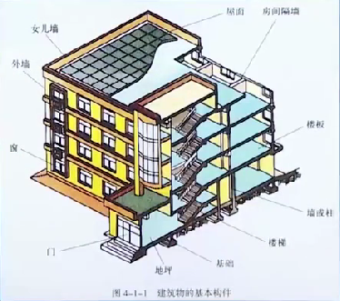


#### 知识点4：==建筑如何分类==
> 
> 1. 按照建筑的==使用性质==分类
> 
>    1. 民用建筑。民用建筑是指供人**们学习、工作、生活以及各种文化、社会活动**的建筑，包括<u>**居住建筑**（住宅、宿舍、公寓等）和**公共建筑**（办公楼、教学楼、医院、图书馆、商店、影剧院、体育馆、火车站等）</u>。
>    2. 工业建筑。工业建筑是指用于**工业生产**的建筑。按其使用性质还可分为**加工类生产厂房和仓储类库房**，包括各行业各种主要<u>生产车间、安放动力设施的厂房和仓库</u>等。
> 
> 2. 按照建筑的建筑高度分类
> 
>    根据建筑高度不同，建筑可分为高层建筑和单层、多层建筑。其中，高层建筑是指建筑高度大于27m的住宅建筑和建筑高度大于24m的非单层厂房、仓库和其他民用建筑。对于有些单层建筑，如体育馆、高大的单层厂房等，因为具有相对便利的疏散和扑救条件，虽然建筑高度大于24m，但不划分为高层建筑。
> 
>    详细分类：
> 
>    ```mermaid
>    	graph LR
>    	A(按高度分类)
>    	a(住宅)
>    		a1(≤27m 单层或多层)
>    		a2(>27m 高层)
>    		a21(≤54m 二类高层)
>    		a22(>54m 一类高层)
>    	b(公共)
>    		b1(≤24m或者>24但只有1层的建筑，如羽毛球馆 单层或多层)
>    		b2(>24m 高层)
>    		b21(一类高层)
>    			b211(>50m)
>    			b212(任一层面积>1000㎡且是商店、展览、电信、邮政、财贸金融建筑及多种功能组合建筑)
>    			b213(医疗建筑、重要公共建筑、独立建造的老年人照料设施)
>    			b214(省级及以上广播电视、防灾指挥调度、网局级和省级电力调度建筑)
>    			b215(藏书超过 100 万册的图书馆、书库)
>    		b22(≤50m 二类高层)
>    	c("工业（厂房和仓库）")
>    		c1(≤24m或者>24但只有1层的建筑 单层或多层)
>    		c2(>24m 高层)
>    	                                                                                                                                    
>    	A-->a
>    	A-->b
>    	A-->c
>    		a-->a1
>    		a-->a2
>    			a2-->a22
>    			a2-->a21
>    		b-->b1
>    		b-->b2
>    			b2-->b21
>    				b21-->b211
>    				b21-->b212
>    				b21-->b213
>    				b21-->b214
>    				b21-->b215
>    			b2-->b22
>    		c-->c1
>    		c-->c2
>    ```
> 
>    
> 
> 3. 按照建筑的**主要承重结构**分类
> 
>    1. 木结构。
> 
>       木结构是以木材作为主要的承重构件。由于木结构存在**易燃、易腐**的缺点，实际运用中应**控制**木结构建筑的应用范围、高度和层数等。
> 
>    2. 砖木结构。
> 
>       砖木结构的主要承重构件由砖、木制成，其中竖向承重构件的墙、柱采用砖石，水平承重构件的楼板、屋架采用木材，这种结构常见于<u>农舍、庙宇</u>。
> 
>    3. 砖混结构。
> 
>       砖混结构的竖向承重构件采用砖璃或砖柱，水平承重构件采用钢筋混凝土楼板、屋顶板，**常见于非高层建筑**。
> 
>    4. 钢筋混凝士结构。
> 
>       钢筋混凝土结构的主要承重构件（**柱、梁、楼板**等）采用钢筋混凝土材料建造砖或其他轻质材料做墙体等围护构件，常见于**高层、大跨度、大空间结构**的建筑。
> 
>    5. 钢结构。
> 
>       钢结构的主要承重构件均用钢材制成，常见于**工业厂房**，但钢结构==防火性能差==，按具体情况采取相应的防火保护措施。
> 
>    6. 钢混结构。
> 
>       钢混结构的**屋顶**采用钢结构，其他主要承重构件采用钢筋混凝土结构，如钢筋混凝土染、柱和钢屋架组成的厂房。
> 
>    7. 其他结构。
> 
>       其他结构如夯土建筑、膜结构建筑等。


#### 知识点5：民用建筑按照建筑高度如何进行分类
> 
> ​	民用建筑按照其建筑高度和层数不同，可分为单、多层民用建筑和高层民用建筑。
> 
> 1. 单、多层民用建筑的分类见表
> 
>    | 名称             | 住宅建筑                                                     | 公共建筑                                                     |
>    | ---------------- | ------------------------------------------------------------ | ------------------------------------------------------------ |
>    | 单、多层民用建筑 | 建筑高度不大于27m的住宅建筑（包括设置商业服务网点的住宅建筑） | （1）建筑高度大于24m的单层公共建筑<br>（2）建筑高度不大于24m的其他公共建筑 |
> 
> 2. 高层民用建筑按照其建筑高度、使用功能和楼层建筑面积还可分为一类高层民用建筑和二类高层民用建筑，见表
> 
>    <div style="text-align: center;">
>        <table border="1" style="margin: auto;">
>            <tr>
>                <td colspan="2" style="text-align: center;">
>                    名称
>                </td>
>                <td style="text-align: center;">
>                    住宅建筑
>                </td>
>                <td style="text-align: center;">
>                    公共建筑
>                </td>
>                <td style="text-align: center;">
>                    备注
>                </td>
>            </tr>
>            <tr>
>                <td rowspan="2" style="writing-mode: tb-rl; text-align: center;">
>                    高层民用建筑
>                </td>
>                <td style="text-align: center;">
>                    一类
>                </td>
>                <td style="text-align: center;">
>                    建筑高度大于54m的住宅建筑（包括设置商业服务网点的住宅建筑）
>                </td>
>                <td style="text-align: center;">
>                    （1）建筑高度大于50m的公共建筑<br>（2）建筑高度24 m以上部分任一楼层建筑面积大于1000㎡的商店、展览、电信、邮政、财贸金融建筑和其他多种功能组合的建筑<br> （3）医疗建筑、重要公共建筑、独立建造的老年人照料设施<br>（4）省级及以上的广播电视和防灾指挥调度建筑、网局级和省级电力调度建筑<br>（5）藏书超过100万册的图书馆、书库
>                </td>
>                <td rowspan="2" style="text-align: center;">
>                    （1）表中未列人的建筑，其类别应根据本表类比确定<br>（2）除规范另有规定外，宿舍、公寓等非住宅类居住建筑的防火要求，应符合公共建筑的规定<br>（3）除规范另有规定外，裙房的防火要求应符合高层民用建筑的规定
>                </td>
>            </tr>
>            <tr>
>                <td style="text-align: center;">
>                    二类
>                </td>
>                <td style="text-align: center;">
>                    建筑高度大于27m，但不大于54m的住宅建筑（包括设置商业服务网点的住宅建筑）
>                </td>
>                <td style="text-align: center;">
>                    除一类高层公共建筑外的其他高层公共建筑
>                </td>
>            </tr>
>        </table>
>    </div>    


#### 知识点6：房和仓库按照其火灾危险性不同如何分类

> 1. 厂房的火灾危险性根据其生产中使用或产生的物质的性质及其数量等因素，划分为**<u>甲、乙（易燃）</u>、丙（可燃）、丁（难燃）、戊（不燃）**类，见表
> 
>    |             厂房生产的火灾危险性             |                             举例                             |
>    | :------------------------------------------: | :----------------------------------------------------------: |
>    |                      甲                      | 甲醇、乙醇、苯等的合成或精制厂房，乙炔站、氢气站、液化石油气灌瓶间，硝化棉、赛璐珞厂房，金属钠、钾加工厂房，过氧化氢、过氧化钠厂房等 |
>    |                      乙                      | 甲酚厂房、松节油或松香蒸馏厂房、煤油灌桶间、高锰酸钾厂房、氧气站、铝粉或镁粉厂房等 |
>    |            丙（生活中接触最多的）            | 焦化厂焦油厂房、油浸变压器室、沥青加工厂房，==针织品==厂房、==服装==加工厂房、==棉花==加工和打包厂房、==印刷==厂的印刷厂房、==饲料==加工厂房，==泡沫塑料==厂的发泡、成型、印片压花部位等 |
>    | 丁（带有难燃、阻燃、防火、窒息的一般是丁类） | 金属冶炼、锻造、铆焊、热轧、铸造、热处理厂房，锅炉房、玻璃原料熔化厂房、难燃铝塑料材料的加工厂房、酚醛泡沫塑料的加工厂房等 |
>    |                      戊                      | 制砖车间、石棉加工车间、金属（镁合金除外）冷加工车间、电动车库，仪表、器械或车辆装配车间，加气混凝土厂的材料准备、构件制作厂房等 |
> 
> 2. 仓库的火灾危险性根据储存物品的性质和储存物品中的可燃物数量等因素，划分为甲、乙、丙、丁、戊类，见表
> 
>    | 仓库储存物品的火灾危险性 |                             举例                             |
>    | :----------------------: | :----------------------------------------------------------: |
>    |            甲            | 储存己烷、戊烷、石脑油、苯、甲苯、甲醇、乙醇、乙醚、乙炔、氢、甲烷、硝化棉，金属钾、钠、锂，氯酸钾、过氧化钠、硝酸铵、赤磷、酒精度为38度及以上的白酒等的仓库 |
>    |            乙            | 储存煤油、松节油、丁烯醇、丁醚、环已胺、溶剂油、樟脑油、氨气、液氢、硝酸、漂白粉、硫黄、镁粉、铝粉、赛璐珞板（片）、樟脑、萘、氧气等的仓库 |
>    |            丙            | 储存动物油、植物油、沥青、蜡、润滑油、机油、重油、闪点≥60℃的柴油、面粉、中药材，化学、人造纤维及其织物，纸张，棉、毛、丝、麻及其织物等的仓库 |
>    |            丁            | 储存自熄性塑料及其制品、酚醛泡沫塑料及其制品、水泥刨花板的仓库 |
>    |            戊            | 储存钢材、铝材、玻璃及其制品，陶瓷制品，不燃气体，玻璃棉，石膏及其无纸制品，水泥、膨胀珍珠岩等的仓库 |


#### 知识点7：什么是老年人照料设施
> 
> ​	老年人照料设施是指为老年人提供集中照料服务的设施，是老年人全日照料设施和老年人日间照料设施的统称，属于公共建筑（**老年人至少需要20人或20个床位**）。其中，老年人全日照料设施是指为老年人提供==住宿、生活照料服务及其他服务项目的设施==，是<u>养老院、老人院、福利院、敬老院、老年养护院</u>等的统称；老年人日间照料设施是指为老年人提供日间休息、生活照料服务及其他服务项目的设施，是托老所、日托站、老年人日间照料室、老年人日间照料中心等的统称。其他专供老年人使用的、非集中照料的设施或场所，如<u>老年大学、老年人活动中心</u>等**不属于**老年人照料设施。


#### 知识点8：什么是商业服务网点
> 
> ​	商业服务网点是指设置在住宅建筑的**首层或首层及二层**，每个分隔单元建筑面积**不大于**300m²的商店、邮政所、储蓄所、理发店等小型营业性用房。


#### 知识点9：什么是地下室与半地下室
> 
> 1. 地下室是指房间地平面低于室外设计地平面的平均高度大于该房间平均净高1/2的建筑。
> 2. 半地下室是指房间地平面低于室外设计地平面的平均高度大于该房间平均净高1/3，且不大于1/2的建筑。


### 第二节 建筑材料的燃烧性能
> 
> 【知识要点】
> 
> 1. 建筑材料燃烧性能的含义。
> 2. 建筑材料燃烧性能等级划分。


#### 知识点1：建筑材料燃烧性能的含义是什么
> 
> ​	建筑材料的燃烧性能是指材料**燃烧或遇火**时所发生的一切**物理和化学**变化，该性能由材料表面的**<u>着火性和火焰传播性、发热、发烟、炭化以及毒性生成物</u>**的产生等特性来衡量。


#### 知识点2：什么是建筑材料
> 
> ​	建筑材料是指在建筑中使用的单一物质或均匀分布的混合物，如<u>石材、木材、混凝土、金属、矿物纤维、聚合物</u>等。


#### 知识点3：我国建筑材料及制品燃烧性能等级如何划分
> 
> ​	我国建筑材料及制品燃烧性能等级划分充分考虑了燃烧的热值、火灾发展率、烟气产生率等燃烧特性要素，等级划分见表
> 
> | 燃烧性能等级 |       名称       |                             特征                             |
> | :----------: | :--------------: | :----------------------------------------------------------: |
> |      A       | 不燃材料（制品） |   在空气中遇明火或高温作用时<u>不起火，不微燃、不炭化</u>    |
> |      B1      | 难燃材料（制品)  | 在空气中遇明火或高温作用时<u>难起火、难微燃、难炭化</u>，火源移走后燃烧或微燃**停止** |
> |      B2      | 可燃材料（制品） | 在空气中遇明火或高温作用时<u>**立即**起火、微燃或炭化</u>，火源移走后燃烧或微燃仍**继续** |
> |      B3      | 易燃材料（制品） |                    极易燃烧，火灾危险性大                    |


### 第三节 建筑构件的耐火极限
> 
> 【知识要点】
> 
> 1. 不同燃烧性能的建筑构件分类。
> 2. 耐火极限的定义。
> 3. 耐火极限的判定。


#### 知识点1：建筑构件按其燃烧性能如何分类
> 
> ​	建筑构件的燃烧性能取决于组成建筑构件材料的燃烧性能。
> ​	通常，按照建筑==构件==的燃烧性能把建筑构件划分为**3类**，分别是**不燃性构件、难燃性构件和可燃性构件**。
> 
> 1. 不燃性构件
> 
>    不燃性构件是指用不燃材料制成的构件，如<u>钢柱、混凝土楼板、砖墙、石膏板</u>等。
> 
> 2. 难燃性构件
> 
>    难燃性构件是指用难燃材料制成的构件，或用燃烧性材料制成而用燃烧性材料作为保护层的构件，如<u>水泥创花板、板条抹灰墙</u>等。
> 
> 3. 可燃性构件
> 
>    可燃性构件是指用可燃或易燃材料制成的构件，如<u>木质构件、竹质构件、宝丽板（polyboard）</u>构件等。


#### 知识点2：==什么是耐火极限==
> 
> ​	耐火极限是指在标准耐火试验条件下，建筑构件、配件或结构从受到火的作用时起，至失去**承载能力、耐火完整性或耐火隔热性**时止所用==时间==，用**小时（h）**表示。
> 
> - **承载能力**是指在标准耐火试验条件下，建筑构件在一定时间内抵抗==垮塌==的能力。
> - **耐火完整性**是指在标准耐火试验条件下，当建筑构件一面受火时，在一定时间内防止==火焰和热气穿透或在背火面出现火焰==的能力。
> - **耐火隔热性**是指在标准耐火试验条件下，当建筑构件一面受火时，在一定时间内防止其==背火面温度不超过规定值==的能力。


#### 知识点3：影响耐火极限的因素有哪些
> 
> ​	影响建筑构件耐火极限的因素较多，**主要有以下3个方面。**
> 
> 1. 材料的燃烧性能
> 
>    在其他条件相同的前提下，==材料的燃烧性能==直接決定了建筑构件的耐火性能。例如，<u>相同截面的钢筋混凝土桂与木柱相比，前者的耐火极限肯定要比后者高</u>。
> 
> 2. 建筑构件的结构特性
> 
>    建筑构件的结构特性由其受力特性决定。在其他条件相同的前提下，==截面形式、结构复杂程度、连接方式（如饺接、铆接、焊接等）和结构形式（如网架结构、桁架结构等）==等均对构件的耐火极限有不同程度的影响。
> 
> 3. 保护层的厚度及结合方式
> 
>    在其他条件相同的前提下，构件的耐火极限受其保护层的厚度和结合方式影响。例如，<u>将钢筋混凝土构件的砂浆保护层加厚，其耐火极限将有一定程度的提高</u>；厚涂型、薄涂型结构防火涂料需采取相应措施提高涂层与构件之间的附着力，才能有效提高构件的耐火极限。


#### 知识点4：如何判断建筑构件是否达到了耐火极限
> 
> 1. 失去完整性或完整性被破坏
> 
>    主要是指在标准耐火试验条件下，墙、楼板、门等构件在试验过程中出现==火焰==、高温气体穿透性裂缝或孔隙。
> 
> 2. 失去隔热性或失去隔火作用
> 
>    主要是指在标准耐火试验条件下，分隔构件==失去==隔绝过量热传导的性能。
> 
> 3. 失去承载能力和抗变形能力
> 
>    在标准耐火试验条件下，如果构件在试验中发生**垮塌或变形量超过规定数值**，则表明其失去支持力。对承重构件来说，是指构件挠曲速率发生突变；对非承重构件来说，是指构件自身解体或垮塌。
> 
>    当上述3个条件中出现任一项时，则表明该建筑构件已达到耐火极限。


#### 知识点5：常见建筑构件的燃烧性能和耐火极限应符合哪些要求
> 
> 1. 民用建筑
> 
>    民用建筑的耐火等级可分为==一、二==、三、四级，不同耐火等级民用建筑相应构件的燃烧性能和耐火极限不应低于表的规定。
> 
>    <table align="center" border="1">
>        <tr>
>        	<td style="vertical-align: middle; text-align: center;" colspan="2" rowspan="2">构件名称</td>
>            <td style="text-align: center;" colspan="4">耐火等级</td>
>        </tr>
>        <tr> 
>        	<td style="text-align: center;">一级</td>
>            <td style="text-align: center;">二级</td>
>            <td style="text-align: center;">三级</td>
>            <td style="text-align: center;">四级</td>
>        </tr>
>        <tr>
>        	<td style="writing-mode: tb-rl; text-align: center;" rowspan="6;">墙</td>
>            <td style="text-align: center;">防火墙</td>
>            <td style="text-align: center;" colspan="4">不燃性3.00</td>
>        </tr>
>        <tr>
>        	<td style="text-align: center;">承重墻</td>
>        	<td style="text-align: center;">不燃性3.00</td>
>        	<td style="text-align: center;">不燃性2.50</td>
>        	<td style="text-align: center;">不燃性2.00</td>
>        	<td style="text-align: center;">难燃性0.50</td>
>        </tr>
>        <tr>
>        	<td style="text-align: center;">非承重外墙</td>
>        	<td style="text-align: center;">不燃性1.00</td>
>        	<td style="text-align: center;">不燃性1.00</td>
>        	<td style="text-align: center;">不燃性0.50</td>
>        	<td style="text-align: center;">可燃性</td>
>        </tr>
>        <tr>
>        	<td style="text-align: center;">楼梯间和前室的墙，<br>电梯井的墙，<br>住宅建筑单元之间的墙和分户墙</td>
>        	<td style="text-align: center;">不燃性2.00</td>
>        	<td style="text-align: center;">不燃性2.00</td>
>        	<td style="text-align: center;">不燃性1.50</td>
>        	<td style="text-align: center;">难燃性0.50</td>
>        </tr>
>        <tr>
>        	<td style="text-align: center;">疏散走道两侧的隔墙</td>
>        	<td style="text-align: center;">不燃性1.00</td>
>        	<td style="text-align: center;">不燃性1.00</td>
>        	<td style="text-align: center;">不燃性0.50</td>
>        	<td style="text-align: center;">难燃性0.25</td>
>        </tr>
>        <tr>
>        	<td style="text-align: center;">房间隔墙</td>
>        	<td style="text-align: center;">不燃性0.75</td>
>        	<td style="text-align: center;">不燃性0.50</td>
>        	<td style="text-align: center;">难燃性0.50</td>
>        	<td style="text-align: center;">难燃性0.25</td>
>        </tr>
>        <tr>
>        	<td style="text-align: center;" colspan="2">柱</td>
>        	<td style="text-align: center;">不燃性3.00</td>
>        	<td style="text-align: center;">不燃性2.50</td>
>        	<td style="text-align: center;">不燃性2.00</td>
>        	<td style="text-align: center;">难燃性0.50</td>
>        </tr>
>        <tr>
>        	<td style="text-align: center;" colspan="2">梁</td>
>        	<td style="text-align: center;">不燃性2.00</td>
>        	<td style="text-align: center;">不燃性1.50</td>
>        	<td style="text-align: center;">不燃性1.00</td>
>        	<td style="text-align: center;">难燃性0.50</td>
>        </tr>
>        <tr>
>        	<td style="text-align: center;" colspan="2">楼板</td>
>        	<td style="text-align: center;">不燃性1.50</td>
>        	<td style="text-align: center;">不燃性1.00</td>
>        	<td style="text-align: center;">不燃性0.50</td>
>        	<td style="text-align: center;">可燃性</td>
>        </tr>
>        <tr>
>        	<td style="text-align: center;" colspan="2">屋顶承重构件</td>
>        	<td style="text-align: center;">不燃性1.50</td>
>        	<td style="text-align: center;">不燃性1.00</td>
>        	<td style="text-align: center;">可燃性0.50</td>
>        	<td style="text-align: center;">可燃性</td>
>        </tr>
>        <tr>
>        	<td style="text-align: center;" colspan="2">疏散楼梯</td>
>        	<td style="text-align: center;">不燃性1.50</td>
>        	<td style="text-align: center;">不燃性1.00</td>
>        	<td style="text-align: center;">不燃性0.50</td>
>        	<td style="text-align: center;">可燃性</td>
>        </tr>
>        <tr>
>        	<td style="text-align: center;" colspan="2">吊顶（包括吊顶搁栅）</td>
>        	<td style="text-align: center;">不燃性0.25</td>
>        	<td style="text-align: center;">难燃性0.25</td>
>        	<td style="text-align: center;">难燃性0.15</td>
>        	<td style="text-align: center;">可燃性</td>
>        </tr>
>    </table>
> 
> 2. 厂房和仓库
> 
>    厂房和仓库的耐火等级可分为一、二、三、四级，不同耐火等级厂层和仓库建筑构件的燃烧性能和耐火极限不应低于表4-3-2的规定。
> 
>    <table>
>        <tr>
>        	<td style="vertical-align: middle; text-align: center;" rowspan="2" colspan="2">构件名称</td>
>            <td style="text-align: center;" colspan="4">耐火等级</td>
>        </tr>
>        <tr>
>        	<td style="text-align: center;">一级</td>
>            <td style="text-align: center;">二级</td>
>        	<td style="text-align: center;">三级</td>
>        	<td style="text-align: center;">四级</td>
>        </tr>
>        <tr>
>        	<td style="writing-mode: tb-rl; text-align: center;" rowspan="5">墙</td>
>            <td style="text-align: center;">防火墻</td>
>        	<td style="text-align: center;" colspan="4">不燃性3.00</td>
>        </tr>
>        <tr>
>        	<td style="text-align: center;">承重墙</td>
>            <td style="text-align: center;">不燃性3.00</td>
>        	<td style="text-align: center;">不燃性2.50</td>
>        	<td style="text-align: center;">不燃性2.00</td>
>        	<td style="text-align: center;">难燃性0.50</td>
>        </tr>
>        <tr>
>        	<td style="text-align: center;">楼梯间和前室的墙，电梯井的墙</td>
>            <td style="text-align: center;">不燃性2.00</td>
>        	<td style="text-align: center;">不燃性2.00</td>
>        	<td style="text-align: center;">不燃性1.50</td>
>        	<td style="text-align: center;">难燃性0.50</td>
>        </tr>
>        <tr>
>        	<td style="text-align: center;">疏散走道两侧的隔墻</td>
>            <td style="text-align: center;">不燃性1.00</td>
>        	<td style="text-align: center;">不燃性1.00</td>
>        	<td style="text-align: center;">不燃性0.50</td>
>        	<td style="text-align: center;">难燃性0.25</td>
>        </tr>
>        <tr>
>        	<td style="text-align: center;">非承重外墙，房间隔墻</td>
>            <td style="text-align: center;">不燃性0.75</td>
>        	<td style="text-align: center;">不燃性0.50</td>
>        	<td style="text-align: center;">难燃性0.50</td>
>        	<td style="text-align: center;">难燃性0.25</td>
>        </tr>
>        <tr>
>        	<td style="text-align: center;" colspan="2">柱</td>
>            <td style="text-align: center;">不燃性3.00</td>
>        	<td style="text-align: center;">不燃性2.50</td>
>        	<td style="text-align: center;">不燃性2.00</td>
>        	<td style="text-align: center;">难燃性0.50</td>
>        </tr>
>        <tr>
>        	<td style="text-align: center;" colspan="2">梁</td>
>            <td style="text-align: center;">不燃性2.00</td>
>        	<td style="text-align: center;">不燃性1.50</td>
>        	<td style="text-align: center;">不燃性1.00</td>
>        	<td style="text-align: center;">难燃性0.50</td>
>        </tr>
>        <tr>
>        	<td style="text-align: center;" colspan="2">楼板</td>
>            <td style="text-align: center;">不燃性1.50</td>
>        	<td style="text-align: center;">不燃性1.00</td>
>        	<td style="text-align: center;">不燃性0.75</td>
>        	<td style="text-align: center;">难燃性0.50</td>
>        </tr>
>        <tr>
>        	<td style="text-align: center;" colspan="2">屋顶承重构件</td>
>            <td style="text-align: center;">不燃性1.50</td>
>        	<td style="text-align: center;">不燃性1.00</td>
>        	<td style="text-align: center;">难燃性0.50</td>
>        	<td style="text-align: center;">可燃性</td>
>        </tr>
>        <tr>
>        	<td style="text-align: center;" colspan="2">疏散楼梯</td>
>            <td style="text-align: center;">不燃性1.50</td>
>        	<td style="text-align: center;">不燃性1.00</td>
>        	<td style="text-align: center;">不燃性0.75</td>
>        	<td style="text-align: center;">可燃性</td>
>        </tr>
>        <tr>
>        	<td style="text-align: center;" colspan="2">吊顶（包括吊顶搁栅）</td>
>            <td style="text-align: center;">不燃性0.25</td>
>        	<td style="text-align: center;">难燃性0.25</td>
>        	<td style="text-align: center;">难燃性0.15</td>
>        	<td style="text-align: center;">可燃性</td>
>        </tr>
>    </table>


### 第四节 建筑的耐火等级
> 
> 【知识要点】
> 
> 1. 建筑耐火等级的定义。
> 2. 建筑耐火等级的划分。


#### 知识点1：什么是建筑的耐火等级
> 
> ​	建筑的耐火等级是衡量建筑耐火程度的分级标准。由于建筑**使用性质、重要程度、规模大小、层数高低和火灾危险性**不同，其耐火等级要求不同。


#### 知识点2：如何划分建筑的耐火等级
> 
> ​	建筑的耐火等级是由组成建筑物的墙、柱、楼板、屋顶承重构件和吊顶等主要构件的**燃烧性能和耐火极限**决定的，分为==一、二、三、四==级。
> ​	例如，<u>高层医疗建筑，因具有建筑高度高、使用功能复杂、火灾扑救难度大等特点，其耐火等级应为一级；而常见的二类高层住宅，因其使用功能单一、火灾扑救难度较小，耐火等级不应低于二级。</u>


#### 知识点3：一些常见民用建筑的耐火等级如何确定
>
> ​	建筑的耐火等级或工程结构的耐火性能，应与其火灾危险性，建筑高度、使用功能和重要性，火灾扑救难度等相适应。
>
> 1. 下列民用建筑的耐火等级应为==一级==：
>    1. 一类高层民用建筑。
>    2. 二层和二层半式、多层式民用机场航站楼。
>    3. A类广播电影电视建筑。
>    4. 四级生物安全实验室。
> 2. 下列民用建筑的耐火等级不应低于==二级==：
>    1. 二类高层民用建筑。
>    2. 一层和一层半式民用机场航站楼。
>    3. 总建筑面积大于1500m的单、多层人员密集场所。
>    4. B类广播电影电视建筑。
>    5. 一级普通消防站、二级普通消防站、特勤消防站、战勤保障消防站。
>    6. 设置洁净手术部的建筑，三级生物安全实验室。
>    7. 用于灾时避难的建筑。
>    8. 单独建造的消防水泵房
> 3. 除上述（1）（2）内规定的建筑外，下列民用建筑的耐火等级不应低于三级：
>    1. 城市和镇中心区内的民用建筑。
>    2. 老年人照料设施、教学建筑、医疗建筑。
> 4. 地下、半地下建筑（室）的耐火等级应为一级


#### 知识点4：一些常见工业建筑的耐火等级如何确定
>
> 1. 下列工业建筑的耐火等级应为一级：
>    1. 建筑高度大于50m的高层厂房。
>    2. 建筑高度大于32m的高层丙类仓库，储存可燃液体的多层丙类仓库，每个防火分隔间建筑面积大于3000㎡的其他多层丙类仓库。
>    3. Ⅰ类飞机库。
> 2. 除上述（1）内规定的建筑外，下列工业建筑的耐火等级不应低于二级：
>    1. 建筑面积大于300㎡的单层甲、乙类厂房、多层甲乙。
>    2. 高架仓库。
>    3. Ⅱ、Ⅲ类飞机库。
>    4. 使用或储存特殊贵重的机器、仪表、仪器等设备或物品的建筑。
>    5. 高层厂房、高层仓库。
> 3. 除上述（1）（2）内规定的建筑外，下列工业建筑的耐火等级不应低于三级：
>    1. 甲、乙类厂房。
>    2. 单、多层丙类厂房。
>    3. 多层丁类厂房。
>    4. 单、多层丙类仓库。
>    5. 多层丁类仓库。
> 4. 丙、丁类物流建筑的耐火等级不应低于二级。
> 5. 地下、半地下建筑（室）的耐火等级应为一级。


### 第五节 建筑的防火分区和防烟分区
> 
> 【知识要点】
> 
> 1. 建筑防火分区的定义及分类。
> 
> 2. 建筑防火分区的划分
> 3. 建筑防烟分区的定义
> 4. 建筑防烟分区的划分


#### 知识点1：什么是防火分区
> 
> ​	==防火分区==是指在建筑内部采用**防火墙、楼板及其他防火分隔设施**分隔而成，能在一定时间内防止火灾向同一建筑的其余部分蔓延的局部空间。


#### 知识点2：防火分区如何分类
> 
> ​	防火分区可分为**水平防火分区**和**竖向防火分区**。
> 
> 1. ==水平==防火分区是指采用**防火墙、防火门、防火卷帘**等防火分隔设施将建筑平面在水平方向上分隔出的防火区域，用以阻止火灾在一定时间内向相邻区域水平方向蔓延扩大。
> 2. ==竖向==防火分区是指在建筑物的上下层间采用一定耐火极限的**楼板及窗槛墙（窗间墙）、防火挑檐**等防火分隔设施进行分隔，用以防止火灾在竖向楼层之间的蔓延扩大。


#### 知识点3：防火分区的划分应符合哪些规定
> 
> ​	工业与民用建筑、地铁车站、平时使用的人民防空工程应综合其**高度（埋深）、使用功能和火灾危险性**等因素，根据有利于消防救援、控制火灾及降低火灾危害的原则划分防火分区。防火分区的划分应符合下列规定。
> 
> 1. 建筑内==横向==应采用**防火墙**等划分防火分区，且<u>防火分隔应保证火灾不会蔓延至相邻防火分区</u>。
> 2. 建筑内==竖份==按自然**楼层**划分防火分区时，除允许设置敞开楼梯间的建筑外，防火分区的建筑面积应按上、下楼层中在火灾时未封闭的开口所连通区域的建筑面积之和计算。
> 3. 高层建筑主体与裙房之闻未采用防火墙和甲级防火门分隔时，裙房的防火分区应按**高房建筑主体的相应要求划分**。
> 4. 除建筑内游泳池、消防水池等的水面、冰面或雪面面积，射击场的靶道面积，污水沉降池面积，开敞式的外走廊或阳台面积等可不计入防火分区的建筑面积外，其他建筑面积均应计入所在防火分区的建筑面积。


#### 知识点4：一些常见公共建筑防火分区划分有何要求
> 
> ​	公共建筑防火分区的划分应综合考虑各类因素，确定合理的防火分区设置形式及分区面积大小。除有**特殊要求的建筑、木结构建筑和附建于民用建筑中的汽车库**外，其他公共建筑中每个防火分区的==最大允许建筑面积==应符合表4-5-1的规定。
> 
> <table>
> 	<tr>
>     	<td style="text-align: center;">名称</td>
>     	<td style="text-align: center;">耐火等级</td>
>     	<td style="text-align: center;">防火分区的最大允许建筑面积（m²）</td>
>     	<td style="text-align: center;">备注</td>
>     </tr>
> 	<tr>
>     	<td style="text-align: center;">高层建筑</td>
>     	<td style="text-align: center;">一、二级</td>
>     	<td style="text-align: center;">1500</td>
>         <td style="text-align: center;" rowspan="6">当防火分区会部设置<b>自动<br>灭火系统</b>时，最大允许建筑<br>面积可以<b>增加1.0倍</b>；当局<br>部设置自动灭火系统时，可<br>按该局部区域建筑面积的<br><b>1/2</b>计入所在防火分区的总<br>建筑面积</td>
>     </tr>
> 	<tr>
>     	<td style="text-align: center;" rowspan="3">单、多层建筑</td>
>     	<td style="text-align: center;">一、二级</td>
>     	<td style="text-align: center;">2500</td>
>     </tr>
> 	<tr>
>     	<td style="text-align: center;">三级</td>
>     	<td style="text-align: center;">1200</td>
>     </tr>
> 	<tr>
>     	<td style="text-align: center;">四级</td>
>     	<td style="text-align: center;">600</td>
>     </tr>
> 	<tr>
>         <td style="text-align: center;">地下设备房</td>
>     	<td style="text-align: center;">一级</td>
>     	<td style="text-align: center;">1000</td>
>     </tr>
> 	<tr>
>         <td style="text-align: center;">地下其他区域</td>
>     	<td style="text-align: center;">一级</td>
>     	<td style="text-align: center;">500</td>
>     </tr>
> </table>


> 
> 
#### 知识点5：当一、二级耐火等级建筑内的商店营业厅设置自动灭火系统和火灾自动报警系统并采用不燃或难燃装修材料时，其每个防火分区的最大允许建筑面积有何要求
> 
> 1. 设置在高层建筑时，不应大于4000m²
> 2. 设置在单层建筑或仅设置在多层建筑的首层时，不应大于10000m²
> 3. 设置在地下或半地下时，不应大于2000m²。


#### 知识点6：什么是防火分隔设施
> 
> ​	防火分隔设施是指能在一定时间内阻止火势蔓延，且能把建筑内部空间分隔成若干较小防火空间的具有一定耐火性能的物体。            


#### 知识点7：防火分隔设施有哪几类
> 
> ​	防火分隔设施可分为**固定式和活动式**两种类型。固定式防火分隔设施包括<u>楼板、防火墙</u>等，活动式防火分隔设施包括<u>防火门、防火卷帘</u>等。


#### 知识点8：什么是防烟（排烟）分区
> 
> ​	防烟分区是指在建筑内部**屋顶或顶板、吊顶下方**，采用具有挡烟功能的**构、配件**进行分隔所形成的，在一定时间内防止烟气向同一防火分区其余部分蔓延的局部空间。


#### 知识点9：防烟分区如何划分
> 
> ​	防烟分区通常以不燃材料制成的挡烟垂壁、隔墙或从顶棚下突出不小于0.50m的染进行划分，**且防烟分区不应跨越防火分区**。


#### 知识点10：什么是挡烟垂壁
> ​	挡烟垂壁是指用不燃材料制成，垂直安装在建筑顶棚、染或吊项下，能在火灾时形成一定<u>蓄烟空间（深度）</u>的挡烟分隔设施。
>
> ​	送风口、排风口、排烟防火阀、挡烟垂壁的保养周期为每==半年==一次。
>
> ​	挡烟垂壁可以通过==火灾自动报警系统自动启动和现场手动启动==。


#### 知识点11：挡烟垂壁如何分类
> 
> ​	挡烟垂壁一般分为固定式挡烟垂壁和活动式挡烟垂壁。
> 
> 1. 固定式挡烟垂壁采用不燃材料制作，如铝丝玻璃、不锈钢薄板等，垂直安装在建筑项棚、梁或吊顶下。
> 2. 活动式挡烟垂壁，应具有火灾自动报警系统自动启动和现场手动启动功能。


### 第六节 建筑的总平面布局和平面布置
> 
> 【知识要点】
> 
> 1. 建筑总平面布局的一般规定。
> 2. 防火间距的定义及要求。
> 3. 消防车道的定义及设置要求。
> 4. 消防车登高操作场地的作用及设置要求。
> 5. 建筑平面布置的基本要求。


#### 知识点1：建筑总平面布局的一般规定有哪些
> 
> ​	建筑的总平面布局应符合**减小火实危害、方便消防救援**的要求。
> ​	工业与民用建筑应根据建筑**使用性质、建筑高度、耐火等级及火灾危险性**等合理确定防火间距，建筑之间的防火间距应保证任意一侧建筑外墙受到的**相邻建筑火灾辐射热强度均低于其临界引燃辐射热强度**。
> 
> ​	<u>甲、乙类物品运输车的汽车库、修车库、停车场与人员密集场所</u>的防火间距==不应小于50m==，与其他民用建筑的防火间距==不应小于25m==；<u>甲类物品运输车的汽车库、修车库、停车场与明火或散发火花地点</u>的防火间距==不应小于30m==。


#### 知识点2：什么是防火间距
> 
> ​	防火间距是指防止着火建筑在一定时间内引燃相邻建筑，便于消防扑救的间隔距离。


#### 知识点3：如何测量防火间距
> 
> ​	防火间距应按相邻建筑外墙的最近距离计算。如外墙有凸出的了**可燃构件**，则应从其==凸出部分外缘算起==；如为诸罐或堆场则应从储罐外壁或堆场的堆垛处缘算起。


#### 知识点4：民用建筑的防火间距有什么要求
> 
> ​	民用建筑应根据建筑使用性质、建筑高度、耐火等级等合理确定防火间距。民用建筑的防火间距应符合下列要求。
> 
> 1. 除裙房与相邻建筑的防火间距可按单、多层建筑确定外，建筑高度大于100m的民用建筑与相邻建筑的防火间距应符合下列规定
>    1. 与**高层民用建筑**的防火间距不应小于13m。
>    2. 与**一、二**级耐火等级单、多层民用建筑的防火间距不应小于9m。
>    3. 与**三级**耐火等级单、多层民用建筑的防火间距不应小于11m。
>    4. 与**四级**耐火等级单、多层民用建筑和木结构民用建筑的防火间距不应小于14m。
> 2. 相邻两座通过连廊、天桥或下部建筑物等连接的建筑，防火间距应按照两座**独立建筑**确定。


#### 知识点5：工业建筑的防火间距有什么要求
> ​	工业建筑应根据建筑使用性质、建筑高度、耐火等级及火灾危险性等合理确定防火间距。
> ​	工业建筑的防火间距应符合下列要求。
> 
> 1. 甲类厂房与人员密集场所的防火间距不应小于50m，与明火或散发火花地点的防火间距不应小于30m。
> 2. 甲类仓库与高层民用建筑和设置人员密集场所的民用建筑的防火间距不应小于50m，甲类仓库之间的防火间距不应小于20m。
> 3. 除乙类第5项（助燃气体）、第6项（能与空气形成爆炸性混合物的浮游状态的粉尘、纤维，以及闪点≥60℃的液体雾滴）物品仓库外，乙类仓库与高层民用建筑和设置人员密集场所的其他民用建筑的防火间距不应小于50m。
> 4. 飞机库与甲类仓库的防火间距不应小于20m。飞机库与喷漆机库贴邻建造时，应采用防火墙分隔。


#### 知识点6：什么是消防车道
> 
> ​	消防车道是指火灾情况下供消防车通行的道路。设置消防车道的目的在于保障火灾发生时消防车顺利到达火场，消防救援人员能迅速开展灭火救援行动，及时扑灭火灾，最大限度地减少人员伤亡和财产损失。


#### 知识点7：消防车道一般应符合哪些要求
> 
> ​	消防车道或兼作消防车道的道路应符合下列规定。
> 
> 1. 道路的净宽度和净空高度应满足消防车安全、快速通行的要求（高宽4*4）。
> 2. 转弯半径应满足消防车转弯的要求.
> 3. 路面及其下面的建筑结构、管道、管沟等，应满足承受消防车满载时压力的要求。
> 4. 坡度应满足消防车满载时正常通行的要求，且不应大于10%，兼作消防救援场地的消防车道，坡度尚应满足消车停靠和消防救援作业的要求，救援场地坡度为3%。
> 5. 消防车障与建筑外墙的水平距离应满足消防车安全通行的要求（≥5m），位于建筑消防扑救面一侧兼作消防救援场地的消防车道应满足消防救援作业的要求。
> 6. 长度大于40m的尽头式消防车道应设置满足消防车回转要求的场地或道路，普通12×12m，登高15×15m，重型18×18m。
> 7. 消防车道与建筑消防扑救面之间不应有妨碍消防车操作的障碍物，不应有影响消防车安全作业的架空高压电线。


#### 知识点8：消防车登高操作场地有何作用，其设置要求有哪些
> 
> ​	消防车登高操作场地的作用是确保登高消防车能够靠近高层建筑主体，便于登高消防车开展灭火救援。
> ​	高层建筑应**至少沿其一条长边**设置消防车登高操作场地。末连续布置的消防车登高操作场地，应保证消防车的救援作业范围能覆盖该建筑的全部消防扑救面。
> 
> ​	消防车登高操作场地应符合下列规定。
> 
> 1. 场地与建筑之间不应有进深大于4m的裙房及其他妨碍消防车操作的障碍物或影响消防车作业的架空高压电线。
> 2. 场地及其下面的建筑结构、管道、管沟等应满足承受消防车满载时压力的要求。
> 3. 场地的坡度应满足消防车安全停靠和消防救援作业的要求（3%）。
> 
> ​	在建筑与消防车登高操作场地相对应的范围内，应设置直通室外的楼梯或直通楼梯间的入口


#### 知识点9：消防数援口没置应符合哪些要求
> 
> ​	建筑外墙上便于消防救援人员出入的消防救援口，设置应符合下列规定。
> 
> 1. 沿外墙的每个防火分区在对应消防救援操作面范围内设置的消防救援口不应少于个2个，间距≤20m
> 2. 无外窗的建筑应每层设置消防救授口，有外窗的建筑应自**第三层**起每层设置消防救援口。
> 3. 消防救援口的净高度和净宽度均不应小于1.0m，当利用门时，净宽度不应小于0.8m
> 4. 消防救援口应易于从室内和室外打开或破拆，采用玻璃窗时，应选用**安全玻璃**。
> 5. 消防救援口应设置可在室内和室外识别的**永久性**明显标志。


#### 知识点10：消防控制室的平面布置应符合哪些要求
> 
> ​	消防控制室的布置和防火分隔应符合下列规定。
> 
> 1. ==单独建造==的消防控制室，耐火等级不应低于==二级==（提到单独建造90%都是二级）
> 2. 附设在建筑内的消防控制室应采用（乙级）防火门、（乙级）防火窗耐火极限不低于2.00h的防火隔墙和耐火极限不低于1.50h的楼板与其他部位分隔。
> 3. 消防控制室应位于建筑的**首层或地下一层**，疏散门应直通室外或安全出口。
> 4. 消防控制室的环境条件不应干扰或影响消防控制室内火灾报瞥与控制设备的正常运行。
> 5. 消防控制室内不应敷设或穿过与消防控制室无关的管线。
> 6. 消防控制室应采取防水淹、防潮、防啮齿动物等的措施。


#### 知识点11：消防水泵房的平面布置应符合哪些要求
> 
> ​	消防水泵房的布置和防火分隔应符合下列规定。
> 
> 1. ==单独==建造的消防水泵房，耐火等级不应低于==二级==
> 2. 附设在建筑内的消防水泵房应采用（甲级）防火门、防火窗、耐火极限不低于2.00h的防火隔墙和耐火极限不低于1.50h的楼板与其他部位分隔。（==防火门如果没提及依据通用规范，把他按甲级门算==）
> 3. 除地铁工程、水利水电工程和其他特殊工程中的地下消防水泵房可根据工程要求确定其设置楼层外，其他建筑中的消防水泵房不应设置在建筑的地下三层区以下楼层。
> 4. 消防水泵房的疏散门应重通室外或安全出口。
> 5. 消防水泵房的室内环境温度不应低5℃
> 6. 消防水泵房应采取防水淹等的措施。


#### 知识点12：儿童活动场所的平面布置应符合哪些要求
> 
> 1. 儿童活动场所的布置应符合下列规定。
> 
>    1. **不应布置**在地下或半地下。
> 
>    2. 对于一、二级耐火等级建筑，应布置在首层、二层或三层。
> 
>    3. 对于（级耐火等级建筑，应布置在首层或二层。
> 
>    4. 对于四级耐火等级建筑，应布置在首层。
> 
>       当儿童活动场所设置在Ⅰ级木结构建筑中时，应布置在首层、二层或三层；当设置在Ⅱ级木结构建筑中时，应布置在首
>       层或二层；当设置在Ⅲ级木结构建筑中时，应布置在首层
> 
> 2. 建筑中的儿童活动场所应采用防火门、防火窗、耐火极限不低于2.00h的防火隔墙和耐火极限不低于1.00h的楼板与其他区域分隔。


#### 知识点13：老年人照料设施的平面布置应符合哪些要求
> 
> 1. 老年人照料设施的布置应符合下列规定。
>    1. 对于一、二级耐火等级建筑，不应布置在楼地面设计标高大于54m的楼层上（独立建筑不宜超32m，不应超54m）。
>    2. 对于三级耐火等级建筑，应布置在首层或二层
>    3. **居室和休息室**不应布置在地下或半地下。
>    4. 老年人公共活动用房、康复与医疗用房，应布置在地下一层及以上楼层，当布置在半地下或地下一层、地上四层及以上楼层时，每个房间的建筑面积不应大于==200㎡==且使用人数不应大于==30==人。当老年人照料设施设置在Ⅰ级木结构建筑中时，应布置在首层、二层或三层，当设置在级木结构建筑中时，应布置在首层或二层。
> 2. 老年人照料设施应采用防火门、防火窗、耐火极限不低于2.00h的防火隔墙和耐火极限不低于1.00h的楼板与其他区域分隔（乙级门）。


#### 知识点14：歌舞娱乐放映游艺场所的平面布置应符合哪些要求
> 
> ​	歌舞娱乐放映游艺场所的布置和分隔应符合下列规定。
> 
> 1. 应布置在地下一层及以上且理深不大于10m的楼层。
> 
> 2. 当布置在地下一层或地上四层及以上楼层时，每个房间的建筑面积不应大于200m²
> 
> 3. 房间之间应采用耐火极限不低于2.00h的防火隔墙分隔。
> 
> 4. 与建筑的其他部位之间应采用防火门、耐火极限不低于2.00h的防火隔墙和耐火极限不低于1.00h的不燃性楼板分隔。
> 
>    当歌舞娱乐放映游艺场所设置在Ⅰ级木结构建筑中时，应布置在首层、二层或三层（乙级门）。


#### 知识点15：医疗建筑中住院病房的平面布置应符合哪些要求
> 
> ​	医疗建筑中住院病房的布置和分隔应符合下列规定。
> 
> 1. 不应布置在地下或半地下
> 2. 对于三级耐火等级建筑，应布置在首层或二层
> 3. 建筑内相邻护理单元之间应采用耐火极限不低子2.00h的防火隔墙和甲级防火门分隔。当医疗建筑中住院病房设置在Ⅰ级木结构建筑中时，应布置在首层、二层或三层当设置在Ⅱ级木结构建筑中时，应布置在首层或二层。


### 第七节 安全疏散
> 
> 【知识要点】
> 
> 1. 安全疏散的定义及相关要求
> 2. 安全出口的定义及设置要求。
> 3. 疏散走道、疏散出口门的设置要求。
> 4. 疏散楼梯的设置要求。
> 5. 避难层、避难闻的设置要求。
> 6. 火灾时辅助人员疏散电梯的设置要求。


#### 知识点1：什么是安全疏散
> 
> ​	安全疏散是指人员由危险区域向安全区域撤离的过程。


#### 知识点2：什么是安全疏散时间
> 
> ​	安全疏散时间，是指人员由危险区域疏散到达安全区域的时间。安全疏散时间是确定<u>安全疏散距离、安全疏散宽度、安全出口数量</u>的**重要依据**。


#### 知识点3：建筑中的最大疏散距离如何确定
> 
> ​	建筑中的最大疏散距离应根据建筑的<u>耐火等级、火灾危险性、空间高度、疏散楼梯（间）的形式和使用人员的特点</u>等因素确定，并应符合下列规定。
> 
> 1. 疏散距离应满足人员安全疏散的要求。
> 2. 房间内任一点至房间疏散门的疏散距离，不应大于建筑中位于袋形走道两侧或尽端房间的疏散们左最近安全出口的最大允许疏散距离。


#### 旧规范疏散距离：
> 
> 厂房疏散距离：
> 
> |            | 单层 | 多层 | 高层 | 地下 |
> | :--------: | :--: | :--: | :--: | :--: |
> | 一二级甲类 |  30  |  25  |      |      |
> | 一二级已类 |  75  |  50  |  30  |      |
> | 一二级丙类 |  80  |  60  |  40  |  30  |
> |   三级丙   |  60  |  40  |      |      |
> 
> 民用建筑疏散距离：
> 
> <table>
>     <tr>
>     	<td style="text-align: center;" colspan="3"></td>
>     	<td style="text-align: center;" colspan="3">两个安全出口之间</td>
>     	<td style="text-align: center;" colspan="3">袋型走到</td>
>     </tr>
>     <tr>
>     	<td style="text-align: center;" colspan="3"></td>
>     	<td style="text-align: center;">一、二级</td>
>     	<td style="text-align: center;">三级</td>
>     	<td style="text-align: center;">四级</td>
>     	<td style="text-align: center;">一、二级</td>
>     	<td style="text-align: center;">三级</td>
>     	<td style="text-align: center;">四级</td>
>     </tr>
>     <tr>
>     	<td style="text-align: center;" colspan="3">老年、幼儿</td>
>     	<td style="text-align: center;">25</td>
>         <td style="text-align: center;">20</td>
>         <td style="text-align: center;">15</td>
>         <td style="text-align: center;">20</td>
>         <td style="text-align: center;">15</td>
>         <td style="text-align: center;">10</td>
>     </tr>
>     <tr>
>     	<td style="text-align: center;" colspan="3">歌舞娱乐</td>
>         <td style="text-align: center;">25</td>
>         <td style="text-align: center;"></td>
>         <td style="text-align: center;"></td>
>         <td style="text-align: center;">9</td>
>         <td style="text-align: center;"></td>
>         <td style="text-align: center;"></td>
>     </tr>
>     <tr>
>         <td style="text-align: center;" rowspan="3">医疗</td>
>         <td style="text-align: center;" colspan="2">单、多层</td>
>         <td style="text-align: center;">35</td>
>         <td style="text-align: center;">30</td>
>         <td style="text-align: center;">25</td>
>         <td style="text-align: center;">20</td>
>         <td style="text-align: center;">15</td>
>         <td style="text-align: center;">10</td>
>     </tr>
>     <tr>
>         <td style="text-align: center;" rowspan="2">高层</td>
>         <td style="text-align: center;">病房</td>
>         <td style="text-align: center;">24</td>
>         <td style="text-align: center;"></td>
>         <td style="text-align: center;"></td>
>         <td style="text-align: center;">12</td>
>         <td style="text-align: center;"></td>
>         <td style="text-align: center;"></td>
>     </tr>
>     <tr>
>         <td style="text-align: center;">其他</td>
>         <td style="text-align: center;">30</td>
>         <td style="text-align: center;"></td>
>         <td style="text-align: center;"></td>
>         <td style="text-align: center;">15</td>
>         <td style="text-align: center;"></td>
>         <td style="text-align: center;"></td>
>     </tr>
>     <tr>
>         <td style="text-align: center;" colspan="3">教学单、多层</td>
>         <td style="text-align: center;">35</td>
>         <td style="text-align: center;">30</td>
>         <td style="text-align: center;">25</td>
>         <td style="text-align: center;">22</td>
>         <td style="text-align: center;">20</td>
>         <td style="text-align: center;">15</td>
>     </tr>
>     <tr>
>         <td style="text-align: center;" colspan="3">教学高层、旅馆高层、展览高层</td>
>         <td style="text-align: center;">30</td>
>         <td style="text-align: center;"></td>
>         <td style="text-align: center;"></td>
>         <td style="text-align: center;">15</td>
>         <td style="text-align: center;"></td>
>         <td style="text-align: center;"></td>
>     </tr>
>     <tr>
>         <td style="text-align: center;" rowspan="2">其他</td>
>         <td style="text-align: center;" colspan="2">单层</td>
>         <td style="text-align: center;">40</td>
>         <td style="text-align: center;">35</td>
>         <td style="text-align: center;">25</td>
>         <td style="text-align: center;">22</td>
>         <td style="text-align: center;">20</td>
>         <td style="text-align: center;">15</td>
>     </tr>
>     <tr>
>         <td style="text-align: center;" colspan="2">高层</td>
>         <td style="text-align: center;">40</td>
>         <td style="text-align: center;"></td>
>         <td style="text-align: center;"></td>
>         <td style="text-align: center;">20</td>
>         <td style="text-align: center;"></td>
>         <td style="text-align: center;"></td>
>     </tr>
> </table>


#### 知识点4：什么是安全出口
> 
> ​	安全出口是指供人员安全疏散用的楼梯间、室外楼梯的出入口或直通室内外安全区域的出口


#### 知识点5：安全出口数量的设置要求有哪些
> 
> 1. 厂房
> 
>    厂房中符合下列条件的每个防火分区或一个防火分区的每个楼层，安全出口不应少于2个。
> 
>    1. 甲类地上生产场所，一个防火分区或楼层的建筑面积大于100㎡或同一时间的使用人数大于5人。
>    2. 乙类地上生产场所，一个防火分区或楼层的建筑面积大于150m²或同一时间的使用人数大于10人。
>    3. 丙类地上生产场所，一个防火分区或楼层的建筑面积大于250m²或同一时间的使用人数大于20人。
>    4. 丁、戊类地上生产场所，一个防火分区或楼层的建筑面积大于400m²或同一时间的使用人数大于30人。
>    5. 丙类地下或半地下生产场所，一个防火分区或楼层的建筑面积大于50㎡或同一时间的使用人数大于15人。
>    6. 丁、戊类地下或半地下生产场所，一个防火分区或楼层的建筑面积大于200m²或同一时间的使用人数大于15人。
> 
> 2. 仓库
> 
>    1. 占地面积大于300m²的地上仓库，安全出口不应少于2个；建筑面积大于100m²的地下或半地下仓库，安全出口不应少于2个。
>    2. 仓库内每个建筑面积大于100㎡的房间的疏散出口不应少于2个。
> 
> 3. 住宅建筑
> 
>    住宅建筑中符合下列条件之一的住宅单元，每层的安全出口不应少于2个
> 
>    1. 任一层建筑面积大于650m²的住宅单元。
>    2. 建筑高度天于54m的住宅单元。
>    3. 建筑高度不大于27m，但任一户门至最近安全出口的疏散距离大于15m的住宅单元。
>    4. 建筑高度大于27m、不大于54m，但任一户门至最近安全出口的疏散距离大于10m的住宅单元。
> 
> 4. 公共建筑和非住宅类居住建筑
> 
>    公共建筑内每个防火分区或一个防火分区的每个楼层的安全出口不应少于2个，仅设置1个安全出口或1部疏散楼梯的公共建筑应符合下列条件之一
> 
>    1. 除托儿所、幼儿园外，建筑面积不大于200m²且人数不大于50人的单层公共建筑或多层公共建筑的首层。
> 
>    2. 除医疗建筑、老年人照料设施、儿童活动场所、歌舞娱乐放映游艺场所外，符合表4-7-1规定的公共建筑。
> 
>       | 建筑的耐火等级或类型 | 最多层数 | 每层最大建筑面积（m²） |              人数              |
>       | :------------------: | :------: | :--------------------: | :----------------------------: |
>       |       一、二级       |   3层    |          200           | 第二、三层的人数之和不大于50人 |
>       |   三级、木结构建筑   |   3层    |          200           | 第二、三层的人数之和不大于25人 |
>       |         四级         |   2层    |          200           |      第二层人数不大于15人      |


#### 知识点6：什么是疏散走道
> 
> ​	疏散走道是指发生火灾时，建筑内人员从火灾现场逃往安全场所的通道。疏散走道的设置应保证逃离火场的人员进入走道后，能顺利地继续通行至楼梯间，到达安全地带。


#### 知识点7：疏散走道的一般设置要求有哪些
> 
> ​	一般来说，疏散走道的设置应符合下列规定。
> 
> 1. 疏散走道的净宽度不应小于1.1m，净高度不应小于2.1m。
> 2. 在疏散走道处，不应有任何影响人员疏散的物体，并应在疏散走道的明显位置设置明显的指示标志。
> 3. 疏散走在有防火分区分隔处应设置疏散门（常开甲级门）


#### 知识点8：疏散出口门的一般设置要求有哪些
> 
> ​	一般来说，疏散出口门的设置应符合下列规定。
> 
> 1. 净宽度要求
> 
>    1. 疏散出口门的净宽度不应小于0.80m。
>    2. 住宅建筑中直通室外地面的住宅户门的净宽度不应小于0.80m。
>    3. 首层疏散外门净宽度不应小于1.1m。
> 
> 2. 开启方向要求
> 
>    除设置在**丙、丁、戊类仓首层靠墙外侧的推拉门或卷帘门可用于碗散门**外，疏散出口应为**平开门**或在火灾时**具有平开功能**的门，且下列场所或部位的疏散出口门应向疏散方向开启。
> 
>    1. 甲、乙类生产场所。
>    2. 甲、乙类物质的储存场所。
>    3. 平时使用的人民防空工程中的公共场所。
>    4. 其他建筑中使用人数大于60人的房间或每樘门的平均疏散人数大于30人的房间。
>    5. 疏散楼梯间及其前室的门。
>    6. 室内通向室外疏散楼梯的门
> 
> 3. 其他要求
> 
>    疏散出口门应能在关闭后从任何一侧手动开启。开向疏散楼梯（间）或疏散走道的门在完全开启时，不应减少楼梯平台或疏散走道的有效净宽度。除**住宅的户门**可不受限制外，建筑中控制人员出入的闸口和设置门禁系统的疏散出口门应具有在火灾时自动释放的功能，且人员不需使用任何工具即能容易地从内部打开，在门内一侧的显著位置应设置明显的标识。


#### 知识点9：疏散楼梯如何分类
> 
> ​	疏散楼梯一般分为敞开楼梯间、封闭楼梯间、防烟楼梯间和室外疏散楼梯等。


#### 知识点10：室内疏散楼梯间的一般设置要求有哪些
> 
> ​	室内疏散楼梯间的设置应符合下列規定。
> 
> 1. 疏散楼梯间内不应设置烧水间、可燃材料储藏室、垃圾道及其他影响人员疏散的凸出物或障碍物。
> 2. 疏散楼梯间内不应设置或穿过甲、乙、丙类**液体管道**。
> 3. 在**住宅建筑**的疏散楼梯间内设置可燃气体管道和可燃气体计量表时，应采用**敞开楼梯间**，并应采取防止燃气泄漏的防护措施；其他建筑的疏散楼梯间及其前室内不应设置可燃或助燃气体管道。
> 4. 疏散楼梯间及其前室与其他部位的防火分隔不应使用卷帘。
> 5. 除疏散楼梯间及其前室的入口入协窗和送风口住宅建筑疏散楼梯间前室或合用前室内的管道井检查门，疏散楼梯间及其前室或合用前室内的墙上不应设置其他门、窗等开口。
> 6. 自然通风条件不符合防烟要求的封闭楼梯间，应采取机械加压防烟措施或采用防烟楼梯间。
> 7. 防烟楼梯间前室的使用面积，公共建筑、高层厂房、高层仓库、平时使用的人民防空工程及其他地下工程，不应小于6.0m²；住宅建筑，不应小于45m²。与消防电梯前室合用的前室的使用面积，公共建筑、高层厂房、高层仓库、平时使用的人民防空工程及其他地下工程，不应小子10.0m²住宅建筑，不应小于6.0m²
> 8. 疏散楼梯间及其前室上的开口与建筑外墙上的其他相邻开口最近边缘之间的水平距离不应小于1.0m。当距离不符合要求时，应采取防止火势通过相邻开口蔓延的措施。


#### 知识点11：封闭楼梯间的常见设置范围
> 
> 1. 工业建筑
> 
>    1. 高房厂房和甲、乙、丙类多层厂房的疏散楼梯应为封闭楼梯间或室外楼梯。
>    2. 高层仓屏的疏散楼梯应为封闭楼梯间或室外楼梯。
> 
> 2. 住宅建筑
> 
>    1. 建筑高度不大于21m的住宅建筑，当户门的耐火完整性低于1.00h时，与电梯井相邻布置的疏散楼梯应为封闭楼梯间。
>    2. 建筑高度大于21m、不大于33m的住宅建筑，当户门的耐火完整性低于1.00h时，疏散楼梯应为封闭楼梯间。
> 
> 3. 公共建筑和非住宅类居住建筑
> 
>    下列公共建筑中与敞开式外廊不有接连通的室内疏散楼梯均应为封闭楼梯间。
> 
>    1. 建筑高度不大于32m的二类高层公共建筑。
>    2. 医疗建筑、旅馆建筑、老年人照料设施及类似使用功能的建筑。
>    3. 设置歌舞娱乐放映游艺场所的多层建筑
>    4. 多层商店建筑、图书馆、展览建筑、会议中心及类似使用功能的建筑。
>    5. 6层及6层以上的其他多层公共建筑。
> 
> 4. 除住宝建筑套内的自用楼梯外，建筑的地下或半地下室、平时使用的人民防空工程、其他地下工程
> 
>    当埋深不大子10或层数不大于2层时，其疏散楼梯间应为封闭楼梯间。


#### 知识点12：防烟楼梯间的设置范围
> 
> 1. 工业建筑
> 
>    建筑高度大于32m且任一层使用人数大于10人的厂房，疏散楼梯应为防烟楼梯间或室外楼梯。
> 
> 2. 住宅建筑
> 
>    建筑高度大大于33m的住宅建筑，疏散楼梯应为防烟楼梯间，开向防烟楼梯间前室或合用前室的户门应为耐火性能不低子级的防火门。
> 
> 3. 公共建筑和非住宅类居住建筑
> 
>    1. 一类高层公共建筑的室内疏散楼梯。
>    2. 建筑高度大于32的二类高层公共建筑的室内疏散楼梯。
> 
> 4. 除住宅建筑套内的自用楼梯外，建筑的地下或半地下室、乎时使用的人民防空工程、其他地下工程
> 
>    当埋深大于10m或层数不小于3层时，其疏散楼梯间应为防烟楼梯间。


#### 知识点13：室外疏散楼梯的设置要求有哪些
> 
> ​	室外疏散楼梯的设置应符合下列规定。
> 
> 1. 室外疏散楼梯的净宽度均不应小于0.80m
> 2. 室外疏散楼梯的栏杆扶手高度不应小于1.10m，倾斜角度不应大于45°
> 3. 除3层及3层以下建筑的室外疏散楼梯可采用唯燃性材料或木结构外，室外疏散楼梯的梯段和平台均应采用不燃材料
> 4. 除疏散门外，楼梯周用270m内的墙面上不应设置其他开口，疏散门不应正对梯段。


#### 知识点14：什么是避难层，避难层的分类有哪些
> 
> ​	避难层是指建筑内用于人员暂时躲避火灾及其烟气危害的楼层。
> 
> ​	避难层可分为敞开式、半敞开式、封闭式三种类型。


#### 知识点15：避难间的设置要求有哪些
> 
> 避难间的设置应符合下列规定。
> 
> 1. 避难区的净面积应满足避难间所在区域设计避难人数避难的要求。
> 2. 避难间兼伙其他用途时，应采取保证人员安全避难的措施。
> 3. 避难间应靠近疏散楼梯间，不应在可燃物库房、锅炉房、发电机房、变配电站等火灾危险性大的场所的正下方、正上方或贴邻。
> 4. 避难间应采用耐火极限不低于2.00h的防火隔墙和甲级防火门与其他部位分隔。
> 5. 避难间应采取防止火灾烟气进入或积聚的措施，并应设置可开启外窗，除外窗和疏散门外，避难间不应设置其他开口。
> 6. 避难间内不应敷设或穿过输送可燃液体、可燃或助燃气体的管道。
> 7. 避难间内应设置消防软管卷盘、灭火器、消防专线电话和应急广播。
> 8. 在避难间入口处的明显位置应设置标示避难间的灯光指示标识。


#### 知识点16：避难层的设置要求有哪些
> 
> ​	建筑高度大子100的工业与民用建筑应设置避难层，且第一个避难层的楼面至消防车登高操作场地地面的高度不应大于50m。避难层应符合下列规定。
> 
> 1. 避难区的净面秋应满足该避难层与上一避难层之间所有楼层的全部使用人数避难的要求。
> 2. 除可布置设备用房外，避难层不应用才其他用途。设置在避难层内的可燃液体管道、可燃或助燃气体管道应集中布置，设备管道区应采用耐火极限不低子3.00h的防火隔墙与避难区及其他公共区分隔。管道并和设备间应采用耐火极限不低于2.00h的防火隔墙与避难区及其他公共区分隔。设备管道区、管道井和设备间与避难区或疏散走道连通时，应设置防少隔间，防火隔自的门应为中级防火门。
> 3. 避难层应设置消防电梯出口、消火栓、消防软管卷盘、灭火器、消防专线电话和应急广播。
> 4. 在避难层进入楼梯间的入口处和疏散楼梯通向避难层的出口处，均应在明显位置设置标示避难层和楼层位置的灯光指示标识。
> 5. 避难区应采取防止火灾烟气进入或积聚的措施，并应设置有开启外窗。
> 6. 避难区应至少有一边水平段影位于同一侧的消防车登高操作场地范围内。


#### 知识点17：火灾时用于辅助人员疏散电梯的设置要求有哪些
> 
> ​	火灾时用于辅助人员疏散的电梯及其设置应符合下列规定。
> 
> 1. 应具有在火灾时仅停靠特定楼层和首层的功能。
> 2. 电梯附近的明显位置应设置标示电梯用途的标志和操作说明。
> 3. 其他要求应符合消防电梯的相关规定。


## 第五章 电气消防基本知识
> 
> ​	电力在日常生活和生产中发挥着越来越重要的作用，给人们的生活带来了极大的便利，成为主要的能源供给方式之一。与之相随的供电设备故障等也成为引起火灾事故的主要原因，所以不断研究我国电气火灾发展的规律，建立健全各种法规制度，采取各种综合防治对策，对抑制电气火灾是十分必要的。


### 第一节 电工学基础知识
> 
> 【知识要点】
> 
> 1. 电路的基本概念、组成、元件及功能。
> 2. 电流、电压、电阻、电能等常用物理量。
> 3. 串联、并联电路特点及欧姆定律、焦耳定律。
> 4. 安全用电、电池基本常识。
> 5. 二极管、常用绝缘工具及材料等基本知识。
> 6. 常用电气仪表的分类、概念、功能及使用方法。


#### 知识点1：什么是电路
> 
> ​	电路即电流的通路，它是为了某种需要由不同的电气元件按一定的顺序用导线依次连接而成的。电路根据电流性质不同分为==直流电路==（例如电池）和==交流电路==（例如家庭用电）。


#### 知识点2：电路有什么基本功能
> 
> ​	电路能实现==电能==的传输和分配或者==电信号==的产生、传输、处理加工及利用。


#### 知识点3：电路由哪些元件组成
> 
> ​	电路主要由电源、负载、中间环节（导线和开关等）组成。
> 
> 1. ==电源==是将其他形式的能量**转化为电能**的设备，如<u>发电机、蓄电池</u>等。
> 2. ==负载==是将**电能转化为其他形式能量**的设备，如<u>电动机、灯泡</u>等。
> 3. 导线由导线材料制成，把**电源、负载和控制器件（或设备，如开关等）连接成一个电路**，并将电源的==电能传输给负载==。


#### 知识点4：什么是电流、电压、电势、电动势
> 
> 1. 电流
> 
>    电流是指电荷有规则的定向移动。电流用字母I表示。习惯上规定：**正电荷**定向移动的方向是**电流的正方向**。电流大小以安培为单位计量，1安培的电流等于在1s内有1库仓的电荷量通过导线的横截面，简称安，用字母A表示。
> 
> 2. 电压
> 
>    电压又称==电势差==，是衡量电场力做功大小的物理量，用字母U表示，其大小为电场力将电荷从A点移到B点所做的功与电荷量的比值。电压**不但有大小而且有方向**。电压的单位为伏特，简称伏，用字母V表示。
> 
> 3. 电势
> 
>    单位正电荷从某一点移到无穷远时，电场力所做的功就是电场中该点的电势，单位为伏特，用字母V表示。
> 
> 4. 电动势
> 
>    电源的电动势是指非静电力移送单位正电荷从电源的负极到电源的正极的过程中所做的功，它是衡量电源将**非电能转化为电能**的本领大小的物理量，用字母E表示。


#### 知识点5：什么是交流电
> 
> ​	**大小和方向都随时间做周期性变化**的电动势、电压和电流分别称为交变电动势、交变电压、交变电流，总称为交流电。交流电分为正弦交流电和非正弦交流电。


#### 知识点6：什么是直流电
> 
> ​	直流电是指电流的**方向不随时间变化**的电流，但电流的大小是可以改变的，电流的大小和方向都不随时间变化的电流称为恒定电流。


#### 知识点7：什么是电能、电功率
> 
> 1. 电能是指电以各种形式做功（**即产生能量**）的能力，通常用字母W表示，W=UIt。通常所说的用电，就是指取用电荷所携带的能量，实际中常采用千瓦·时（KW·h）作为电能单位，1KW·h=1000w·h。
> 2. 电功率是指**单位时间**内电路中**产生或损耗的电能**，用字母P表示，即P=W/t


#### 知识点8：什么是电阻
> 
> ​	电阻是反映导体对电流**阻碍作用**的大小的物理量，用字母R或r表示。单位是欧姆，简称欧，符号为**Ω**。导体的电阻是客观存在的，是由导体本身的因素决定的，与导体本身的电阻率和尺寸大小有关。电阻的符号，如图5-1-1所示。
> 
> 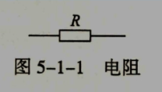


#### 知识点9：什么是欧姆定律
> 
> ​	欧姆定律：通过电阻元件的电流与电阻两端的**电压成正比**，**与电阻成反比**，即I=U/R。从公式可以看出，如果电压U一定，那么电阻R越小时，则电流I越大；反之，当电阻R越大时，电流I越小。欧姆定律适用于<u>纯电阻电路、金属导电和电解液导电</u>，不适用于<u>气体导电和半导体元件</u>。


#### 知识点10：什么是串联电路
>
> ​	串联电路是指电气元件依次首尾相连，且每个节点**最多只连接两个元件**的电路，如图5-1-2所示。
>
> 


#### 知识点11：电阻串联电路有什么特点
> 
> 1. 流过每个电阻的**电流相等**
> 2. 总电压（串联电路两端的电压）等于分电压（每个电阻两端的电压）**之和**。
> 3. 总电阻等于分电阻**之和**。
> 4. 各个电阻两端的电压与其阻值成**正比**
> 5. 各个电阻消耗的动率与其阻值成**正比**。


#### 知识点12：什么是并联电路
> 
> ​	并联是指电路元件的一端连在一起，另一端也连在一起，然后把两端接入电路的方式，如图5-1-3所示。
> 
> 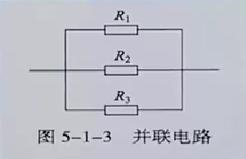


#### 知识点13：电阻并联电路有什么特点
> 
> 1. 电路有**若干条通路**
> 2. 干路开关控制**所有**元件，支路开关控制**所在支路**的元件。
> 3. 各元件相互**无影响**。
> 4. 并联电路中，每一元件两端的电压U都是相同的。
> 5. **总电阻的倒数等于各分电阻的倒数之和。**
> 6. **总电流等于各支路的电流之和。**
> 7. 各个电阻消耗的功率与其阻值成**反比**。


#### 知识点14：什么是电流的热效应
> 
> ​	电流通过导体会产生**热量**，这种现象称为电流的==热效应==。


#### 知识点15:什么是焦耳定律
> 
> ​	焦耳定律是指电流流过导体产生的热量，与**电流的平方、导体电阻及通电时间成正比**。其数学表达式如下:
> $$
> Q=I²Rt
> $$
> 式中 Q--电流通过导体所产生的热量，J;
> 
> ​	 I--通过导体的电流，A; 
> 
> ​	 R--导体的电阻，2;
> 
> ​	 t--通电时间，s。


#### 知识点16：什么是电池、原电池、蓄电池、干电池、电解池
> 
> 1. 电池是指将物质的**化学能转换成电能**的一种电化学装置。
> 2. 原电池是指经过放电后，不能用一般的充电方法使其**复原**而继续使用的电池，也称**一次电池**。
> 3. 蓄电池是指可以通过**充电**的方法使**两极活性物质复原**而可再次放电的电池，也称二次电池。
> 4. 干电池是指电解液**不流动**的电池。通常是指锌锰干电池。
> 5. 电解池是一种将**电能转变为化学能**的电化学装置。**电池充电时相当于电解池**。


#### 知识点17：为什么电池放电不需要外接电源而充电需要外接电源
> 
> ​	因为电池**放电**时的电化学反应是一种**自发**的过程，即**电池向外电路供电是自发进行**；而充电时的电池相当于电解池，电解池中消耗电能的电化学反应是一种**不可以自发**进行的过程，所以要借助外接电源强迫化学反应道方向进行。


#### 知识点18：电池是如何向外输出电能的
> 
> ​	电池向外输出电能时，在**外电路**依靠**电子的定向移动**来传递电荷，在电池**内部**依靠**离子的定向移动**来传递电荷，在电极分界面上依靠其发生电化学反应来传递电荷


#### 知识点19：什么是安全距离
> 
> ​	安全距离是指在各种工况条件下，带电导体与<u>附近接地的物体、地面、不同相带电导体以及工作人员之间</u>所必领保持的**最小距离**或**最小空气间距**。安全距离不仅应保证在各种可能的最大工作电压或过电压作用下不发生**闪络（击穿空气）放电**，还应保证工作人员在对设备进行维护检查、操作和检修时的绝对安全。


#### 知识点20：什么是安全电压
> 
> ​	人体与电接触时，对人体各个组织不会造成任何**损害**的电压为安全电压。（**36V**）


#### 知识点21：什么是保护地线
> 
> ​	为防止电器绝缘损坏而遭触电，一般常用导线将其和大地连接起来，这根导线叫作保护地线。


#### 知识点22：什么是安全色
> 
> ​	安全色是传递安全信息含义的颜色，包括<u>红、蓝、黄、绿</u>4种颜色。红色表示**禁止、停止、危险以及消防设备的意思**。凡是禁止、停止、消防和有危险的器件或环境均应涂以红色的标记作为警示的信号。蓝色表示**指令**，要求人们必须遵守的规定。黄色表示提醒人们**注意**。凡是警告人们注意的器件、设备及环境都应以黄色表示。绿色表示允许、**安全**。安全色如图5-1-4所示。
> 
> 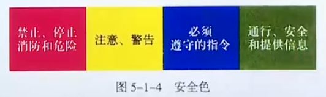


#### 知识点23：二极管有什么特性
> 
> ​	二极管具有**单向**导电性。


#### 知识点24：电气测量仪表按用途如何分类
> 
> ​	电气测量仪表按用途不同可分为<u>电压表、电流表、电能表和功率表</u>等。


#### 知识点25：电气测量仪表按工作原理如何分类
> 
> ​	电气测量仪表按工作原理不同可分为<u>电磁系仪表、磁电系仪表、感应系仪表和电动系仪表</u>等。


#### 知识点26：电气测量仪表按被测电流的性质如何分类
> 
> ​	电气测量仪表按被测电流性质的不同可分为<u>直流表和交流表</u>。


#### 知识点27：什么是电压表
> 
> ​	电压表又称伏特表，是测量电路电压的仪表。电压表有**直流和交流**的区别，但它们的连接方式都是与被测量电路**并联**。电压表如图5-1-5所示
> 
> 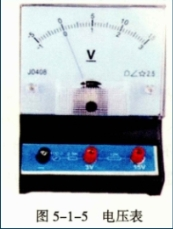


#### 知识点28：什么是电流表
> 
> ​	电流表又称安培表，是测量电流的仪表。电流表也有**交流和直流**的区别，但它们的连接方式都是与被测电路**串联**。电流表根据所测电流的种类分**为直流表、交流表和交直流两用表**等。电流表如图5-1-5所示。
> 
> 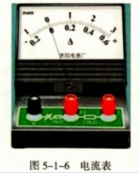


#### 知识点29：电流表和电压表的使用步骤是什么
> 
> ​	电流表和电压表的使用步骤基本相同，都分为<u>调、选、连、读</u>4步。
> 
> 1. 调--使用前先将表的指针调到“**零刻度**”的位置。
> 2. 选--根据电路的实际情况选用合适的**量程**。在不知实际电流或电压的情况下，可采用“**试触**”的方法判断是否超过量程。注意，试触时要接在**大量程**的接线柱上，并且动作要**迅速**
> 3. 连--将电流表和电压表按照各自正确的连接方法连入电路，注意表的正、负接线柱与电流流向的关系，必领保证电流从表的**正接线柱流入、从负接线柱流出**。
> 4. 读--正确读出表指针所指的数值，读数时一定要注意选用的量程及其对应的最小刻度值。


#### 知识点30：什么是万用表
> 
> ​	万用表是电子测量中最常用的工具，具有**用途广、量程广、使用方便**等优点，能测量<u>电压、电流、电阻，有的还可以测量晶体管的放大倍数、频率、电容值、电感值、分贝值</u>等。万用表如图5-1-7所示。
> 
> 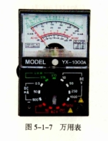


#### 知识点31：万用表的工作原理是什么
> 
> ​	万用表的工作原理是利用一只灵敏的磁**电式直流电流表作为表头**，当有微小电流通过表头时，就会有**电流指示**。但表头**不能通过大电流**，所以必须在表头上并联或串联电阻进行**分流或降压**，从而测出电路中的电流、电压和电阻等。


#### 知识点32：万用表怎样测量电阻
> 
> ​	先将表笔搭在一起，使指针向右偏转，随即调整欧姆调零旋钮，使指针恰好指到“0”。测电阻时，把转换开关拨至适当的“Ω”量程，将两支马克笔分别接触被测电阻或电路的两端，读出指针在欧姆刻度线上的读数，再乘以该挡标的数字，即得到被测电阻的电阻值。


#### 知识点33：万用表怎样测量直流电压
> 
> ​	首先估计一下被测电压的大小，然后将转换开关拨至适当的“V”量程，将正表笔接被测电压的“+”端，负表笔接被测电压的“-”端，然后根据该挡量程与表直流符号“DC”刻度线上指针所指数字，读出被测电压的大小。


#### 知识点34：万用表怎样测量直流电流
> 
> 首先预估一下被测电流的大小，然后将转换开关拨至合适的“mA”量程，再把万用表串联在电路中，同时观察标有直流符号“DC”刻度线上指针所指数字，读出读数。


### 第二节 电气线路和设备防火知识
> 
> 【知识要点】
> 
> 1. 电气防火的相关概念。
> 2. 造成电气火灾的原因及预防措施。
> 3. 电气线路火灾的预防措施及保护措施。
> 4. 电气照明灯具在不同场所的选择。
> 5. 电气照明灯具的火灾危险性及设置要求。
> 6. 电气装置的火灾预防措施。
> 7. 静电、雷电的危害及防护措施。


#### 知识点1：什么是电气火灾
> 
> ​	由于电气方面的原因（如<u>过载、短路漏电、电火花或电弧</u>等）产生**火源**而引起的
> 火灾，称为**电气火灾**。


#### 知识点2：什么是电气防火措施
> 
> ​	为了抑制电气火源的产生而采取的各种即时措施和安全管理措施，称为电气防火措施。


#### 知识点3：造成电气火灾的原因有哪些
> 
> ​	从电气防火的角度来看，电气火灾大都是由于电气线路和设备安装或使用不当、配电线路<u>短路、过载、电气产品质量差、雷击或静电以及管理不善</u>等原因造成的。


#### 知识点4：什么是过载
> 
> ​	过载是指电气设备和电气线路在运行中**超过安全载流量或额定值**。


#### 知识点5：造成过载的原因有哪些
> 
> 1. **设计、安装时选型不正确**，使电气设备的额定容量小于实际负载容量。
> 2. **设备或导线随意装接**，负荷增加，造成过载运行。
> 3. **检修、维护不及时**，使设备或导线长期处于带病运行状态。


#### 知识点6：如何防止过载
> 
> 1. **低压配**电装置**不能过载运行**，其电压、电流指示值应在正常范围内。
> 2. 正确选择和安装**过载保护装置**。
> 3. **电开关和插座**应选用合格产品，且不能过载使用。
> 4. 正确选用不同规格的**电线电缆**，即根据使用负荷选择**合适的导线截面**。
> 5. 对于存在电动机（大功率）的负载的电路，要正确选型，防止电动机过载。


#### 知识点7：什么是短路、电弧和火花
> 
> ​	短路是**相线与相线，相线与零线（或地线）**在某一点相碰或相接引起电气回路中电流突然增大的现象。短路是一种较为严重的电气故障状态。短路时，在短路点或导线松动的电气接头处，会产生电弧或电火花。电弧温度可达到**6000℃**以上。


#### 知识点8：造成短路的原因有哪些
> 
> 1. 电气设备的使用和安装与**使用环境要求不符**，致使其绝缘在<u>高温、潮湿、酸碱</u>等环境下受到破坏。
> 2. 电气设备使用**时间过长**，绝缘**老化**，耐压与机械强度下降。
> 3. 金属等导体或老鼠等动物跨越**在输电裸线之间或裸线与地之间**。
> 4. 由于拖拉、摩擦、挤压、长期接触坚硬物体等，导线的**绝缘层受到机械损伤**。
> 5. 过电压使**绝缘被击穿**。
> 6. 恶劣天气造成**线路金属性连接**。


#### 知识点9：如何防止短路
> 
> 1. 电气线路应选用**绝缘**电线电缆。
> 2. 确保电气线路的**安装施工质量**，**加强日常安全检查**，注意电气线路间及线路与物体间保持一定的**安全距离**，并防止导线因**机械性损伤**而导致**绝缘性能下降**。
> 3. 低压配电装置的大负荷开关应安装**灭弧装置**。
> 4. <u>配电线、插座、开关</u>等容易产生电弧或电火花的设备**附近不要放置易燃物品**。
> 5. 插座和开关等设备应保持完好无损，在**潮湿场所应采取防水、防潮措施**。
> 6. 安装**漏电检测与保护装置**，及时发现电气线路和用电气设备的绝缘故障，并提供保护。


#### 知识点10：接地故障引起火灾的原因有哪些
> 
> 1. 当**绝缘损坏**时，相线与接地线或接地金属物之间漏电，会形成火花放电。
> 2. 在接地回路中，因**接地线接头太松或被腐蚀**等，使电阻增加导致局部**过热**
> 3. 在高阻值回路中，流通的故障电流会沿**邻近阻抗小的接地金属结构流散**。
> 4. 在低阻值回路中，若接地线截面过小，会影响其**热稳定性**（散热），使接地线产生近热现象。


#### 知识点11：如何预防接地故障引起的火灾
> 
> 1. 在接地系统设计时要**综合考虑，确保系统安全**。
> 2. 确保接地装置具有足够的**载流量、热稳定性及连接可靠性**。
> 3. 低压配电系统实行**等电势连接**。
> 4. 装设**漏电保护装置**。


#### 知识点12：如何预防电气线路的火灾
> 
> ​	预防电气线路的火灾主要应从<u>电线电缆的选择、线路的敷设及连接、在线路上采取保护</u>错施等方面入手。


#### 知识点13：如何选择电线电缆
> 
> ​	应根据使用场所的<u>湿度、化学腐蚀性、温度</u>等环境因素及<u>额定电压</u>要求，选择适宜的电线电缆。同时应根据系统的载荷情况，合理地选择导线截面积，在计算所得导线截面积的基础上适当**留出增加负荷的余量**。


#### 知识点14：什么样的场所不应选用铝芯电缆而应该选择铜芯电缆
> 
> 1. 需要确保**长期运行、连接可靠**的回路。
> 2. **移动**设备的线路。
> 3. **振动**环境的线路。
> 4. 对**铝有腐烛**的环境。
> 5. **非操作人员容易接触**的线路。


#### 知识点15：固定敷设的供电线路宜采用什么电缆
> 
> ​	固定敷设的供电线路宜采用**铜芯**电缆。


#### 知识点16：什么样的场所应选用铝芯电缆
> 
> 1. 对**铜有腐蚀但对铝腐蚀较小**的环境。
> 2. **氨压缩机房**等场所。


#### 知识点17：电线电缆按绝缘材料不同分为哪几类
> 
> ​	电线电缆按绝缘材料不同分为：<u>普通电线电缆、阻燃电线电缆和耐火电线电缆</u>。


#### 知识点18：普通电线电缆分为哪几类
> 
> ​	普通电线电缆分为：<u>普通聚氯乙烯电线电缆、交联聚氣乙烯电线电缆、橡胶电线电缆</u>。


#### 知识点19：普通聚氯乙烯电线电缆的适用范围有哪些
> 
> ​	普通聚氯乙烯电线电缆适用于温度为**-15~60℃**的环境。普通聚氯乙烯电线电缆在燃烧时会产生**有毒烟气**，对人体造成严重的伤害，所以不适用于<u>地下客运设施、地下商业街、高层建筑和重要公共设施等人员密集场所</u>。


#### 知识点20：交联聚氯乙烯电线电缆的适用范围有哪些
> 
> ​	交联聚氯乙烯电线电缆适用于温度**小于-15℃或大于60℃**的环境。交联聚氯乙烯电线电缆不具备**阻燃性能**，但燃烧时**不会产生大量有毒烟气**，适用于有**清洁要求的工业与民用建筑**。


#### 知识点21：橡胶电线电缆的适用范围有哪些
> 
> ​	橡胶电线电缆的弯曲性能较好，能够在**严寒气候**下敷设，适用于水平高差大和需要垂直敷设的场所，也适用于**移动式**电气设备的供电线路。


#### 知识点22：什么是阻燃电线电缆
> 
> ​	阻燃电线电缆是指在规定试验条件下燃烧时，火焰仅在规定范围内蔓延，撤去火源后，残焰和残灼能在限定时间内**自行熄灭**的电线电缆。


#### 知识点23：阻燃电线电缆按燃烧性能不同分为哪几类
> 
> ​	阻燃电线电缆按燃烧性能不同可分为：**B1级电线电缆和B2级电线电缆两大类**。


#### 知识点24：阻燃电线电缆按燃烧时烟气特性不同分为哪几类
> 
> ​	阻燃电线电缆按燃烧时烟气特性不同可分为：**一般阻燃电线电缆、低烟低卤阻燃电线电缆、无卤阻燃电线电缆**三大类。


#### 知识点25：阻燃电线电缆敷设时应注意哪些问题
> 
> ​	当敷设在<u>电缆井、沟</u>内时，可**不穿金属管或采用封闭式金属线槽盒保护**。同一通道中敷设的电线电缆，应为**同一**阻燃级别。阻燃和非阻燃电线电缆**不宜在同一通道内敷设**。


#### 知识点26：什么是耐火电线电缆
> 
> ​	耐火电线电缆是指在规定试验条件下，在火焰中燃烧**一定时间内仍然能保持正常运行**的电线电缆。


#### 知识点27：耐灭电线电缆按绝缘材料不同分为哪几类
> 
> ​	耐火电线电缆按绝缘材料不同可分为：**有机型耐火电线电缆和无机型耐火电线电缆**两种。


#### 知识点28：什么是有机型耐火电线电缆
> 
> ​	有机型耐火电线电缆主要采用耐800℃高温的**云母带**，以50%的重叠搭盖率包覆两层作为**耐火层**，**外部**采用聚氯乙烯或交联聚氯乙烯作为**绝缘**。如果同时要求阻燃，则外部采用**阻燃**性材料。
> 
> 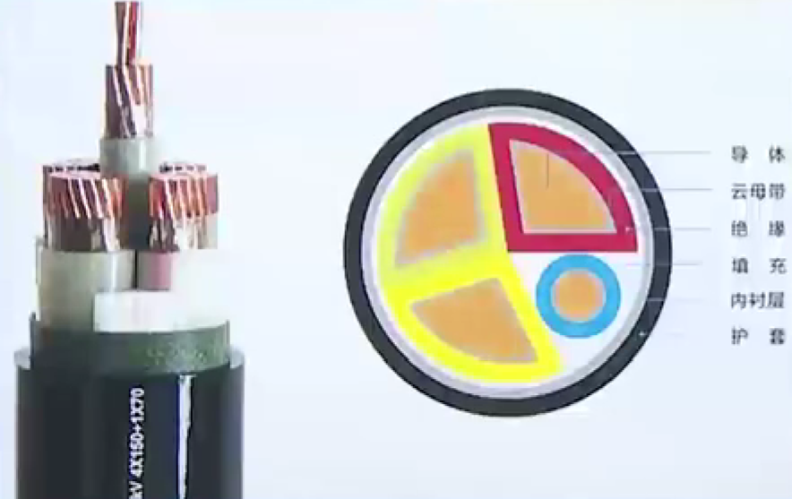


#### 知识点29：什么是无机型耐火电线电缆
> 
> ​	无机型耐火电线电缆又称为**矿物绝缘电线电缆**，采用**氧化镁**作为**绝缘**材料，**铜管**作为**保护套**。


#### 知识点30：耐灭电线电缆的适用范围是什么
> 
> ​	耐火电线电缆主要适用于**发生火灾时仍需要保持正常运行**的线路，如民用建筑的**应急照明系统**等。
> 
> 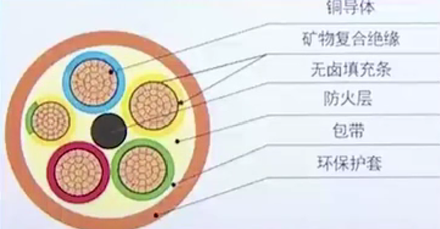


#### 知识点31：电线电缆截面积的选择原则是什么
> 
> 1. 通过**负载**电流时，**线芯温度不超过电线电缆绝缘所允许的长期工作温度**。
> 2. 通过**短路**电流时，**不超过所允许的短路电流强度**。**高压**电线电缆要校验**热稳定性**，**母线**要校验**动稳定性和热稳定性**。
> 3. 电压损失在介许范围内。
> 4. 满足力学强度的要求。
> 5. 低压电线电缆应符合负载保护要求，TN系统（保护接零）还应保证接地故障发生时保护电器能断开电路。


#### 知识点32：保护电气线路的方法有哪些
> 
> 1. 电线电缆的**合理选型**
> 2. 电线电缆的**合理敷设**
> 3. 设置**短路保护、过载保护和接地故障保护**。


#### 知识点33：设置短路保护有什么要求
> 
> ​	短路保护装置应保证短路电流在导体和连接件中产生的热效应和机械损伤造成危害**之前分断该短路电流**。其分断能力**不应小于**保护电器安装的**预期短路电流**，但在上级**已装具有相应分断能力的保护电器时**，下级保护电器的分断能力**允许小于**预期短路电流。此时，该上、下级保护电器的动作特性必须配合，使得通过下级保护电器的容量**不超过其能够承受的容量**，在短路电流使导体达到允许的**极限温度之前分断该短路电流**。


#### 知识点34：设置过载保护有什么要求
> 
> ​	保护电器应在过载电流引起导体升温，对导体的绝缘、接头、端子或导体周围的物质造成**损害之前分断过载电流**。对于突然断电会比过载造成更大损失的线路，如**消防水泵**之类的负荷，其过载保护应作为**报警信号**，不应作为直接切断电路的触发信号。


#### 知识点35：过载保护电器的动作特性需要满足什么条件
> 
> 1. 线路**计算电流小于或等于**熔断器熔体的**额定电流**，后者应**小于或等于导体允许持续载流量**。
> 2. 保证保护电器可靠动作的电流**小于或等于1.45倍**熔断器熔体的额定电流。（**不用背**）


#### 知识点36：电气照明灯具在不同场所应如何选型
> 
> ​	灯具的选型应符合国家相关标准的规定，既要满足使用功能和照明质量的要求，又要满足防火安全的要求，见表5-2-1。
> 
> |                场所                |                    灯具类型                    |
> | :--------------------------------: | :--------------------------------------------: |
> |            火灾危险场所            |        应选用闭合型、封闭型、密闭型灯具        |
> |            爆炸危险场所            |            应选用防爆型、隔爆型灯具            |
> |     有腐蚀性气体及特别潮湿场所     | 应采用密闭型灯具，灯具的各部件还应进行防腐处理 |
> |         潮湿的厂房内和户外         |    可采用封闭型灯具或有防水灯座的开启型灯具    |
> |              振动场所              |               灯具应具有防振昔施               |
> |        人防工程内的潮湿场所        |                应采用防潮型灯具                |
> | 柴油发电机的储油间、<br>蓄电池室等 |                应采用密闭型灯具                |
> |            可燃物品厂房            |          不应设置卤钨灯等高温照明灯具          |
> |     可能有外来机械性损伤的场所     |              应采用有保护罩的灯具              |


#### 知识点37：常用电气照明灯具火灾的预防方法有哪些
> 
> 1. **白炽灯、高压汞灯与可燃物品之间**的距离应大于**50cm**。严禁用纸、布等可燃材料遮挡灯具。灯具下方不能堆放可燃物品。
> 2. 灯泡距地面的高度一般不低于**2m**，如低于2m应采取**防护措施**。容易出现碰撞的场所应采用金属网罩防护，湿度大的场所应有**防止水滴的措施**。
> 3. 日光灯**镇流器**安装时应注意**通风散热**，不准将镇流器直接固定在可燃天花板或板壁上。镇流器在低压照明中，要选择合适的导线截面，防止**发热量过大**而引起危险
> 4. 在有大量**可燃粉尘**的地方，如<u>粮食加工厂、棉花工厂</u>等要采用**防尘灯具**。
> 5. 爆炸场所应安装相应的**防爆**照明灯具。


#### 知识点38：什么是电气设备
> 
> ​	电气设备是在电力系统中对发电机、变压器、电力线路、断路器等设备的统称。


#### 知识点39：什么是电气装置
> 
> 电气装置是指相关电气设备的组合，具有为实现特定目的而相互协调的特性
> 
> 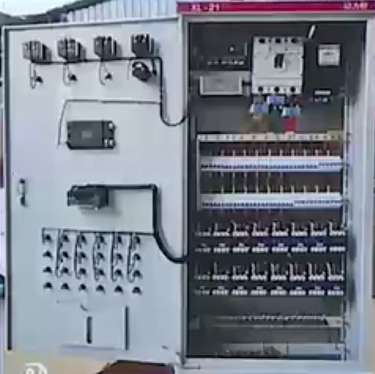


#### 知识点40：预防剩余电流保护装置火灾的方法有哪些
> 
> ​	剩余电流保护装置应安装在**通风干燥**的地方，避免**灰尘和有毒气体**的**腐蚀**。在接线时应特别注意保护装置的接线端子不要接错，被保护线路应用**纱布或胶布扎紧并穿过零序电流互感器圆孔的中心**，在零序电流互感器圆孔前后**20cm**范围内线束不应散开。在安装具有短路保护的剩余电流保护装置时，必须保证在电弧喷出方向留有足够的**飞弧距离**。


#### 知识点41：预防配电柜火灾的方法有哪些
> 
> ​	配电柜应安装在**安全·、干燥、便于操作**的场所。配电柜上的电气设备应根据<u>电压等级、防火要求、负荷容量</u>等进行选定。配电柜的金属支架和电气设备的金属外壳必须**接地或接零**。


#### 知识点42：预防变压器火灾的方法有哪些 
> 
> ​	安装前，注意检查变压器的**绝缘情况**，保证各部分绝缘良好，保证变压器额定电压与电源电压一致；安装时要注意接线牢固，接地可靠；运行中要注意变压器**电流、电压**的测量，防止**过载运行**；平时要加强对变压器各零部件的检查，发现有破损、漏油等异常现象及时处理；油温控制在**85℃**以下，对油进行定期检查，发现**变质或者酸量超过规定值**要及时更换处理。


#### 知识点43：预防电容器火灾的方法有哪些
> 
> 1. 防止过电压。运行电压不超道**1.1**倍的额定电压，运行电流不宜超过**1.3**倍的额定电流。
> 2. 保持良好的通风条件，室内温度不宜超过**40℃**。
> 3. 加强线路维护，做到无凸起、无渗漏油、无套管松动和裂损、无火花放电等不良现象。
> 4. 接地线要连接良好。
> 5. 设置可靠的保护装置。


#### 知识点44：电气防爆的基本原理是什么
> 
> ​	电气防爆就是将设备在正常运行时产生电火花、电弧的部件放在**隔爆外壳内**，或采取<u>浇封、充砂、油浸或正压</u>等其他方式达到防爆目的。对于在正常运行时不会产生电火花、电弧和危险高温的设备，如果在其结构上再采取一些保护措施，使设备在正常运行或认可的过载条件下不产生电火花、电弧或过热现象，这种设备在正常运行时就没有引燃源，设备的安全性和可靠性就可进一步提高，可用于有爆炸危险的环境。


#### 知识点45：电气防爆的基本措施有哪些
> 
> 1. 宜将正常运行时产生火花、电弧和危险温度的电气设备和线路，布置在**爆炸危险性较小或没有爆炸危险**的环境内。
> 2. 采用**防爆**的电气设备。
> 3. 按有关电力设备接地设计技术规程规定的一般情况**不需要接地**的部分，在爆炸危险区域内**仍应接地**，电气设备的**金属外壳**应可靠**接地**。
> 4. 设置漏电火灾报警和紧急断电装置。
> 5. 安全使用防爆电气设备。
> 6. <u>散发较空气重的可燃气体、可燃蒸气的甲类厂房以及有粉尘、纤维爆炸危险的乙类厂房，应采用不发火花的地面。采用绝缘材料作为整体面层时，应采取防静电措施。</u>（非电气防爆）


#### 知识点46：电气设备的防爆性能与爆炸危险物质的危险性相适应的原则是什么
> 
> ​	当区域存在两种以上爆炸危险物质时，电气设备的防爆性能应**满足危险程度较高**的物质的要求。爆炸性气体环境内，防爆电气设备的类型和温度组别应与爆炸性气体（或混合物）的**分类、分级和分组**相对应；爆炸性粉尘环境内，防爆电气设备的最高表面温度应符合规范。


#### 知识点47：静电火灾发生的条件有哪些
> 
> 1. 周围和空间必须有**可燃物**存在。
> 2. 具有产生和**积累静电**的条件。
> 3. 当静电累积至足够高的静电电势后，必将周围的空气介质击穿而产生**放电**。
> 4. 静电放电的能量大于或等于可燃物的最小点火能量。


#### 知识点48：静电的危害包括哪些
> 
> ​	静电的危害主要包括呈现<u>静电力作用（或高压击穿作用）、静电火灾和爆炸、人体电击、射频辐射</u>4个方面的内容。其中消防部门最注重的是静电火灾和爆炸事故。


#### 知识点49：静电的防护措施有哪些
> 
> 1. 减少静电荷的**产生**
> 
>    正确选择材料、改变工艺操作程序，降低静电的危害、降低摩擦速率和流速、减少特殊操作中的静电等。
> 
> 2. 减少静电荷的**积聚**
> 
>    静电接地、增加空气的相对湿度、采用抗静电添加剂、采用静电消除器防止带电等。
> 
> 3. **控制静电场所**的危险程度
> 
>    抑制静电放电、控制静电放电的能量、控制和排除可燃物等。
> 
> 4. 防止人体静电
> 
>    人体接地，释放人体静电。


#### 知识点50：雷电如何分类
> 
> ​	雷电的种类包括：直击雷、感应雷、雷电波和球雷等。


#### 知识点51：雷电的危害有哪些
> 
> ​	雷电的危害包括：电效应、热效应、机械效应和电磁效应。


#### 知识点52：建筑物的防雷装置的接地装置应满足哪些基本要求
> 
> ​	建筑物的防雷装置主要包括建筑物**外部**防雷装置和建筑物**内部**防雷装置。建筑物的防雷装置由**接闪器、引下线、接地装置**组成。建筑物的接地装置应满足<u>材质、尺寸、埋设深度、力学强度</u>等方面的要求。


## 第六章 消防设施基本知识
> 
> ​	建筑消防设施是指建筑物、构筑物中设置的用于火灾<u>报警、灭火、人员疏散（照明）、防火分隔（卷帘、门）、灭火救援（消防电梯）行动</u>等设施的总称。建筑消防设施在<u>预防火灾发生（预警）、帮助人员逃生、控制及消灭火灾</u>等方面发挥着巨大作用，是建筑物实现自防自救的重要设施。现代建筑消防设施涉及的范围较广，种类多、功能全，常见的有<u>火灾自动报警系统、自动喷水灭火系统、气体灭火系统、泡沫灭火系统、干粉灭火系统、水喷雾灭火系统、消火栓系统防烟排烟系统、安全疏散系统（照明）</u>等。


### 第一节 火灾自动报警系统基本知识
> 
> 【知识要点】
> 
> 1. 火灾自动报警系统的作用、组成及类型。
> 2. 火灾探测器的类型及相关特性。
> 3. 火灾自动报警系统的工作原理。
> 4. 火灾自动报警系统的设置范围和要求。


#### 知识点1：什么是火灾自动报警系统
> 
> ​	火灾自动报警系统是**探测火灾早期特征（热、光、火焰）、发出火灾报警信号**，为人员疏散、防止火灾蔓延和启动自动灭火设备提供**控制与指示**的消防系统。


#### 知识点2：火灾自动报警系统的设置范围有哪些
> 
> 1. 《建筑防火通用规范》（GB 55037-2022）中规定，除<u>散装粮食仓库、原煤仓库</u>可**不设置**火灾自动报警系统外，下列工业建筑或场所应设置火灾自动报警系统。（**口诀：高丙、下1丙**）
>    1. 丙类高层厂房。
>    2. 地下、半地下且建筑面积大于1000m²的丙类生产场所。
>    3. 地下、半地下且建筑面积大于1000m²的丙类仓库。
>    4. 丙类高层仓库或丙类高架仓库。
> 2. 下列民用建筑或场所应设置火灾自动报警系统。
>    1. 商店建筑、展览建筑、财贸金融建筑、客运和货运建筑等类似用途的建筑。
>    2. 旅馆建筑。
>    3. 建筑高度大于100m的**住宅**建筑。
>    4. 图书或文物的**珍**藏库，每座藏书超过50万册的图书馆，**重**要的档案馆。
>    5. 地**市**级及以上广播电视建筑、邮政建筑、电信建筑，城市或区域性电力、交通和防灾等指挥调度建筑。
>    6. **特等、甲等**剧场，座位数超过1500个的其他等级的剧场或电影院，座位数超过2000个的会堂或礼堂，座位数超过3000个的体育馆。（**口诀：3体2会礼特甲15剧**）
>    7. **疗**养院的病房楼，床位数不少于100张的医院的门诊楼、病房楼、手术部等。
>    8. 托儿所、幼儿园，老年人照料设施，任一层建筑面积大于500㎡或总建筑面积大于1000m²的其他儿童活动场所。（**口诀：任5总1童**）
>    9. 歌舞娱乐放映游艺场所。
>    10. 其他二类高层公共建筑内建筑面积大于50m²的可燃物品库房和建筑面积大于500m²的商店营业厅，以及其他一类高层公共建筑。（**口诀：二公550**）


#### 知识点3：火灾自动报警系统有哪些形式
> 
> ​	火灾自动报警系统有==**区域**报警系统、**集中**报警系统和控制**中心**报警系统==三种形式，各自有不同的适用范围。
> 
> 1. 区城报警系统适用于**仅**需要**报警**、**不**需要**联动**自动消防设备的保护对象。
> 2. 集中报警系统适用于不仅需要**报警**，同时需要**联动**自动消防设备，且**只设置一台**具有集中控制功能的火灾报警控制器和消防联动控制器的保护对象。需要一个消防控制室
> 3. 控制中心报警系统适用于设置**两个及以上**消防控制室的保护对象，也适用于已设置**两个及以上**集中报警系统的保护对象。


#### 知识点4：火灾自动报警系统有哪些组成部分
>
> ​	火灾自动报警系统的设置形式不一样，其系统组成也不一样。
>
> 1. 区域报警系统应由**火灾探测器（自动触发）、手动火灾报警按钮、火灾声光警报器及火灾报警按制器**等组成，系统中可包括消防控制室图形显示装置和指示楼层的区域显示器。==火灾探测器和手报按钮必须要有==
> 2. 集中报警系统应由**火灾探测器、手动火灾报警按钮、火灾声光警报器、消防专用电话、消防应急广播、消防控制室图形显示装置、火灾报警控制器、消防联动控制器**等组成。
> 3. 控制中心报警系统设置两个及以上消防控制室，或设置两个及以上集中报警系统，其组成与集中报警系统基本一致。当有两个及以上消防控制室时，应确定一个**主消防控制室**。主消防控制室应能显示**所有**火灾报警信号和联动控制状态信号，并应能控制**重要**的<u>消防设备（泵和风机）</u>；各分消防控制室内消防设备之间可互相**传输、显示状态信息**，但**不应互相控制**。
> 4. ==集中火灾报警控制器主要包括：显示板（含显示屏）、指示灯·、开关和按钮、打印机、主板、输入/输出控制板、音响器件、网络接口组件、电源装置（含电池）、外壳等器件。==


#### 知识点5：怎样理解火灾探测报警系统的工作原理
> 
> ​	火灾发生时，安装在保护区域现场的火灾探测器，将火灾产生的<u>烟雾、热量和光福射</u>等火灾特征参数信息转变为**电信号**，经数据处理后**传输至火灾报警控制器**；或**直接**由火灾探测器做出火灾报警**判断**（独立型），将报警信息传输到火灾报警控制器。火灾报警控制器在接收到火灾探测器的火灾特征参数信息或报警信息后，经报警确认判断，**显示**火灾探测器的**位置**，**记录**火灾探测器的火灾报警**时间**。
> 
> ​	处于火灾现场的人员，在发现火灾后可立即**触动**安装在现场的**手动火灾报警按钮**，火灾报警控制器在接收到手动火灾报警按钮的报警信息后，经报警确认判断，显示动作的手动火灾报警按钮的位置，记录手动火灾报警按钮的报警时间。
> ​	火灾报警控制器在确认（**两个触发信号，比如两个探测器或一个探测器一个手报**）火灾探测器和手动火灾报警按钮的报警信息后，**驱动**安装在被保护区域现场的火灾警报装置，发出火灾警报，向处于被保护区域内的人员警示火灾的发生。


#### 知识点6：怎样理解消防联动经控制系统的工作原理
> 
> ​	火灾发生时，火灾探测器和手动火灾报警按钮的报警信号等联动触发信号**传输**至消防联动控制器，消防联动控制器按照预设的逻辑关系对接收到的触发信号进行**识别、判断**，在满足逻辑关系条件时，消防联动控制器按照预设的控制时序启动相应的自动消防系统（设施），实现预设的消防功能；消防控制室的消防管理人员也可以通过操作消防联动控制器的**手动控制盘直接启动**相应的消防系统（设施），从而实现预设的消防功能。消防联动控制器接收并显示消防系统（设施）动作的反馈信息。


#### 知识点7：怎样理解可燃气体探测报警系统的工作原理
> 
> ​	发生可燃气体泄漏时，安装在保护区域现场的可燃气体探测器，将泄漏的可燃气体**浓度参数信息转变为电信号**，经数据处理后传输至**可燃气体报警控制器**；或直接由可燃气体探测器（独立型）做出可燃气体泄漏液度超限报警判断，==将报警信息传输至可燃气体报警控制器（和图显）==。
> 
> ​	可燃气体报警控制器在接收到可燃气体探测器的可燃气体浓度参数信息或报警信息后，经报警确认判断，显示可燃气体探测器的位置并发出泄漏的可燃气体浓度参数信息，**记录**可燃气体探测器的**报警时间**，同时**驱动**安装在保护区域现场的声光**警报装置**，发出声观**警报**，警示人员采取相应的处置措施。必要时可以控制并关断可燃气体的阀门，防止可燃气体的进一步泄漏。


#### 知识点8：怎样理解电气火灾监控系统的工作原理
>
> ​	发生电气故障时，电气火灾监控探测器将保护线路的剩余电流、温度等电气**故障参数信息转变为电信号**，经数据处理后，电气火灾监控探测器做出报警判断，将报警信息**传输**到电气火灾监控器。
>
> ​	电气火灾监控器在接收到电气火灾监控探测器的报警信息后，经报警确认判断，显示电气火灾监控探测器的位置信息，**记录**电气火灾监控探测器的报警**时间**，同时**驱动**安装在保护区域现场的声光警报装置，发出声光警报，警示人员采取相应的处置措施，排除电气故障、消除电气火灾隐患，防止电气火灾的发生。
>
> ​	==电气火灾监控设备关机前先断开备用电源开关再断开主电源空气开关==。


#### 知识点9：火灾自动报警系统的常见触发器件是指哪些
> 
> ​	在火灾自动报警系统中，自动或手动产生火灾报警信号的器件称为触发器件，主要包括**火灾探测器和手动火灾报警按钮**。火灾探测器是能对火灾参数（如<u>烟、温度、火焰辐射、气体浓度</u>等）响应，并自动产生火灾报警信号的器件。手动火灾报警按钮是**手动方式**产生火灾报警信号、启动火灾自动报警系统的器件。


#### 知识点10：火灾探测器如何分类
>
>1. 根据火灾特征参数分类
>
>   火灾探测器根据火灾特征参数的不同，可以分为<u>感烟、感温、感光、气体、复合</u>等类型。
>
>   1. 感温火灾探测器：响应<u>异常温度、温升速率和温差变化</u>等参数的探测器。
>
>   2. 感烟火灾探测器：响应悬浮在大气中燃烧和（或）热解产生的固体或液体微粒的探测器，进一步可分为<u>离子感烟、光电感烟、（点型）</u><u>红外光束（线型）</u>、吸气型等类型。
>
>   3. 感光火灾探测器：响应火焰发出的特定波段电磁辐射的探测器，又称火焰探测器，进一步可分为<u>紫外、红外及复合</u>式等类型。
>
>   4. 气体火灾探测器：响应燃烧和（或）热解产生的气体的火灾探测器。
>
>   5. 复合火灾探测器：将多种探测原理集于一身的探测器，进一步可分为<u>烟温复合、红外紫外复合</u>等类型。
>
>      此外，还有一些特殊类型的火灾探测器，包括：使用摄像机、红外热成像器件等视频设备或它们的合方式获取监控现场视频信息，进行火灾探测的**图像型**火灾探测器；探测泄漏电流大小的漏电流感应型火灾探测器；探测静电电势高低的静电感应型火灾探测器；还有在一些特殊场合使用的、要求探测极其灵敏、动作极为迅速，通过探测爆炸产生的参数变化（如压力的变化）信号来抑制、消灭爆炸事故发生的微区差型火灾探测器；利用超声原理探测火灾的超声波火灾探测器等。
>
>2. 根据监视范围分类
>
>   火灾探测器根据其监视范围的不同，分为点型火灾探测器和线型火灾探测器。
>
>   1. 点型火灾探测器：响应一个小型传感器附近火灾特征参数的探测器。
>   2. 线型火灾探测器：响应某一连续路线附近火灾特征参数的探测器。此外，还有一种多点型火灾探测器，可响应多个小型传感器（如热电偶）附近的火灾特征参数。
>
>3. 根据是否具有复位（恢复）功能分类
>
>   火灾探测器根据其是否具有复位（恢复）功能，分为可复位探测器和不可复位探测器。
>
>   1. 可复位探测器：在响应后和引起响应的条件终止时，**不更换任何组件**即可从报警状态恢复到监视状态的探测器。
>   2. 不可复位探测器：在响应后不能恢复到正常监视状态的探测器。
>
>4. 根据是否具有可拆卸性分类
>
>   火灾探测器根据其维修和保养时是否具有可拆卸性，分为可拆卸探测器和不可拆卸探测器。
>
>   1. 可拆御探测器：探测器设计成**容易**从正常运行位置上拆下来的形式，以方便维修和保养。
>   2. 不可拆卸探测器：探测器设计成**不容易**从正常运行位置上拆下来的形式。
>
>​	线型光束感烟火灾探测器的发射器和接收器之间的距离==不宜超过100m==。
>
>​	==当建筑内梁突出顶棚的高度超过0.6m时，被梁隔断的每个梁间区域应至少设置一只探测器。==
>
>==探测器期间==：
>
>1. 如果发现线型光束感烟火灾探测器的发射、接收窗口及反射器表面被灰尘或者油污污染，注意不要使用水（水难以清理油污）及其他化学药剂（可能损坏表面材料）除污。
>2. 具有报脏功能的探测器在报脏时应该及时清洁保养。没有报脏功能的探测器，应按产品说明书的要求进行清洁保养；产品说明书没有明确要求的，应每2年清洁或标定一次。
>3. 线型光束感烟火灾探测器每半年进行一次报警功能测试。


#### 知识点11：手动火灾报警按钮如何分类
> 
> ​	手动火灾报警按钮是火灾自动报警系统中**不可缺少**的一种手动触发器件，它通过手动操作报警按钮的启动机构向火灾报警控制器发出火灾报警信号，即手动火灾报警按钮是需要**外力**才能触发启动的。手动火灾报警按钮的分类见表6-1-1。
> 
> ​	手动火灾报警按钮在工业和民用建筑中应用广泛，每个防火分区应**至少设置一只手**动火灾报警按钮。从一个防火分区内的任何位置到最邻近的手动火灾报警按钮的**步行距离**不应大**30m**。在石油化工企业甲、乙类装置区周围和罐组四周道路边应设置手动火灾报警按钮，其间距不宜大于**100m**。
> 
> <table>
>     <tr>
>     	<td style="text-align: center;" >序号</td>
>     	<td style="text-align: center;" >分类标准</td>
>     	<td style="text-align: center;" >类别</td>
>     </tr>
>     <tr>
>     	<td style="text-align: center;" >1</td>
>     	<td style="text-align: center;"  rowspan="2">有无编码</td>
>     	<td style="text-align: center;" >编码型手动火灾报警按钮</td>
>     </tr>
>     <tr>
>     	<td style="text-align: center;" >2</td>
>     	<td style="text-align: center;" >非编码型手动火灾报警按钮</td>
>     </tr>
>     <tr>
>     	<td style="text-align: center;" >3</td>
>     	<td style="text-align: center;"  rowspan="2">触发方式</td>
>     	<td style="text-align: center;" >玻璃破碎型手动火灾报警按钮</td>
>     </tr>
>     <tr>
>     	<td style="text-align: center;" >4</td>
>     	<td style="text-align: center;" >可复位型手动火灾报警按钮</td>
>     </tr>
> </table>


> 
#### 知识点12：火灾警报装置如何分类
> 
> ​	火灾自动报警系统应设置火灾**声光**警报器，并应在确认火灾后启动建筑内的**所有**火灾声光警报器。未设置消防联动控制器的火灾自动报警系统，火灾声光警报器应由**火灾报警控制器**控制；设置消防联动控制器的火灾自动报警系统，火灾声光警报器应由**火灾报警控制器或消防联动控制器**控制。
> ​	公共场所宜设置具有同一种火灾变调声的火灾声警报器；对于具有**多个报警区域**的保护对象，宜选用带有**语音提示**的火灾声警报器；**学校、工厂**等各类日常使用电铃的场所，**不应使用警铃**作为火灾声警报器。火灾警报装置的分类见表6-1-2。
> 
> 
> <table>
>     <tr>
>     	<td style="text-align: center;" >序号</td>
>     	<td style="text-align: center;" >分类标准</td>
>     	<td style="text-align: center;"  colspan="2">类别</td>
>     </tr>
>     <tr>
>     	<td style="text-align: center;" >1</td>
>     	<td style="text-align: center;"  rowspan="4">用途</td>
>     	<td style="text-align: center;"  colspan="2">火灾声警报器</td>
>     </tr>
>     <tr>
>     	<td style="text-align: center;" >2</td>
>     	<td style="text-align: center;"  colspan="2">火灾光警报器</td>
>     </tr>
>     <tr>
>     	<td style="text-align: center;" >3</td>
>     	<td style="text-align: center;"  colspan="2">火灾声光警报器</td>
>     </tr>
>     <tr>
>     	<td style="text-align: center;" >4</td>
>     	<td style="text-align: center;"  colspan="2">气体释放警报器</td>
>     </tr>
>     <tr>
>     	<td style="text-align: center;" >5</td>
>     	<td style="text-align: center;"  rowspan="3">使用场所</td>
>     	<td style="text-align: center;"  rowspan="2">室内型火灾警报装置</td>
>     	<td style="text-align: center;" >住宅内使用</td>
>     </tr>
>     <tr>
>     	<td style="text-align: center;" >6</td>
>     	<td style="text-align: center;" >非住宅内使用</td>
>     </tr>
>     <tr>
>     	<td style="text-align: center;" >7</td>
>     	<td style="text-align: center;"  colspan="2">室外型火灾警报装置</td>
>     </tr>
> </table>


#### 知识点13：火灾报警控制器如何分类
>
> ​	区域型火灾报警控制器能向集中型火灾报警控制器发送<u>火灾报警、火灾报警控制、故障报警、自检以及可能具有的监管报警、屏蔽、延时</u>等各种完整信息，并应能**接收、处理集中控制器**的相关指令。
> ​	集中型火灾报警控制器能接收和显示来自各区域型火灾报警控制器的<u>火灾报警、火灾报警控制、故障报警、自检以及可能具有的监管报警、屏蔽、延时</u>等各种完整信息，进入相应状态，并应能向区域型火灾报警控制器发出控制指令。集中型火灾报警控制器与区域型火灾报警控制器间的连接线发生<u>断路、短路和影响功能的接地</u>时，**集中型火灾报警控制器应能进入故障状态**并显示区域型火灾报警控制器的位置。火灾报警控制器的分类见表6-1-3。
>
>
> <table>
>  <tr>
>  	<td style="text-align: center;" >序号</td>
>  	<td style="text-align: center;" >分类标准</td>
>  	<td style="text-align: center;" >类别</td>
>  </tr>
>  <tr>
>  	<td style="text-align: center;" >1</td>
>  	<td style="text-align: center;"  rowspan="4">应用方式</td>
>  	<td style="text-align: center;" >独立型火灾报警控制器</td>
>  </tr>
>  <tr>
>  	<td style="text-align: center;" >2</td>
>  	<td style="text-align: center;" >区域型火灾报警控制器</td>
>  </tr>
>  <tr>
>  	<td style="text-align: center;" >3</td>
>  	<td style="text-align: center;" >集中型火灾报警控制器</td>
>  </tr>
>  <tr>
>  	<td style="text-align: center;" >4</td>
>  	<td style="text-align: center;" >集中区域兼容型火灾报警控制器</td>
>  </tr>
>  <tr>
>  	<td style="text-align: center;" >5</td>
>  	<td style="text-align: center;"  rowspan="3">结构形式</td>
>  	<td style="text-align: center;" >壁挂式火灾报警控制器</td>
>  </tr>
>  <tr>
>  	<td style="text-align: center;" >6</td>
>  	<td style="text-align: center;" >琴台式火灾报警控制器</td>
>  </tr>
>  <tr>
>  	<td style="text-align: center;" >7</td>
>  	<td style="text-align: center;" >立柜式火灾报警控制器</td>
>  </tr>
> </table>
> ​	目前市场上的火灾报警控制器绝大多数是**集中区域兼容**型火灾报警控制器，既能满足集中型火灾报警控制器的要求，也能满足区域型火灾报警控制器的要求，所以得到了广泛应用。为了满足消防联动控制的需要，**火灾报警控制器通常和消防联动控制器组合在一起**，即火灾报警控制器（联动型）。火灾报警控制器（联动型）既具有火灾报警控制器的功能，也具有消防联动控制器的功能，因其功能完善而得到广泛使用。
>
> ​	集中控制器的历史信息包括==火警信息、故障信息、反馈信息、操作信息==等，最多能记录999条相关信息，存满后新事件产生时覆盖最早的事件。


#### 知识点14：火灾显示盘有哪些类型
> ​	火灾显示盘是火灾自动报警系统中**报警和故障信息**的现场分显设备，用来指示所辖区域内现场报警触发设备/模块的报警和故障信息，向该区域发出火灾报警信号，从而使火灾报警信息能够迅速通报到发生火灾危险的现场。火灾显示器根据显示形式不同可分为数字式、图形式等多种形式。
>
> ​	火灾显示盘应能接收与其连接的火灾报警控制器发出的火灾报警信号，并在火灾报警控制器发出火灾报警信号后==3s==内发出火灾报警声、光信号，显示火灾发生的部位。
>
> ​	==火灾显示盘按照显示方式不同，分为数字式、汉字/英文式、图形式三种==。


### 第二节 自动灭火系统基本知识
> 
> 【知识要点】
> 
> 1. 自动灭火系统的分类。
> 2. 自动灭火系统的组成及工作原理。
> 3. 不同类型自动灭火系统的特点、设置范围和要求。


#### 知识点1：自动灭火系统的设置范围有哪些
> 
> 1. 《建筑防火通用规范》（GB 55037-2022）中规定，除**散装粮食仓库**可不设置自动灭火系统外，下列**厂房或生产部位、仓库**应设置自动灭火系统。
>    1. 地上不小于50000纱锭的棉纺厂房中的开包、清花车间，不小于5000锭的麻纺厂房中的分级、梳麻车间，火柴厂的烤梗、筛选部位。
>    2. 地上占地面积大于1500m或建筑面积大于3000m²的单、多层制鞋、制衣、玩具及电子等类似用途的厂房。
>    3. 占地面积大于1500m²的地上木器厂房。
>    4. 泡沫塑料厂的预发、成型、切片、压花部位
>    5. 除1至4规定外的其他乙、丙类高层厂房。
>    6. 建筑面积大于500㎡的地下或半地下丙类生产场所
>    7. 除占地面积不大于2000㎡的单层棉花仓库外，每座占地面积大于1000㎡的棉、毛、丝、麻、化纤、毛皮及其制品的地上仓库。
>    8. 每座店地面积大于600m²的地上火柴仓库。
>    9. 邮政建筑内建筑面积大于500m²的地上空邮袋库。
>    10. 设计温度高于0℃的地上高架冷库，设计温度高于0℃且每个防火分区建筑面积大于1500m²的地上非高架冷库。
>    11. 除7至10规定外，其他每座占地面积大于1500m²或总建筑面积大于3000m²的单、多层丙类仓库。
>    12. 除7至11规定外，其他丙、丁类地上高架仓库，丙、丁类高层仓库。
>    13. 地下或半地下总建筑面积大于500m²的丙类仓库。
> 2. 除建筑内的游泳池、浴池、溜冰场可不设置自动灭火系统外，下列民用建筑、场所和平时使用的人民防空工程应设置自动灭火系统。
>    1. 一类高层公共建筑及其地下、半地下室。
>    2. 二类高层公共建筑及其地下、半地下室中的公共活动用房、走道、办公室、旅馆的客房、可燃物品库房。
>    3. 建筑高度大100m的住宅建筑。
>    4. 特等和甲等剧场，座位数大于1500个的乙等剧场，座位数大于2000个的会堂或礼堂，座位数大于3000个的体育馆，座位数大于5000个的体育场的室内人员休息室与器材间等。
>    5. 任一层建筑面积大于1500㎡或总建筑面积大于3000m²的单、多层展览建筑、商店建筑、餐饮建筑和旅馆建筑。
>    6. 中型和大型幼儿园，老年人照料设施，任一层建筑面积大于1500m²或总建筑面积大于3000m²的单、多层病房楼、门诊楼和手术部。
>    7. 除本条上述规定外，设置具有送回风道（管）系统的集中空气调节系统且总建筑面积大于3000m²的其他单、多层公共建筑。
>    8. 总建筑面积大于500m²的地下或半地下商店
>    9. 设置在地下或半地下、多层建筑的地上第四层及以上楼层、高层民用建筑内的歌舞娱乐放映游艺场所，设置在多层建筑第一层至第三层且楼层建筑面积大于300㎡的地上歌舞娱乐放映游艺场所。
>    10. 位于地下或半地下且座位数大于800个的电影院、剧场或礼堂的观众厅
>    11. 建筑面积大于1000㎡且平时使用的人民防空工程。
> 3. 除敞开式汽车库可不设置自动灭火设施外，Ⅰ、Ⅱ、Ⅲ类地上汽车库，停车数大于10辆的地下或半地下汽车库，机械式汽车库，采用汽车专用升降机作汽车疏散出口的汽车库，Ⅰ类的机动车修车库均应设自动灭火系统。


#### 知识点2：什么是自动喷水灭火系统
> ​	自动喷水灭火系统是由<u>酒水喷头、报警阀组、水流报警装置（水流指示器或压力开关）</u>等组件以及<u>管道、供水设施</u>等组成，能在发生火灾时喷水的自动灭火系统。
>
> ​	==水流指示器==是将水流信号转换为电信号的一种报警装置，一般安装在自动喷水灭火系统的分配水管上。


#### 知识点3：自动喷水灭火系统如何分类
> 
> ​	自动喷水灭火系统存在不同的应用类型，通常按照所安装**喷头结构形式**的不同分为**闭式自动喷水灭火系统和开式自动喷水灭火系统两大类**。闭式自动喷水灭火系统是采用闭式洒水喷头的自动喷水灭火系统；开式自动喷水灭火系统是采用开式洒水喷头的自动喷水灭火系统。
> 
> 湿式系统：
> 
> 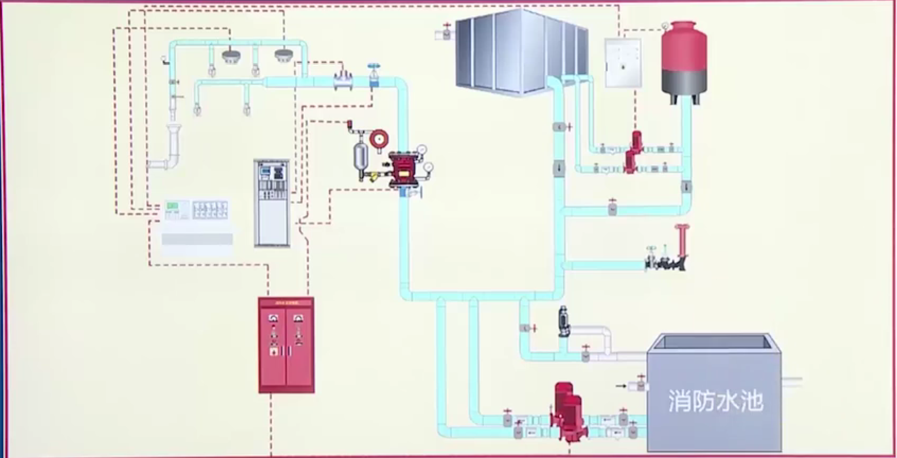
> 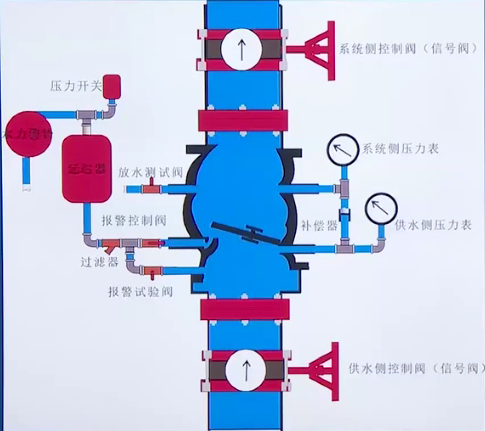
> 
> 干式系统
> 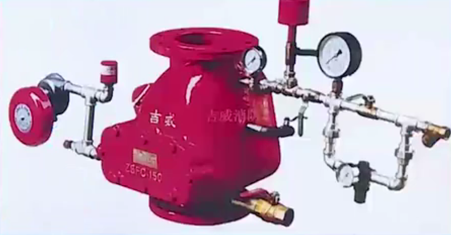
> 
> 雨淋系统：
> 
> 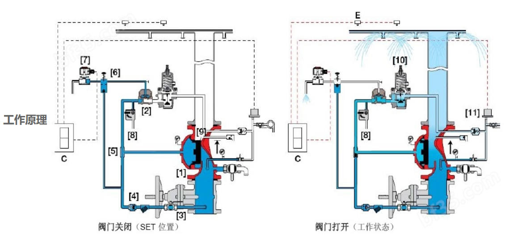
> 
> 预作用：


> 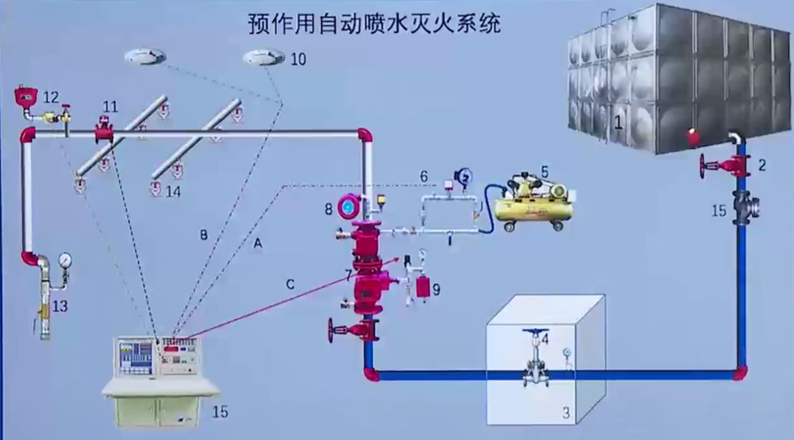


> 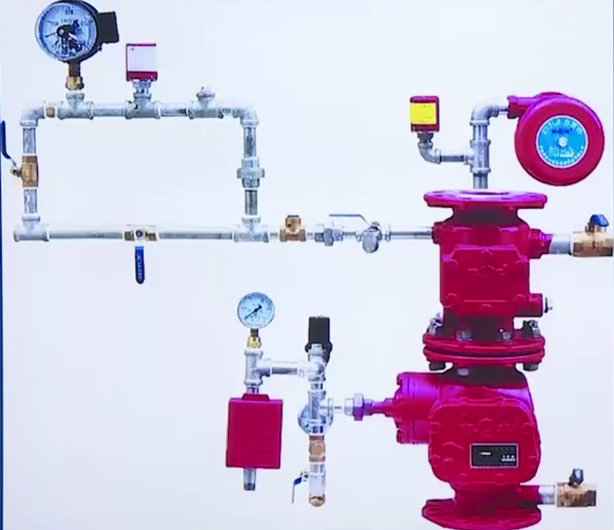


#### 知识点4：闭式自动喷水灭火系统有哪些类型
> 
> 1. 湿式自动喷水灭火系统
> 
>    湿式自动喷水灭火系统是在准工作状态时配水管道内充满用于启动系统的**有压水**的闭式系统，由闭式洒水喷头、水流指示器、**湿式报警阀组**以及管道和**供水设施**（<u>泵、稳压泵、高位水箱、水池</u>）等组成，管道内始终充满**有压水**。
> 
> 2. 干式自动喷水灭火系统
> 
>    干式自动喷水灭火系统是在准工作状态时配水管道内充满用于启动系统的**有压气体**的闭式系统。干式自动喷水灭火系统在准工作状态时配水管道内充满有压气体，使用场所**不受环境温度**的限制。干式自动喷水灭火系统与湿式自动喷水灭火系统的区别在于，干式自动喷水灭火系统采用**干式报警阀组**，并设置保持配水管道内气压的**充气设施**。
> 
>    干式自动喷水灭火系统适用于有**冰冻危险**或环境温度有可能**超过70℃**、使管道内的充水汽化升压的场所。干式自动喷水灭火系统的缺点是发生火灾时，配水管道必须经过排气充水过程，因此**延迟**了开始喷水的时间，对于火灾蔓延速度**较快**的场所，**不适合**采用此种系统。
> 
> 3. 预作用自动喷水灭火系统
> 
>    预作用自动喷水灭火系统是在**准工作**状态时配水管道内**不充水**，发生火灾时由火灾**自动报警系统**、充气管道上的**压力开关联锁控制预作用装置**和**消防水泵**，向配水管道供水的闲式系统。预作用自动喷水灭火系统由闭式酒水喷头、预作用装置、管道、充气设备和供水设施等组成。
> 
> 4. 防护冷却系统
> 
>    防护冷却系统由闭式洒水喷头、湿式报警阀组等组成，发生火灾时用于冷却防火卷帘、防火玻璃墙等防火分隔设施。
> 
> 5. 重复启闭预作用自动喷水系统
> 
>    重复启闭预作用自动喷水系统能在扑灭火灾后**自动关阀**、**复燃**时**再次开阀喷水**，与常规预作用系统不同，重复启闭预作用自动喷水系统采用的是既可输出**火警信号**又可在环境**恢复**常温时**输出灭火信号**的感温探测器。
> 
>    当其感应到环境温度超出预定值时，报警并**启动消防水泵**打开具有复位功能的雨淋报警阀，为配水管道**充水**，并在喷头动作后喷水灭火。喷水过程中，当现场温度恢复至常温时，探测器发出关停系统的信号，在按设定条件**延迟**喷水一段时间后，关闭兩淋**报警阀**停止喷水。若火灾复燃、温度再次升高时，系统则再次启动，直至彻底灭火。


#### 知识点5：湿式自动喷水灭火系统的工作原理及适用范围是什么
> 
> 1. 工作原理
> 
>    湿式自动喷水灭火系统在准工作状态时，管道内充满**有压力的水**。发生火灾时，火源周围环境温度上升，闭式洒水喷头受热后**开启喷水**，**水流指示器动作并反馈信号**至消防控制中心报警控制器，指示起火区域，湿式报警阀系统侧（沿供水方向，报警阀后为系统侧，下同）压力下降，造成湿式报警网水源侧（沿供水方向，报警阀前为水源侧，下同）压力大于系统侧压力，湿式报警阀**阀瓣开启**，**压力开关动作并输出**；
> 
>    **消防水泵启动**信号，完成系统的启动。系统启动后，由**消防水泵向开放的喷头供水**，开放的喷头将供水按不低于设计**规定的喷水强度**均匀喷酒，实施灭火。
> 
> 2. 适用范围
> 
>    湿式自动喷水灭火系统是应用**最为广泛**的自动喷水灭火系统，适合在温度**不低于4℃且不高于70℃**的环境中使用。如果在低于4℃的场所使用湿式自动喷水灭火系统，存在系统管道和组件充水**冰冻**的危险；如果在高于70℃的场所采用湿式自动喷水灭火系统，存在系统管道和组件内**气压升高**而**破坏管道**的危险。


#### 知识点6：干式自动喷水灭火系统的工作原理及适用范围是什么
>
>1. 工作原理
>
>   干式自动喷水灭火系统在准工作状态时，系统侧管道内充满**有压气体**（通常采用压缩空气），干式报警阀处于关闭状态发生火灾时，闭式酒水喷头**受热开启**，管道中的**有压气体**从喷头**喷出**，干式报警阀系统侧**压力下降**，造成水源侧压力大于系统侧压力，干式**报警阀自动打开**，压力水进入供水管道，
>
>   使剩余压缩空气从系统立管顶端或横干管最高处的**排气阀**或已打开的**喷头**处喷出，然后喷水灭火。消防水箱出**水管上的流量开关**、消防水泵出**水管上的压力开关或报警阀组的压力开关**动作并输出**消防水泵启动信号**，完成系统的启动。系统启动后，由消防水泵向开放的喷头供水，开放的喷头将供水按不低于设计规定的喷水强度均匀喷酒，实施灭火。
>
>   根据系统操作控制和维护管理的需要，湿式、干式自动喷水灭火系统电气控制柜应具备主/备泵切换功能。当主泵发生故障时，备用泵自动延时投入。水泵启动时间==不应大于2min==。
>   
>   干式系统有压充气管道的快速排气阀入口前应设==电磁阀==。
>
>
>2. 适用范围
>
>   干式自动喷水灭火系统适用于环境温度**低于4℃或高于70℃**的场所。干式自动喷水灭火系统虽然解决了湿式自动喷水灭火系统不适用于高温及低温环境场所的问题，但由于在准工作状态时配水管道内没有水，喷头动作、系统启动时必须经过一个管道排气充水的过程，因此会出现**滞后**喷水现象，**不适用于要求迅速控火灭火**的场所。


#### 知识点7：预作用自动喷水灭火系统的工作原理及适用范围是什么
> 
> 1. 工作原理
> 
>    预作用自动喷水灭火系统处于准工作状态时，系统侧管道内平时**无水**或充以**有压气体**。火灾时，由**火灾自动报警系统自动开启预作用报警阀**，配水管道开始**排气充水**，使系统在闭式洒水喷头动作前转换成**湿式**自动喷水灭火系统，并在闭式洒水喷头开启后**立即喷水**。
> 
> 2. 适用范围
> 
>    预作用自动喷水灭火系统可**消除**干式自动喷水灭火系统在喷头开放后**延迟**喷水的缺点，能在低温和高温环境中**替代干式**自动喷水灭火系统。系统处于准工作状态时，严禁**管道漏水及系统误喷的忌水场所**应采用预作用自动喷水灭火系统


#### 知识点8：开式自动喷水灭火系统有哪些类型
> 
> 1. 雨淋灭火系统
> 
>    雨淋灭火系统由**开式**酒水喷头、**雨淋报警网组**等组成。发生火灾时，其由火灾自动报警系统或**传动管**控制，自动开启雨淋报警阀组和启动消防水泵，是用于灭火的开式系统。雨淋灭火系统通常安装在火灾发生后**火势发展迅猛、蔓延迅速**的场所。
> 
> 2. 水幕系统
> 
>    水幕系统由**开式洒水喷头或水幕喷头**、**雨淋报警阀组或感温雨淋报警阀**等组成，是用于**防火分隔**或**防护冷却**的开式系统，包括防火分隔水幕和防护冷却水幕两种类型。防火分隔水幕由开式洒水喷头或水幕喷头、雨淋报警阀组或感温雨淋报警阀等组成，发生火灾时密集喷洒形成水墙或水帘；防护冷却水幕由水幕喷头、雨淋报警阀组或感温兩淋报警阀等组成，**发生火灾时用于冷却防火卷帘、防火玻璃墙**等防火分隔设施。


#### 知识点9：雨淋灭火系统的工作原理及设置范围是什么
> 
> 1. 工作原理
> 
>    系统处于准工作状态时，由<u>消防水箱或稳压泵、气压给水设备</u>等稳压设施维持**水源侧**管道内充水的压力。火灾时，由**火灾自动报警系统或传动管**自动控制开启雨林报警阀和供水泵，向消防系统管网供水，开式酒水喷头喷水。
> 
> 2. 设置范围
> 
>    雨淋灭火系统主要适用于需大面积喷水、快速扑灭火灾的特别危险场所。《建筑防火通用规范》（GB 55037-2022）中规定下列建筑或部位应设置兩淋灭火系统。
> 
>    1. 火柴厂的氯酸钾压碾车间。
>    2. 建筑面积大于100㎡且生产或使用硝化棉、喷漆棉、火胶棉、赛璐珞胶片、硝化纤维的场所。
>    3. 乒乓球厂的轧坯、切片、磨球、分球检验部位。
>    4. 建筑面积大于60㎡或储存量大于2t的硝化棉、喷漆棉、火胶棉、赛璐珞胶片、硝化纤维库房。
>    5. 日装瓶数量大于3000瓶的液化石油气储配站的灌瓶间、实瓶库。
>    6. 特等和甲等剧场的舞台葡萄架下部，座位数大于1500个的乙等剧场的舞台葡萄架下部，座位数大于2000个的会堂或礼堂的舞台葡萄架下部。
>    7. 建筑面积大于或等于400m²的演播室，建筑面积大于或等于500m²的电影摄影棚。


> 
#### 知识点10：自动喷水灭火系统洒水喷头的类型及适用范围是什么
> 
> ​	洒水喷头在热作用下，能在预定的温度范围内**自行启动**，或根据**火灾信号由控制设备启动**，并按设计的**酒水形状**和流量洒水。在自动喷水灭火系统中，洒水喷头直接作用在火焰上方，自动喷水灭火系统能不能灭火、能不能在规定时间内达到规定的喷水强度，与**洒水喷头有直接关系**。酒水喷头种类繁多，不同的自动喷水灭火系统应选择与其相适应的洒水喷头，否则很难达到自动喷水灭火系统的效果。
> 
> 1. 根据是否具有**热敏感**释放机构分类
> 
>    1. 闭式洒水喷头。闭式洒水喷头具有**热敏感**释放机构，火灾时受热能自动开启。**玻璃球洒水喷头和易熔元件洒水喷头**是典型的闭式洒水喷头。玻璃球洒水喷头通过玻璃球内充装的液体**受热膨胀使玻璃球爆破**而开启；易熔元件洒水喷头通过**易熔元件受热熔化**而开启。
> 
>       **响应时间指数**（response time index，RTI）是**闭式洒水喷头的热敏性能指标**。**RTI值越大，喷头反应越慢**；RTI值越小，喷头反应越灵敏。闭式洒水喷头可根据灵敏度分为快速响应洒水喷头、特殊响应洒水喷头和标准响应洒水喷头三种（见表6-2-1)。
> 
>       | 序号 |       类别       |         响应时间指数技术指标         |
>       | :--: | :--------------: | :----------------------------------: |
>       |  1   | 快速响应洒水喷头 |         RTI ≤ 50(m· s) ^0.5          |
>       |  2   | 特殊响应洒水喷头 | 50 (m · s) ^0.5<RTI ≤  80(m. s) ^0.5 |
>       |  3   | 标准响应洒水喷头 |  80 (m s)^0.5<RTI < 350(m· s) ^0.5   |
> 
>    2. 开式洒水喷头。开式洒水喷头**无热敏感**释放机构，喷嘴敞开，发生火灾时**通过控制设备启动**。开式洒水喷头适用于<u>雨淋灭火系统和水幕系统</u>等。
> 
> 2. 根据**安装位置**分类
> 
>    洒水喷头根据安装位置不同分为**边墙型、下垂型和直立型**三种。下垂型洒水喷头**水流向下**冲向溅水盘，适用于湿式自动喷水灭火系统**吊顶下**布置的洒水喷头。直立型洒水喷头直立安装，**水流向上**冲向溅水盘，当湿式自动喷水灭火系统设置在不做吊顶的场所，配水支管布置在**梁下**时，应采用直立型酒水喷头。干式自动喷水灭火系统、预作用自动喷水灭火系统管道内伺应状态时充有气体，为便于在灭火或维修后恢复准工作状态之前排尽管道中的积水，同时有利于在系统启动时排气，<u>干式自动喷水灭火系统和预作用自动喷水灭火系统</u>采用**直立型**洒水喷头。
> 
> 3. 根据**保护面积**分类
> 
>    洒水喷头根据保护面积不同分为标准覆盖面积洒水喷头、扩大覆盖面积酒水喷头两种。扩大覆盖面积酒水喷头包括<u>直立型、下垂型和边墙型</u>三种，具有比标淮覆盖面积洒水喷头更大的特定保护面积。
> 
> 4. 特殊类型酒水喷头
> 
>    特殊类型洒水喷头包括<u>干式洒水喷头、吊顶型酒水喷头、带涂层洒水喷头、带防水罩洒水喷头、自动启闭酒水喷头</u>等。


#### 知识点11：气体灭火系统的设置范围有哪些
> 
> 现行国家标准《建筑设计防火规范（2018年版）》（GB 50016-2014）中规定以下8种场所宜采用气体灭火系统。
> 
> 1. 国家、省级或入口超过100万的城市广播电视发射塔内的微波机房、分米波机房、米波机房、变配电室和不间断电源室。
> 2. 国际电信局、大区中心、省中心和1万路以上的地区中心内的长途程控交换机房、控制室和信令转接点室。
> 3. 两万线以上的市话汇接局和6万门以上的市话端局内的程控交换机房、控制室和信令转接点室。
> 4. 中央及省级公安、防灾和网局级及以上的电力等调度指挥中心内的通信机房和控制室。
> 5. A、B级电子信息系统机房内的主机房和基本工作间的已记录磁（纸）介质库。
> 6. 中央和省级广播电视中心内建筑面积不小于120m²的音像制品库房。
> 7. 国家、省级或藏书量超过100万册的图书馆内的特藏库；中央和省级档案馆内的珍藏库和非纸质档案库；大、中型博物馆内的珍品库房；一级纸绢质文物的陈列室。
> 8. 其他特殊重要设备室。


#### 知识点12：气体灭火系统适用于扑救哪些火灾
> 
> ​	气体灭火系统适用于扑救<u>**电气火灾**、固体表面火灾、液体火灾、灭火前能切断气源的气体火灾</u>。
> ​	气体灭火系统不适用于扑救下列火灾：<u>硝化纤维、硝酸钠等氧化剂或含氧化剂的化学制品火灾；钾、镁、钠、钛、锆、铀等活泼金属火灾；氢化钾、氢化钠等金属氢化物火实；过氧化氢、联胺等能自行分解的化学物质火灾；可燃固体物质的深位火灾；能发生自燃的物质火实，如白磷、某些金属有机化合物</u>等。


#### 知识点13：气体灭火系统如何分类
> 
> ​	气体灭水系统是以某些在常温、常压下呈现气态的物质作为灭火介质，通过这些气体在整个防护区内或保护对象周国的局部区域建立起**灭火浓度**实现灭火。根据其性能特点，主要用于保护某些特定场合，是建筑物内安装的灭火设施的一种重要形式。气体灭火系统的分类见表6-2-2。
> 
> <table>
>     <tr>
>     	<td style="text-align: center; background-color: #A1E8F2;" >序号</td>
>     	<td style="text-align: center; background-color: #A1E8F2;" >分类标准</td>
>     	<td style="text-align: center; background-color: #A1E8F2;"  colspan="2">分类结果</td>
>     </tr>
>     <tr>
>     	<td style="text-align: center;" >1</td>
>     	<td style="text-align: center;"  rowspan="2">应用方式</td>
>     	<td style="text-align: center;"  colspan="2">全淹没气体灭火系统</td>
>     </tr>
>     <tr>
>     	<td style="text-align: center;" >2</td>
>     	<td style="text-align: center;"  colspan="2">局部应用干粉灭火系统</td>
>     </tr>
>     <tr>
>     	<td style="text-align: center;" >3</td>
>     	<td style="text-align: center;"  rowspan="2">结构特点</td>
>     	<td style="text-align: center;"  colspan="2">组合分配气体灭火系统</td>
>     </tr>
>     <tr>
>     	<td style="text-align: center;" >4</td>
>     	<td style="text-align: center;"  colspan="2">单元独立气体灭火系统</td>
>     </tr>
>     <tr>
>     	<td style="text-align: center;" >5</td>
>     	<td style="text-align: center;"  rowspan="3">加压方式</td>
>     	<td style="text-align: center;"  colspan="2">自压式气体灭火系统</td>
>     </tr>
>     <tr>
>     	<td style="text-align: center;" >6</td>
>     	<td style="text-align: center;"  colspan="2">内储压式气体灭火系统</td>
>     </tr>
>     <tr>
>     	<td style="text-align: center;" >7</td>
>     	<td style="text-align: center;"  colspan="2">外储压式气体灭火系统</td>
>     </tr>
>     <tr>
>     	<td style="text-align: center;" >8</td>
>     	<td style="text-align: center;"  rowspan="9">充装灭火剂的种类</td>
>     	<td style="text-align: center;"  colspan="2">七氟丙烷灭火系统</td>
>     </tr>
>     <tr>
>     	<td style="text-align: center;" >9</td>
>     	<td style="text-align: center;"  colspan="2">三氟甲烷灭火系统</td>
>     </tr>
>     <tr>
>     	<td style="text-align: center;" >10</td>
>     	<td style="text-align: center;"  rowspan="4">惰性气体灭火系统</td>
>     	<td style="text-align: center;" >IG01灭火系统（氩气）</td>
>     </tr>
>     <tr>
>     	<td style="text-align: center;" >11</td>
>     	<td style="text-align: center;" >IG100灭火系统（氮气）</td>
>     </tr>
>     <tr>
>     	<td style="text-align: center;" >12</td>
>     	<td style="text-align: center;" >IG541灭火系统（氩气、氮气、二氧化碳）</td>
>     </tr>
>     <tr>
>     	<td style="text-align: center;" >13</td>
>     	<td style="text-align: center;" >IG55 灭火系统（氩气、氮气）</td>
>     </tr>
>     <tr>
>     	<td style="text-align: center;" >14</td>
>     	<td style="text-align: center;"  rowspan="2">二氧化碳灭火系统</td>
>     	<td style="text-align: center;" >高压二氧化碳灭火系统</td>
>     </tr>
>     <tr>
>     	<td style="text-align: center;" >15</td>
>     	<td style="text-align: center;" >低压二氧化碳灭火系统</td>
>     </tr>
>     <tr>
>     	<td style="text-align: center;" >16</td>
>     	<td style="text-align: center;"  colspan="2">热气溶胶灭火装置</td>
>     </tr>
>     <tr>
>     	<td style="text-align: center;" >17</td>
>     	<td style="text-align: center;"  rowspan="2">装配形式</td>
>     	<td style="text-align: center;"  colspan="2">管网灭火系统</td>
>     </tr>
>     <tr>
>     	<td style="text-align: center;" >18</td>
> 		<td style="text-align: center;"  colspan="2">预制灭火系统（柜式气体灭火装置）</td>
>     </tr>
> </table>


#### 知识点14：常见气体灭火系统的组成及工作原理是什么
> 
> 1. 高压二氧化碳灭火系统、内储压式七氟丙烷灭火系统与惰性气体灭火系统
> 
>    当防护区发生火灾，产生烟雾、高温和光辐射使烟感、温感、感光等**探测器探测到火灾信号**，探测器将**火灾信号转变为电信号**传送到火灾报警控制器，控制器自动发出声光警报并经逻辑判断后，启动联动装置，经过一段延时（或者不延时），发出系**统启动信号**，启动驱动气体瓶组上的容器阀**释放驱动气体**，打开通向发生火灾的防护区的选择阀。
> 
>    同时打开灭火剂瓶组的容器阀，各瓶组的灭火剂经连接管汇集到**集流管**，通过选择阀到达安装在防护区内的喷头进行喷放灭火，同时安装在管道上的信号**反馈装置动作**，将**信号传送到控制器**，由控制器启动防护区外用于显示灭火剂喷放状态的**火灾声光报警器**（带有声警报的气体释放灯）。
> 
>    另外，通过压力开关监测系统是否正常工作，若启动指令发出，而压力开关的**信号末反馈**，则说明系统存在**故障**，值班人员应在听到事故报警后尽快到储瓶间，手动开启储存容器上的容器阀，人工启动灭火。
> 
> 2. 外储压式七氟丙烷灭火系统
> 
>    控制器发出系统启动信号，启动驱动气体瓶组上的容器网释放驱动气体，打开通向发生火灾的防护区的选择阀，同时打开加压单元气体瓶组的容器阀，加压气体经减压进入灭火剂瓶组，加压后的灭火剂经连接管汇集到集流管，通过选择阀到达安装在防护区内的喷头进行喷放灭火。


#### 知识点15：泡沫灭火系统如何分类
> 
> ​	泡沫灭火系统是通过机械作用将<u>泡沫灭火剂、水与空气</u>按一定比例充分混合并产生泡沫实施灭火的系统。该系统主要通过**隔氧窒息作用、辐射热阻隔作用和吸热冷却作用实现灭火**，具有<u>安全可靠、经济实用、灭火效率高、无毒性</u>的特点。从20世纪初开始应用至今，日前已在<u>石油化工企业、油库、地下工程、汽车库、各类仓库、煤矿、大型飞机库、船舶</u>等场所得到广泛应用，是扑灭<u>**甲、乙、丙类液体火灾**和某些固体火灾</u>的一种主要灭火设施。泡沫灭火系统的分类见表6-2-3。
> 
> <table>
>     <tr>
>     	<td style="text-align: center; background-color: #A1E8F2;">序号</td>
> 		<td style="text-align: center; background-color: #A1E8F2;">分类标准</td>
> 		<td style="text-align: center; background-color: #A1E8F2;">分类结果</td>
> 		<td style="text-align: center; background-color: #A1E8F2;">含义及特点</td>
>     </tr>
>     <tr>
>     	<td style="text-align: center;">1</td>
> 		<td style="text-align: center;" rowspan="3">系统结构</td>
> 		<td style="text-align: center;">固定式</td>
> 		<td>由固定的泡沫消防水泵、泡沫比例混合器、泡沫产（发）生装置和管道等组成的灭火系统。固定式泡沫灭火系统适用于独立的甲、乙、丙类液体储罐区和机动消防设施不足的企业附属甲、乙、丙类液体储罐区。多数设计为手动控制系统，也有的靠火灾报警及联动控制系统自动启动消防泵及相关阀门，向储罐区排放泡沫实施灭火</td>
>     </tr>
>     <tr>
>     	<td style="text-align: center;">2</td>
> 		<td style="text-align: center;">半固定式</td>
> 		<td>由<u><b>固定的泡沫产生器与部分连接管道</b>，泡沫消防车或机动消防泵与泡沫比例混合器，用水带</u>连接组成的灭火系统。半固定式泡沫灭火系统适用于机动消防设施较强的企业附属甲、乙、丙类液体储罐区</td>
>     </tr>
>     <tr>
>     	<td style="text-align: center;">3</td>
> 		<td style="text-align: center;">移动式</td>
> 		<td>由消防车、机动消防泵或有压水源，泡沫比例混合器，泡沫枪、泡沫炮或移动式泡沫产生器，用水带等连接组成的灭火系统</td>
>     </tr>
>     <tr>
>     	<td style="text-align: center;">4</td>
> 		<td style="text-align: center;" rowspan="3">发泡倍数</td>
> 		<td style="text-align: center;">低倍数泡沫灭火系统</td>
> 		<td>低倍数泡沫灭火系统是指发泡倍数<b>小于20</b>的泡沫灭火系统。该系统是甲、乙、丙类液体储罐及石油化工装置区等场所的首选灭火系统</td>
>     </tr>
>     <tr>
>     	<td style="text-align: center;">5</td>
> 		<td style="text-align: center;">中倍数泡沫灭火系统</td>
> 		<td>中倍数泡沫灭火系统是指发泡倍数为<b>20～200</b>的泡沫灭火系统。中倍数泡沫灭火系统在实际工程中应用较少，且多用作辅助灭火设施</td>
>     </tr>
>     <tr>
>     	<td style="text-align: center;">6</td>
> 		<td style="text-align: center;">高倍数泡沫灭火系统</td>
> 		<td>高倍数泡沫灭火系统是指发泡倍数为<b>201～1000</b>的泡沫灭火系统。高倍数泡沫灭火系统发泡量大，虽稳定性差，但易于输送至较高较远位置</td>
>     </tr>
>     <tr>
>     	<td style="text-align: center;">7</td>
> 		<td style="text-align: center;" rowspan="5">系统形式（中高倍数）</td>
> 		<td style="text-align: center;">全淹没系统</td>
> 		<td>由固定式泡沫产生器直接或通过导泡筒将泡沫喷放到封闭或被围挡的防护区内，并在规定的时间内达到一定泡沫淹没深度的灭火系统</td>
>     </tr>
>     <tr>
>     	<td style="text-align: center;">8</td>
> 		<td style="text-align: center;">局部应用系统</td>
> 		<td>由固定式泡沫产生器直接或通过导泡筒将泡沫喷放到火灾部位的灭火系统</td>
>     </tr>
>     <tr>
>     	<td style="text-align: center;">9</td>
> 		<td style="text-align: center;">移动系统（中高倍数）</td>
> 		<td>移动式泡沫灭火系统是指车载式或便携式系统。移动式高倍数灭火系统可作为固定系统的辅助设施，也可作为独立系统用于某些场所。移动式泡沫灭火系统可用于发生火灾的部位难以确定或人员难以接近的场所，发生火灾时需要排烟、降温或排除有害气体的封闭空间。移动式中倍数泡沫灭火系统还可用于面积不大于100m²的可燃液体流淌火灾场所</td>
>     </tr>
>     <tr>
>     	<td style="text-align: center;">10</td>
> 		<td style="text-align: center;">泡沫 - 水喷淋系统</td>
> 		<td>由喷头、报警阀组、水流报警装置（水流指示器或压力开关）等组件，以及管道、泡沫液与水供给设放、施组成，并能在发生火灾时按预定时间与供给强度向防护区依次喷洒泡沫与水的自动灭火系统。泡沫－水喷淋系统可分为泡沫-水雨淋、闭式泡沫-水喷淋等</td>
>     </tr>
>     <tr>
>     	<td style="text-align: center;">11</td>
> 		<td style="text-align: center;">泡沫喷雾系统</td>
> 		<td>采用离心雾化型水雾喷头，在发生火灾时按预定时间与供给强度向被保护设备或防火区喷洒泡沫。泡沫喷雾系统综合了水雾灭火和泡沫灭火的特点，借助水雾和泡沫的冷却、窒息、乳化、隔离等作用，可实现迅速灭火。泡沫喷雾系统可用于保护独立变电站的油浸电力变压器、面积不大于200m²的非水溶性液体室内场所</td>
>     </tr>
>     <tr>
>     	<td style="text-align: center;">12</td>
> 		<td style="text-align: center;" rowspan="2">喷射方式</td>
> 		<td style="text-align: center;">液上喷射系统</td>	
> 		<td>泡沫从液面上喷人被保护储罐内的灭火系统。与液下喷射灭火系统相比，该系统具有泡沫不易受油污染，可以使用廉价的普通蛋白泡沫等优点</td>
>     </tr>
>     <tr>
>     	<td style="text-align: center;">13</td>
> 		<td style="text-align: center;">液下喷射系统</td>
> 		<td>泡沫从液面下喷人被保护储罐内的灭火系统。泡沫在注入液体燃烧层下部之后，上升至液体表面并扩散开，形成一个泡沫层。液下喷射系统用的泡沫液必须是氟蛋白泡沫灭火液或是水成膜泡沫液。该系统通常有固定式和半固定式两种应用形式</td>
>     </tr>
> </table>


> 
#### 知识点16：泡沫灭火系统的设置范围是什么
> 
> ​	固定式泡沫灭火系统适用于单罐容量大于1000m³的甲、乙、丙类液体固定顶罐；移动式泡沫灭火系统适用于罐壁高度小于7m或容量不大于200m³的甲、乙、丙类液体储罐；其他甲、乙、丙类液体宜采用半固定式泡沫灭火系统。在石油库中，地上固定项储罐、内浮顶储罐和地上卧式储罐应设低倍数泡沫灭火系统或中倍数泡沫灭火系统；外浮顶储罐、储存甲B、乙和丙A类油品的覆土立式油罐，应设低倍数泡沫灭火系统。
> 
> ​	容量大于500m³的水溶性液体地上立式储罐和容量大于1000m³的其他甲B、乙、丙A类易燃、可燃液体地上立式储罐，应采用固定式泡沫灭火系统；容量小于或等于500m³的水溶性液体地上立式储罐和容量小于或等于1000m³的其他易燃、可燃液体地上立式储罐，可采用半固定式泡沫灭火系统；地上卧式储罐、覆土立式油罐、丙B类液体立式储罐和容量不大于200m³的地上储罐，可采用移动式泡沫灭火系统。


#### 知识点17：干粉灭火系统的适用范围是什么
> 
> ​	干粉灭火系统是依靠驱动气体（惰性气体）驱动干粉的，干粉固体所占体积与驱动气体相比小得多，宏观上类似于气体灭火系统。干粉灭火剂的主要灭火机理是阻断燃烧链式反应，实现化学抑制作用。同时，干粉灭火剂的基料在火焰的高温作用下将会发生一系列的分解反应，这些反应都是吸热反应，可吸收火焰的部分热量。而这些分解反应产生的一些非活性气体如二氧化碳、水蒸气等，对燃烧的氧液度也具有稀释作用。
> 
> ​	干粉灭火系统应用广泛，迅速可靠，适用于火焰蔓延迅速的易燃液体；它造价低，占地小，不冻结，对于无水及寒冷的地区尤为适宜；适用于灭火前可切断气源的气体火灾，易燃、可燃液体和可熔化固体火灾，可燃固体表面火灾和带电设备火灾等。干粉灭火系统不得用于扑救硝化纤维、炸药等无空气仍能迅速氧化的化学物质与强氧化剂物质火灾，也不适用于钾、钠、镁、钛、锆等活泼金属及其氢化物火灾。


#### 知识点18：干粉灭火系统如何分类
> 
> ​	干粉灭火系统是指由干粉供应源通过输送管道连接到固定的喷嘴上，通过喷嘴喷放干粉的自动灭火系统。
> 
> 干粉灭火系统的分类见表6-2-4。
> 
> 
> <table>
>     <tr>
>     	<td style="text-align: center; background-color: #A1E8F2;">序号</td>
> 		<td style="text-align: center; background-color: #A1E8F2;">分类标准</td>
> 		<td style="text-align: center; background-color: #A1E8F2;">分类结果</td>
>     </tr>
>     <tr>
> 		<td style="text-align: center;">1</td>
> 		<td style="text-align: center;" rowspan="2">应用方式</td>
> 		<td style="text-align: center;">全淹没干粉灭火系统</td>
>     </tr>
>     <tr>
>     	<td style="text-align: center;">2</td>
> 		<td style="text-align: center;">局部应用干粉灭火系统</td>
>     </tr>
>     <tr>
>     	<td style="text-align: center;">3</td>
> 		<td style="text-align: center;" rowspan="2">结构特点</td>
> 		<td style="text-align: center;">组合分配干粉灭火系统</td>
>     </tr>
>     <tr>
>     	<td style="text-align: center;">4</td>
> 		<td style="text-align: center;">单元独立干粉灭火系统</td>
>     </tr>
>     <tr>
>     	<td style="text-align: center;">5</td>
> 		<td style="text-align: center;" rowspan="3">干粉的驱动方式</td>
> 		<td style="text-align: center;">储气瓶型干粉灭火系统</td>
>     </tr>
>     <tr>
>     	<td style="text-align: center;">6</td>
> 		<td style="text-align: center;">储压型干粉灭火系统</td>
>     </tr>
>     <tr>
>     	<td style="text-align: center;">7</td>
> 		<td style="text-align: center;">燃气驱动型干粉灭火系统</td>
>     </tr>
>     <tr>
>     	<td style="text-align: center;">8</td>
> 		<td style="text-align: center;" rowspan="2">充装灭火剂的种类</td>
> 		<td style="text-align: center;">BC 干粉灭火系统</td>
>     </tr>
>     <tr>
>     	<td style="text-align: center;">9</td>
> 		<td style="text-align: center;">ABC 干粉灭火系统</td>
>     </tr>
>     <tr>
>     	<td style="text-align: center;">10</td>
> 		<td style="text-align: center;" rowspan="2">充装灭火剂的粒径</td>
> 		<td style="text-align: center;">普通干粉灭火系统</td>
>     </tr>
>     <tr>
>     	<td style="text-align: center;">11</td>
> 		<td style="text-align: center;">超细干粉灭火系统</td>
>     </tr>
>     <tr>
>     	<td style="text-align: center;">12</td>
> 		<td style="text-align: center;" rowspan="2">安装方式</td>
> 		<td style="text-align: center;">半固定式干粉灭火系统</td>
>     </tr>
>     <tr>
>     	<td style="text-align: center;">13</td>
> 		<td style="text-align: center;">固定式干粉灭火系统</td>
>     </tr>
> </table>
> 1. 按应用方式分类
> 
>    干粉灭火系统按应用方式不同可分为全淹没干粉灭火系统和局部应用干粉灭火系统。全淹没干粉灭火系统在规定时间内，向防护区喷射一定浓度的干粉，并使其均匀地充满整个防护区；局部应用干粉灭火系统主要由一个适当的灭火剂供应源组成，它能将灭火剂直接喷放到着火物上或认为危险的区域。扑救封闭空间内的火灾应采用全淹没干粉灭火系统；扑救火灾中的具体保护对象应采用局部应用干粉灭火系统。
> 
> 2. 按结构特点分类
> 
>    组合分配干粉灭火系统用一套灭火剂储存装置，保护两个及以上防护区或保护对象。在组合分配干粉灭火系统中，各防护区或保护对象同时着火的概率很小，无须考虑同时向各个防护区或保护对象释放干粉灭火剂。对两个或两个以上的防护区，可采用组合分配干粉灭火系统。对于特别重要的场所，在经济条件允许的情况下，可考虑采用单元独立干粉灭火系统，单元独立干粉灭火系统用一套干粉储存装置保护一个防护区或保护对象。
> 
> 3. 其他分类标准
> 
>    1. 按干粉的驱动方式不同分为储气瓶型、储压型、燃气驱动型三种干粉灭火系统。
>    2. 按充装灭火剂的种类不同分为BC干粉灭火系统和ABC干粉灭火系统。
>    3. 按充装灭火剂的粒径不同分为普通干粉灭火系统和超细干粉灭火系统两种。
>    4. 按安装方式分为固定式干粉灭火系统和半固定式干粉灭火系统。
> 
> ​	干粉灭火装置以悬挂、壁挂和其他方式固定安装在保护区域，能通过自动探测启动或控制装置手动启动，由驱动介质（气体或者燃气）或机械能驱动干粉灭火剂实施灭火。干粉灭火装置按干粉灭火剂储存的形式分为储压式和非储压式两种；按灭火装置的安装方式分为悬挂式、壁挂式和其他安装方式三种；按干粉灭火剂的种类分为BC干粉灭火装置、ABC干粉灭火装置和其他类干粉灭火装置；
> 
> ​	按干粉灭火剂粒径分为超细干粉灭火装置和普通干粉灭火装置两种；按灭火装置使用场所分为普通场所干粉灭火装置和专用场所干粉灭火装置，专用场所干粉灭火装置包括发动机舱专用干粉灭火装置、风电机舱专用干粉灭火装置等；按干粉灭火剂的驱动方式分为惰性气体驱动型、燃气驱动型、机械储能驱动型和其他方式驱动型干粉灭火装置。


#### 知识点19：干粉灭火系统的工作原理是什么
> 
> ​	干粉灭火系统的启动方式可分为自动控制和手动控制，工作原理如下。
> 
> 1. 自动控制方式
> 
>    保护对象着火后，温度上升达到规定值，探测器发出火灾信号到控制器，然后由控制器打开相应报警设备（如声光及警铃）。
> 
>    当启动机构接收到控制器的启动信号后将启动瓶打开，启动瓶内的氮气通过管道将高压驱动气体瓶组的瓶头阀打开，瓶中的高压驱动气体进入集气管，经过高压阀进入减压阀，减压至规定压力后，通过进气阀进入干粉储罐内，搅动罐中干粉灭剂，使罐中干粉灭火剂疏松形成便于流动的气粉混合物，当干粉罐内的压力升到规定压力数值时，定压动作机构开始动作，打开干粉罐出口球阀，干粉灭火剂则经过总阀门、选择阀、输粉管和喷嘴喷向着火对象，或者经喷枪射到着火对象的表面进行灭火。
> 
> 2. 手动控制方式
> 
>    手动启动装置是防护区内或保护对象附近的人员在发现火险时启动灭火系统的装置，应安装在既靠近防护区或保护对象叉能够确保操作人员安全的位置。为了避免操作人员在紧急情况下错按其他按钮，要求所有手动启动装置都应明显标示出其对应的防护区或保护对象的名称。


#### 知识点20：水喷雾灭火系统的适用范围是什么
> 
> ​	水喷雾灭火系统由水源、供水设备、管道、雨淋报警阀（或电动控制阀、气动控制阀）、过滤器和水雾喷头等组成，喷出的水滴粒径一般在1mm以下，喷出的水雾能吸收大量的热量，具有良好的降温作用，同时水在热作用下会迅速变成水蒸气，并包裹保护对象，起到部分室息灭火的作用。
> 
> ​	水喷雾灭火系统可用于扑救固体物质火灾、丙类液体火灾饮料酒火灾和电气火灾，并可用于可燃气体和甲、乙、丙类液体的生产、储存装置或装卸设施的防护冷却。水喷雾灭火系统不得用于扑救遇水能发生化学反应造成燃烧、爆炸的火灾，以及水雾会对保护对象造成明显损害的火灾。
> 
> ​	水喷雾灭火系统对于重质油品具有良好的灭火效果，适用于单台容量在40mW及以上的厂矿企业油浸变压器，单台容量在90mW及以上的电厂油浸变压器，单台容量在125mW及以上的独立变电站油浸变压器以及飞机发动机试验台的试车部位，也适用于充可燃油并设置在高层民用建筑内的高压电容器和多油开关室。
> 
> ​	水喷雾灭火系统通过表面冷却、室息、稀释、冲击乳化和覆盖等作用实现灭火。与自动喷水灭火系统相比，其用水量为后者的70%-90%，具有较好的节水性。


#### 知识点21：水喷雾灭火系统如何分类
> 
> ​	水喷雾灭火系统可根据应用方式、启动方式不同进行分类。水喷雾灭火系统的分类见表6-2-5
> 
> 
> <table>
>     <tr>
>     	<td style="text-align: center; background-color: #A1E8F2;">序号</td>
> 		<td style="text-align: center; background-color: #A1E8F2;">分类标准</td>
> 		<td style="text-align: center; background-color: #A1E8F2;">分类结果</td>
>     </tr>
>     <tr>
>     	<td style="text-align: center;">1</td>
> 		<td style="text-align: center;" rowspan="3">应用方式</td>
> 		<td style="text-align: center;">固定式水喷雾灭火系统</td>
>     </tr>
>     <tr>
>     	<td style="text-align: center;">2</td>
> 		<td style="text-align: center;">自动喷水-水喷雾混合配置系统</td>
>     </tr>
>     <tr>
>     	<td style="text-align: center;">3</td>
> 		<td style="text-align: center;">泡沫-水喷雾联用系统</td>
>     </tr>
>     <tr>
>     	<td style="text-align: center;">4</td>
> 		<td style="text-align: center;" rowspan="2">启动方式</td>
> 		<td style="text-align: center;">电动启动水喷雾灭火系统</td>
>     </tr>
>     <tr>
>     	<td style="text-align: center;">5</td>
> 		<td style="text-align: center;">传动管启动水喷雾灭火系统</td>
>     </tr>
> </table>
> 
> 
#### 知识点22：水喷雾灭火系统的工作原理是什么
> 
> ​	当系统的火灾探测器发现火灾后，自动或由手动打开丽淋报警阀组，同时发出火灾报警信号给报警控制器，并启动消防水泵，通过供水管网到达水雾喷头，水雾喷头喷水灭火。


#### 知识点23：细水雾灭火系统的适用范围是什么
> 
> ​	细水雾灭火系统由供水装置、过滤装置、控制阀、细水雾喷头等组件和供水管道组成，能自动和人工启动并喷放细水雾进行灭火或控火。细水雾灭火系统适用于扑救相对封闭空间内的==可燃固体表面火灾、可燃液体火灾及带电设备火灾==，不适用于==可燃固体深位火灾、能与水发生剧烈反应或产生大量有害物质的活泼金属及其化合物火灾以及可燃气体火灾==。


#### 知识点24：细水雾灭火系统如何分类
> 
> ​	细水雾灭火系统的分类见表6-2-6。
> 
> <table>
>     <tr>
>     	<td style="text-align: center; background-color: #A1E8F2;">序号</td>
> 		<td style="text-align: center; background-color: #A1E8F2;">分类标准</td>
> 		<td style="text-align: center; background-color: #A1E8F2;">分类结果</td>
>     </tr>
>     <tr>
>     	<td style="text-align: center;">1</td>
> 		<td style="text-align: center;" rowspan="3">供水方式</td>
> 		<td style="text-align: center;">瓶组式细水雾灭火系统</td>
>     </tr>
>     <tr>
>     	<td style="text-align: center;">2</td>
> 		<td style="text-align: center;">泵组式细水雾灭火系统</td>
>     </tr>
>     <tr>
>     	<td style="text-align: center;">3</td>
> 		<td style="text-align: center;">其他供水方式细水雾灭火系统</td>
>     </tr>
>     <tr>
>     	<td style="text-align: center;">4</td>
> 		<td style="text-align: center;" rowspan="2">喷头样式</td>
> 		<td style="text-align: center;">闭式细水雾灭火系统</td>
>     </tr>
>     <tr>
>     	<td style="text-align: center;">5</td>
> 		<td style="text-align: center;">开式细水雾灭火系统</td>
>     </tr>
>     <tr>
>     	<td style="text-align: center;">6</td>
> 		<td style="text-align: center;" rowspan="2">应用方式</td>
> 		<td style="text-align: center;">全淹没细水雾灭火系统</td>
>     </tr>
>     <tr>
>     	<td style="text-align: center;">7</td>
> 		<td style="text-align: center;">局部应用细水雾灭火系统</td>
>     </tr>
>     <tr>
>     	<td style="text-align: center;">8</td>
> 		<td style="text-align: center;" rowspan="2">流动介质类型</td>
> 		<td style="text-align: center;">单流体细水雾灭火系统</td>
>     </tr>
>     <tr>
>     	<td style="text-align: center;">9</td>
> 		<td style="text-align: center;">双流体细水雾灭火系统</td>
>     </tr>
>     <tr>
>     	<td style="text-align: center;">10</td>
> 		<td style="text-align: center;" rowspan="3">系统工作压力</td>
> 		<td style="text-align: center;">高压细水雾灭火系统（≥3.5 MPa）</td>
>     </tr>
>     <tr>
>     	<td style="text-align: center;">11</td>
>         <td style="text-align: center;">中压细水雾灭火系统（≥1.2 MPa且＜3.50 MPa）</td>
>     </tr>
>     <tr>
>     	<td style="text-align: center;">12</td>
> 		<td style="text-align: center;">低压细水雾灭火系统（＜1.2 MPa）</td>
>     </tr>
> </table>
> 
> 1. 按供水方式分类
> 
>    细水雾灭火系统按供水方式不同分为瓶组式细水雾灭火系统、泵组式细水雾灭火系统和其他供水方式细水雾灭火系统三种。
> 
> 2. 按喷头样式分类
> 
>    细水雾灭火系统按所使用的细水雾喷头样式不同分为开式细水雾灭火系统和闭式细水雾灭火系统两种。开式细水雾灭火系统采用开式细水雾喷头，有全淹没和局部应用两种应用方式。开式细水雾灭火系统既可用于抑制火灾，也可用于扑灭火灾，适用于多种火灾类型。闭式细水雾灭火系统采用闭式细水雾喷头，适用于扑救可燃固体表面火灾。
> 
> 3. 按应用方式分类
> 
>    细水雾灭火系统按应用方式不同分为全淹没细水雾灭火系统和局部应用细水雾灭火系统两种。全淹没细水雾灭火系统向整个防护区内喷放细水雾，保护其内部所有保护对象；局部应用细水雾灭火系统向保护对象直接喷放细水雾，保护空间内某具体的保护对象。
> 
> 4. 按流动介质类型分类
> 
>    细水雾灭火系统按流动介质类型不同分为单流体细水雾灭火系统和双流体细水雾灭火系统。单流体细水妥灭火系统只向细水雾喷头供给水；双流体细水雾灭火系统向细水雾喷头分别供给水和雾化介质。
> 
> 5. 按系统工作压力分类
> 
>    细水雾灭火系统按系统工作压力不同分为高压细水雾灭火系统、中压细水雾灭火系统和低压细水雾灭火系统三种。高压细水雾灭火系统分配管网中流动介质压力≥3.5MPa；中压细水雾灭火系统分配管网中流动介质压力≥1.2MPA且<3.50MPa;低压细水雾灭火系统分配管网中流动介质压力<1.2MPa。


#### 知识点25：细水雾灭火系统的操作和控制方式有哪些
> 
> ​	泵组式细水雾灭火系统应具有自动、手动控制方式。瓶组式细水雾灭火系统应具有自动、手动和机械应急操作控制方式，机械应急操作应能在瓶组间直接手动启动细水雾灭火系统。开式细水雾灭火系统的自动控制应能在接收到两个独立的火灾报簪信号后自动启动。闭式细水雾灭火系统的自动控制应能在喷头动作后，由动作信号反馈装置直接联锁自动启动。开式细水雾灭火系统分区控制网的自动操作方式可采用电动、液动或气动方式。


#### 知识点26：固定消防炮灭火系统的作用是什么
> 
> ​	固定消防炮灭火系统是指由固定消防炮和相应配置的系统组件组成的固定灭火系统。该系统可以远程控制并自动搜集火源、对准着火点、自动喷洒水或其他灭火剂进行灭火，可与火灾自动报警系统联动，既可手动控制，也可实现自动操作。


#### 知识点27：固定消防炮灭火系统的适用范围是什么
> 
> ​	固定消防炮灭火系统适用于扑救大空间内的早期火灾。对于设置自动喷水灭火系统不能有效发挥早期响应和灭火作用的场所，采用与火灾探测器联动的固定消防炮或自动跟踪定位射流灭火系统比快速响应喷头更能及时扑救早期火灾。


#### 知识点28：固定消防炮灭火系统如何分类
> 
> ​	固定消防炮灭火系统可按喷射介质、安装形式及控制方式进行分类。固定消防炮灭火系统的分类见表6-2-7。
> 
> <table>
>     <tr>
>     	<td style="text-align: center; background-color: #A1E8F2;">序号</td>
> 		<td style="text-align: center; background-color: #A1E8F2;">分类标准</td>
> 		<td style="text-align: center; background-color: #A1E8F2;">分类结果</td>
>     </tr>
>     <tr>
>     	<td style="text-align: center;">1</td>
> 		<td style="text-align: center;" rowspan="3">喷射介质</td>
> 		<td style="text-align: center;">水炮系统</td>
>     </tr>
>     <tr>
>     	<td style="text-align: center;">2</td>
> 		<td style="text-align: center;">泡沫炮系统</td>
>     </tr>
>     <tr>
>     	<td style="text-align: center;">3</td>
> 		<td style="text-align: center;">干粉炮系统</td>
>     </tr>
>     <tr>
>     	<td style="text-align: center;">4</td>
>         <td style="text-align: center;"  rowspan="2">安装形式</td>
>         <td style="text-align: center;">固定式消防炮系统</td>
>     </tr>
>     <tr>
>     	<td style="text-align: center;">5</td>
> 		<td style="text-align: center;">移动式消防炮系统</td>
>     </tr>
>     <tr>
>     	<td style="text-align: center;">6</td>
> 		<td style="text-align: center;" rowspan="2">控制方式</td>
> 		<td style="text-align: center;">远控消防炮系统</td>
>     </tr>
>     <tr>
>     	<td style="text-align: center;">7</td>
>         <td style="text-align: center;">非远控消防炮系统</td>
>     </tr>
> </table>
> 
> 1. 按喷射介质分类
> 
>    消防炮按喷射介质不同分为消防水炮、消防泡沫炮和消防干粉炮三种。脉冲消防水炮利用压缩空气的急速膨胀与水撞击混合后，以脉冲方式喷射高速水雾，是一种特殊的消防水炮。消防泡沫炮按泡沫液吸入方式分为自吸式消防泡沫炮和非自吸式消防泡沫炮两种。
> 
> 2. 按安装形式分类
> 
>    消防炮按安装形式不同分为固定式消防炮、移动式消防炮两种。固定式消防炮安装在固定支座上，包括固定安装在消防车、船上的消防炮；移动式消防炮安装在可移动支架上，包括固定安装在拖车上的消防炮。
> 
>    移动式消防炮按移动方式可分为便携移动式消防炮、手拾移动式消防炮和拖车移动式消防炮。移动式消防炮在整个水平回转角范围内以最小仰角喷射时应稳定可靠，不应有滑移或倾翻现象。自摆消防炮具有水平自动摆动功能，是一种特殊的移动式消防炮，在工作时自摆机构不应出现卡死现象。
> 
> 3. 按控制方式分类
> 
>    消防炮按控制方式不同分为远控消防炮和非远控消防炮。远控消防炮具有远距离控制操作功能，配置有遥控器。从无线遥控器或控制器启动至消防炮动作的响应时间小于5s，无线遥控距离不小于150m。远控消防炮同时设置手动操作机构。
> 
> 4. 其他分类方式
> 
>    1. 消防炮按驱动方式不同分为手动消防炮、电动消防炮、液动消防炮、气动消防炮四种。电动消防炮以电驱动为主；液动消防炮以液压驱动为主；气动消防炮以气压驱动为主。
>    2. 消防炮按使用功能不同分为单用消防炮、两用消防炮、组合消防炮3种。两用消防炮利用同一流道在不同时刻喷射两种介质；组合消防炮利用不同流道喷射两种或两种以上介质。


### 第三节 其他消防设施基本知识
> 
> 【知识要点】
> 
> 1. 消防给水系统、防烟排烟系统、应急照明和疏散指示系统的作用、组成及工作原理。
> 2. 灭火器、建筑火灾逃生避难器材的类型及使用方法。
> 3. 防火分隔设施的类型和作用。
> 4. 消火栓系统、防烟排烟系统、应急照明和疏散指示系统、灭火器、建筑火灾逃生避难器材等设施的设置要求。
> 5. 消防电梯的组成及工作原理。


#### 知识点1：常见的消防水源有哪些
> 
> ​	消防水源是向水灭火设施、车载或手抬等移动消防水泵、固定消防水泵等提供消防用水的水源，包括市政给水、消防水池、高位消防水池和天然水源等，市政给水较安全可靠应优先采用。


#### 知识点2：消防水池的有效容积有哪些要求
> 
> ​	当市政给水管网能保证室外消防给水设计流量时，消防水池的有效容积应满足在火灾延续时间内室内消防用水量的要求；当市政给水管网不能保证室外消防给水设计流量时，消防水池的有效容积应满足火灾延续时间内室内消防用水量和室外消防用水量不足部分之和的要求。当消防水池采用两路消防供水且在火灾情况下的连续补水能满足消防要求时，消防水池的有效容积应根据计算确定，但不应小于100m²，如果仅设有消火栓系统时不应小于50m²。
> 
> ​	==消防水池容积过大也会影响供水的可靠性==，所以消防水池的总蓄水有效容积大于500m³时，宜设两格能独立使用的消防水池；当大于1000m³时，应设置两座能独立使用的消防水池。每格（或座）消防水池应设置独立的出水管，并应设置满足最低有效水位的连通管，且其管径应能满足消防给水设计流量的要求。


#### 知识点3：消防水池的设置有哪些要求
> ​	为了能直观了解消防水池的水量情况，消防水池应设置就地水位显示装置，一般采用可直观观察的玻璃板液位计、磁耦合液位计、浮标液位计等。同时，还应在消防控制室或值班室等地点设置显示消防水池水位的装置，能随时接收到消防水池的最高和最低水位报警；消防水池应设置溢流水管和排水设施，为了防止污水倒灌污染消防水池内的水，消防水池应采用间接排水。消防水池设置的通气管、呼吸管和溢流水管等应采取防止虫鼠等进入消防水池的技术措施，确保消防水池内的水不受污染、不堵塞消防给水管道。
>
> ​	消防水池（水箱）应设置于==便于维护、通风良好、不结冰、不受污染的场所==。


#### 知识点4：消防供水设施有哪些
>
>​	消防供水设施是建筑消防给水系统的重要组成部分，其主要任务是为建筑消防给水系统储存并提供足够的水量和水压，确保建筑消防给水系统的供水安全。消防供水设施通常包括：消防水泵、高位消防水箱、稳压泵、消防水泵接合器等。
>
>1. 消防水泵
>
>   消防水泵是通过叶轮的旋转将能量传递给水，从而增加水的动能、压能，并将其输送到灭火设备处，以满足各种灭火设备对水量、水压的要求，它是消防给水系统的心脏。目前消防给水系统中使用的水泵多为离心泵，该类水泵具有适应范围广、型号多、供水连续、可随意调节流量等优点。
>
>   消防水泵包括固定消防水泵、移动消防水泵和消防车消防水泵。固定消防水泵设置在建筑物内。移动消防水泵主要指供消防员使用的移动式手抬消防泵。消防车的消防水泵设置在消防车上，用于直接扑救或控制在其扑救范围内的火灾。
>
>   1. ==分类方法==
>      - 按出口压力等级
>         - 低压消防泵
>         - 中压消防泵
>         - 中低压消防泵
>         - 高压消防泵
>         - 高低压消防泵
>
>      - 按用途
>         - 供水消防泵
>
>         - 稳压消防泵
>
>         - 供水泡沫液消防泵
>
>      - 按辅助特征
>         - 普通消防泵
>
>         - 深井消防泵
>
>         - 潜水消防泵
>
>2. 高位消防水箱
>
>   高位消防水箱是指设置在高处直接向水灭火设施重力供应初期火灾消防用水量的蓄水设施。设置高位消防水箱的目的，一是提供水灭火系统启动初期的用水量和水压，在消防水泵出现故障的紧急情况下应急供水；二是利用高位差为水灭火系统提供准工作状态下所需的水压，使管道内充水并保持一定的压力。
>
>3. 稳压泵
>
>   稳压泵是指能使自动喷水灭火系统在准工作状态的压力保持在设计工作压力范围内的一种专用水泵。稳压泵的作用是稳定自动喷水灭火系统和消火栓给水系统的压力，使系统水压始终满足压力要求，一旦喷头或消火栓出水，即能供应满足消防用水需求的水量和水压。稳压泵通常设置在消防水泵房内或高位消防水箱旁。
>
>4. 消防水泵接合器
>
>   消防水泵接合器固定设置在建筑物外，是用于消防车或机动泵向建筑物内消防给水系统输送消防用水或其他液体灭火剂的连接工具，主要作用是向系统内增加水压和水量。
>
>   ==组装式水泵接合器的安装，应按接口、本体、连接管、止回阀、安全阀、放空管、控制阀的顺序进行,止回阀的安装方向应使消防用水能从水泵接合器进入系统。==


#### 知识点5：在什么情况下设置分区供水
> 
> ​	如果建筑物很高，则要将处于底层的消防水池内的水输送至很高的建筑物很难，因此会利用分区供水。分区供水不仅可以防止损坏消火栓系统和自动喷水灭火系统的组件，同时也可以避免过高供水压力造成的浪费。分区供水可采用消防水泵并联或串联、减压水箱和减压阀减压的形式。如果有以下情况，则应采用分区供水：消防给水系统的工作压力大于2.4MPa；消火栓栓口处静压大于1MPa；自动水灭火系统报警阀处的工作压力大于1.6MPa或喷头处的工作压力大于1.2MPa。


#### 知识点6：高位消防水箱的有效容积有哪些要求
>
> ​	临时高压消防给水系统的高位消防水箱的有效容积应满足初期火灾消防用水量的要求，并应符合以下6项规定。
>
> 1. 一类高层公共建筑，不应小于36m³；但当建筑高度大于100m时，不应小于50m³；当建筑高度大于150m时，不应小于100m3
> 2. 多层公共建筑、二类高层公共建筑和一类高层住宅，不应小于18m³；当一类高层住宅建筑高度超过100m时，不应小于36m³
> 3. 二类高层住宅，不应小于12m³。
> 4. 建筑高度大于21m的多层住宅，不应小于6m³。
> 5. 工业建筑室内消防给水设计流量小于或等于25L/s时，不应小于12m³；大于25L/s时，不应小于18m³。
> 6. 总建筑面积大于10000m²且小于30000m²的商店建筑，不应小于36m³；总建筑面积大子30000m²的商店，不应小于50m³。如果商店建筑同时又属于一类高层公共建筑，则商店建筑高位消防水箱的有效容积应结合一类高层公共建筑高位消防水箱有效容积的要求，按较大值确定。
>
> ​	对于采用==临时高压==消防给水系统的高层或多层建筑,当高位消防水箱的设置不能满足系统最不利点处的静压要求时,应在建筑消防给水系统中设置增（稳）压设施，并采取配套设置气压罐等防止稳压泵频繁启停的技术措施。


#### 知识点7：高位消防水箱的静水压力有哪些要求
> 
> ​	高位消防水箱的设置位置应高于其所服务的水灭火设施，且最低有效水位应满足水灭火设施最不利点处的静水压力，并应按以下5项规定确定。
> 
> 1. 一类高层公共建筑，不应低于0.10MPa；但当建筑高度超过100m时，不应低于0.15MPa。
> 2. 高层住宅、二类高层公共建筑、多层公共建筑，不应低于0.07MPa；多层住宅不宜低于0.07MPa。
> 3. 工业建筑不应低于0.10MPa；当建筑体积小于20000m³时，不宜低于0.07MPa。
> 4. 自动喷水灭火系统等自动水灭火系统应根据喷头灭火需求压力确定，但最小不应小于0.10MPa。
> 5. 当高位消防水箱不能满足上述静压要求时，应设稳压泵。


#### 知识点8：高位消防水箱的设置有哪些要求
> 
> ​	为了保证正常使用，高位消防水箱与基础应牢固连接，在屋顶露天设置时，水箱的人孔以及进、出水管的阀门等应采取锁具或阀门箱等保护措施；严寒、寒冷等冬季冰冻地区的消防水箱应设置在消防水箱间内，其他地区宜设置在室内，当必须在屋顶露天设置时，应采取防冻隔热等安全措施；高位消防水箱间应通风良好，不应结冰，当必须设置在严寒、寒冷等冬季结冰地区的非采暖房间时，应采取防冻措施，环境温度或水温不应低于5℃。
> 
> ​	高位消防水箱出水管应位于高位消防水箱最低水位以下，并应设置防止消防用水进入高位消防水箱的止回阀。高位消防水箱的进、出水管应设置带指示启闭装置的阀门。


#### 知识点9：室外消火栓给水系统如何分类
> 
> ​	按用途不同，室外消火栓给水系统可分为生产、生活、消防合用给水系统，生产、消防合用给水系统，生活、消防合用给水系统，独立消防给水系统四类；按水压不同，室外消火栓给水系统可分为室外低压消火栓给水系统、室外临时高压消火栓给水系统及室外高压消火栓给水系统三类。室外消火栓给水系统的分类见表6-3-1。
> 
> 
> <table>
>     <tr>
>     	<td style="text-align: center; background-color: #A1E8F2;">序号</td>
> 		<td style="text-align: center; background-color: #A1E8F2;">分类标准</td>
> 		<td style="text-align: center; background-color: #A1E8F2;">分类结果</td>
>     </tr>
>     <tr>
>     	<td style="text-align: center;">1</td>
> 		<td style="text-align: center;" rowspan="4">用途</td>
> 		<td style="text-align: center;">生产、生活、消防合用给水系统</td>
>     </tr>
>     <tr>
>     	<td style="text-align: center;">2</td>
> 		<td style="text-align: center;">生产、消防合用给水系统</td>
>     </tr>
>     <tr>
>     	<td style="text-align: center;">3</td>
> 		<td style="text-align: center;">生活、消防合用给水系统</td>
>     </tr>
>     <tr>
>     	<td style="text-align: center;">4</td>
> 		<td style="text-align: center;">独立消防给水系统</td>
>     </tr>
>     <tr>
>     	<td style="text-align: center;">5</td>
> 		<td style="text-align: center;" rowspan="3">水压</td>
> 		<td style="text-align: center;">室外低压消火栓给水系统</td>
>     </tr>
>     <tr>
>     	<td style="text-align: center;">6</td>
> 		<td style="text-align: center;">室外临时高压消火栓给水系统</td>
>     </tr>
>     <tr>
>     	<td style="text-align: center;">7</td>
> 		<td style="text-align: center;">室外高压消火栓给水系统</td>
>     </tr>
> </table>
> 
> 
#### 知识点10：室外消火栓如何分类
> 
> ​	室外消火栓是一种与供水管路连接，由阀、出水口和栓体等组成的消防供水（或泡沫混合液）装置，有3种分类方式。
> 
> 1. 按安装场合不同可分为地上式、地下式和折叠式，地上式又可分为湿我和干式。
> 2. 按进水口连接方式不同可分为承插式和法兰式。
> 3. 接用途不同可分为普通型和特殊型。
> 
> 室外消火栓的分类见表6-3-2。
> 
> 
> <table>
>     <tr>
>     	<td style="text-align: center; background-color: #A1E8F2;">序号</td>
> 		<td style="text-align: center; background-color: #A1E8F2;">分类标准</td>
> 		<td style="text-align: center; background-color: #A1E8F2;" colspan="2">分类结果</td>
> 		<td style="text-align: center; background-color: #A1E8F2;">型号</td>
>     </tr>
>     <tr>
>     	<td style="text-align: center;">1</td>
> 		<td style="text-align: center;" rowspan="3">安装场合</td>
> 		<td style="text-align: center;" colspan="2">地上式</td>
> 		<td style="text-align: center;">SS</td>
>     </tr>
>     <tr>
>     	<td style="text-align: center;">2</td>
> 		<td style="text-align: center;" colspan="2">地下式</td>
> 		<td style="text-align: center;">SA</td>
>     </tr>
>     <tr>
>     	<td style="text-align: center;">3</td>
> 		<td style="text-align: center;" colspan="2">折叠式</td>
> 		<td style="text-align: center;">SD</td>
>     </tr>
>     <tr>
>     	<td style="text-align: center;">4</td>
> 		<td style="text-align: center;" rowspan="2">进水口连接方式</td>
> 		<td style="text-align: center;" colspan="2">承插式</td>
> 		<td style="text-align: center;">-</td>
>     </tr>
>     <tr>
>     	<td style="text-align: center;">5</td>
> 		<td style="text-align: center;" colspan="2">法兰式</td>
> 		<td style="text-align: center;">-</td>
>     </tr>
>     <tr>
>     	<td style="text-align: center;">6</td>
> 		<td style="text-align: center;" rowspan="4">用途</td>
> 		<td style="text-align: center;" colspan="2">普通型</td>
> 		<td style="text-align: center;">-</td>
>     </tr>
>     <tr>
>     	<td style="text-align: center;">7</td>
> 		<td style="text-align: center;" rowspan="3">特殊型</td>
> 		<td style="text-align: center;">泡沐型</td>
> 		<td style="text-align: center;">-</td>
>     </tr>
>     <tr>
>     	<td style="text-align: center;">8</td>
> 		<td style="text-align: center;">防撞型</td>
> 		<td style="text-align: center;">-</td>
>     </tr>
>     <tr>
>     	<td style="text-align: center;">9</td>
> 		<td style="text-align: center;">减压稳压型</td>
> 		<td style="text-align: center;">-</td>
>     </tr>
> </table>
> 
> 
#### 知识点11：室内消火栓给水系统如何分类
> 
> ​	室内消火栓给水系统按用途不同可分为生产、生活、消防合用给水系统，生产、消防合用给水系统，生活、消防合用给水系统，独立消防给水系统四类；按水压不同可分为室内临时高压消火栓给水系统、室内高压消火栓给水系统。室内消火栓是控制建筑内初期火灾的主要灭火、控火设备，一般需要专业人员或受过训练的人员才能较好地使用并发挥其作用。


#### 知识点12：室内消火栓的配置应符合哪些要求
> 
> 1. 应采用==DN65mm==（DN指公称直径）室内消火栓，并可与消防软管卷盘或轻便水龙设置在同一箱体内。
> 2. 应配置公称直径为65mm有内衬里的消防水带，长度不宜超过25m；消防软管卷盘应配置内径不小子19mm的消防软管，长度宜为30m；轻便水龙应配置公称直径为25mm有内衬里的消防水带，长度宜为30m。
> 3. 宜配置当量喷嘴直径为16mm或19mm的消防水枪，但当消火栓设计流量为2.5L/s时宜配置当量喷嘴直径为11mm或13mm的消防水枪；消防软管卷盘和轻便水龙应配置当量喷嘴直径为6mm的消防水枪。


#### 知识点13：室内消火栓的设置范围是什么
> 
> ​	《建筑防火通用规范》（GB55037-2022）中规定，除不适合用水保护或灭火的场所、远离城镇且无人值守的独立建筑、散装粮食仓库、金库可不设置室内消火栓系统外，下列建筑应设置室内消火栓系统。
> 
> 1. 建筑占地面积大于300m²的甲、乙、丙类厂房。
> 2. 建筑占地面积大于300m²的甲、乙、丙类仓库。
> 3. 高层公共建筑，建筑高度大于21m的住宅建筑。
> 4. 特等和甲等剧场，座位数大于800个的乙等剧场，座位数大于800个的电影院，座位数大于1200个的礼堂，座位数大于1200个的体育馆等建筑。
> 5. 建筑体积大于5000m³的下列单、多层建筑：车站、码头、机场的候车（船、机）建筑，展览、商店、旅馆和医疗建筑，老年人照料设施，档案馆，图书馆。
> 6. 建筑高度大于15m或建筑体积大于10000m³的办公建筑、(教学建筑及其他单、多层民用建筑。
> 7. 建筑面积大于300㎡的汽车库和修车库。
> 8. 建筑面积大于300㎡且平时使用的人民防空工程。
> 9. 地铁工程中的地下区间、控制中心、车站及长度大于30m的人行通道，车辆基地内建筑面积大于300m²的建筑。
> 10. 通行机动车的一、二、三类城市交通隧道。


#### 知识点14：室内消火栓栓口动压和消防水枪充实水柱应符合哪些要求
> 
> ​	室内消火栓栓口动压和消防水枪充实水柱是室内消火栓正常工作的基本保证。室内消火栓栓口动压不应大于0.50MPa；当大于0.70MPa时必须设置减压装置；高层建筑、厂房、库房和室内净空高度超过8m的民用建筑等场所，室内消火栓栓口动压不应小于0.35MPa，且消防水枪充实水柱应按13m计算；其他场所，消火栓栓口动压不应小于0.25MPa，且消防水枪充实水柱应按10m计算。


#### 知识点15：消防水枪如何分类
> 
> 消防枪作为一种灭火剂喷射器具，由单人或多人携带和操作。喷射水的消防枪是消防水枪。消防水枪是一种喷射管枪，以水作为灭火剂，通常由接口、枪体、开关和喷嘴或能形成不同形式射流的装置组成。消防水枪的分类见表6-3-3。
>
>
> <table>
>     <tr>
>     	<td style="text-align: center; background-color: #A1E8F2;">序号</td>
>         <td style="text-align: center; background-color: #A1E8F2;">分类标准</td>
>         <td style="text-align: center; background-color: #A1E8F2;">分类结果</td>
>         <td style="text-align: center; background-color: #A1E8F2;">备注</td>
>     </tr>
>     <tr>
>     	<td style="text-align: center;">1</td>
>         <td style="text-align: center;" rowspan="4">水流形式</td>
>         <td style="text-align: center;">直流水枪</td>
>         <td style="text-align: center;">-</td>
>     </tr>
>     <tr>
>     	<td style="text-align: center;">2</td>
>         <td style="text-align: center;">直液喷零水枪</td>
>         <td style="text-align: center;">-</td>
>     </tr>
>     <tr>
>     	<td style="text-align: center;">3</td>
>         <td style="text-align: center;">直流开花水枪</td>
>         <td style="text-align: center;">-</td>
>     </tr>
>     <tr>
>     	<td style="text-align: center;">4</td>
>         <td style="text-align: center;">多用水枪</td>
>         <td style="text-align: center;">兼具直流水枪、直流喷雾水枪、直流开花水枪的特点</td>
>     </tr>
>     <tr>
>     	<td style="text-align: center;">5</td>
>         <td style="text-align: center;" rowspan="3">工作压力范围</td>
>         <td style="text-align: center;">低压水枪</td>
>         <td style="text-align: center;">工作压力范围在0.2MPa至1.6MPa之间</td>
>     </tr>
>     <tr>
>     	<td style="text-align: center;">6</td>
>         <td style="text-align: center;">中压水枪</td>
>         <td style="text-align: center;">工作压力范围在1.6MPa至2.5MPa之间</td>
>     </tr>
>     <tr>
>     	<td style="text-align: center;">7</td>
>         <td style="text-align: center;">高压水枪</td>
>         <td style="text-align: center;">工作压力范围在 2.5 MPa至 4.0 MPa之间</td>
>     </tr>
> </table>
>
> 


#### 知识点16：哪些场所或部位应采取防烟措施

> ​	《建筑防火通用规范》（GB55037-2022）中规定，下列部位应采取防烟措施。
>
> 1. 封闭楼梯间。
> 2. 防烟楼梯间及其前室。
> 3. 消防电梯的前室或合用前室。
> 4. 避难层、避难间。
> 5. 避难走道的前室，地铁工程中的避难走道。
>
> 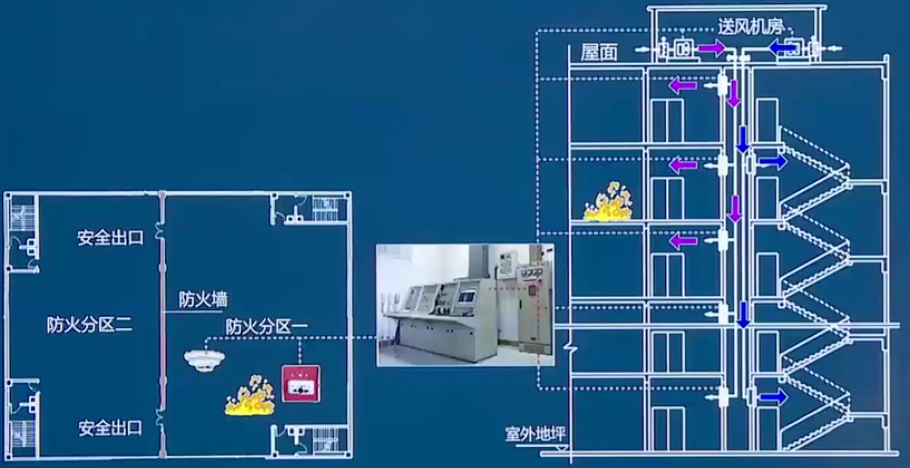


#### 知识点17：建筑防烟系统有哪些形式

> ​	建筑防烟系统主要有自然通风和机械加压送风两种形式。防烟系统通过采用自然通风方式，防止火灾烟气在楼梯间、前室、避难层（间）等空间内积聚，或通过采用机械加压送风方式阻止火灾烟气侵入楼梯间、前室、避难层（间）等空间。自然通风系统设置有一定面积要求的可开启外窗或开口，可开启外窗应方便直接开启，通常设有手动开启装置。在机械加压送风系统中，直灌式机械加压送风系统无送风井道，采用风机直接对楼梯间进行机械加压，是机械加压送风系统的一种特殊类型。


#### 知识点18：机械加压送风系统的工作原理是什么

> ​	加压送风口所在防火分区内的两只独立的火灾探测器或一只火灾探测器与一只手动火灾报警按钮的报警信号，作为送风口开启和加压送风机启动的联动触发信号，消防联动控制器联动控制相关层前室等需要加压送风场所的加压送风口开启和加压送风机启动。机械加压送风系统打开，向楼梯间、前室、避难层（间）等区域加注有压新鲜空气，使楼梯间、前室、避难层（间）等区域内形成正压，楼层间形成“防烟楼梯间压力>前室压力>走道压力>房间压力”的递减压力分布，从而阻止烟气侵入，控制烟气蔓延，为安全疏散创造有利条件，保证人员安全疏散。
>
> 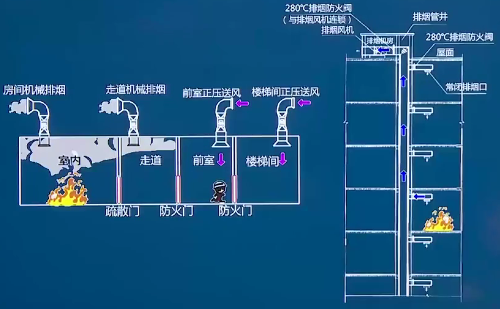


#### 知识点19：哪些场所或部位应设置排烟投施

> 1. 《建筑防火通用规范》（GB55037-2022）中规定，除不适合设置排烟设施的场所、火灾发展缓慢的场所可不设置排烟设施外，工业与民用建筑的下列场所或部位应采取排烟等烟气控制措施。
>    1. 建筑面积大于300㎡，且经常有人停留或可燃物较多的地上丙类生产场所，，丙类厂房内建筑面积大于300m²，且经常有人停留或可燃物较多的地上房间。
>    2. 建筑面积大于100m²的地下或半地下丙类生产场所
>    3. 除高温生产工艺的丁类厂房外，其他建筑面积大于5000m²的地上丁类生产场所。
>    4. 建筑面积大于1000m²的地下或半地下丁类生产场所。
>    5. 建筑面积大于300m²的地上丙类库房。
>    6. 设置在地下或半地下、地上第四层及以上楼层的歌舞娱乐放映游艺场所，设置在其他楼层且房间总建筑面积大于100m²的歌舞娱乐放映游艺场所。
>    7. 公共建筑内建筑面积大于100m²且经常有人停留的房间。
>    8. 公共建筑内建筑面积大于300㎡且可燃物较多的房间。
>    9. 中庭。
>    10. 建筑高度大于32m的厂房或仓库内长度大于20m的疏散走道，其他厂房或仓库内长度大于40m的疏散走道，民用建筑内长度大于20m的疏散走道。
> 2. 除敞开式汽车库、地下一层中建筑面积小于1000m²的汽车库、地下一层中建筑面积小于1000m²的修车库可不设置排烟设施外，其他汽车库、修车库应设置排烟设施。通行机动车的一、二、三类城市交通隧道内应设置排烟设施。
> 3. 建筑中下列经常有人停留或可燃物较多且无可开启外窗的房间或区域应设置排烟设施。
>    1. 建筑面积大于50m²的房间。
>    2. 房间的建筑面积不大于50m²，总建筑面积大于200m²的
>       区域。
> 4. 设置机械加压送风系统并靠外墙或可直通屋面的封闭楼梯间、防烟楼梯间，在楼梯间的顶部或最上一层墙上应设置常闭式应急排烟窗，且该应急排烟窗应具有手动和联动开启功能。
> 5. 除有特殊功能、性能要求或火灾发展缓慢的场所可不在外墙或屋顶设置应急排烟排热设施外，下列无可开启外窗的地上建筑或部位均应在其每层外墙和（或）屋顶上设置应急排烟排热设施，且该应急排烟排热设施应具有手动、联动或依靠烟气温度等方式自动开启的功能。
>    1. 任一层建筑面积大于2500m²的丙类厂房。
>    2. 任一层建筑面积大于2500m²的丙类仓库。
>    3. 任一层建筑面积大于2500m²的商店营业厅、展览厅、会议厅、多功能厅、宴会厅，以及这些建筑中长度大于60m的走道。
>    4. 总建筑面积大于1000m²的歌舞娱乐放映游艺场所中的房间和走道。
>    5. 靠外墙或贯通至建筑屋顶的中庭。


#### 知识点20：建筑排烟系统有哪些形式

> ​	建筑排烟系统主要有自然排烟和机械排烟两种形式。多层建筑受外部条件影响较小，一般采用自然排烟方式。高层建筑受自然条件（如室外风速、风压、风向等）的影响较大，一般采用机械排烟方式。同一个防烟分区内不应同时采用自然排烟方式和机械排烟方式，因为两者之间会存在气流干扰，影响排烟效果。
>
> ​	建筑高度大于50m的公共建筑和工业建筑、建筑高度大于100m的住宅建筑，其机械排烟系统应竖向分段独立设置，且公共建筑和工业建筑中每段的系统服务高度应小于或等于50m，住宅建筑中每段的系统服务高度应小于或等于100m。除地上建筑的走道或地上建筑面积小于500m²的房间外，设置排烟系统的场所应能直接从室外引入空气补风，且补风量和补风口的风速应满足排烟系统有效排烟的要求。


#### 知识点21：机械排烟系统的工作原理是什么

> ​	建筑物内发生火灾时，同一防烟分区内的两只独立的火灾探测器的报警信号，作为排烟口、排烟窗或排烟阀开启的联动触发信号，消防联动控制器联动控制排烟口、排焑窗或排焑阀的开启，同时停止该防烟分区的空气调节系统。排烟口、排烟窗或排烟阀开启的动作信号，作为排烟风机启动的联动触发信号，消防联动控制器联动控制排烟风机的启动，排烟风机运转所产生的气体流动和压力差，在排烟口处形成局部负压将烟气吸入，并利用排烟管道将房间、走道等空间的烟气排至建筑物外。
>
> ​	排烟防火阀安装在机械排烟系统的管道上，平时呈开启状态，火灾时当排烟管道内烟气温度达到==280℃==时关闭
>
> ​	==防火阀和补风机==属于正压送风系统。


#### 知识点22：防火门如何分类

> 1. 按耐火性能分类
>
>    防火门按照耐火性能可分为隔热防火门、部分隔热防火门和非隔热防火门三类。隔热防火门以“A”标记，根据耐火极限分别以A3.00、A2.00、A1.50、A1.00、A0.50标记，3.00、2.00、1.50、1.00、0.50表示隔热防火门在标准规定的测试条件下，满足耐火隔热性和耐火完整性要求的时间，以小时为单位。
>
>    1. 甲级防火门是A1.50隔热防火门。甲级防火门常用于火灾危险性大的场所的防火分隔。设置在防火墙上的门、疏散走道在防火分区处设置的门、耐火极限要求不低于3.00h的防火隔墙上的门、电梯间、疏散楼梯间与汽车库连通的门、室内开向避难走道前室的门、避难间的疏散门、多层乙类仓库和地下、半地下及多、高层丙类仓库中从库房通向疏散走道或疏散楼梯间的门均应采用甲级防火门。
>    2. 乙级防火门是A1.00隔热防火门。甲、乙类厂房，多层丙类厂房，人员密集的公共建筑和其他高层工业与民用建筑中封闭楼梯间的门，防烟楼梯间及其前室的门，消防电梯前室或合用前室的门，前室开向避难走道的门，地下、半地下及多、高层丁类仓库中从库房通向疏散走道或疏散楼梯的门，歌舞娱乐放映游艺场所中的房间疏散门，从室内通向室外疏散楼梯的疏散门及设置在耐火极限要求不低子2.00h的防火隔墙上的门的耐火性能不应低于乙级防火门的要求。
>    3. 丙级防火门是A0.50隔热防火门。电气竖井、管道井、排烟道、排气道、垃圾道等竖井井壁上的检查门的耐火性能不应低于丙级防火门的要求。
>
> 2. 按启闭状态分类
>
>    防火门按照启闭状态分为常开防火门和常闭防火门两种。随着消防科学技术的发展，防火门监控技术也得到了迅速发展。防火门监控系统由防火门监控器、监控分机、常开式防火门监控模块、常闭式防火门监控模块、防火门定位装置和==释放装置==等组成，主要功能是接收火灾报警控制器的火警信息，控制常开防火门的关闭，接收常开、常闭防火门关闭状态的反馈信号。门磁开关安装在防火门的门扇或门框上，且不能破坏防火门的防火性能和密闭性能。
>
> 3. 其他分类方式
>
>   4. 按材质可将防火门分为==木质防火门、钢质防火门、钢木质防火门和其他材质防火门==。
>    5. 按门扇数量可将防火门分为==单扇防火门、双扇防火门和多扇防火门（含有两个以上门扇的防火门）==。
>    6. 按结构形式可将防火门分为门扇上==带防火玻璃的防火门、无玻璃防火门==等。
>
> ​	==防火门电动闭门器是能够在收到指令后将处于打开状态的防火门关闭==，并将其状态信息反馈至防火门监控器的电动装置。防火门电磁释放器是使常开防火门保持打开状态，在收到指令后释放防火门使其关闭，并将本身的状态信息反馈至防火门监控器的电动装置。


#### 知识点23：防火卷帘有哪些类型

> ​	防火卷帘是在一定时间内，连同框架能满足耐火完整性和耐火隔热性等要求的卷帘。防火卷帘在建筑中应用广泛，常用于防火分区之间的防火分隔。防火卷帘可分为钢质防火卷帘、无机纤维复合防火卷帘和特级防火卷帘。
>
> 1. 钢质防火卷帘
>
>    钢质防火卷帘以“GFJ”标记，是用钢质材料制作帘板、导轨、座板、门楣、箱体等，并配以卷门机和控制箱所组成的能符合耐火完整性要求的卷帘。
>
> 2. 无机纤维复合防火卷帘
>
>    无机纤维复合防火卷帘以"WFJ”标记，是用无机纤维材料做帘面（内配不锈钢丝或不锈钢丝绳），用钢质材料做夹板、导轨、、座板、门楣、箱体等，并配以卷门机和控制箱所组成的能符合耐火完整性要求的卷帘。
>
> 3. 特级防火卷帘
>
>    特级防火卷帘以“UFJ”标记。特级防火卷帘既可以用钢质材料做帘面，也可以用无机纤维材料做帘面，再用钢质材料做导轨、座板、夹板、门楣、箱体等，并配以卷门机和控制箱所组成的能符合耐火完整性、隔热性和防烟性能要求的卷帘。
>
> ​	对于疏散通道上设置的防火卷帘，由防火分区内任两只独立的感烟火灾探测器或任一只专门用于联动防火卷帘的感烟火灾探测器的报警信号联动控制防火卷帘下降至距楼板面==1.8m==处；由任一只专门用于联动防火卷帘下降到楼板面。在卷帘的任一侧距卷帘纵深==0.5~5m==内应设置不少于==2==只专门用于联动防火卷帘的感温火灾探测器。
>
> ​	防火卷帘升降不到位，需重新调整==行程开关==位置，检查门体。
>
> ​	防火卷帘主要由卷门机、帘板（面）、座板、卷轴、导轨、防护罩（箱体）、控制器、手动按钮盒、温控释放装置等部件协同构成。其中温控释放装置的感温元件周围的温度达到==73±0.5℃==时，温控释放装置动作，牵引开启卷门机的制动机构，松开刹车盘，卷帘依靠自重下降关闭。
>
> ​	防火卷帘一般设置在==电梯厅、自动扶梯周围、中庭与楼层走道、过厅相通的开口部位生产车间中大面积工艺洞口，设置防火墙有困难的部位==。


#### 知识点24：消防应急照明和疏散指示标志的设置范围有哪些

> 1. 《建筑防火通用规范》（GB55037-2022）中规定，除筒仓、散装粮食仓库和火灾发展缓慢的场所外，下列建筑应设置灯光疏散指示标志，疏散指示标志及其设置间距、照度应保证疏散路线指示明确、方向指示正确清晰、视觉连续。
>    1. 甲、乙、丙类厂房，高层丁、戊类厂房。
>    2. 丙类仓库，高层仓库。
>    3. 公共建筑。
>    4. 建筑高度大于27m的住宅建筑。
>    5. 除室内无车道且无人员停留的汽车库外的其他汽车库和修车库。
>    6. 平时使用的人民防空工程。
>    7. 地铁工程中的车站、换乘通道或连接通道、车辆基地、地下区间内的纵向疏散平台。
>    8. 城市交通隧道、城市综合管廊。
>    9. 城市的地下人行通道。
>    10. 其他地下或半地下建筑。
> 2. 除筒仓、散装粮食仓库和火灾发展缓慢的场所外，厂房、丙类仓库、民用建筑、平时使用的人民防空工程等建筑中的下列部位应设置疏散照明。
>    1. 安全出口、疏散楼梯（间）、疏散楼梯间的前室或合用前室、避难走道及其前室、避难层、避难间、消防专用通道、兼作人员疏散的天桥和连廊。
>    2. 观众厅、展览厅、多功能厅及其疏散口。
>    3. 建筑面积大于200m²的营业厅、餐厅、演播室、售票厅、候车（机、船）厅等人员密集的场所及其疏散口。
>    4. 建筑面积大于100m²的地下或半地下公共活动场所。
>    5. 地铁工程中的车站公共区，自动扶梯、自动人行道，楼梯，连接通道或换乘通道，车辆基地，地下区间内的纵向疏散平台。
>    6. 城市交通隧道两侧，人行横通道或人行疏散通道。
>    7. 城市综合管廊的人行道及人员出入口。
>    8. 城市地下人行通道。


#### 知识点25：消防应急照明和疏散指示系统有哪些类型

> ​	消防应急照明和疏散指示系统为人员疏散和发生火灾时仍需工作的场所提供照明和疏散指示，由消防应急照明灯具、消防应急标志灯具及相关装置构成。该系统的主要功能是在火灾等紧急情况下，为人员的安全疏散和灭火救援行动提供必要的照度条件及正确的疏散指示信息。
>
> ​	消防应急照明和疏散指示系统根据控制方式不同分为集中控制型系统和非集中控制型系统。集中控制型系统又可以分为灯具采用集中电源供电方式的集中控制型系统和灯具采用自带电源供电方式的集中控制型系统；非集中控制型系统分为灯具采用集中电源供电方式的非集中控制型系统和灯具采用自带电源供电方式的非集中控制型系统。
>
> ​	设置消防控制室的场所应选择集中控制型系统。自带电源非集中控制型应急照明和疏散指示系统由自带电源型消防应急灯具、应急照明配电箱及相关附件等组成。非集中控制型系统未设置应急照明控制器，由应急照明集中电源或应急照明配电箱分别控制其配接消防应急灯具的工作状态。
>
> ​	应急照明控制器设置时，应符合下列规定：
>
> 1. 在墙面上
>    1. 设备主显示屏高度==宜为1.5~1.8m==。
>    2. 设备靠近门轴的侧面距墙==不应小于0.5m==。
>    3. 设备正面操作距离==不应小于1.2m==。
> 2. 在地面上
>    1. 底边高度宜高出地坪 ‌==0.1m～0.2m‌== 。
>    2. 在值班人员经常工作的一面，设备面板至墙的距离==不应小于 ‌3m== 。
>    3. 设备面盘后的维修距离==不宜小于1m==。
>    4. 设备面盘排列长度大于 ‌**4m**‌ 时，其两端应设置宽度不小于 ‌**1m**‌ 的通道 。‌


#### 知识点26：建筑内消防应急照明灯具的照度有哪些要求

> ​	《建筑防火通用规范》（GB55037-2022）中规定，建筑内疏散照明的地面最低水平照度应符合下列规定。
>
> 1. 疏散楼梯间、疏散楼梯间的前室或合用前室、避难走道及其前室、避难层、避难间、消防专用通道，不应低于10.0lx。
> 2. 疏散走道、人员密集的场所，不应低于3.0lx。
> 3. 上述规定场所外的其他场所，不应低于1.0lx。
>
> ​	消防控制室、消防水泵房、自备发电机房、配电室、防排烟机房以及发生火灾时仍需正常工作的消防设备房应设置备用照明，其作业面的最低照度不应低于正常照明的照度。


#### 知识点27：消防应急灯具有哪些类型

> ​	消防应急灯具是消防应急照明和疏散指示系统的重要组成部分。消防应急照明和疏散指示系统的作用则是通过消防应急灯具体现出来的。消防应急灯具应选择采用节能光源的灯具，优先选择安全性高、不含重金属等对环境有害物质的蓄电池.
> ​	消防应急灯具是指为人员疏散、消防作业提供照明和指示标志的各类灯具。消防应急灯具的分类见表6-3-4。
>
> 
> <table>
>     <tr>
>     	<td style="text-align: center; background-color: #A1E8F2;">序号</td>
>         <td style="text-align: center; background-color: #A1E8F2;">分类标准</td>
>         <td style="text-align: center; background-color: #A1E8F2;">分类结果</td>
>     </tr>
>     <tr>
>     	<td style="text-align: center;">1</td>
>         <td style="text-align: center;" rowspan="3">用途</td>
>         <td style="text-align: center;">消防应急照明灯具</td>
>     </tr>
>     <tr>
>     	<td style="text-align: center;">2</td>
>         <td style="text-align: center;">消防应急标志灯具</td>
>     </tr>
>     <tr>
>     	<td style="text-align: center;">3</td>
>         <td style="text-align: center;">消防应急照明标志复合灯具</td>
>     </tr>
>     <tr>
>     	<td style="text-align: center;">4</td>
>         <td style="text-align: center;" rowspan="2">应急控制方式</td>
>         <td style="text-align: center;">集中控制型消防应急灯具</td>
>     </tr>
>     <tr>
>     	<td style="text-align: center;">5</td>
>         <td style="text-align: center;">非集中控制型消防应急灯具</td>
>     </tr>
>     <tr>
>     	<td style="text-align: center;">6</td>
>         <td style="text-align: center;" rowspan="2">工作方式</td>
>         <td style="text-align: center;">持续型消防应急灯具</td>
>     </tr>
>     <tr>
>     	<td style="text-align: center;">7</td>
>         <td style="text-align: center;">非持续型消防应急灯具</td>
>     </tr>
>     <tr>
>     	<td style="text-align: center;">8</td>
>         <td style="text-align: center;" rowspan="2">应急供电方式</td>
>         <td style="text-align: center;">自带电源型消防应急灯具</td>
>     </tr>
>     <tr>
>     	<td style="text-align: center;">9</td>
>         <td style="text-align: center;">集中电源型消防应急灯具</td>
>     </tr>
> </table>


#### 知识点28：城市消防远程监控系统的设置有什么要求

> ​	建筑高度大于250m的民用建筑应接入城市消防远程监控系统。设置火灾自动报警系统、消防给水及消火栓系统或自动喷水灭火系统等建筑消防设施的人员密集场所，宜与城市消防远程监控系统联网，传输火灾报警和建筑消防设施运行状态信息。


#### 知识点29：消防设备电源监控统系的组成和功能是什么

> ​	消防设备电源是指为各类消防设备供电的交流或直流电源，包括主电源和备用电源。消防设备电源监控系统用于监控消防设备电源工作状态，在电源发生过电压、欠电压、过电流、缺相等故障时能发出报警信号，由消防设备电源状态监控器、电压传感器、电流传感器等部分或全部设备组成。


#### 知识点30：柴油发电机组有哪些类型

> ​	柴油发电机组按控制方式分为手动柴油发电机组、
> 自启动柴油发电机组和微机控制自动化柴油发电机组3类。
>
> 1. 手动柴油发电机组具有电压和转速自动调节功能，操作人员在机房现场对柴油发电机组进行启动、合闸、分闸和停机等操作，通常作为主电源或备用电源。
>
> 2. 自启动柴油发电机组是在手动柴油发电机组的基础上，增加了自动控制系统。当市电突然停电时，自启动柴油发电机组具有自动启动、自动调压、自动调频、自动进行开关切换和自动停机等功能；当自启动柴油发电机组机油压力过低、机油温度和冷却水温过高时，能自动发出声光报警信号；当自启动柴油发电机组超速时，能自动紧急停机保护机组。自启动柴油发电机组大大减少了对操作人员的依赖性，缩短了市电中断至由机组供电之间的间隔时间，通常作为备用电源。
>
> 3. 微机控制自动化柴油发电机组由柴油机、同步发电机、机油自动补偿装置、冷却水自动补偿装置和自动控制屏等组成。自动控制屏采用可编程自动控制器控制。
>
>    除了具备自启动柴油发电机组的各项功能外，还可按负荷大小自动增减机组、故障自动处理、自动记录、打印机组运行报表和故障情况，对柴油发电机组进行自动控制。
>
>    微机控制自动化柴油发电机组的自动化程度可按实际需要配置，适合作为应急电源。


#### 知识点31：灭火器有哪些类型

> ​	灭火器按照操作方法可以分为手提式灭火器、推车式灭火器和简易式灭火器3种，具体分类见表6-3-5。
>
> 
> <table>
>  <tr>
>     <td style="text-align: center; background-color: #A1E8F2;">序号</td>
>     <td style="text-align: center; background-color: #A1E8F2;">类别</td>
>     <td style="text-align: center; background-color: #A1E8F2;">分类标准</td>
>     <td style="text-align: center; background-color: #A1E8F2;" colspan="2">分类结果</td>  
>  </tr>
>  <tr>
> 	<td style="text-align: center;">1</td>
>     <td style="text-align: center;" rowspan="7">手提式灭火器</td>
>     <td style="text-align: center;" rowspan="5">充装的灭火剂</td>
>     <td style="text-align: center;" colspan="2">水基型灭火器</td>
>  </tr>
>  <tr>
> 	<td style="text-align: center;">2</td>
>     <td style="text-align: center;" rowspan="2">手提式干粉灭火器</td>
>     <td style="text-align: center;">BC干粉灭火器</td>
>  </tr>
>  <tr>
> 	<td style="text-align: center;">3</td>
>     <td style="text-align: center;">ABC干粉灭火器</td>
>  </tr>
>  <tr>
> 	<td style="text-align: center;">4</td>
>     <td style="text-align: center;" colspan="2">二氧化碳灭火器</td>
>  </tr>
>  <tr>
> 	<td style="text-align: center;">5</td>
>     <td style="text-align: center;" colspan="2">洁净气体灭火器</td>
>  </tr>
>  <tr>
> 	<td style="text-align: center;">6</td>
>     <td style="text-align: center;" rowspan="2">驱动灭火器的形式</td>
>     <td style="text-align: center;" colspan="2">储气瓶式灭火器</td>
>  </tr>
>  <tr>
> 	<td style="text-align: center;">7</td>
>     <td style="text-align: center;" colspan="2">储压式灭火器</td>
>  </tr>
>  <tr>
> 	<td style="text-align: center;">8</td>
>     <td style="text-align: center;" rowspan="7">推车式灭火器</td>
>     <td style="text-align: center;" rowspan="5">充装的灭火剂</td>
>     <td style="text-align: center;" colspan="2">推车式水基型灭火器</td>
>  </tr>
>  <tr>
> 	<td style="text-align: center;">9</td>
>     <td style="text-align: center;" rowspan="2">推车式干粉灭火器</td>
>     <td style="text-align: center;">BC干粉灭火器</td>
>  </tr>
>  <tr>
> 	<td style="text-align: center;">10</td>
>     <td style="text-align: center;">ABC干粉灭火器</td>
>  </tr>
>  <tr>
> 	<td style="text-align: center;">11</td>
>     <td style="text-align: center;" colspan="2">推车式二氧化炭灭火器</td>
>  </tr>
>  <tr>
> 	<td style="text-align: center;">12</td>
>     <td style="text-align: center;" colspan="2">推车式洁净气体灭火器</td>
>  </tr>
>  <tr>
> 	<td style="text-align: center;">13</td>
>     <td style="text-align: center;" rowspan="2">驱动灭火器的形式</td>
>     <td style="text-align: center;" colspan="2">储气瓶式灭火器</td>
>  </tr>
>  <tr>
> 	<td style="text-align: center;">14</td>
>     <td style="text-align: center;" colspan="2">储压式灭火器</td>
>  </tr>
>  <tr>
> 	<td style="text-align: center;">15</td>
>     <td style="text-align: center;" colspan="5">简易式灭火器</td>
>  </tr>
> </table>


#### 知识点32：建筑火灾逃生避难器材有哪些

> ​	建筑火灾逃生避难器材是在发生建筑火灾的情况下，遇险人员逃离火场时所使用的辅助逃生器材。建筑火灾逃生避难器材的分类见表6-3-6。
>
> 
> <table>
>     <tr>
>     	 <td style="text-align: center; background-color: #A1E8F2;">序号</td>
>          <td style="text-align: center; background-color: #A1E8F2;">分类标准</td>
>          <td style="text-align: center; background-color: #A1E8F2;">类别</td>
>          <td style="text-align: center; background-color: #A1E8F2;">分类结果举例</td>
>     </tr>
>     <tr>
>     	 <td style="text-align: center;">1</td>
>          <td style="text-align: center;" rowspan="4">结构</td>
>          <td style="text-align: center;">绳索类</td>
>          <td style="text-align: center;">逃生缓降器、应急逃生器、逃生绳</td>
>     </tr>
>     <tr>
>     	 <td style="text-align: center;">2</td>
>          <td style="text-align: center;">滑道类</td>
>          <td style="text-align: center;">逃生滑道</td>
>     </tr>
>     <tr>
>     	 <td style="text-align: center;">3</td>
>          <td style="text-align: center;">梯类</td>
>          <td style="text-align: center;">固定式逃生梯、悬挂式逃生梯</td>
>     </tr>
>     <tr>
>     	 <td style="text-align: center;">4</td>
>          <td style="text-align: center;">呼吸器类</td>
>          <td style="text-align: center;">消防过滤式自救呼吸器、化学氧消防自救呼吸器</td>
>     </tr>
>     <tr>
>     	 <td style="text-align: center;">5</td>
>          <td style="text-align: center;" rowspan="2">工作方式</td>
>          <td style="text-align: center;">单人逃生类</td>
>          <td style="text-align: center;">逃生缓降器、应急逃生器、逃生绳、悬挂式逃生梯、消防过滤式自救呼吸器、化学氧消防自救呼吸器</td>
>     </tr>
>     <tr>
>     	 <td style="text-align: center;">6</td>
>          <td style="text-align: center;">多人逃生类</td>
>          <td style="text-align: center;">逃生滑道、固定式逃生梯</td>
>     </tr>
> </table>


#### 知识点33：消防电梯的定义及设置场所有哪些

>​	消防电梯是指设置在建筑的耐火封闭结构内，具有前室和备用电源，在正常情况下可为普通乘客使用，当建筑发生火灾时其附加的保护、控制和信号等功能可专供消防员使用的电梯，能将消防员及其设备运送至指定楼层。
>
>1. 《建筑防火通用规范》（GB55037-2022）中规定，除城市综合管廊、交通遂道和室内无车道且无人员停留的机械式汽车库可不设置消防电梯外，下列建筑均应设置消防电梯，且每个防火分区可供使用的消防电梯不应少于1部。
>   1. 建筑高度大于33m的住宅建筑。
>   2. 5层及以上且建筑面积大于3000m²（包括设置在其他建筑内第五层及以上楼层）的老年人照料设施。
>   3. 一类高层公共建筑，建筑高度大于32m的二类高层公共建筑。
>   4. 建筑高度大于32m的丙类高层厂房。
>   5. 建筑高度大于32m的封闭或半封闭汽车库。
>   6. 除轨道交通工程外，埋深大于10m且总建筑面积大于3000m²的地下或半地下建筑（室）。
>2. 消防电梯应符合下列规定。
>   1. 应能在所服务区域每层停靠。
>   2. 电梯的载重量不应小于**800kg**。
>   3. 电梯的动力和控制线缆与控制面板的连接处、控制面板的外壳防水性能等级不应低于IPX5。
>   4. 在消防电梯的首层入口处，应设置明显的标识和供消防救援人员专用的操作按钮
>   5. 电梯轿厢内部装修材料的燃烧性能应为A级。
>   6. 电梯轿厢内部应设置专用消防对讲电话和视频监控系统的终端设备。
>3. 设置在消防电梯或疏散楼梯间前室内的非消防电梯，防火性能不应低于消防电梯的防火性能。


## 第七章 初期火灾的处置知识

​	初期火灾是指火灾发生发展过程中的初起阶段。火灾初起阶段是指物质起火后的几分钟里，燃烧面积不大，烟气流动速度缓慢，火焰辐射热量不多，周围物品和建筑结构温度上升不快。在此阶段内，采用较少的人力和灭火器材即可将火灾控制或消灭。发现火情后，切莫惊慌，应立即呼救、果断报警，科学使用灭火器扑灭火灾，迅速组织人员进行疏散逃生，积极参与火灾扑救工作并做好火灾现场的保护。


### 第一节 常用灭火剂灭火原理、灭火器使用方法

【知识要点】

1. 常用灭火器的类型及适用范围。
2. 常用灭火剂的灭火原理。
3. 灭火器的使用方法。


#### 知识点1：常用灭火剂有哪些类型

> ​	常用灭火剂主要包括水系灭火剂、泡沫灭火剂、气体灭火剂和干粉灭火剂等类型。


#### 知识点2：什么是水系灭火剂

> ​	水系灭火剂是指电水、渗透剂、阻燃剂以及其他添加剂组成，一般以液滴或以液滴和泡沫混合的形式灭火的液体灭火剂。


#### 知识点3：==水系灭火剂的灭火原理是什么==

> ​	水系灭火剂的灭火原理主要体现在以下4个方面。
>
> 1. 冷却灭火
>
>    由于水的比热容大，汽化热高，而且水具有较好的导热性，因而当水与燃烧物质接触或流经燃烧区时，将被加热或汽化，吸收热量，使燃烧区温度降低，导致燃烧终止。
>
> 2. 室息灭火
>
>    水汽化后在燃烧区产生大量水蒸气占据燃烧区，降低燃烧区的氧气浓度，使可燃物得不到氧的补充，导致燃烧强度减弱直至终止。
>
> 3. 稀释灰火
>
>    水是一种良好的溶剂，可以溶解水溶性甲、乙、丙类液体，当此类物质起火后，可以用水进行稀释，以降低可燃液体的浓度。
>
> 4. 对非水溶性可燃液体的乳化
>
>    非水溶性可燃液体的初起火灾，在未形成热波之前，以较强的水雾射流或滴状射流灭火，可在液体表面形成“油包水”型乳液，重质油品甚至可以形成含水油泡沫。水的乳化作用可使液体表面冷却，使可燃蒸气产生的速率降低，致使燃烧终止。综上所述，用水灭火时往往是以上几种作用的共同结果，但冷却发挥着主要作用。


#### 知识点4：水系灭火剂的类型如何划分

> ​	水系灭火剂按性能分为以下两类。一是抗醇性水系灭火剂，即适用于扑灭A类火灾和B类火灾（水溶性和非水溶性液体燃料）的水系灭火剂；二是非抗醇性水系灭火剂，即适用于扑灭A类火灾或A、B类火灾（非水溶性液体燃料）的水系灭火剂。


#### 知识点5：水系灭火剂的适用范围是什么

> 1. 用直流水或开花水可扑救一般固体物质的表面火灾及闪点在120℃以上的重油火灾。
> 2. 用雾状水可扑救阴燃物质火灾、可燃粉尘火灾、电气设备火灾。
> 6. 用水蒸气可以扑救封闭空间内（如船舱）的火灾。
> 7. 凡遇水会发生燃烧和爆炸的物质，不能用水进行扑救。


#### 知识点6：什么是泡沫灭火剂

> ​	泡沫灭火剂是指泡沫液与水混溶，并通过==机械方法==或化学反应产生灭火泡沫，用于扑救可燃易燃夜体的有效灭火剂。


#### 知识点7：泡沫灭火剂的灭火原理是什么

> ​	泡沫灭火剂通过冷却、室息、隔离、淹没等综合作用实现灭火。在可燃易燃液体表面生成凝聚的泡沫漂浮层，可起到窒息和冷却作用。


#### 知识点8：泡沫灭火剂的类型如何划分

> ​	泡沫灭火剂按发泡倍数不同，分为低倍泡沫灭火剂、中倍泡沫灭火剂和高倍泡沫灭火剂；按构成成分不同，分为蛋白泡沫灭火剂、氟蛋白泡沫灭火剂、水成膜泡沫灭火剂、成膜氟蛋白泡沫灭火剂、合成泡沫灭火剂、抗溶性泡沫灭火剂和A类泡沫灭火剂等类型。


#### 知识点9：低倍泡沫灭火剂的发泡倍数及主要运用场所是什么

> ​	低倍泡沫灭火剂是指发泡倍数为1~20的泡沫灭火剂。低倍泡沫灭火剂主要用于甲、乙、丙类液体的生产、储存、运输和使用场所，如石油化工企业、炼油厂、储油罐区、飞机库、车库、为铁路油槽车装卸油的鹤管栈桥、码头、机场以及燃油锅炉房等。


#### 知识点10：中倍泡沫灭火剂的发泡倍数及应用火灾类型是什么

> ​	中倍泡沫灭火剂是指发泡倍数为21~200的泡沫灭火剂，一般用于控制或扑灭易燃可燃液体、固体表面火灾及固体深位阴燃火灾。


#### 知识点11：高倍泡沫灭火剂的发泡倍数及灭火原理是什么

> ​	高倍泡沫灭火剂是指发泡倍数为201以上的泡沫灭火剂。它以合成表面活性剂为基料，通过高倍数泡沫产生器可产生气泡直径在10mm以上的泡沫，通过产生的泡沫迅速充满、淹没被保护区域和空间，隔绝空气实施灭火；同时，泡沫受热后产生大量水蒸气，降低燃烧区域温度，降低空气中的氧气浓度，阻止热量传递，防止火势蔓延。


#### 知识点12：蛋白泡沫灭火剂的性质及优缺点分别有哪些

> ​	蛋白泡沫灭火剂是泡沫灭火剂中最基本的一种，由含蛋白的原料经部分水解制成，是一种黑褐色的黏稠液体，具有天然蛋白质分解后的臭味。蛋白泡沫灭火剂具有原料易得、生产工艺简单、成本低、泡沫稳定性好、对水质要求不高、储存性能较好等优点，主要用于扑救油类液体火灾。但蛋白泡沫灭火剂的流动性能较差，抵抗油质污染的能力较弱，不能用于液下喷射灭火，也不能与干粉灭火剂联用。


#### 知识点13：氟蛋泡沫灭火剂的性质及优缺点分别有哪些

> ​	氟蛋白泡沫灭火剂是在蛋白泡沫液中加入氟碳表面活性剂、碳氢表面活性剂等制成。由于氟碳表面活性剂的表面张力较低，并具有较好的疏油性，使其性能得到改善。与蛋白泡沫液相比，氟蛋白泡沫的流动性能较好，疏油性强，可以用于==液下喷射灭火，也可以与干粉灭火剂联用==，提高整体灭火效率。


#### 知识点14：水成膜泡沫灭火剂的性质及优缺点分别有哪些

> ​	水成膜泡沫灭火剂（又称“轻水”泡沫灭火剂，英文简称AFFF）是指以碳氢表面活性剂和氟碳表面活性剂为基料，可在某些烃类表面形成一层水膜的泡沫灭火剂。其特点是可在某些烃类表面形成一层能够抑制油品蒸发的水膜，靠泡沫和水膜的双重作用灭火，灭火速度最快，具有流动性好、可液下喷射、可与干粉联用、可预混等特点；但与蛋白泡沫液相比，泡沫不够稳定，防复燃隔热性能差，而且成本较高。


#### 知识点15：成膜氟蛋白泡沫灭火剂的组成及适用范围是什么

> ​	成膜氟蛋白泡沫灭火剂（英文简称FFFP
> 是由碳氢表面活性剂、氟碳表面活性剂、抗燥剂、助剂、极性成膜剂、稳定剂、抗冻剂、防腐剂等配制而成，可在某些烃类表面形成一层水膜的氟蛋白泡沫，主要用于扑救油类火灾和极性溶剂火灾。成膜氟蛋白泡沫灭火剂的灭火性能和抗复燃性能与水成膜泡沫灭火剂相当，是一种多功能泡沫灭火剂。


#### 知识点16：抗溶性泡沫灭火剂的性质、类型及适用范围是什么

> ​	抗溶性泡沫灭火剂是指所产生的泡沫施放到醇类或其他极性溶剂表面时，可抵抗其对泡沫破坏性的泡沫灭火剂，又称抗醇泡沫灭火剂。抗溶性泡沫灭火剂有金属皂型、凝胶型、氟蛋白型、硅酮表面活性剂型等多种类型，用于扑救水溶性甲、乙、丙类液体火灾。


#### 知识点17：A类泡沫灭火剂如何分类

> ​	A类泡沫灭火剂是指主要适用于扑救A类火灾的泡沫灭火剂。A类泡沫灭火剂
>
> ​	按产品性能分为以下两类：一是适用于扑救A类火灾及隔热防护的A类泡沫灭火剂，代号为MJAP；二是适用于扑救A类火灾、非水溶性液体燃料火灾及隔热防护的A类泡沫灭火剂，代号为MJABP。


#### 知识点18：什么是气体灭火剂

> ​	气体灭火剂是指以气体状态进行灭火的灭火剂。


#### 知识点19：气体灭火剂包含哪些类

> ​	气体灭火剂包含二氧化碳灭火剂、七氟丙烷灭火剂、六氟丙烷灭火剂、惰性气体灭火剂、气溶胶灭火剂、全氟己酮灭火剂等。


#### 知识点20：二氧化碳灭火剂的灭火原理是什么

> ​	二氧化碳灭火剂在常温常压下是一种无色、无味的气体，当储存于密封高压气瓶中，低于临界温度31.4℃时，以气、液两相共存。在灭火过程中，二氧化碳从储存气瓶中释放出来，压力骤然下降，使二氧化碳由液态转变成气态，分布于燃烧物的周围，降低空气中的氧气浓度，氧气浓度降低会使燃烧时热的产生率减小，而当热产生率减小到低于热散失率的程度时燃烧就会停止，这是二氧化碳所产生的室息作用；另外，二氧化碳释放时又因降的关系温度急剧下降，形成细微的固体干冰粒子，干冰吸取其周围的热量而升华，即能产生冷却燃烧物的作用。因此，二氧化碳灭火剂的灭火作用主
> 要在于室息，其次是冷却。


#### 知识点21：二氧化碳灭火剂的适用范围是什么

> ​	二氧化碳灭火剂可以扑救灭火前可切断气源的气体火灾液体火灾或石蜡、沥青等可熔化的固体火灾，固体表面火灾及成卷装或堆垛类的棉毛、织物、纸张等部分固体深位火灾，电气火灾。二氧化碳灭火剂不得用于扑救硝化纤维、火药等含氧化剂的化学制品火灾，钾、钠、镁、钛、锆等活泼金属火灾，氢化钾、氢化钠等金属氢化物火灾。


#### 知识点22：七氟丙烷灭火剂的性质有哪些

> ​	七氟丙烷灭火剂是一种无色无味、低毒性、不导电的洁净气体灭火剂，其密度大约是空气密度的6倍，可在一定压力下呈液态储存。释放后无残余物，对环境的不良影响小，消耗臭氧潜能值为零，毒性较低，不会污染环境和保护对象，是目前
> 卤代烧1211，1301灭火剂的理想替代品。


#### 知识点23：七氟丙烷灭火剂的灭火原理是什么

> ​	当七氟丙烷灭火剂喷射到保护区或保护对象后，液态灭火剂迅速转变成气态，吸收大量热量，使保护区和火焰周围的温度显著降低；另外，七氟丙烷灭火剂在化学反应过程中释放游离基，能最阻止燃烧的链式反应，从而使火灾扑灭。


#### 知识点24：七氟丙烷灭火剂的适用范围是什么

> ​	七氟丙烷灭火剂适用于扑救甲、乙、丙类液体火灾，可燃气体火灾，电气设备火灾，可燃固体物质表面火灾。


#### 知识点25：惰性气体灭火剂的含义及类型是什么

> ​	惰性气体灭火剂是指由氮气、氩气和二氧化碳按一定质量比混合而成的灭火剂。
>
> ​	惰性气体灭火剂又分为IG-01有性气体灭火剂（由氩气单独组成的气体灭火剂）、IG-100惰性气体灭火剂（由氮气单独组成的气体灭火剂）、IG-55惰性气体灭火剂（由氩气和氮气按一定质量比混合而成的灭火剂）和IG-541惰性气体灭火剂（由氮气、氩气和二氧化碳按一定质量比混合而成的灭火剂）四种类型。该类灭火剂主要通过降低防护对象周围的氧气浓度以致室息进行灭火。


#### 知识点26：惰性气体灭火剂的灭火原理是什么

> ​	惰性气体灭火剂属于物理灭火剂，当混合气体释放后，通过降低防护区中的氧气浓度，使其不能维持燃烧而达到灭火的目的。


#### 知识点27：惰性气体灭火剂的适用范围是什么

> ​	惰性气体灭火剂可以扑救灭火前可切断气源的气体火灾，液体火灾或石蜡、沥青等可熔化的固体火灾，固体表面火灾及成卷装或堆垛类的棉毛、织物、纸张等部分固体深位火灾，气火灾。


#### 知识点28：气溶胶灭火剂的含义及类型是什么

> ​	气溶胶是指以气体为分散介质，液体或固体为被分散介质所形成的溶胶状物质。气溶胶灭火剂是通过燃烧或其他方式产生具有灭火效能气溶胶的灭火剂。气溶胶灭火剂按其产生方式分为热气溶胶灭火剂和冷气溶胶灭火剂两种。热气溶胶灭火剂是指由固体化学混合物（热气溶胶发生剂）经燃烧反应生成的具有灭火性质的气溶胶，包括S型热气溶胶、K型热气溶胶和其他型热气溶胶。冷汽溶胶灭火剂是一种特别研制加工的超细磷酸铵盐干粉，其粒径须在10μm以下，用惰性气体使其从容器中喷射出来后在空气中形成气溶胶形态。


#### 知识点29：热气溶胶灭火剂的灭火原理是什么

> 1. 吸热降温灭火，即热气溶胶灭火剂在高温下吸收大量的热，发生热熔、汽化等物理吸热过程，火焰温度降低，进而辐射到可燃烧物燃烧而用于汽化可燃物分子和将已汽化的可燃物分子裂解成自由基的热量就会减少，燃烧反应速率得到一定抑制。
> 2. 化学抑制灭火，即在热作用下，灭火气溶胶中分解的汽化金属离子或失去电子的阳离子可以与燃烧中的活性基团发生亲核反应，反复大量消耗活性基团，减少燃烧自由基。
> 3. 降低氧气浓度，即灭火气溶胶中的氮气、二氧化碳等可降低燃烧中的氧气浓度，但其速度较为缓慢，灭火作用远远小于吸热降温和化学抑制。


#### 知识点30：气溶胶灭火剂的适用范围是什么

> ​	气溶胶灭火剂适用于扑救固体表面火灾，以及通信机房、电子计算机房、电缆隧道（夹层、井）及自备发电机房等防护区火灾。


#### 知识点31：全氟己酮灭火剂的性质是什么

> ​	全氟己酮是一种重要的哈龙灭火剂替代品，属于氟化酮类的化合物，是一种清澈、无色、无味、绝缘的液体，用氮气进行超级增压，并作为灭火系统的一部分存放在高压气瓶中。在常温下是液体，但由于其蒸发热仅仅是水的1/25，而蒸气压是水的25倍的性质使它易于汽化并以气态存在。全氟己酮主要依靠吸热达到灭火效果，灭火浓度4%~6%，安全余量比较高，使用时对人体更安全。


#### 知识点32：全氟己酮灭火剂的灭火原理是什么

> ​	全氟己酮灭火剂灭火时会快速汽化带走热量，导致温度下降，其自身会形成隔离层，隔绝氧气，起到室息灭火作用：其表面张力小，具有优异的相容性。此外，该灭火剂具有超强的绝缘性，和大多数物品接触后不会发生反应，对常用金属，如碳钢、铜、铝、不锈钢等材质亦无腐蚀作用，不会损害电子部件和线路，不会造成二次损坏。全氟己酮灭火剂是目前全球公认的新一代洁净型灭火剂。


#### 知识点33：全氟己酮灭火剂的适用范围是什么

> ​	全氟己酮灭火剂适用于不宜使用其他灭火剂扑救和灭火后不能有大的二次污染的火灾场所，适用于密闭空间和有人的场所。例如，数据处理中心、电子控制中心、高级精密仪器、博物馆、档案馆、图书馆、通信基站、变电站、电网等场所。


#### 知识点34：什么是干粉灭火剂

> ​	干粉灭火剂是指用于灭火的干燥、易于流动的细微粉末。干粉灭火剂是由灭火基料（如小苏打、磷酸铵盐等）和适量的流动助剂（硬脂酸镁、云母粉、滑石粉等）以及防潮剂（硅油）在一定工艺条件下研磨、混配制成的固体粉末灭火剂。


#### 知识点35：干粉灭火剂的类型有哪些

> 1. 普通干粉灭火剂，又称BC干粉灭火剂。这类灭火剂可扑救B类、C类、E类火灾。
> 2. 多用途干粉灭火剂，又称ABC干粉灭火剂。这类灭火剂可扑救A类、B类、C类、E类火灾。
> 3. 超细干粉灭火剂，即90%粒径小于或等于20μm的固体粉末灭火剂。该类灭火剂按其灭火性能分为BC超细干粉灭火剂和ABC超细干粉灭火剂两类。
> 4. D类干粉灭火剂，即能扑救D类火灾的干粉灭火剂。D类干粉灭火剂按可扑救的金属材料对象分为单一型和复合型两类。


#### 知识点36：干粉灭火剂的适用范围是什么

> ​	磷酸铵盐干粉灭火剂适用于扑救A类、B类、C类和电气设备火灾；碳酸氢钠干粉灭火剂适用于扑救B类、C类、带电设备及可熔化的固体物质火灾；BC超细干粉灭火剂适用于扑救B类、C类及带电设备的初起火灾，不适合固体物质火灾；ABC超细干粉灭火剂适用于扑数A类、B类、C类灾；D类干粉灭火剂适用于扑救D类火灾。


#### 知识点37：使用干粉灭火剂的注意事项是什么

> ​	BC类干粉灭火剂与ABC类干粉灭火剂不兼容
> ，BC类干粉灭火剂与蛋白泡沫灭火剂不兼容，因为干粉灭火剂中的防潮剂对蛋白泡沫有较大的破坏作用。对于一些扩散性很强的气体，如氢气、乙炔气体，干粉喷射后难以稀释整个空间的气体，在精密仪器、仪表上会留下残渣，所以不宜使用干粉灭火。


#### 知识点38：7150灭火剂的性质是什么

> ​	7150灭火剂是特种灭火剂的一种，适用于扑数D类火灾。7150灭火剂是一种无色、透明液体，其化学名称为三甲氧基硼氧六环。


#### 知识点39：7150灭火剂的灭火原理是什么

> ​	7150灭火剂热稳定性较差，同时本身又是可燃物。当它以雾状被喷到炽热燃烧的轻金属表面时，会发生化学反应，所生成的物质在轻金属燃烧的高温下熔化为玻璃状液体，流散于金属表面及其缝隙中，在金属表面形成一层隔膜，使金属与大气（氧气）隔绝，从而使燃烧室息；同时在7150灭火剂发生燃烧反应时，还需消耗金属表面附近的大量氧气，这能够降低轻金属的燃烧强度。


#### 知识点40：手提式灭火器的操作使用方法及注意事项是什么

> 1. 操作使用方法
>
>    使用手提式干粉灭火器灭火时，先将灭火器从设置点处提至距离燃烧物2~5m处，然后拔掉保险销，一手握住喷筒，另一手握住开启压把并用力压下鸭嘴，使瓶内灭火剂喷出，对准火焰根部进行扫射灭火，随着灭火器喷射距离缩短，操作者应逐渐向燃烧物靠近。手提式灭火器的操作要领归纳为“一提、二拔、三握、四压、五瞄、六射”，如图7-1-1所示。
>
>    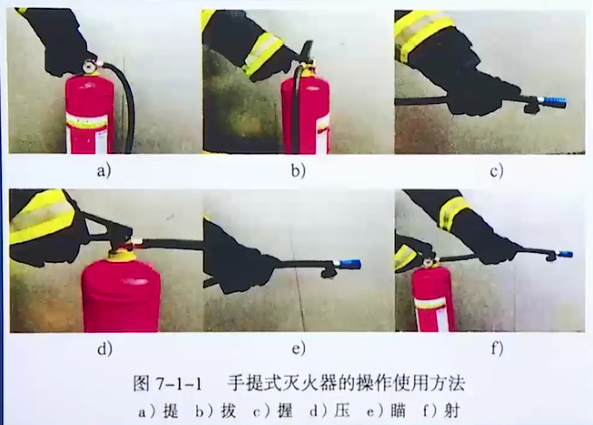
>
> 2. 使用注意事项
>
>    1. 使用干粉灭火器前，要先将灭火器上下颠倒几次，使筒内干粉松动。有喷射软管的灭火器或储压式灭火器在使用时，一手应始终压下压把，不能放开，否则喷射会中断。
>    2. 使用二氧化碳灭火器灭火时，手一定要握在喷筒木柄处，接触喷筒或金属管要戴防护手套，以防局部皮肤冻伤。
>    3. 扑救可燃液体火灾时，应避免灭火剂直接冲击燃烧液面，防止可燃液体流散扩大火势。
>    4. 扑救火灾时，应由近及远喷射灭火剂，直至扑灭火势。
>    5. 扑救电气火灾时，应先断电，后灭火。


#### 知识点41：推车式干粉灭火器的使用方法是什么

> ​	推车式干粉灭火器在使用时一般由两人协同操作，先将灭火器推拉至现场，在上风方向距离火源约10m处做好喷射准备。然后一人拔掉保险销，迅速向上扳起手柄或旋转手轮到最大开度位置；另一人取下喷枪，展开喷射软管，然后一只手握住喷枪枪管行至距离燃烧物1～2m处，将喷嘴对准火焰根部，另一只手开启喷枪阀门，使灭火剂喷出灭火。喷射时要沿火焰根部喷扫推进，直至把火扑灭，如图7-1-2所示。灭火后，放松手握开关压把，开关即自行关闭，喷射停止，同时关闭钢瓶上的启闭阀。推车式灭火器的操作要领归纳为一推、二拨、三展、四开、五扣、六射”。
>
> 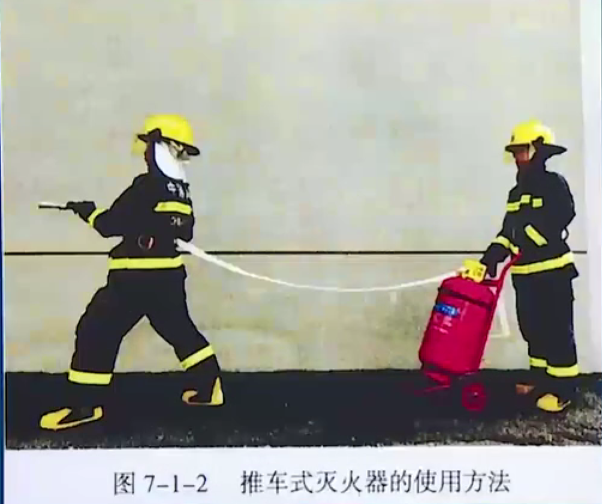


#### 知识点42：推车式灭火器的使用注意事项是什么

> 1. 使用时注意喷射软管不能打折或打圈。
> 2. 灭火时对准火焰根部，应由近及远扫射推进，注意死角，防止复燃。
> 3. 使用二氧化碳灭火器灭火时，手一定要握在喷筒木柄处，接触喷筒或金属管要戴防护手套，应避免触碰喇叭筒喷嘴前部，防止冻伤。在狭小空间喷射灭火剂时，应提前采取预防措施，防止人员室息。
> 4. 扑救可燃液体火灾时，应避免灭火剂直接冲击燃烧液面，防止可燃液体流散扩大火势。
> 5. 扑救电气火灾时，应先断电，后灭火。


### 第二节 火灾报警

【知识要点】

1. 《中华人民共和国消防法》对公民报告火警义务的规定。
2. 火灾报警的方法。
3. 拨打“119”报警电话的主要内容。
4. 消防控制室值班人员接到火灾警报的应急程序。


#### 知识点1：《中华人民共和国消防法》对公民报告火警义务的规定是什么

> ​	《中华人民共和国消防法》规定，任何单位和个人都有维护消防安全、保护消防设施、预防火灾、报告火警的义务；任何人发现火灾都应当立即报警；任何单位、个人都应当无偿为报警提供便利，不得阻拦报警；严禁谎报火警。发现火灾立即报警是每个公民应尽的义务，及时报告火警对于减轻火灾损失具有十分重要的作用。


#### 知识点2：拨打“119”报警电话叙述的主要内容是什么

> ​	报火警时，必须讲清以下几项内容。
>
> 1. 起火单位和场所的详细地址，包括单位、场所及建筑物和街道名称，门牌号码，靠近何处，并说明起火部位及附近的明显标志等。
> 2. 火灾基本情况，包括起火的场所和部位、着火的物质、火势的大小、是否有人员被困、火场有无化学危险源等，以便消防部门根据现场火势情况派出相应的灭火车辆。
> 3. 报警人姓名、单位及电话号码等相关信息。


#### 知识点3：火灾报警的方法有哪些

> 1. 拨打“119”火灾报警电话。
> 2. 使用报警设施设备如报警按钮报警。
> 3. 通过应急广播系统发布火警信息和疏散指示。
> 4. 条件允许时，可派人至就近消防站报警。
> 5. 使用预先约定的信号或方法报警。


#### 知识点4：消防控制室值班人员接到火灾警报的应急程序是什么

> 1. 接到火灾警报后，消防控制室值班人员应立即以最快方式确认火警。
> 2. 火灾确认后，消防控制室值班人员应立即确认火灾报警联动控制开关处于自动状态，同时拨打“119”火灾电话报警，报警时应说明着火单位地点、起火部位、着火物种类、火势大小、报警人姓名和联系电话等
> 3. 消防控制室值班人员应立即启动单位内部应急疏散和灭火预案，并报告单位负责人。


#### 知识点5：火灾的确认标准是什么

> 1. 任一只探测器动作+消防按钮动作。
> 2. 任一只探测器动作+水流指示器动作。
> 3. 任一只探测器动作+压力开关动作。
> 4. 任两只不同类型探测器动作（如温感+烟感、烟感+红外线、烟感+火焰、烟感+线缆式等）。
> 5. 各类喷头动作。
> 6. 任一只探测器动作+人工确认火灾发生（如手动开启排烟阀、正压送风阀或固定灭火系统）。
> 7. 人工确认火灾发生。


#### 知识点6：消防控制室“两屏三器两柜”指的是什么

> 1. 两屏：视频监控屏、图形显示屏（消防设施）。
> 2. 三器：火灾报警控制器、消防联动控制器、消防应急广播控制器。
> 3. 两柜：消防电源控制柜、消防水箱液位显示柜。


#### 知识点7：消防控制室的管理要求是什么

> 1. 应实行每日24h专人值班制度，每班不应少于2人。值班人员应持有消防设施操作员职业资格证书
> 2. 消防设施日常维护管理应符合《建筑消防设施的维护管理》（GB 25201-2010）的要求。
> 3. 应确保火灾自动报警系统和其他联动控制设备处于正常工作状态，不得将应处于自动状态的设在手动状态。
> 4. 应确保高位消防水箱、消防水池、气压罐等消防储水设施水量充足，确保消防水泵出水管阀门、自动喷水灭火系统管道上的的阀门常开。
> 5. 确保消防水泵、防排烟风机、防火卷帘等消防用电设备的配电柜启动开关处于自动位置（通电状态）。


#### 知识点8：消防控制室内设置的消防设备有哪些

> ​	消防控制室内设置的消防设备主要包括火灾报警控制器、消防联动控制器、消防控制室图形显示装置、消防电话总机、消防应急广播控制装置、消防应急照明和疏散指示系统控制装置、消防电源监控器等设备。


#### 知识点9：火灾报警控制器显示的信息有哪些

> ​	火灾报警控制器显示的信息主要包括火灾探测器、火灾显示盘、手动火灾报警按钮的正常工作状态、火灾报警状态、屏蔽状态及故障状态等相关信息，并能控制火灾声光警报器的启动和停止。
>
> ​	集中火灾报警控制器信息显示按火灾报警、监管报警及其他状态顺序==由高至低==排列信息显示等级


#### 知识点10：火灾信息主要包括哪些内容

> ​	火灾信息主要包括==起火时间、起火部位、起火原因、报警方式（指自动、人工等）、灭火方式（指气体、喷水、喷雾、泡沫、干粉灭火系统，水基型、干粉、二氧化碳、洁净气体灭火器，消防力量等）==。


#### 知识点11：消防电话分机设置

> ​	消防水泵房、发电机房、配变电室、计算机网络房、主要通风和空调机房、防排烟机房、灭火控制系统操作装置处或控制室、企业消防站、消防值班室、总调度室、消防电梯轿厢、消防电梯机房及其他与消防联动控制有关的且经常有人值班的机房应设置消防电话分机
>
> ​	按下面板测试（自检）按钮或选择主菜单自检功能，检查消防电话==总机指示灯、显示器和音响器件的动作情况==。


### 第三节 疏散逃生

【知识要点】

1. 应急疏散逃生的基本原则。
2. 灭火和应急疏散预案制定的内容与演练频次。
3. 疏散逃生的组织与实施。


#### 知识点1：应急疏散逃生的基本原则是什么

> ​	统一指挥，有序组织，确保安全。


#### 知识点2：应急疏散逃生统一指挥的具体内容是什么

> 1. 实施统一指挥可有效避免在疏散逃生过程中产生混乱、交叉和拥堵，提高效率。
> 2. 实施统一指挥应以有计划、有步骤、有方法、有秩序和有保障为前提。
> 3. 实施统-指挥应充分利用应急广播系统、扩音器等设施设备，统一发布火警信息指引方向，严防自行其是。


#### 知识点3：如何有序组织疏散逃生

> 1. 组织疏散逃生应明确优先顺序，优先安排受火势威胁最严重或最危险区域内的人员疏散，以疏散至安全区域为主要目标。
> 2. 当仅有唯一疏散路径时，必须合理安排先后顺序，分别进行引导；当具备多条疏散路径和辅助安全疏散设施时，应合理分配路径和设施，在互不干扰的前提下组织疏散逃生。


#### 知识点4：如何确保疏散逃生过程中的安全工作

> 1. 疏散逃生过程中严禁使用普通电梯，防止因烟火蔓延侵入造成人员伤亡。
> 2. 疏散逃生过程中应利用安全疏散设施或开启紧急电梯抢救被困人员。
> 3. 疏散逃生过程中应同时组织力量利用室内消火栓、防火门、防火卷帘等设施控制初起火势，启动通风和排烟系统降低烟雾浓度，防止烟火侵入疏散通道，为疏散逃生创造安全环境。


#### 知识点5：灭火和应急疏散预案的具体内容是什么

> ​	消防安全重点单位制定的灭火和应急疏散预案的主要内容包括以下5项。
>
> 1. 组织机构，包括灭火行动组、通信联络组、疏散引导组、安全防护救护组等。
> 2. 报警和接警处置程序。
> 3. 应急疏散的组织程序和措施。
> 4. 扑救初起火灾的程序和措施。
> 5. 通信联络、安全防护救护的程序和措施。


#### 知识点6：灭火和应急疏散预案制定的要求是什么

> 1. 开展单位基本情况调研，掌握与火灾扑救相关的环境、道路、水源等情况以及所涉及的生产设施设备、生产工艺流程等，详细分析火灾重点部位、火灾特点以及发生火灾后可能出现的各种情况，绘制单位总平面图、建筑平面图、重点部位图等相关图样
> 2. 在分析、研判的基础上，分别以单位要害部位起火、重点部位起火等假设火灾情况，部署灭火力量，确定火灾扑救的程序和方法，确定任务分工和人员责任。
> 3. 确定火灾扑救组织机构，明确报警和火灾初起处置程序，根据假设火情绘制火情态势图、灭火力量部署图。
> 4. 明确安全防护和通信联络方式及要求，确保单位上下级应急通信畅通；安全防护应重点明确不同区域的最低防护等级、防护手段等，标注应急物资存储位置和种类。
> 5. 根据单位重点部位、人员分布以及安全疏散、避难设施等情况，确定安全疏散路径，绘制安全疏散路线图。


#### 知识点7：灭火和应急疏散预案演练的频次如何确定

> ​	消防安全重点单位应至少每半年组织一次演练，火灾高危单位应至少每季度组织一次演练，其他单位应至少每年组织一次演练。在火灾多发季节或有重大活动保卫任务的单位，应组织全要素综合演练。单位内的有关部门应结合实际适时组织专项演练，宜每月组织开展一次疏散演练。


#### 知识点8：灭火和应急疏散预案演练的要求是什么

> 1. 根据灭火和应急疏散预案，设定演练形式和范围，确定演练时间、参演人员和方式，做好演练准备。
> 2. 编制演练文案，明确组织机构、任务分工、安全保障、实施程序和评估方案，确保演练安全有序。
> 3. 演练期间应加强过程控制，根据灭火和应急疏散预案合理传递控制信息，参演人员应根据相关信息采取相应行动，演练导调人员应做好全过程记录，为后期评估和总结做好准备。
> 4. 演练结束后，应对演练过程进行评估、总结，及时总结经验教训，制定改进措施，修订、完善灭火和应急疏散预案。


#### 知识点9：发布火警的具体要求是什么

> 1. 利用应急广播系统、警铃、室内电话等设施设备以及通过喊话等方式发布火警信息。
> 2. 发布的信息应包含稳定人员情绪，告知最佳疏散路线、疏散方法和注意事项。


#### 知识点10：应急响应的具体内容是什么

> 1. 单位内部人员应预先了解应急情况下的职责分工，根据统一指令迅速行动。
> 2. 开启消防水泵，切断电源，关闭防火分隔设备，启动通风排烟系统等。
> 3. 引导被困人员按预定路线向安全区域疏散或实施临时避难等待救援。


#### 知识点11：引导疏散的具体内容是什么

> 1. 疏散过程中应加强安全管理，维护疏散秩序，必要时可采取强制措施，防止拥挤、踩踏、摔伤等事故发生。
> 2. 在疏散路径的转弯、岔道、交叉口等易迷失方向的部位设立引导人员指示方向。
> 3. 引导疏散应有组织地进行，引导被困人员按照疏散走道、疏散楼梯等设施向着火层下层疏散，直至到达地面安全区域。
> 4. 当下行疏散路径受阻时，应注意稳定被困人员情绪，在确保安全的前提下，利用辅助疏散设施实施疏散，并开辟临时避难场所，及时联系外部救援力量等待救援。


### 第四节 火灾扑救

【知识要点】

1. 扑救初起火灾的基本原则、程序和方法。
2. 微型消防站器材配置和值守联动要求。
3. 不同保护对象初起火灾的扑救方法及注意事项。


#### 知识点1：初起火灾扑救的基本原则是什么

> ​	初起火灾扑救的基本原则主要包括：==救人第一，先控制、后消灭、先重点、后一般等原则==。


#### 知识点2：初起火灾扑救时，如何贯彻“救人第一”的基本原则

> ​	初起火灾现场如有人员被困，受到火势威胁，单位消防安全责任人、保安员及在场群众的首要任务就是抢救被火势围困的人员。灭火力量较强时，灭火和救人可以同时进行，在未抢救出被困人员之前，灭火是为了开设救人通道或减少烟火对被困人员的威胁，为被困人员脱险创造条件。依据火灾现场实际情况，有时先救人后灭火，有时为救人先灭火，有时救人与灭火同时进行。


#### 知识点3：初起火灾扑救时，如何贯彻“先控制、后消灭”的基本原则

> ​	“先控制、后消灭”是对于不能立即扑灭的初起火灾应贯彻的原则，对于能一举扑灭的小火，要迅速消灭火势。当火势较大，灭火力量相对较弱，
> 不能立即扑灭时，要将主要力量放在控制火势发展或防正爆炸等方面，防止火势扩大，为消灭火
> 创造条件。


#### 知识点4：初起火灾扑救时，如何贯彻“先重点、后一般的基本原则

> ​	“先重点、后一般”是指扑救初起火灾时，要全面了解并认真分析火场情况，区别重点与一般，对事关全局或生命安全的物资和人员要优先抢救，之后再抢救一般物资。


#### 知识点5：==初起火灾扑救的基本程序是什么==

> 1. 发现起火后，应利用就近消火栓、灭火器等设施灭火，触动手动火灾报警按钮或拨打报警电话，及时通知消防控制室值班人员。
> 2. 火灾确认后，应及时启动灭火和应急疏散预案，迅速开启消防设施，第一时间组织力量灭火，并向相关人员通报火灾情况。
> 3. 组织、引导人员有序疏散，协助有需要的人员撤离。
> 4. 设立警戒，阻止无关人员进入火场，维护现场秩序。


#### 知识点6：初起火灾扑救的基本方法是什么

> 1. 利用室内消火栓，直接将水喷洒到燃烧物表面或燃烧区域内，利用水受热汽化原理降低燃烧区域现场温度，达到冷却灭火的效果。
> 2. 将泡沫等灭火剂喷洒到燃烧物表面形成保护层，隔绝空气终止燃烧，或转移着火区域附近的易燃易爆物品至安全区域，关阀断料，开辟防火隔离带等，以达到隔离灭火的效果。
> 3. 当有限空间发生火灾时，可采取封堵孔洞、门窗等方法，阻止空气进入燃烧区域，或向封闭空间内注入惰性气体降低氧气浓度，以达到室息灭火的效果。
> 4. 将干粉等灭火剂喷洒到燃烧区域参与燃烧反应，使燃烧停止，达到抑制灭火的效果。灭火时，需将足量的灭火剂喷洒到燃烧区域内，燃烧终止后仍需要采取冷却降温措施，防止火灾复燃。


#### 知识点7：应如何配合消防救援队伍开展火灾扑救工作

> ​	在及时报警和组织扑救的同时，应积极配合消防救援队伍灭火救灾。如已将初起火灾扑灭，应注意保护现场，以便后续相关部门调查火灾原因和损失；如火势已扩大，无法将火势扑灭时，要采取措施制止火势蔓延；主动配合消防救援队伍灭火，在消防车可能驶来的方向派人守候接车，开道引路；消防人员到场后，及时讲清火场情况，包括具体燃烧部位、有无人员被困、有无爆炸、毒害物品等；维护火灾现场秩序，禁止无关人员入内。


#### 知识点8：消防安全重点单位和社区型消防站的建设原则是什么

> 1. 消防安全重点单位微型消防站建设原则
>
>    除须建立专职消防队的重点单位外，其他设有消防控制室的重点单位，以救早、灭小和3min到场扑救初起火灾为目标，依托单位志愿消防队伍，配备必要的消防器材，建立重点单位微型消防站，积极开展防火巡查和初起火灾扑救等火灾防控工作。合用消防控制室的重点单位，可联合建立微型消防站。
>
> 2. 社区微型消防站建设原则
>
>    以救早、灭小和3min到场扑救初起火灾为自标，划定最小灭火单元，依托消防安全网格化管理平台和体系，发挥治安联防、保安巡防等群防群治队伍的作用，建立社区微型消防站，积极开展初起火灾扑救等火灾防控工作。


#### 知识点9：消防安全重点单位微型消防站的器材应如何配置

> 1. 微型消防站应设置人员值守、器材存放等功能用房可与消防控制室合用，有条件的可单独设置。
> 2. 微型消防站应根据扑救初起火灾需要，配备一定数量的灭火器、水枪、水带等灭火器材，配置外线电话、手持对讲机等通信器材。有条件的站点可选配消防头盔、灭火防护服、防护靴、破拆工具等器材。
> 3. 微型消防站应在建筑物内部和避难层设置消防器材存放点，可根据需要在建筑之间分区域设置消防器材存放点。
> 4. 有条件的微型消防站可根据实际选配消防车辆


#### 知识点10：社区微型消防站的器材应如何配置

> 1. 微型消防站应充分利用社区服务中心等现有的场地、设施，设置在便于人员出动、器材取用的位置，房间和场地应满足日常值守、放置消防器材的基本要求，配置外线电话。
> 2. 微型消防站应根据本社区扑救初起火灾的需要，配备消防摩托车和灭火器、水枪、水带等基本的灭火器材和个人防护装备。具备条件的，可选配小型消防车。


#### 知识点11：消防安全重点单位微型消防站值守联动的要求是什么

> 1. 微型消防站应建立值守制度，确保值守人员24h在岗在位，做好应急准备。
> 2. 接到火警信息后，控制室值班员应迅速核实火情，启动灭火处置程序。消防员应按照3min到场的要求赶赴现场处置。
> 3. 微型消防站应纳入当地灭火救援联勤联动体系，参与周边区域灭火处置工作。


#### 知识点12：社区微型消防站值守联动的要求是什么

> 1. 微型消防站应建立24h值守制度，分班编组值守，每班不少于3人。
> 2. 乡镇（街道）辖区内建有多个社区微型消防站的，应实行统一调度，并纳入当地灭火救援联勤联动体系。


#### 知识点13：初期火灾的分类及灭火方法是什么

> ​	根据国家标准《火灾分类》（GB/T4968-2008），按照可燃物质的类型和燃烧特性，将火灾分为以下6种不同类别。
>
> 1. A类火灾是指固体物质火灾，这种物质通常具有有机物的性质，一般在燃烧时能产生灼热的余烬。例如，木材、煤、棉、毛、麻、纸张等物质火灾。扑救A类火灾应选用水系、泡沫、干粉等灭火剂。
> 2. B类火灾是指液体或可熔化的固体物质火灾。例如，煤油、柴油、原油、甲醇、乙醇、沥青、石蜡等物质火灾。扑救B类火灾应选用干粉、泡沫、卤代烷、二氧化碳等灭火剂，扑救水溶性B类火灾不得选用化学泡沫灭火剂。
> 3. C类火灾是指气体火灾。例如，煤气、天然气、甲烷、乙烷、丙烷、氢气等气体火灾。扑救C类火灾应选用干粉、二氧化碳等灭火剂。
> 4. D类火灾是指金属火灾。例如，钾、钠、镁、铝镁合金等金属火灾。扑救D类火灾应选用专用干粉灭火剂。
> 5. E类火灾是指带电火灾，即物体带电燃烧的火灾。扑救带电设备火灾应选用卤代烷、二氧化碳、干粉等灭火剂，慎用水扑救。
> 6. F类火灾是指烹饪器具内的烹饪物（如动植物油脂）火灾。扑救F类火灾应采用空气隔离法，用锅盖等物体立即将燃烧物体盖住，起到隔离空气的作用。如引起大面积火灾，则用泡沫灭火剂灭火。


#### 知识点14：电气设备初起火灾扑救的要点是什么

> ​	电气设备发生火灾，在扑救时应遵守“先断电，后灭火”的原则。如果情况危急须带电灭火，可用干粉灭火剂、二氧化碳灭火剂灭火，或用灭火毯等不透气的物品将着火电器包裹，让火焰自行熄灭。切勿用水或泡沫灭火剂扑救，防止发生触电等伤亡事故。


### 第五节 火灾现场保护

【知识要点】

1. 火灾现场保护的目的。
2. 火灾现场保护的基本要求和注意事项。
3. 火灾现场保护的方法。


#### 知识点1：火灾现场保护指的是什么

> ​	火灾现场保留着能证明起火点、起火时间、起火原因等的痕迹、物证，如不及、时保护好火灾现场，则现场的真实状态就可能受到人为或自然因素的破坏，不但会增加火灾原因调查的难度，甚至导致永远查不清起火原因。


#### 知识点2：火灾现场保护的目的是什么

> ​	火灾现场保留着火灾发生、发展和熄灭过程的真实记录，是火灾原因的物质载体。保护火灾现场的目的是使火灾调查人员能够发现、提取到客观、真实、有效的火灾痕迹和物证，确保火灾原因认定的准确性。


#### 知识点3：火灾现场保护的范围应如何确定

> ​	凡与火灾有关的留有火灾物证的场所均应列入现场保护范围，但在保证能够查清起火原因的条件下，应尽量把保护现场的范围缩小到最小限度。根据现场条件和勘验工作需要，要扩大保护范围的情况有以下几种。
>
> 1. 起火点位置未能确定，起火部位不明显，起火点位置看法有分歧，初步认定的起火点与火灾现场遗留痕迹不一致等。
> 2. 当怀疑起火原因为电气故障时，凡与火灾现场用电设备有关的线路、设备及其通过或安装的场所都应列入保护范围，如进户线、总配电盘、开关、灯座、插座、电机及其拖动设备等。
> 3. 对爆炸起火的现场，不论抛出物体飞出的距离有多远，都应把抛出物着地点列入保护范围，同时把爆炸场所破坏或影响到的建筑物等列入现场保护的范围。


#### 知识点4：灭火中现场保护的内容是什么

> ​	消防员在进行火情侦察时，应注意发现和保护起火部位和起火点。在起火部位的灭火行动中，特别是在消灭残火阶段，尽量不实施消防破拆或变动物品的位置，以保持燃烧后的自然状态。


#### 知识点5：火灾现场的保护时间如何确定

> ​	火灾现场的保护时间应从发现火灾时起，到火灾现场勘验结束为止。火灾现场勘验负责人应当根据勘验需要和进展情况，调整现场保护范围，经勘验不需要继续保护的部分，应当及时解除封闭并通知火灾当事人。


#### 知识点6：痕迹与物证的现场保护内容是什么

> ​	对于可能证明火灾蔓延方向和火灾原因的任何痕迹、物证均应严加保护；为了引起注意，可在留有痕迹、物证的地点做出保护标志；对室外某些痕迹、物证等应用席子、塑料布等加以遮盖。


#### 知识点7：火灾现场保护的基本要求是什么

> ​	现场保护人员要服从指挥、遵守纪律，有组织地做好现场保护工作；不准随便进入现场，不准触摸现场物品，不准移动、拿用现场物品；现场保护人员要坚守岗位，做好工作，自始至终保护好现场的痕迹、物证，收集群众反映的情况。


#### 知识点8：火灾现场保护的注意事项是什么

> ​	现场保护人员的工作不仅限于布置警戒、封锁现场、保护痕迹和物证，由于现场有时会出现一些紧急情况，所以现场保护人员还要提高警惕，随时掌握现场动态。发现问题时，负责保护现场的人员应及时采取有效措施进行处理，并及时向有关部门报告。
>
> 1. 扑灭后的火场“死灰”复燃，甚至二次成灾时，要迅速有效地实施扑救，酌情及时报警。有的火场扑灭后善后事宜未尽，现场保护人员应及时发现、积极处理，如发现易燃液体或者可燃气体泄漏应关闭阀门，发现有导线落地时应切断电源。
> 2. 遇有人命危急的情况，应立即设法施行急救；遇有趁火打劫或者二次放火的，思维要敏捷，处置要果断；对打听消息、反复探视、问询火场情况以及行为可疑的人要多加小心，纳入视线，必要情况下应控制后移交公安机关。
> 3. 危险物品发生火灾时，无关人员不要靠近，危险区域实行隔离，禁止进入，人要站在上冈处，离开低洼处。对于那些存在接触即可能被灼伤的火灾现场，以及有毒物品、放射性物品引起的火灾现场，进入现场的人员要使用隔绝式呼吸器，穿着全身防护服。暴露在放射线中的人员及装置要等待放射线主管人员到达，按其指示处理，清扫现场。
> 4. 被烧坏的建筑物有倒塌危险并危及他人安全时，应采取措施使其固定。如受条件限制不能使其固定，应在其倒塌之前仔细观察并记录下倒塌前的烧毁情况。采取移动措施时，尽量使现场少受破坏；若需要移动，事前应详细记录现场原貌。


#### 知识点9：灭火中的现场保护方法是什么

> ​	在灭火时，特别是消灭残火时不要轻易破坏或变动现场物品的位置，应尽量保持燃烧后物品的自然状态；在拆除某些构件和清理火灾现场时，应该注意保护好起火部位物品的原状对于有可能是起火点的部位，要特别小心，尽可能做到不拆散已烧毁的结构、构件、设备和其他残留物；在翻动、移动重要物品以及经确认已经死亡的人员尸体之前，应当采用编号并拍照或录像等方式先行记录。


#### 知识点10：勘验前的现场保护方法是什么

> ​	根据不同火灾现场情况，可采取以下现场保护方法。
>
> 1. 露天火灾现场
>
>    应首先在发生火灾的地点和留有火灾相关痕迹、物证的一切处所周围，划定保护范围。起初应当把保护范围划大一些，待勘验人员到达后，可根据具体情况缩小。如果现场的范围不大，可用警戒带、绳索、白粉等划定警戒范围，对现场重要部位和出入口应设置屏障遮挡或布置看守。
>
> 2. 室内火灾现场
>
>    主要应在室外门窗外布置专人看守，或重点部位加以看守，必要时对现场的室外和院落也应划出一定的禁入范围，并对房间所有人做好安抚工作，劝其不要急于清理。
>
> 3. 大型火灾现场
>
>    可利用原有的围墙、栅栏等进行封锁隔离，待勘验时，再酌情缩小现场保护范围。


#### 知识点11：勘验中的现场保护方法是什么

> ​	有的火灾现场需要多次勘验，因此在勘验过程中，不应有违反勘验纪律的行为，即使是烧剩下的一些构件或物体妨碍工作，也不应随意清理；在清理之前，必须从不同角度拍照，以照片的形式记录和保存现场的原始状态。


## 第八章 计算机基础知识

​	计算机的发明是20世纪人类文明最伟大的成就之一。经过半个多世纪的发展，计算机的应用已深入各行各业，建筑内消防设施的信息化程度日益提升，熟练使用计算机实现对各类报警与联动系统的操作、管理已经成为消防行业从业人员的必备技能，而计算机知识也早已成为从业人员必须具备的基础知识之一。


### 第一节 计算机系统的组成与功能

【知识要点】

1. 计算机系统的组成。
2. 系统软件的概念与分类。
3. 常用应用软件的基本操作。


#### 知识点1：计算机系统由哪几部分组成

> ​	计算机系统是由硬件系统和软件系统两部分组成的。
>
> 1. 硬件系统
>
>    计算机硬件系统是指计算机的物理系统，是构成计算机的物理零部件，是看得到、摸得着的物理器件。计算机硬件系统通常包括计算机主机及其外围设备，主要由中央处理器（central processing unit，CPU)、内存储器、外在储器、输出设备、输入设备等组成，如图8-1-1所示。
>
>    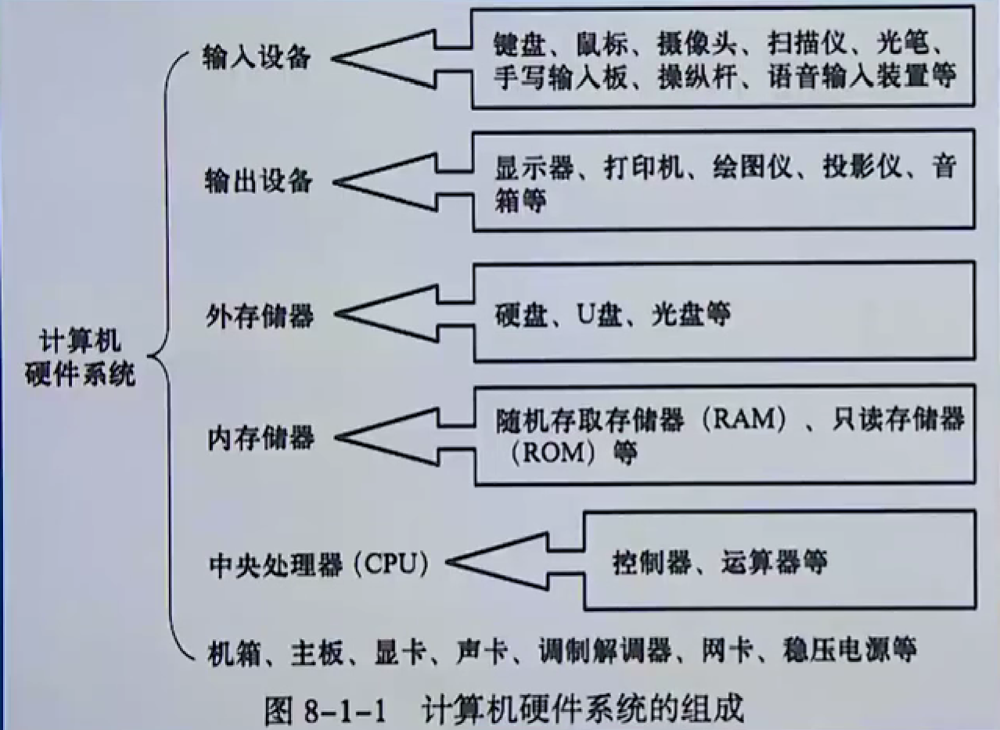
>
> 2. 软件系统
>
>    计算机软件是指为运行、维护和管理计算机而编制的各种程序、数据和文档的总称。
>
>    计算机软件系统按照使用功能，一般分为系统软件和应用软件两大类。系统软件是为扩大计算机的功能、提高计算机的工作效率以及为方便用户使用计算机而设计的软件，如操作系统、语言处理程序和服务程序等；应用软件是为解决某个应用领域中的具体任务而编制的程序，如文字处理软件、计算机辅助设计软件等。


#### 知识点2：计算机具有哪些特性

> 1. 运算速度快。
> 2. 计算精度高。
> 3. 具备复杂的逻辑判断能力。
> 4. 具有自动执行功能。


#### 知识点3：计算机的安全工作环境需要满足哪几个方面的条件

> 1. 温度
>
>    计算机一般应在20～25℃的环境下工作。现在的计算机虽然本身散热性能很好，但过高的温度仍然会使计算机工作时产生的热量散发不出去，轻则缩短计算机的使用寿命，重则烧毁计算机的芯片或其他配件。
>
> 2. 湿度
>
>    计算机机房相对湿度一般控制在40%~70%之间，相对湿度不能过高，否则计算机内的线路板很容易腐蚀，使板卡过早老化。
>
> 3. 电源
>
>    1. 供电。计算机机房供电一般都采用三级供电，即市电一稳压电源一机内电源。电压过低或过高时，很容易损坏计算机系统，因此要接入稳压电源。
>    2. 供电电网的连续性。计算机系统要求供电电网在工作时间内连续供电，在供电电网经常发生断电的地区，必须配置不间断电源。
>    3. 避免与带有大容量感性负载的电网并联使用。计算机系统的电源线应当避免与带有大容量感性负载的电网并联使用，因为感性负载在启动、停止时，会产生高压电流和干扰，使计算机不能工常工作。
>
> 4. 灰尘
>
>    由于计算机各组成部件非常精密，如果在灰尘较多的环境下工作，就有可能堵塞计算机的各种接口，使其不能正常工作。因此，不要将计算机安装于高粉尘的环境中，如确实需要安装，应做好防尘工作。
>
> 5. 振动和噪声
>
>    振动和噪声会造成计算机部件的损坏（如硬盘的损坏）或数据的丢失等，因此，计算机不能在振动和噪声很大的环境中工作，如确实需要将计算机放置在振动和噪声大的环境中时，应考虑安装防振和隔音设备。
>
> 6. 静电
>
>    静电有可能造成计算机芯片的损坏。为防止静电对计算机造成损害，在打开计算机机箱前应当用手接触可以放电的物体，将静电放掉后再接触计算机的配件。另外，在安装计算机时将机壳用导线接地，也可以起到很好的防静电效果。


#### 知识点4：什么是输入设备

> ​	输入设备是指向计算机输入数据和信息的设备，是计算机与用户或其他设备通信的桥梁。输入设备用于把原始数据输入到计算机中，把待输入的信息转换成能用计算机处理的数据。


#### 知识点5：常见的输入设备有哪些

> 1. 字符输入设备：键盘。
> 2. 光学阅读设备：光学标记阅读机、光学字符阅读机。
> 3. 图形输入设备：鼠标、操纵杆、光笔。
> 4. 图像输入设备：摄像机、扫描仪、传真机。
> 5. 模拟输入设备：语言模数转换识别设备。


#### 知识点6：鼠标有几种类型

> 1. 鼠标的分类
>
>    常用鼠标按构造可以分为机械鼠标、光电鼠标和触摸式鼠标；按连接形式可以分为有线鼠标和无线鼠标（见图8-1-2）。
>
>    
>
> 2. 鼠标的操作
>
>    用鼠标进行定位、单击左键、单击右键、双击左键、拖动等操作，可实现对象的选择和编辑。
>
> 3. 鼠标的属性设置
>
>    单击“控制面板”，在打开的“控制面板”窗口中，单击“硬件和声音”，在打开的“硬件和声音”窗口中，单击“鼠标”按钮，弹出“鼠标属性”对话框。在该对话框中，用户可以使用其中的“鼠标键”选项卡来切换鼠标左右键功能，以满足部分习惯使用左手的用户；可以使用“指针”选项卡来更换鼠标指针形状，以满足用户的美观需求等。


#### 知识点7：计算机键盘主要功能分区有哪些

> ​	标准Windows键盘共有104个键，分为主键盘区、功能键区、控制键区、数字键区和状态指示区5个部分，如图8-1-3所示。
>
> 
>
> ​	主键盘区也称标准打字键盘区，此键区除包含26个英文字母、10个数字符号、各种标点符号、数学符号、特殊符号等47个字符键外，还有若干基本的功能控制键。
>
> ​	功能键区也称专用键区，包含F1～F12共12个功能键，主要用于扩展键盘的输入控制功能。各个功能键的作用在不同的软件中通常有不同的定义。
>
> ​	控制键区也称编辑键区，主要用于控制或移动光标。
>
> ​	数字键区也称小键盘、副键盘或数字/光标移动键盘，主要用于数字符号的快速输入。在数字键区中，各个数字符号键的分布紧凑合理，适于单手操作，在录入内容为纯数字符号的文本时，比使用主键盘更方便，更有利于提高输入速度。


#### 知识点8：什么是输出设备

> ​	输出设备是计算机硬件系统的终端设备，是将计算机处理的结果以人能识别、理解的形式表现出来的设备。可以把各种计算结果（数据或信息）以数字、字符、图像、声音等形式表现出来，这些返回结果可能是使用者能够以视觉、听觉直接体验的，也可能作为该计算机所控制的其他设备的输入。
> ​	常见的输出设备有显示器、打印机、绘图仪、投影仪等影像输出系统，语音输出设备，磁记录设备等。


#### 知识点9：打印机的类型有哪些，不同类型的打印机各有什么特点

> 1. 打印机用于将计算机处理结果打印在相关介质上，按工作原理分为击打式和非击打式。击打式打印机是利用打印头上的钢针与色带和打印纸相撞而印出字符或图形。非击打式打印机是利用光、电、磁、喷墨等物理和化学的方法把字符或图形印出来。常见的打印机有激光打印机、喷墨打印机，此外还有热敏打印机、针式打印机等，如图8-1-4所示。
>
>    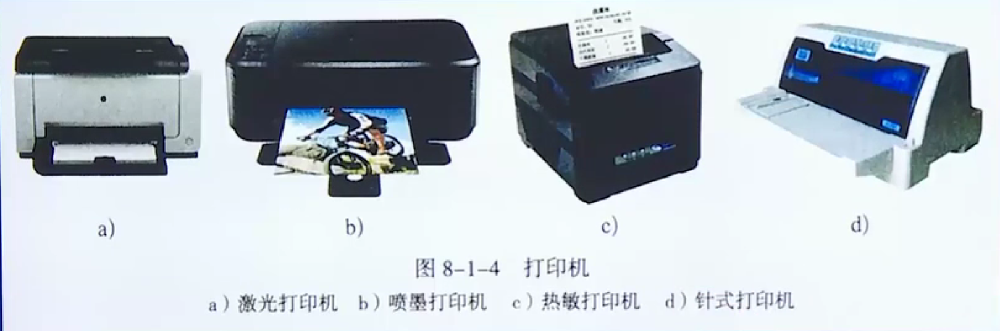
>
> 2. 不同类型的打印机具有不同特点。
>
>    激光打印机打印图案精细，水浸图案不会模糊，打印速度快，打印成本低，噪声低。一般常用于办公文件的打印。
>
>    喷墨打印机打印照片效果好，成本较低，噪声低。缺点是打印速度较慢，水浸图案会模糊，针头容易堵。一般常用于家庭打印或照片的打印。
>
>    热敏打印机靠对打印纸加热，使其内部热敏物质变黑，不需要除热敏纸外的其他耗材。缺点是不能长期放置，图案会消失，加热后整体变黑，不能打印彩色图案。一般常用于超市购物小票的打印。
>
>    针式打印机靠针头把墨水打印到纸上，可以打印一式几份的票据（复写纸式）。缺点是噪声大，打印速度慢，只能单色打印。一般常用于发票的打印。


#### 知识点10：网络打印机与本地打印机有什么区别

> 1. 网络打印机是指通过打印服务器（内置或者外置）将打印机作为独立的设备接入局域网或者互联网，从而使打印机摆脱作为计算机外部设备的附属地位，使之成为网络中的独立成员，成为一个网络节点和信息管理与输出终端，网络成员可以直接访问和使用该打印机。
> 2. 本地打印机是通过在连接的计算机中安装相关驱动程序和配置程序，在计算机上直接设置的打印机。本地打印机可供本机使用，也可远程使用。


#### 知识点11：本地打印机如何实现网络打印

> 本地打印机实现网络打印需进行以下5项操作。
>
> 1. 取消禁用Guest用户。
> 2. 设置共享目标打印机，并且设置一个共享名。
> 3. 启用文件和打印共享，关闭密码保护。
> 4. 将局域网内的计算机设置在一个工作组内。
> 5. 在其他计算机上添加目标打印机。


#### 知识点12：计算机存储器分为哪两类

> ​	计算机的存储器可分为内存储器（主存储器）和外存储器（辅助存储器）。
>
> 1. 内存储器简称内存，也称为主存储器。它直接与中央处理器（CPU）相连接，是计算机中的工作存储器，即当前计算机中正在运行的程序与数据都存放在内存储器内，计算机工作时所执行的指令及操作数都从内存储器中取出，处理的结果也存放在其中。依据性能、特点，内存储器可分为只读存储器（ROM）和随机存取存储器（RAM）。通常所说的计算机内存指随机存取存储器，如图8-1-5所示。
>
>    
> 2. 外存储器简称外存，也称为辅助存储器。外存指除计算机内存及CPU缓存以外的存储器，通常是磁性介质或光盘等，此类存储器一般断电后仍然能保存数据，能长期保存信息。


#### 知识点13：内存和外存具体包括哪些内容

> 1. 内存主要包括随机存取存储器、只读存储器
>
>    1. 随机存取存储器，可以随时读写（刷新时除外），而且速度很快，一旦断电所存储的数据将随之丢失。
>    2. 只读存储器，信息一旦写入后就固定下来，即使切断电源，信息也不会丢失，所以又称为固定存储器。
>
> 2. 外存主要包括硬盘、光盘、移动硬盘、U盘等
>
>    1. 硬盘。硬盘主要分为固态硬盘、机械硬盘、混合硬盘等几种类型。
>
>       固态硬盘采用闪存颗粒来存储，机械硬盘采用磁性碟片来存储，混合硬盘是把磁性碟片和闪存颗粒集成到一起的一种硬盘。
>
>       机械硬盘最主要的性能指标是转速和容量。转速是指硬盘盘片旋转的速度，转速越大，硬盘读写速度越快。容量是指硬盘能存放的信息量，以字为单位，用英文字母B表示。在计算机中，一个英文字符占一个字节的存储容量，一个汉字占两个字节的存储容量。容量的具体换算关系为：ITB=1024GB，1GB =1024MB，1MB=1024KB，1KB=1024B。
>
>    2. 光盘。光盘是一种利用激光技术存储信息的装置。光盘需要使用光盘驱动器写入和读取。目前用于计算机系统的光盘可分为只读光盘（CD或DVD）、一次性写入光盘和可改写光盘三大类。光盘可以单独存放和随身携带，存放中应特别注意防划伤。
>
>    3. 移动硬盘。移动硬盘是以硬盘为存储介质，强调便携性的存储设备，其本质是一块可以移动的硬盘，便于数据的移动存储。
>
>    4. U盘。U盘全称USB闪存盘，是一种使用USB接口的无须物理驱动器的微型高容量移动存储设备。


#### 知识点14：硬盘的接口和转速分别有哪几种

> 1. 硬盘接口分为IDE、SATA、SCSI、光纤通道、M2-SATA、M2-Nvme和SAS七种。
> 2. 家用的普通硬盘的转速一般有5400rpm（revolutions per minute）、7200rpm两种；服务器硬盘转速一般采用7200rpm、10000rpm、15000rpm三种。


#### 知识点15：什么是CPU

> ​	中央处理器（CPU）作为计算机系统的运算和控制核心，是信息处理、程序运行的最终执行单元，主要由控制器和运算器两部分组成。控制器是计算机的指挥中心，主要作用是控制管理计算机系统，它按照程序指令的操作要求向计算机的各个部分发出控制信号，使整个计算机协调一致地工作。运算器可以完成各种运算和处理，如完成各种算术运算和逻辑运算以及移位、比较等操作。


#### 知识点16：CPU的性能指标有哪些

> ​	影响CPU性能的指标主要有CPU的主频、CPU的位数、CPU的缓存指令集、CPU核心数和每周期指令数（IPC）。CPU的主频指的是时钟频率，它直接决定了CPU的性能，可以通过超频来提高CPU的主频从而使CPU获得更高的性能。而CPU的位数指的是处理器能够一次性计算的浮点数的位数，通常情况下，CPU的位数越高，CPU进行运算时的速度就会变得越快。而CPU的缓存指令集是存储在CPU内部的，主要指的是能够对CPU的运算进行指导以及优化的硬程序。一般来讲，CPU的缓存可以分为一级缓存、二级缓存和三级缓存，缓存性能直接影响CPU的处理性能。一些具有特殊功能的CPU可能会配备四级缓存。


#### 知识点17：什么是主板

> ​	主板又叫主机板、系统板或母板，是计算机最基本的同时也是最重要的部件之一。主板一般为矩形电路板，上面安装了组成计算机的主要电路系统，一般有BIOS芯片、I/0控制芯片、键盘和面板控制开关接口、指示灯插接件、扩充插槽、主板及插卡的直流电源供电接插件等元件。


#### 知识点18：什么是服务器

> ​	服务器是计算机的一种，在网络中为其他客户机（如台式计算机、智能手机等终端）提供计算或者应用服务。服务器具有高速的CPU运算能力、长时间的可靠运行能力、强大的I/0外部数据吞吐能力以及更好的扩展性。
> ​	一般来说，服务器都具备响应服务请求、承担服务、保障服务的能力。


#### 知识点19：服务器与台式计算机的区别是什么

> ​	两者的最根本区别是要满足不同的应用需求。台式计算机主要用于个人的简单应用和家庭娱乐，比较注重性能；服务器主要应用于企业和个人的网络工作，在注重性能的同时，比较注重长时间正常运行的能力，即稳定性。两者的区别包括以下几点。
>
> 1. 对稳定性和可靠性的要求不同。
> 2. 主板性能不同。
> 3. 可扩展性不同。
> 4. 操作系统不同。
> 5. 易管理性不同。
> 6. 应用软件不同。


#### 知识点20：什么是软件

> 软件就是程序、数据、文档的集合体，是一系列按照特定顺序组织的计算机数据和指令的集合。


#### 知识点21：什么是程序，软件和程序有什么不同

> 1. 程序是为解决某一问题而设计的一系列有序的指令或语句的集合。
> 2. 软件的概念要比程序大，软件不仅包括与计算机系统操作有关的程序，还包括有关的规程、规则，以及可能有的文件、文档及数据。


#### 知识点22：什么是系统软件

> ​	系统软件是指控制和协调计算机及外部设备，支持应用软件开发和运行的系统，是无须用户干预的各种程序的集合，其主要功能是调度、监控和维护计算机系统，负责管理计算机系统中各种独立的硬件，使得它们可以协调工作。


#### 知识点23：常用的系统软件有哪些

> 1. 操作系统
>
>    操作系统管理计算机的硬件设备，使应用软件能方便、高效地使用这些设备。
>
> 2. 数据库和数据库管理系统
>
>    数据库和数据库管理系统是一种操纵和管理数据库的大型软件，用于建立、使用和维护数据库。
>
> 3. 各种程序设计语言及其解释程序和编译程序
>
>    为了提高效率，人们规定一套新的指令，称为高级语言，其中每一条指令完成一项操作，但CPU并不能直接执行这些新的指令，需要编写一个程序，专门用来将源程序中的每条指令翻译成一系列CPU能接受的基本指令（也称机器语言）使源程序转化成能在计算机上运行的程序
>
> 4. 系统辅助处理类程序
>
>    机器监控管理程序、调试程序、故障检查和诊断程序属于系统辅助处理类程序。
>
> 5. 网络软件
>
>    网络软件一般是指网络操作系统、网络通信协议和提供网络服务功能的专用软件。


#### 知识点24：什么是应用软件

> ​	应用软件是为满足用户不同领域、不同问题的应用需求而提供的软件。它可以拓宽计算机系统的应用领域，放大硬件的功能，包括用户可以使用的各种程序设计语言，以及用各种程序设计语言编制的应用程序的集合。


#### 知识点25：常见的应用软件有哪些

> 1. 文字处理软件
>
>    文字处理软件是办公软件的一种，用于文字的编辑和排版，常用的文字处理软件主要有Microsoft（微软）公司开发的Word、北京金山办公软件股份有限公司开发的WPS_Office等。
>
> 2. 压缩软件
>
>    压缩软件的作用是使原文件的存储容量变小，减少占用的磁盘空间。此外，还可以加密压缩，保证原文件的安全。常用压缩软件有WinRAR、WinZip、360压缩等。
>
> 3. 图形图像处理软件
>
>    图形图像处理软件是被广泛应用于广告制作、平面设计、影视后期制作等领域的软件。常见的图形图像处理软件有Photoshop、ExifShow、ACDsee、光影魔术手等。
>
> 4. 音频、视频处理软件
>
>    常用的音频处理软件有AdobeAudition、GoldWave、NGWave Audio Editor、AllEditor、Wavosaur等。常用视频处理软件有爱剪辑、会声会影、AdobeAfterEffects、AdobePremiere Pro、狸窝全能视频转换器、格式工厂等。
>
> 5. 电子书阅读软件
>
>    电子书是供人们阅读的数字化出版物，区别于以纸张为载体的传统出版物。目前电子书的文件类型和阅读软件种类很多，常见的有AdobeReader（PDF文件阅读软件）、多看阅读、福昕等。
>
> 6. 消防行业职业技能鉴定一体化业务系统
>
>    该系统以不断提升鉴定管理科学化、标准化、智能化、规范化水平为目标，实现对鉴定报名、准考证打印、在线考核、成绩查询、证书制发等鉴定工作全流程闭环管理。“消防职业技能鉴定考试网”网址是https://xfhy.jd.119. gov.cn/。
>
> 7. 消防设施操作员技能在线考核虚拟仿真系统
>
>    该系统具有仿真操作、信息交互、信息采集、技能考核、成绩评定等功能，对接任务场景及考核标准等，使得消防设施操作人员可以在虚拟化场景中完成消防设施操作流程。


#### 知识点26：如何利用压缩软件给文件加密和解密

> ​	可以在压缩文件或者文件夹的过程中设置一个密码，该密码在用户对压缩文件进行解压缩的时候起作用。下面以WinRAR压缩软件使用为例进行说明。
>
> 1. 压缩文件（夹）密码设置
>
>    右键单击要压缩的文件（文件夹），选择“添加到压缩文件”，进入“压缩文件名和参数”对话框，选择“常规”选项卡，选择右下角“设置密码”，输入密码后选中“加密文件名”复选按钮，单击“确定”按钮。
>
> 2. 压缩文件（夹）解密
>
>    文件（文件夹）被加密后，当需要进行解压时，系统会要求用户输入密码方可正常解压，具体步骤是：右键单击压缩文件（文件夹），选择“解压到当前文件夹”。在弹出的对话框中输入压缩文件（文件夹）时设置的密码，单击“确定”按钮。


#### 知识点27：常用杀毒软件的操作使用

> ​	杀毒软件也称反病毒软件或防毒软件，通常集成监控识别、病毒扫描和清除、自动升级、主动防御等功能，有的杀毒软件还带有数据恢复、防范黑客入侵、网络流量控制等功能，是计算机防御系统（包含杀毒软件、防火墙、特洛伊木马和恶意软件的查杀程序、入侵预防系统等）的重要组成部分。
>
> ​	下面以“360杀毒”软件为例，简要说明杀毒软件的安装、使用和升级方法。
>
> 1. 安装软件
>
>    下载最新版本的“360杀毒”软件安装程序。下载完成后，运行安装程序，阅读许可协议，选中“我已阅读并同意软件安装协议”复选按钮，选择安装位置，单击“立即安装”。安装完成后，系统自动打开软件首页，此时表示杀毒软件已经成功安装。
>
> 2. 病毒查杀
>
>    “360杀毒”软件提供快速扫描、全盘扫描及自定义扫描3种手动病毒扫描方式。
>
>    快速扫描：扫描windows系统目录及ProgramFiles目录。
>
>    全盘扫描：扫描所有磁盘。
>
>    自定义扫描：用户可以指定磁盘中的任意位置进行病毒扫描，完全自主操作，可以有针对性地进行扫描查杀。
>
>    启动扫描之后，会显示扫描进度窗口。在这个窗口中用户可以看到正在扫描的文件、总体进度以及发现问题的文件。如果用户希望“360杀毒”软件在扫描完计算机后自动关闭计算机，可以选中“扫描完成后自动处理并关机”复选框。这样在扫描结束之后，“360杀毒”软件会自动处理病毒并关闭计算机。
>
> 3. 升级软件
>
>    “360杀毒”软件具有自动升级和手动升级功能，如果开启了自动升级功能，“360杀毒”软件会在有升级可用时自动下载并安装升级文件，自动升级完成后会通过气泡窗口提示。如果想手动进行升级，可以单击“检查更新”按钮，此时升级程序会连接服务器检查是否有可用更新，如果有就会下载并安装升级文件。


#### 知识点28：智慧消防是什么

> ​	智慧消防能利用物联网、大数据、人工智能、虚拟现实、互联网+等最新技术，配合云计算平台、火警智能研判等专业应用，实现城市消防的智能化提高信息传递的效率、保障消防设施的完好率、改善执法及管理效果、增强救援能力、减少火灾发生及降低灾害损失。与传统消防相比，智慧消防注重打通各系统间的信息孤岛，提升感知预警能力和应急指挥智慧能力，通过更早发现、更快处理，将火灾风险和影响降到最低。智慧消防利用物联网、大数据、人工智能等技术让消防变得自动化、智能化、系统化、精细化，其“智慧”之处主要体现在智慧防控、智慧管理、智慧作站、智慧指挥4个方面。


### 第二节 计算机基本操作

【知识要点】

1. 计算机操作系统的种类及发展。
2. 计算机操作系统的基本配置
3. 计算机操作系统基本应用


#### 知识点1：什么是操作系统

> ​	操作系统是管理计算机硬件与软件资源的计算机程序，同时也是计算机系统的内核与基石。操作系统需要处理管理与配置内存、决定系统资源供需的优先次序、控制输入与输出设备、操作网络与管理文件系统等基本事务。
>
> ​	操作系统有并发性、共享性、虚拟性和异步性4个基本特征。
>
> ​	操作系统包含驱动程序、内核、接口库、外围4大部分。
>
> ​	操作系统具有3个基本功能：管理计算机硬、软件资源，使之能有效地被应用；组织协调计算机各组成部分的运行，增强系统的处理能力；提供各种实用的人机界面，为用户操作提供方便。


#### 知识点2：常见的操作系统有哪些

> 1. Microsoft Windows
>
>    Windows系列操作系统是一种图形操作系统。它是一个多任务的操作环境，采用图形窗口界面，允许用户同时运行多个应用程序，并可以在程序之间进行手动和自动的数据交换和通信。
>
> 2. 安卓（Android)
>
>    安卓是一种基于Linux内核的自由及开放源代码的操作系统，主要应用于移动设备，如智能手机和平板电脑。
>
> 3. macOS
>
>    macOS是-套由苹果公司（AppleInc.）开发的操作系统。
>
> 4. 银河麒麟（kylinOS）
>
>    银河麒麟是我国自主研发的闭源服务器操作系统，广泛应用于金融、海关、能源等众多行业。
>
> 5. 鸿蒙
>
>    鸿蒙是由华为公司开发的一款基于微内核，面向5G物联网、全场景的分布式操作系统，英文名称为HarmonyOS，意为和谐，是与安卓不一样的操作系统，能兼容安卓的所有网络应用。由于鸿蒙系统微内核的代码量只有Linux宏内核的千分之一，其受攻击概率也大幅降低。


#### 知识点3：Windows桌面的基本组成有哪些

> ​	Windows桌面（见图8-2-1）是指系统启动完成后，屏幕显示的内容，包括“开始”菜单、桌面图标和任务栏3个部分。
>
> 
>
> 1. “开始”菜单
>
>    用鼠标单击“开始”按钮，弹出“开始”菜单。菜单列出当前计算机上安装的程序，程序以图标的形式出现，后面是程序名。
>
> 2. 桌面图标
>
>    桌面图标可分为系统图标和应用程序快捷方式图标两类。
>
> 3. 任务栏
>
>    打开程序和文档后，在任务栏上会出现一个标有文档名称的按钮，若要切换界面，单击代表该界面的按钮。若右键单击该按钮，则可以弹出快捷菜单关闭界面。
>
>    单击任务栏最右侧的时钟，用户可以通过它设置日期和时间。
>
>    单击任务栏右侧的中/英按钮，可以切换中英文输入法。


#### 知识点4：什么是控制面板

> ​	控制面板是用来进行系统设置和设备管理的一个工作集。在控制面板中，用户可以根据自己的喜好对鼠标、键盘、桌面等进行设置和管理，还可以添加或删除软件和硬件。执行“开始”菜单的“Window系统”文件夹中的“控制面板”程序可以启动控制面板（见图8-2-2）。
>
> 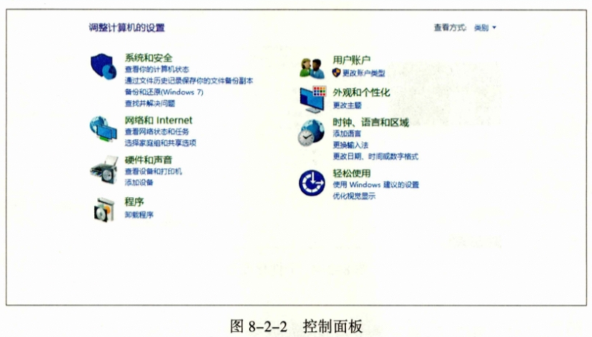


#### 知识点5：Windows设置的基本操作有哪些

> 1. 调整系统字体大小、显示分辨率（见图8-2-3）
>
>    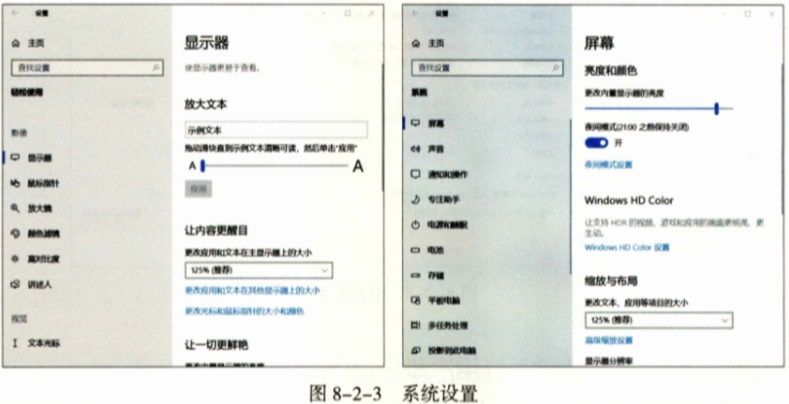
>
>    在“Windows设置”中单击“轻松使用”，选择左侧“显示器”菜单，通过拖动滑块实现系统字体的放大、缩小。单击“设置”中的“系统”，选择左侧“屏幕”菜单，单击屏幕下方的“显示器分辨率”下拉框，更改屏幕显示分辨率。
>
> 2. 更改桌面图标、背景和主题（见图8-2-4）
>
>    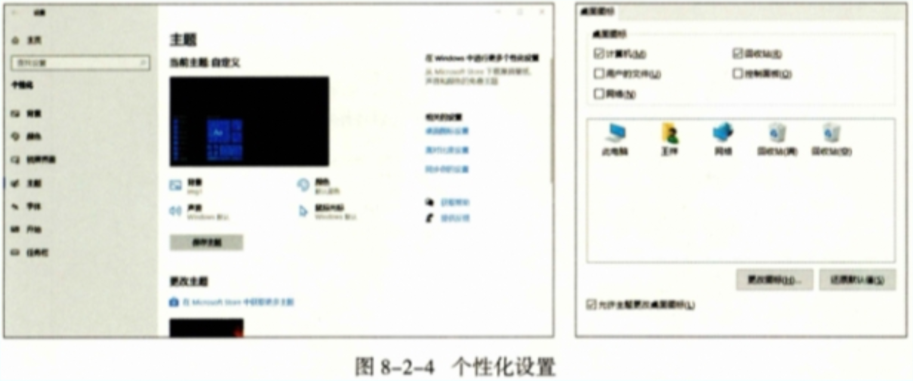
>
>    在桌面单击右键，选择“个性化”进入个性化设置，选择左侧“背景”菜单，可以更改桌面背景图片；选择左侧“主是”菜单，可以更改系统的主题；单击右侧“相关的设置”中的“桌面图标设置”，可以更改桌面系统功能图标显示。
>


#### 知识点6：如何查看计算机的系统版本等基本信息

> ​	右键单击“此电脑”，在快捷菜单中单击“属性”按钮，则打开如图8-2-5所示的系统属性对话框。
>
> 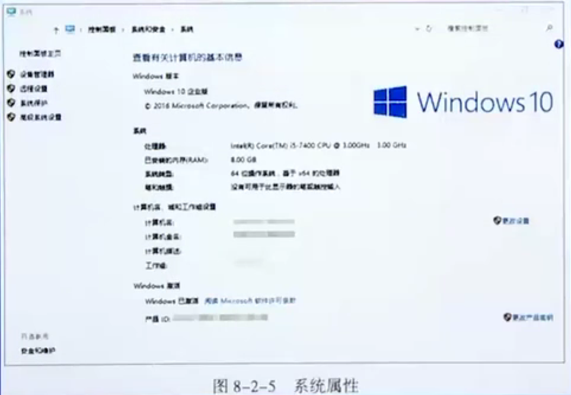


#### 知识点7：如何管理系统用户账户

> ​	用户账户是计算机使用者的身份凭证。Windows在一台计算机上可以建立多个用户账号，不同用户使用不同账号登录，可以尽量减少相互之间的影响。以下操作均需要以管理员的身份登录进行设置。
>
> 1. 创建用户
>
>    在“Windows设置”中单击“账户”图标。在“账户”界面左侧选择“其他用户”。在“其他用户”下方单击“将其他人添加到这台电脑”。输入新用户的账号信息，点击“下一步”并根据提示完成后续操作，此账户就被添加到计算机中了。
>
> 2. 更改用户
>
>    计算机管理用户通过“Windows设置”进入“账户”界面，可以更改用户图片；进入“登录选项”界面，可以更改登录密码。
>
>    计算机管理用户通过“控制面板”进入“用户账户”界面，可以更改账户类型和允许其他用户访问此计算机。
>
> 3. 删除用户
>
>    计算机管理用户通过“Windows设置”进入“账户”界面，在“其他用户”处，可以选中并删除用户。
>
>    计算机管理用户通过“控制面板”进入“用户账户”界面，点击“允许其他用户访问此计算机”，可以删除列表中已经存在的用户。


#### 知识点8：如何设置屏幕保护密码

> ​	屏幕保护密码是用户从屏幕保护状态转换到运行状态时，需要输入的账户密码。
>
> ​	设置屏幕保护密码的步骤为：打开“Windows设置”，单击“个性化”图标，选择“锁屏界面”，点击页面底部的“屏幕保护程序设置”，在打开的对话框中勾选“在恢复时显示登录屏幕”复选框，单击“确定”，如图8-2-6所示。
>
> 


#### 知识点9：如何设置系统音量和时间

> ​	在任务栏右侧单击“小喇叭”按钮，在弹出的“扬声器”窗口中通过拖动滑条实现音量调节；或者进入“控制面板”中“硬件和声音”界面的“声音”模块，根据需要调整设备或者具体应用程序的音量，如图8-2-7所示。
>
> 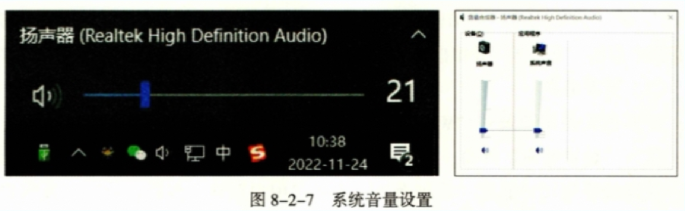
>
> ​	在“控制面板”的“时钟和区域”界面中单击“日期和时间”，打开“日期和时间”对话框，可以更改时区，调节年、月、日和时间等内容，如图8-2-8所示。
>
> 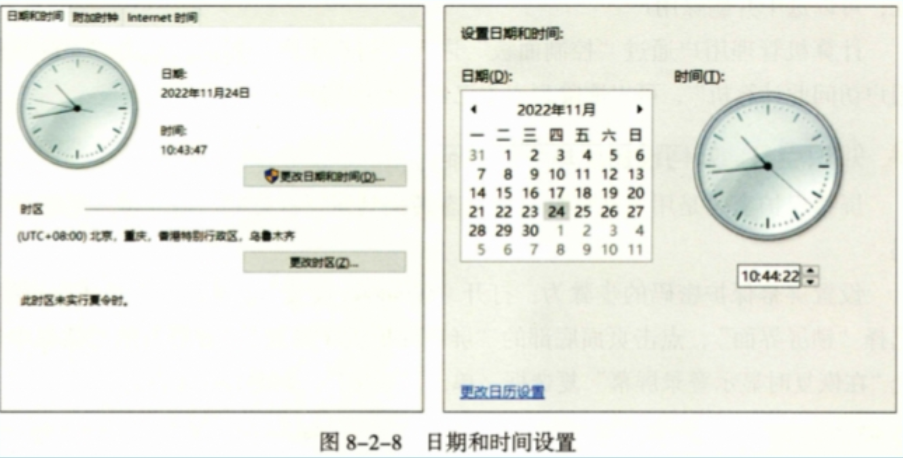


#### 知识点10：如何安装计算机软件

> ​	软件的安装分为两种：一种是不用安装的绿色软件，下载解压后可以直接使用；另一种是需要安装的软件，如Microsoft Office，双击setup.exe（有的软件双击install.exe）就可以安装。


#### 知识点11：常见的中文输入法有哪几种

> ​	广泛使用的中文输入法有拼音输入法、五笔字型输入法、二笔输入法、郑码输入法等。另外还有语音输入、手写输入、扫描输入等中文输入方法，但目前最常用的还是拼音输入法和五笔字型输入法。


#### 知识点12：什么是文件（文件夹）

> 1. 文件
>
>    打开计算机的任何一个窗口发现的最基本的元素是文件。文件用图标和名称表示。文件名包括两个部分：文件主名和扩展名。例如，某文件名显示为“南京训练总队.doc”，其中“南京训练总队”为文件主名，“.doc'为扩展名，表示文件的类型。
>
> 2. 文件夹
>
>    计算机的磁盘中可能有成千上万个文件，为避免混乱，可以把文件放到文件夹中。通常将内容相关的文件存放在一个文件夹中。


#### 知识点13：文件（文件夹）的基本操作有哪些

> 1. 建立文件夹
>
>    单击窗口中的“主页”选项卡，选择“新建文件夹”，该窗口显示增加了一个叫作“新建文件夹”的文件夹（见图8-2-9），输入一个新名称，按Enter键，文件夹建立完毕。以上操作也可以单击右键通过快捷菜单完成。
>
>    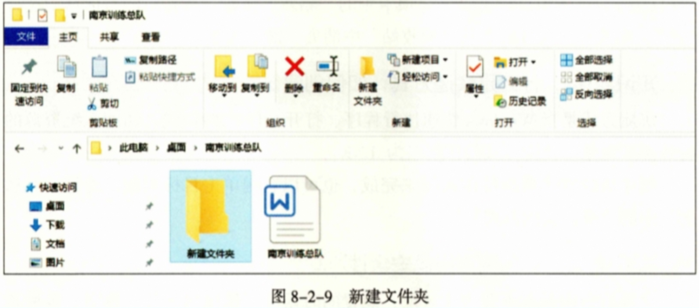
>
> 2. 重命名文件（文件夹）
>
>    选中需要重命名的文件（文件夹），在“主页”选项卡中选择“重命名”，文件（文件夹）名在框内突出显示，输入新名称，按Enter键，完成文件重命名。以上操作也可以右键单击文件（文件夹），通过快捷菜单完成。
>
> 3. 选中文件（文件夹）
>
>    单击第一个文件（文件夹），按下Shift键后单击最后一个文件（文件夹），可选中一组连续文件（文件夹）；单击第一个文件（文件夹），按下Ctrl键后，单击另一个文件（文件夹），可依次选中多个不连续文件（文件夹）；单击任一个文件（文件夹），在“主页”选项卡中单击“全部选择”按钮（或按下Ctrl+A键），即可选中全部文件（文件夹）。
>
> 4. 复制、移动、剪切文件（文件夹）
>
>    选中文件（文件夹），在“主页”选项卡中选择“复制”按钮，或按下Ctrl+C键，或单击右键选择“复制”命令，即执行“复制”命令；在目标位置窗口“主页”选项卡中选择“粘贴”按钮，或按下Ctrl+V键，或单击右键选择“粘贴”命令，即执行“粘贴”命令。将上述操作中的“复制”按钮改成“移动到”或“剪切”按钮，则实现移动、剪切文件（文件夹）。按下快捷键Ctrl+X键，即执行“剪切”命令。
>
> 5. 删除文件（文件夹）
>
>    选中文件（文件夹），在窗口“主页”选项卡中选择“删除”按钮（或按下Delete键），原有位置的文件（文件夹）就消失了，被放到了“回收站”中。“回收站”中的文件（文件夹）是可以被还原到原始位置的。选中文件（文件夹）后按下Shif+Delete键，或者在“回收站”中选中文件（文件夹），单击窗口“主页”选项卡中的“删除”按钮，在弹出的对话框中选择“是”，则文件（文件夹）从“回收站”中消失，被永久删除。


#### 知识点14：什么是快捷方式，如何创建快捷方式

> ​	快捷方式是指Windows快速执行程序、打开文件（文件夹）访问系统资源的特殊图形对象。快捷方式的扩展名为.LNK。
>
> ​	创建快捷方式可以使用向导来完成，也可以右键单击目标对象，选择（发送到中的“桌面快捷方式”。


#### 知识点15：如何提高密码安全性

> ​	设置的密码长度不要少于8位，设置的时候应尽量包含字母、数字、各种符号，如果区分大小写的话，还应交替使用大小写。此外，尽量不要使用周围人容易获取的信息作为密码，可以使用一些只有自己知道的字符，以增加密码的破解难度；经常更换密码，降低密码被破解的概率。


### 第三节 文字处理软件的功能和使用

【知识要点】

1. 1.文字处理软件的功能和种类。

2. Word文档基本操作。
3. Word文字编辑和排版。


#### 知识点1：什么是文字处理软件

> ​	文字处理软件属于办公软件的一种，一般用于文字的编辑和排版。文字处理软件的发展和文字处理的电子化是信息社会发展的标志之一。下面以Word 2019为例进行说明。


#### 知识点2：如何创建Word文档

> 1. 在Word文档窗口中建立文档
>
>    在主页左侧选择“新建”，点击“空白文档”，则新建并打开“文档1”。单击“文件”菜单中的“新建”按钮，选择“空白文档”，系统建立“文档2”。
>
> 2. 通过快捷菜单建立文档
>
>    选定保存文件的位置。单击右键弹出快捷菜单，在“新建”中选择“DOC文档”，则会在当前位置出现文档，名称为“新建DOC文档.doc”。


#### 知识点3：如何给Word文档加密

> ​	可以通过“另存为”功能和“信息”功能两种方式为Word文档设置相应的密码，加强文档的安全性。
>
> 1. 通过“另存为”功能为Word文档设置密码
>
>    打开需要加密的Word文档，选择“文件”菜单中的“另存为”，出现“另存为”对话框，在底部“工具”中选择“常规选项”，出现“常规选项”对话框，如图8-3-1所示。
>
>    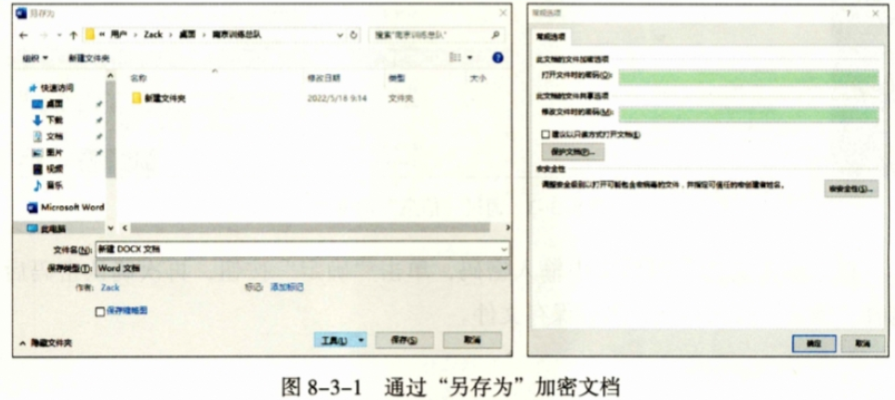
>
>    在“常规选项”对话框中，分别在“打开文件时的密码”和“修改文件时的密码”框中输入密码。两种密码可以相同也可以不同，再次确认后按“确定”。
>
>    如果同时设置了打开密码和修改密码，在打开文档时，则需要同时输入打开密码和修改密码，系统出现如图8-3-2所示的提示。如果只设置了修改密码而没有设置打开密码，则在打开文档时，只会提示输入修改文件所需的密码。如果用户输入了正确的密码，则打开文档后可以对该文档进行修改，否则该文档只能以只读方式打开。
>
>    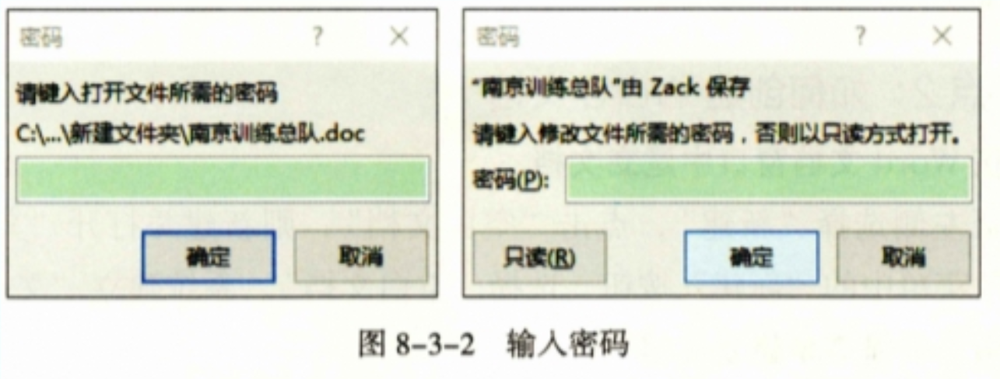
>
> 1. 通过“信息”功能为Word文档设置密码
>
>    打开需要加密的Word文档，选择“文件”菜单的“信息”按钮，在“信息”对话框中选择“保护文档”，在弹出的菜单中选择“用密码进行加密”，如图8-3-3所示。
>
>    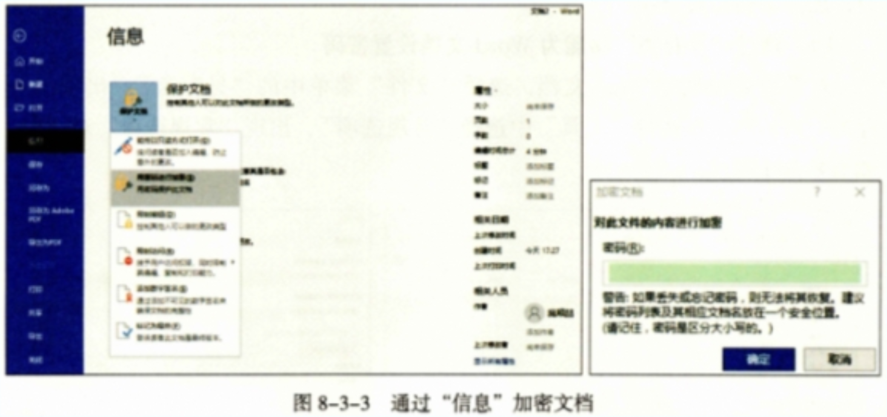
>    
>    在“加密文档”对话框中输入密码，单击“确定”按钮，再次确认密码后，选择“确定”按钮退出，最后保存文件。


#### 知识点4：如何进行打印设置

> ​	打印前要确保打印机已经连接到主机端口上，电源接通并开启，打印纸已装好；确保所用打印机的打印驱动程序已经安装完成。在正式打印之前，通常应按照设置好的页面格式进行打印预览，以查看最后的打印效果，可以按照以下方法操作。单击“文件”菜单，选择“打印”命令，在页面右侧会出现打印预览窗口，在“设置”界面可以选择打印的范围，包括所有页、选定区域、当前页面或自定义打印范围。在“份数”框中设置打印的份数，确认无误后开始打印。


#### 知识点5：如何进行文字的查找和替换

> ​	使用查找功能可以快速定位到指定字符处，使用替换功能可以快速修改指定的文字。单击“开始”菜单下“编辑”标签中的“高级查找”按钮，弹出“查找和替换”对话框（见图8-3-4）。在“查找内容”框内输入要搜索的文本，如“计算机”，单击“查找下一处”按钮，则开始在文档中查找。单击“替换”选项卡，在“替换为”框内输入要替换的文字，单击“替换”，则被选中内容被替换，下一个查找到的内容被选中。如果确定要将查找的全部字符串进行替换，单击“全部替换”按钮。
>
> 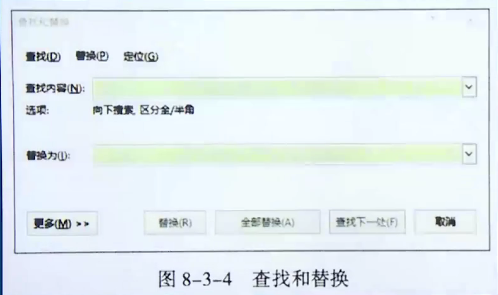


#### 知识点6：如何撤销和恢复操作

> ​	在编辑的过程中如果出现误操作，可以单击标题栏左侧的撤销按钮（见图8-3-5）或执行Ctrl+Z组合键命令。
>
> 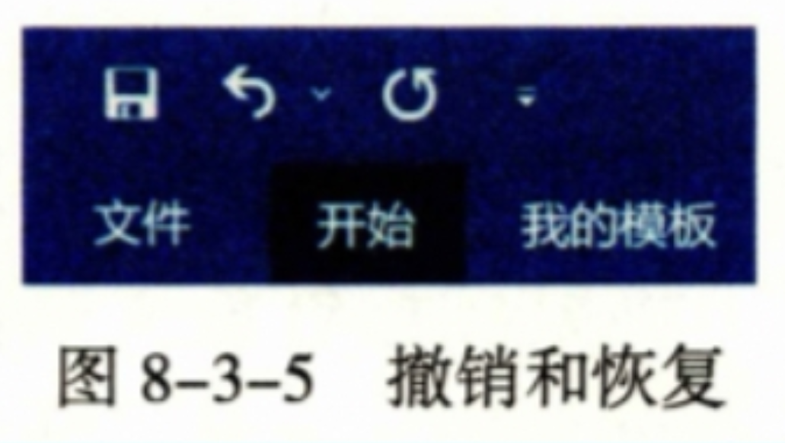
>
> ​	单击标签上恢复按钮可实现恢复操作，方法与撤销操作基本类似。


#### 知识点7：如何对文字（字符）进行排版

> ​	排版是指对文字（字符）的字体、大小、颜色、显示效果等格式进行设置。
>
> ​	选中需要排版的文字（字符），在“开始”菜单“字体”标签中选择对应命令进行快捷编排，或者单击“字体”标签右下角箭头，在弹出的“字体”对话框中设置，如图8-3-6所示。完成设置后单击“确定”。
>
> ​	在“字体”对话框中的“高级”选项卡中还可以对文字（字符）的间距进行设置。
>
> 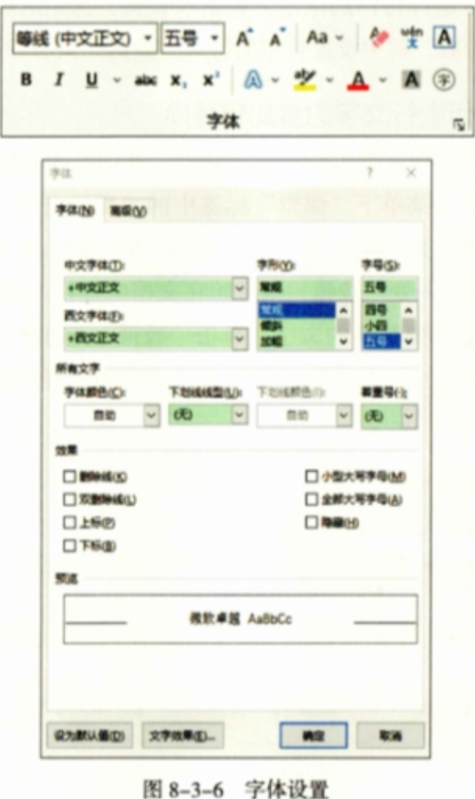


#### 知识点8：如何对段落进行排版

> ​	在文档中执行回车可以进行分段，段落排版主要包括段落对齐、段落缩进、段落间距、段落的边框和底纹等的设置，可按照以下方法操作。
>
> ​	将鼠标指针放入到段落中，在“开始”菜单“段落”标签中选择对应的编排命令进行快捷编排，或者单击“段落”标签右下角箭头，在弹出的“段落”对话框中设置，如图8-3-7所示。通过对“缩进和间距”选项卡中各种参数的设置完成段落设置操作后，单击“确定”
>
> 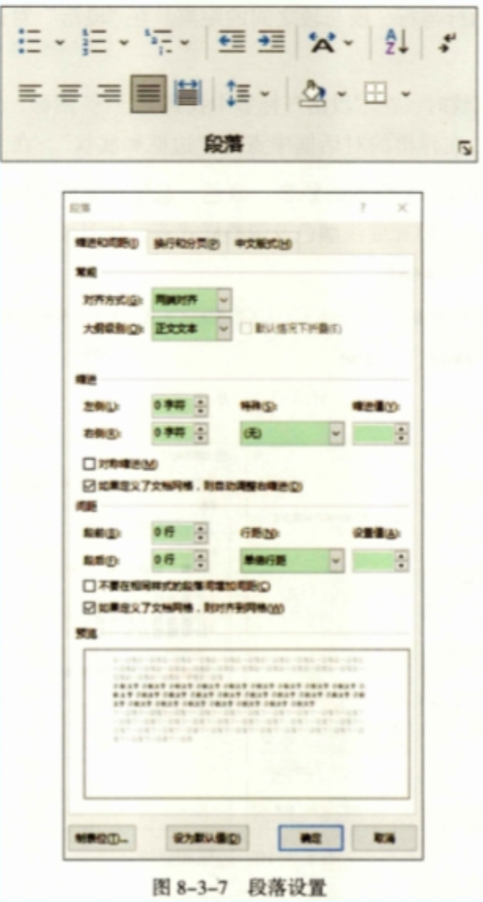
>
> ​	段落的对齐方式包括左对齐、居中、右对齐、两端对齐和分散对齐，操作时可在“段落”对话框中“常规”项的“对齐方式”中设置。单击“段落”标签中相应的按钮（见图8-3-8）也可完成段落对齐设置。
>
> 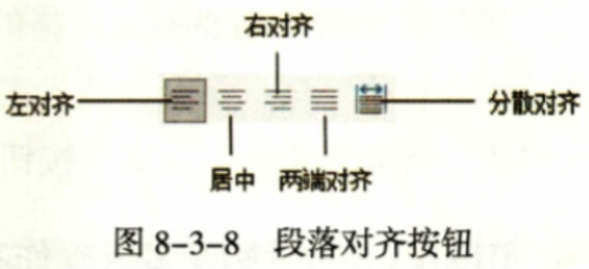
>
> ​	段落缩进在“段落”对话框中“缩进”项中设置。拖动水平标尺相应的游标也可设置左缩进、右缩进、首行缩进和悬挂缩进，如图8-3-9所示。首行缩进控制段落中第一行第一字的起始位，一般为两个字符。悬挂缩进控制段落中首行以外的其他行的起始位。左缩进和右缩进控制段落左边界和右边界的位置。
>
> ​	段落间距表示行与行、段与段之间的距离。在“段落”对话框“间距”项中设置。
>
> ​	设置边框和底纹时，在“段落”标签中找到 ![](img/QQ20260614-204859.png" style="zoom:25%;" /> 图标，此图标的名称为边框，点击小箭头。在弹出的对话框中点击“边框和底纹”。在“边框”和“页面边框”选项卡中可以调节框线的线型、颜色、宽度，也可以调整应用的对象。在“底纹”选项卡中可以填充底纹颜色及调整样式等，如图8-3-10所示。
>
> 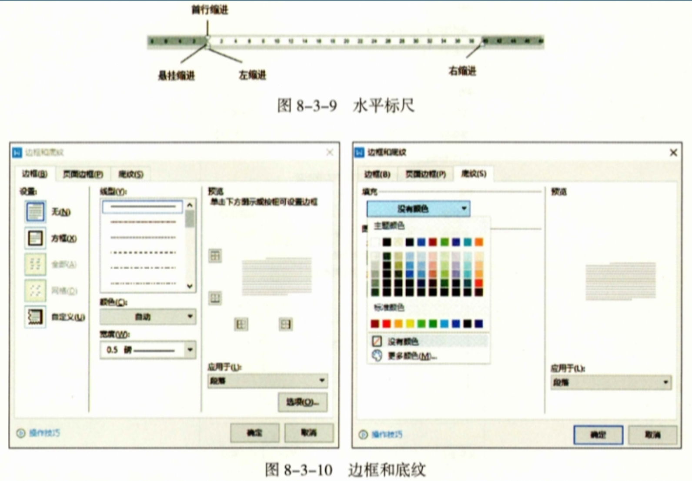


#### 知识点9：如何在文档中建立表格

> ​	移动鼠标指针到要插入表格的位置，在“插入”菜单下的“表格”标签中选择“插入表格”项，打开“插入表格”对话框，如图8-3-11所示。在对话框中输入列数、行数，单击“确定”按钮。
>
> 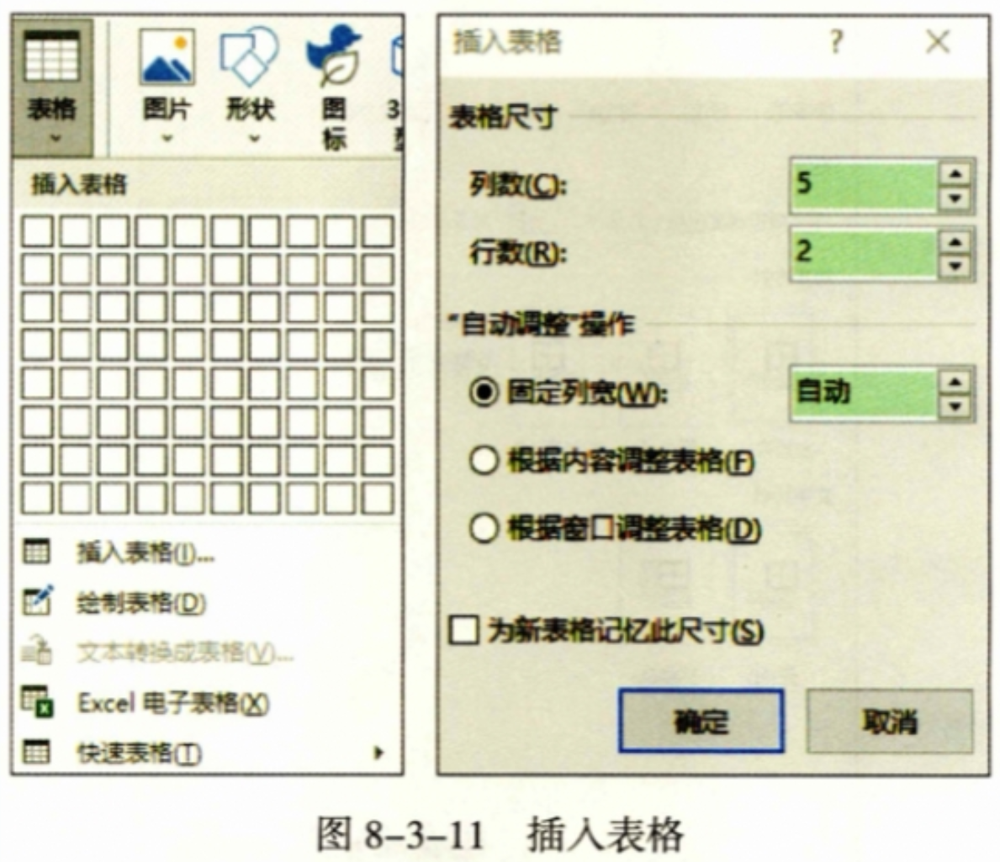


#### 知识点10：表格编辑操作有哪些

> ​	在文档中插入一个空表格后，单击鼠标可将插入点定位在某单元格，即可进行文本输入。对单元格中已输入的文本内容可进行复制、移动和删除，与一般文本的操作相同。
> ​	表格编辑操作主要包括：选定单元格，插入、删除行或列单元格，拆分、合并单元格等。


#### 知识点11：如何调整表格尺寸

> ​	选定需要改变行高的一行或多行，在“布局”菜单（见图8-3-12）的“单元格大小”标签中进行调整。也可单击右键，在下拉菜单中选择“表格属性”，弹出“表格属性”对话框（见图8-3-13），单击“行”选项卡或“列”选项卡，选中“指定高度”或“指定宽度”复选框，在其后的数值框中输入设置值。
>
> 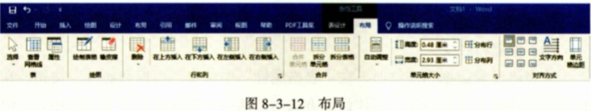
>
> 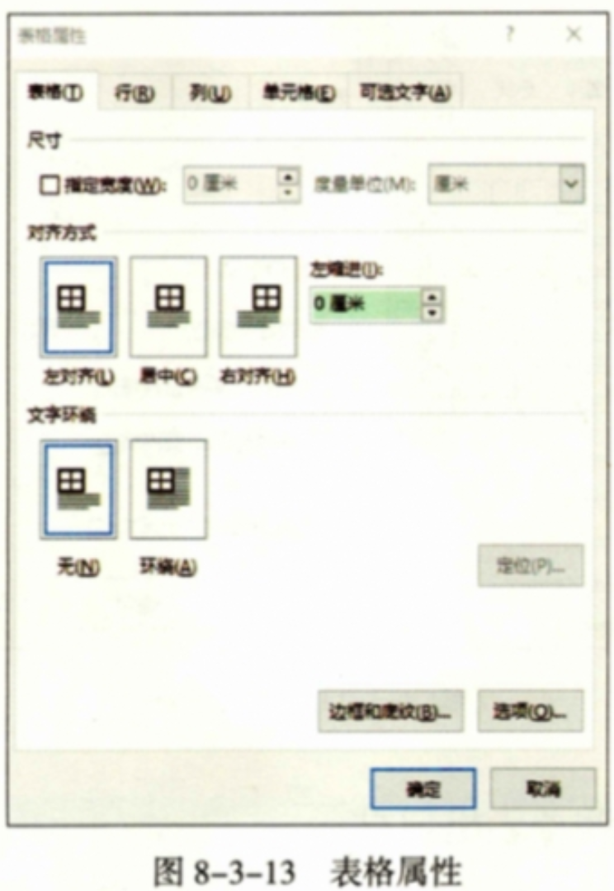
>
> ​	要使多行、多列或多个单元格具有相同的高度、宽度时，可选定这些行、列或单元格，单击右键，在下拉菜单中选择“平均分布各行”或“平均分布各列”，也可在“布局”菜单的“单元格大小”标签中选择相同按钮，Word将按照整张表的宽度、高度自动调整行高、列宽。
> ​	如果没有明确的数值要求时，也可以将鼠标指针移到要调整行高或列宽的行边框、列边框上，当指针变为双向箭头时，按住左键拖动到理想的高度或宽度后，松开左键完成操作


#### 知识点12：如何对表格内容进行排版

> 1. 对齐方式
>
>    选定要设置文本对齐方式的单元格。单击右键弹出快捷菜单，单击“表格属性”，在弹出的对话框中选择所需的对齐格式；或者在“布局”菜单的“对齐方式”标签中进行调整。
>
> 2. 边框和底纹
>
>    给表格设置边框和底纹时，在“表格属性”中单击“边框和底纹”按钮，在打开的对话框中进行设置，具体设置方法与段落的边框和底纹设置方法相同，但应在“应用于”选项中选择“表格”。或者在“表设计”菜单的“边框”标签中单击打开“边框”菜单，在打开的菜单中进行设置。
>
> 3. 文字方向
>
>    选择要改变文字方向的单元格，单击右键弹出快捷菜单，执行“文字方向”命令，在弹出的“文字方向”对话框中选择所需的文字方向，如图8-3-14所示。
>
>    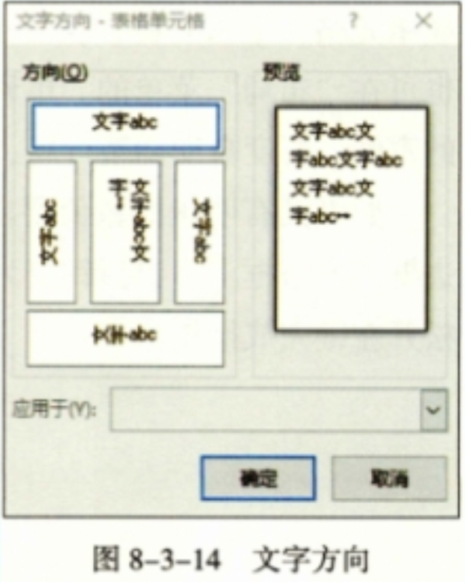
>
> 4. 自动套用格式
>
>    在表格内任意处单击，在“表设计”菜单的“表格样式”标签中选择合适的样式即可，如图8-3-15所示。
>
>    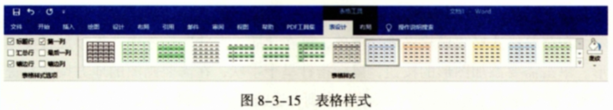
>
> 5. 绘制斜线表头
>
>    单击要添加斜线表头的表格。在“表设计”菜单的“边框”标签点击“边，框”，在弹出的下拉菜单中根据需要选择斜下框线”或“斜上框线”。在单元格中输入所需的行、列标题，通过空格、回车调整标题显示位置。行、列标题也可通过插入文本框的形式调整显示的位置。


#### 知识点13：如何在文档中插入图片

> ​	在“插入”菜单的“插图”标签中单击“图片”，选择对象的来源，找到待插入的图片后，单击“插入”，该图片就会出现在文档中。
>
> ​	在“格式”菜单的“排列”标签中单击“环绕文字”，可以设置图片和文字的相对位置，包括嵌入式、环绕式和浮衬式等。嵌入式指文字排列在图片的上方与下方；环绕式指文字排列在图片的四周，把图片包围起来；浮衬式指图片浮于文字上方或衬于文字下方。
>
> ​	单击各功能按钮可以完成不同格式设置。裁剪工具可以实现对图片的剪裁，将鼠标指针移到“裁剪”按钮上，按下左键，指针形状与“裁剪”按钮上的图形相同，拖动鼠标，在图片上会出现一个虚框，虚框表示裁剪后图片的剩余部分。


#### 知识点14：如何在文档中插入艺术字

> ​	先定位好插入艺术字的位置。在“插入”菜单的“文本”标签中单击“插入艺术字”，选择艺术字样式后，单击“形状格式”菜单（见图8-3-16）。在菜单下
>
> 
>
> ​	“艺术字样式”标签中对艺术字的内容、轮廓、效果进行调整。
> 图8-3-16 形状格式


#### 知识点15：如何在文档中插入图形

> ​	单击文档中要创建绘图的位置。单击“插入”菜单的“插图”标签中的“形状”，在下拉菜单底部选择“新建画布”弹出“绘图画布”区域，在该区域上可绘制多个形状。若删除画X布，可以选中后按Delete键。
>
> ​	在菜单栏选择“形状格式”菜单，可在“插入形状”标签中选择添加各类图形。单击需要添加图形的按钮，鼠标指针呈十字状，在需要画图的地方按住左键不放，然后拖动鼠标向某方向移动，直到合适的长度，放开左键。
>
> ​	利用“绘图”菜单可以绘制各种图形，还可以插入画布。


#### 知识点16：如何编辑图形

> ​	可以对图形的大小、颜色、阴影、三维效果等进行修改。修改前先选定图形对象，然后单击“形状格式”菜单栏“形状样式”标签中的相应按钮即可。
>
> 1. 形状填充工具可以为图形修改填充颜色、纹理等。
> 2. 形状轮廓工具可以为图形修改线条粗细、颜色和样式等。
> 3. 形状效果工具可以给图形增加或取消阴影、映像、发光、柔化边缘、棱台、三维旋转等特效。


#### 知识点17：如何在文档中插入文本框

> ​	文本框是一种可移动、可调大小的文字或图形容器。使用文本框，可以在一页上放置数个文字块，或使文字按与文档中其他文字不同的方向排列。
>
> 1. 把现有的内容纳入文本框
>
>    选取准备纳入文本框的所有内容。单击“插入”菜单的“文本”标签中的“文本框”按钮，在下拉菜单中选择“绘制横排文本框”或“绘制竖排文本框”
>
> 2. 插入空文本框，
>
>    在无内容选择时，将鼠标指针移动至需要插入文本框的位置，单击“插入”菜单的“文本”标签中的“文本框”按钮，选择要插入的文本框样式，这时插入点已移到空文本框处，可以直接输入文本框内容。
>
> 3. 编辑文本框
>
>    文本框具有图形属性，编辑方法与图形相同。


#### 知识点18：什么是视图

> ​	每一种显示方式称为一种视图。Word提供了多种视图，其中页面视图是最常用的方式。
>
> 1. 阅读视图
>
>    阅读视图以书页的形式显示文档。页面被设计成填满屏幕，使得文档更易于阅读。
>
> 2. 页面视图
>
>    页面视图是Word默认视图，可以显示整个页面的分布情况和文档中的所有元素。在页面视图方式下，所显示的效果反映了打印后的真实效果，即“所见即所得”。
>
> 3. Web版式视图
>
>    Web版式视图方便查看网页形式的文档外观，如果文档中包含宽表，也非常适合使用此视图。
>
> 4. 大纲视图
>
>    在大纲视图中，可以折叠文档，只查看主标题；或者扩展文档，以便查看整个文档。
>
> 5. 草稿视图
>
>    草稿视图取消了页面边距、分栏、页眉、页脚和图片等元素，仅显示标题和正文，是最节省计算机系统硬件资源的视图方式。


#### 知识点19：如何进行页面设置

> ​	页面设置（排版）一般选择在页面视图中完成。打开“布局”菜单，单击“页面设置”标签右下角箭头，弹出“页面设置”对话框（见图8-3-17）。在“页面设置”对话框中单击“页边距”选项卡，在相应的框中输入数值，设置正文与纸张边缘的距离。若只修改文档中一部分文本的页边距，可在“应用于”框中设置。在“纸张方向”项中可选择纸张的方向。
>
> 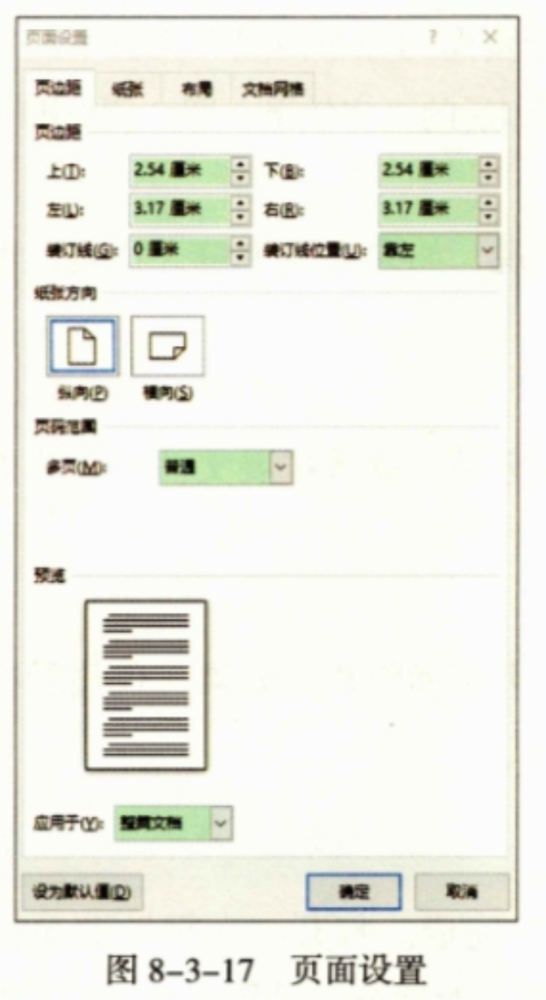


#### 知识点20：如何设置页眉和页脚

> ​	页眉和页脚包含文件（书）名、章节名、页码、日期等信息，页眉打印在页面顶部区域，而页脚打印在页面底部区域。在文档中可自始至终使用同一个页眉或页脚，也可在文档的不同部分用不同的页眉和页脚。
>
> 1. 创建页眉和页脚
>
>    选择“插入”菜单下的“页眉和页脚”标签，选择“页眉”或“页脚”中的“编辑页眉”或“编辑页脚”，弹出页眉、页脚编辑区。
>
> 2. 在文档的不同部分创建不同的页眉和页脚
>
>    在文档的不同部分创建不同的页眉和页脚，需要将文档分成多节来设置。
>
>    将鼠标指针移到需要分节的位置。选择“布局”菜单的“页面设置”标签中的“分隔符”按钮，弹出下拉菜单，如图8-3-18所示。在“分节符”选择框中选择下一节的起始位置：“下一页”表示从下一页上开始新节；“连续”表示上、下节内容紧接，在同一页上开始新节；“偶数页”表示从下一偶数页开始新节；“奇数页”表示从下一奇数页开始新节。
>
>    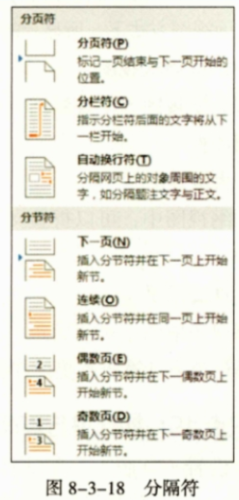
>    
>    单击“插入”菜单的“页眉和页脚”标签中的“页码”命令，选择“设置页码格式”，弹出“页码格式”对话框（见图8-3-19），选中“起始页码”项，断开当前节与前一节页眉和页脚间的连接，设置当前节起始页码。
>    
>    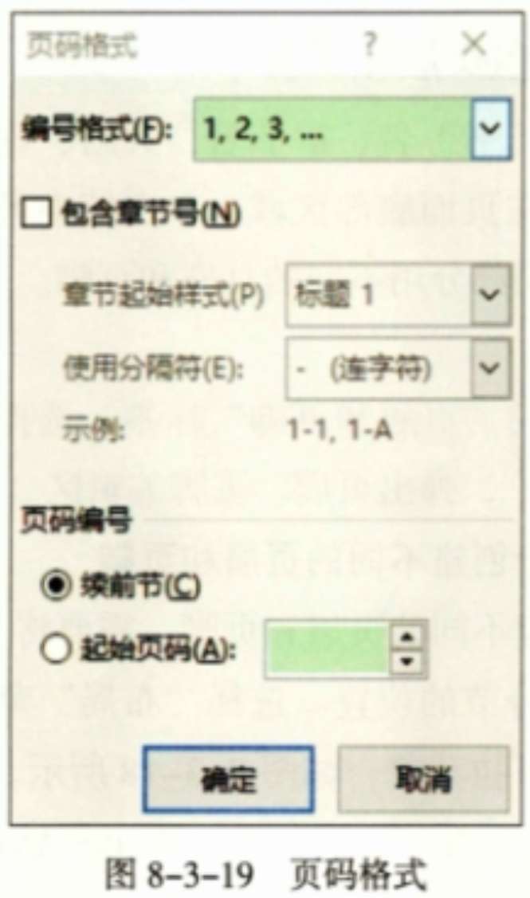


#### 知识点21：如何设置页码

> ​	如果在页眉或页脚中只需要包含页码，按照以下步骤操作。
> ​	单击“插入”菜单的“页眉和页脚”标签中的“页码”按钮，在下拉菜单中选择插入页码的位置、页边距等信息。单击“设置页码格式”按钮设置页码的格式等。设置完成后单击“确定”按钮。


### 第四节 电子表格软件的功能和使用

【知识要点】

1. 电子表格软件的功能和分类。

2. Excel的新建、保存、打印等基本操作。
3. 数字、公式以及单元格的基本操作。


#### 知识点1：什么是电子表格，常用的电子表格软件有哪些

> ​	电子表格又称电子数据表，是一类模拟纸上计算表格的计算机程序。它会显示由一系列行与列构成的网格。单元格内可以存放数值、计算式或文本。电子表格可以输入输出、显示数据，也可以利用公式实现一些简单的加减法计算。
> ​	下面以Excel 2019为例进行说明。


#### 知识点2：Excel有哪些基本功能

> ​	简单来说，Excel的功能包括表格处理、数据库管理和图表处理。
>
> 1. 建立与编辑表格。
> 2. 设置表格格式。
> 3. 管理表格数据并快速进行表格数据的加工与处理。
> 4. 管理数据（数据库管理）。
> 5. 绘制图表。


#### 知识点3：工作簿、工作表和单元格之间有什么关系

> 1. 工作簿是Excel文件，是扩展名为.XLSX的文件。工作表是工作簿的基本组成单位，工作表由256列、65536行构成。单元格是工作表的组成元素，是工作表中行、列交叉位置处的方框。每个单元格都有单元格地址名（名称），它由单元格列号与行号组成。
> 2. 工作簿、工作表和单元格的关系是单元格组成工作表，工作表组成工作簿。工作表中的单元格数量是固定的--16777216个，工作簿中的工作表数是1~255个。


#### 知识点4：如何给Excel文档加密

> ​	Excel文档都可以通过“文件”菜单中的“另存为”功能和“信息”功能两种方法实现设置密码和修改密码的操作，具体操作方法与Word文档的类似。


#### 知识点5：如何进行打印设置

> 1. 设置打印区域
>
>    设置打印区域，可以只将工作表的某一部分打印出来，可按照以下方法操作。
>
>    选定工作表，选择需要打印的区域。单击“文件”菜单的“打印”按钮，出现“打印”对话框。在“打印”对话框中的“设置”框内，选择“打印选定区域”就可只打印指定区域。
>
> 2. 分页
>
>    打印工作表时需要对工作表中的某些内容进行强制分页，一般要在工作表中插入分页符，包括垂直的人工分页符和水平的人工分页符。
>
>    选定要开始新页的单元格，如果是垂直分页，选定的单元格应属于“A”列；如果是水平分页，选定的单元格应属于第一行。选择“页面布局”菜单下“页面设置”标签中的“分隔符”，在下拉菜单中单击“插入分页符”按钮，可实现人工分页。单击“删除分页符”按钮就可以删除人工分页符。
>
> 3. 打印预览
>
>    打印预览看到的内容和打印到纸张上的结果是一样的，打开“页面设置”对话框，在“页面”选项卡下方选择“打印预览”按钮，或者在“文件”菜单下单击“打印”按钮，屏幕右侧就会显示打印预览状态。
>
> 4. 打印
>
>    预览完后，当设置符合用户要求时，可以单击“打印”按钮，屏幕会显示打印对话框。在“设置”栏中选择“打印活动工作表”，可打印整张工作表。在“页数”栏可设定需要打印页的页码，在上方“份数”栏中选择打印的份数。


#### 知识点6：工作表的基本操作有哪些

> ​	建立、保存和打开Excel文档的方法与Word文档的操作方法相同，图8-4-1为Exce1文档“工作簿”窗口。
>
> 
>
> ​	新建的工作簿文件会同时新建Sheet1、Sheet2和Sheet3三张空工作表。每张工作表由行和列构成，行号在屏幕中自上而下由数字编号，列号由左到右以字母编号。
>
> ​	工作表的常见基本操作主要包括：添加、删除、重命名、移动或复制等。


#### 知识点7：如何输入数据

> ​	可直接在单元格或编辑栏输入数据。
>
> 1. 选中需要输入数据的单元格，使其成为活动单元格。
> 2. 输入数据并按Enter键或Tab键。
> 3. 重复步骤（2）直至输完所有数据。


#### 知识点8：如何自动填充数据

> ​	通过自动填充数据的方式填充数据可以提高数据输入效率。可将选定单元格中的内容复制到同行或同列中的其他单元格，也可以通过“开始”菜单的“编辑”标签上的“填充”命令按照指定的“序列”自动填充数据。


#### 知识点9：Excel中的运算符类型有哪些

> ​	Excel包含4种类型的运算符：算术运算符、
> 比较运算符、文本运算符和引用运算符。


#### 知识点10：什么是公式

> ​	公式可以对工作表中的数据进行加、减、乘、除等运算。公式可以由值、函数或运算符等组成。公式的特征是必须以“=”开始，一般在编辑栏输入。


#### 知识点11：如何输入公式

> 1. 选定要输入公式的单元格。
>
> 2. 在单元格或编辑栏中输入“=”
>
> 3. 输入设置的公式，按Enter键完成。
>
>    例如，人员补助的计算方式为：每一年工龄乘以2加上工资的18%的总和，则对张三的补助计算公式见编辑栏，其余人员的补助可以利用自动填充方式快速完成，如图8-4-2所示。
>    
>    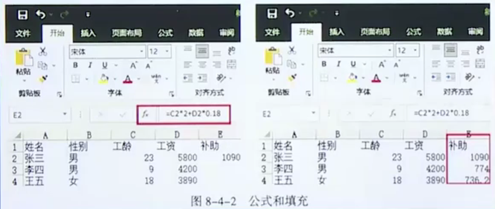


#### 知识点12：Excel中常用的函数有哪些

> ​	Excel提供了大量的函数，可以加快数据的录入和计算速度。Excel中的函数有求和（SUM）、求平均值（AVERAGE）、求最大值（MAX)、求最小值（MIN)等。


#### 知识点13：如何操作使用求和、求平均值函数

> 1. 求和函数
>
>    函数格式为SUM（numberl，number2，....）。括号内是所求和的若干个参数。该函数的功能是对所划定的单元格或区域进行求和。例如，在F1单元格中输入“总额”，要求得每名人员的总额，应按照以下步骤操作。单击第一名人员“总额”所在的F2单元格；单击“公式”菜单中“函数库”标签下“插入函数”命令；单击“选择函数”列表框中的“SUM”选项；单击“确定”按钮，显示如图8-4-3所示的“函数参数”对话框。
>
>    Excel会根据活动单元格所在位置与行和列的关系，自动赋予Number1一个求值范围。用鼠标在表中选定区域后，单击“确定”（见图8-4-4），完成总额求和。
>
>    其余人员的总额可以利用自动填充方式快速完成，如图8-4-5所示。
>
>    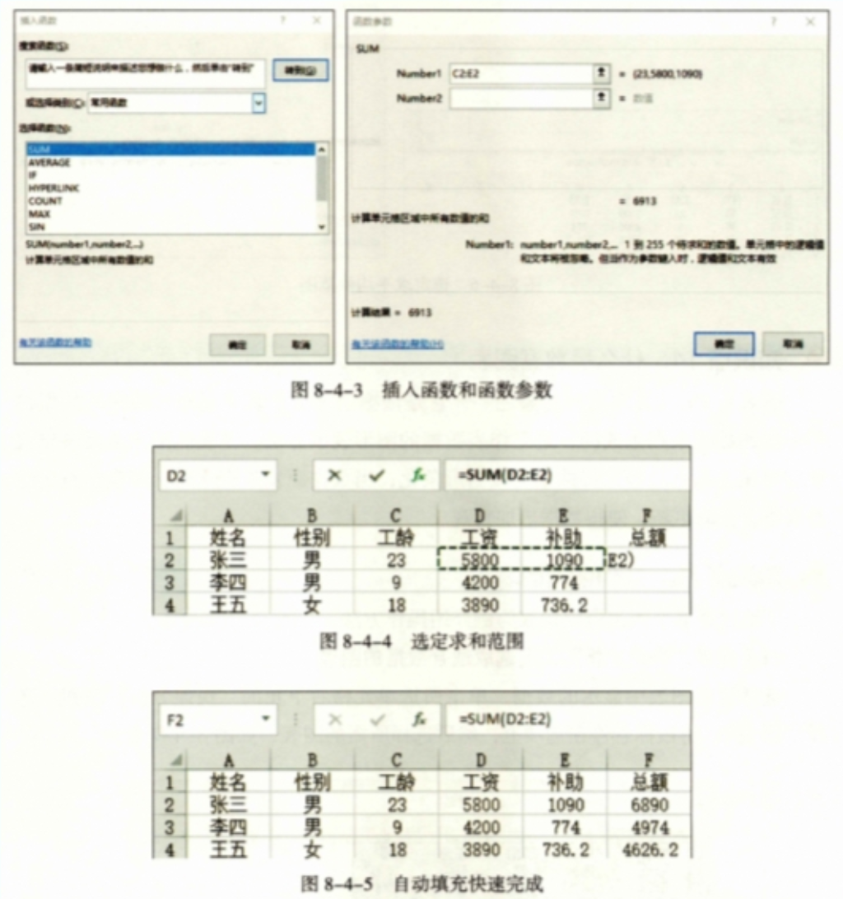
>
> 2. 平均值函数
>
>    函数格式为AVERAGE（numberl，number2，....）。
>
>    求平均值函数要求参数必须是数值。求平均值的步骤同求和基本相同。例如，求图8-4-6中3人工资的平均值并将其放入B5单元格中。
>
>    单击D5单元格为活动单元格；然后单击工具栏中的“插入函数”按钮，在“选择函数”列表框中选择“AVERAGE”选项，单击“确定”按钮后，弹出“函数参数”对话框，单击右侧折叠按钮，用鼠标选中3个工资值所在的单元格，单击“确定”，在D5单元格中显示平均值。
>    
>    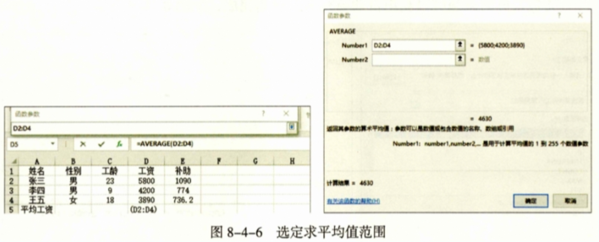


#### 知识点14：什么是数据图表

> ​	图表是Excel最常用的对象之一，它是依据选定工作表单元格区域内的数据按照一定的数据系列生成的，是工作表数据的图形表示方法。图表能形象地反映出数据的对比关系及趋势，将抽象的数据形象化，当数据源发生变化时，图表中对应的数据也会自动更新，使得数据更加直观。


#### 知识点15：如何创建图表

> ​	下面以建立3人工资值图表为例介绍操作方法。
>
> 1. 使用“快速分析”工具选取适合数据的图表
>
>    选择要在图表中显示的数据，单击所选单元格右下角的“快速分析”按钮，选择“图表”，将鼠标悬停在选项上，然后选择所需的图表，如图8-4-7所示。
>
>    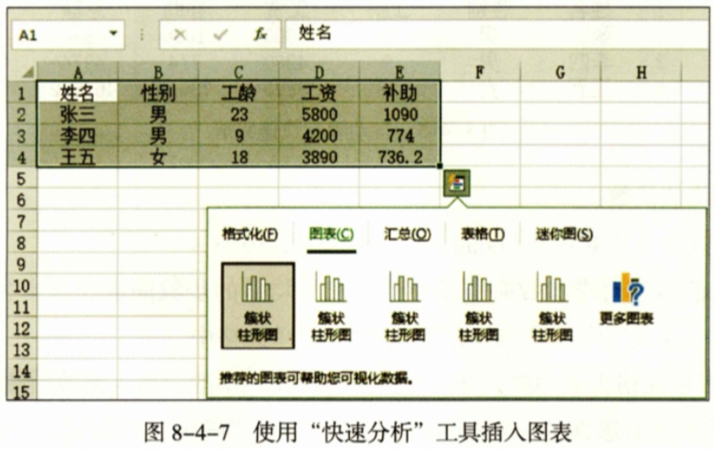
>
> 2. 使用图表向导创建图表
>
>    单击“插入”菜单中“图表”标签右下角的小箭头。弹出“插入图表”对话框，在“所有图表”选项卡下选择“柱形图”选项，在右侧选择“簇状柱形图”，并选择任意一种图形，单击“确定”按钮，即可在当前工作表中创建一个图表，如图8-4-8所示。
>
>    图表创建完成后，可以选择“图表标题”文本框，根据图表名称更改标题文字，如图8-4-9所示。
>
>    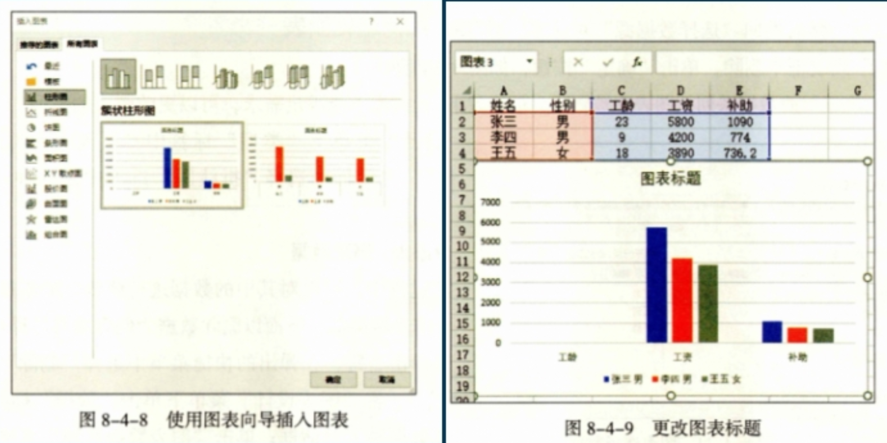
>    
>    对图表样式、布局、数据、类型、位置等信息的更改可在“图表设计”菜单中设置，如图8-4-10所示。
>    
>    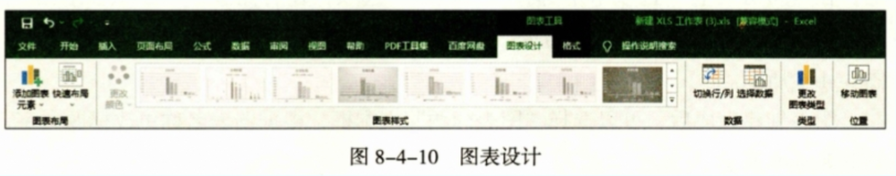


#### 知识点16：如何编辑图表

> 1. 更改图表类型
>
>    如果创建的图表类型不能满足需求，可以更改图表的类型。
>
>    单击“图表设计”菜单下“类型”标签中“更改图表类型”按钮，在弹出的“更改图表类型”对话框中选择“折线图”选项中的一种，然后单击“确定’按钮。
>
> 2. 在图表中添加/删除数据
>
>    在使用图表的过程中，可以对其中的数据进行修改，如添加或删除数据等。添加与删除数据的操作步骤类似，下面以删除数据为例介绍具体操作步骤。
>
>    选择第4行并单击右键，在弹出的快捷菜单中选择“删除”选项，删除第4行中的数据；选择图表，在“图表设计”菜单下单击“数据”标签中的“选择数据”按钮，弹出“选择数据源”对话框；单击“图表数据区域”文本框右侧的按钮，选择A1：E3单元格区域，然后返回“选择数据源”对话框，可以看到“王五”数据已从“图例项（系列）”列表框中删除，单击“确定”按钮，如图8-4-11所示。
>
>    此时可以看到“王五”的数据系列从图表中被删除，最终效果如图8-4-12所示。
>
>    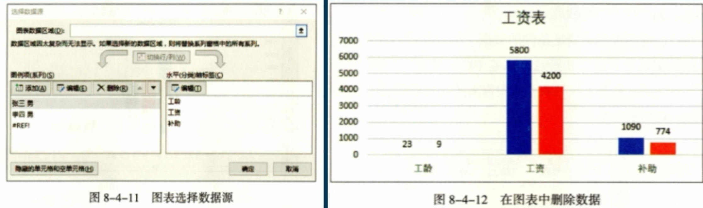
>
> 3. 调整图表大小
>
>    创建图表后还可以根据实际需要调整图表的大小。
>
>    1. 拖曳调整图表大小。选择图表，图表周围会出现8个控制点，将鼠标指针放置在控制点上，当鼠标指针变成调整形状时按住鼠标左键并拖电控制点，即可调整图表的大小。
>    2. 精确调整图表大小。如果要精确调整图表的大小，可以在“格式”菜单下“大小”标签中的“高度”和“宽度”微调框中输入图表的高度和宽度数值，按Enter键确认。


#### 知识点17：如何将数据排序

> ​	Excel排序功能可以实现对数据的排序，对上例中的数据进行排序的操作步骤如下。
>
> 1. 单击数据区域任一个单元格，单击“数据”菜单下“排序和筛选”标签中的“排序”按钮，弹出如图8-4-13所示的“排序”对话框。
> 2. 选择“列”“排序依据”和“次序”中的各个选项，单击“确定”按钮。若排序的单元格值相同时，可以对其他两个关键字再次排序。
>
>    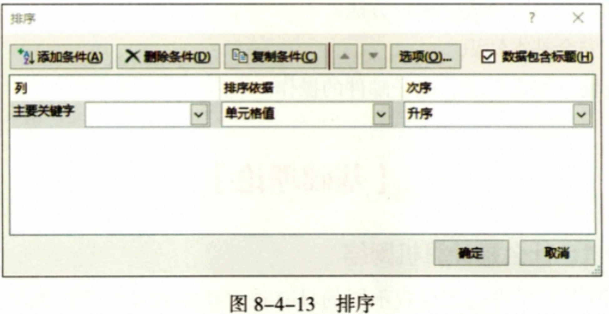


#### 知识点18：如何自动筛选

> ​	数据的自动筛选可实现显示满足条件的数据，暂时隐藏不满足条件的数据。
>
> ​	单击“数据”菜单下“排序和筛选”标签中的“筛选”按钮，在所需筛选的标题名右侧出现三角标记，单击下拉列表，选中需要筛选的确切值（见图8-4-14），单击“确定”按钮，弹出筛选结果。
>
> 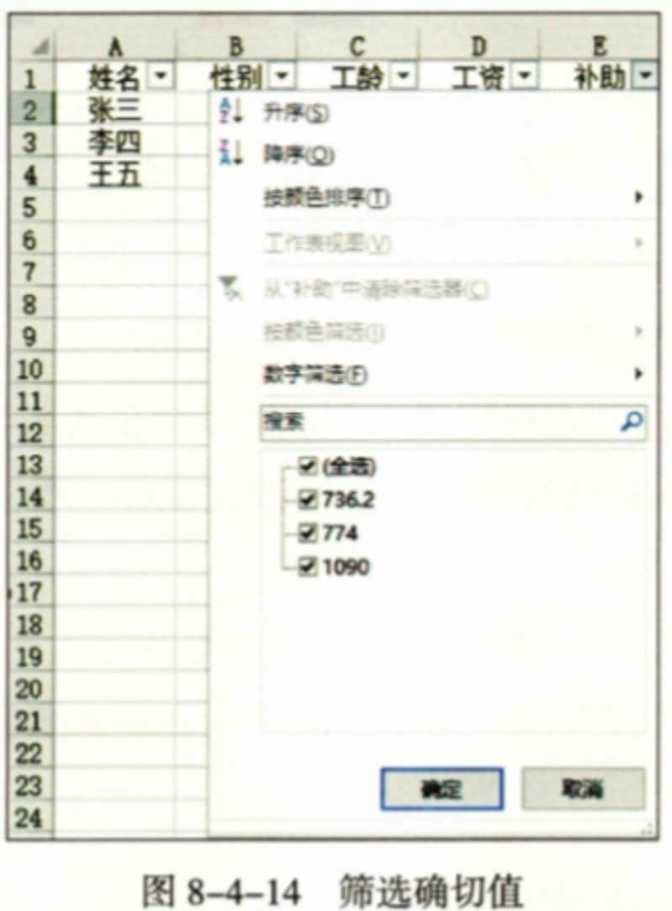


### 第五节 互联网的基本概念和应用

【知识要点】

1. 计算机网络术语。
2. 计算机网络的介质、接入方法。
3. 网络安全基本知识。
4. 浏览器、搜索引擎、电子邮件的操作。


#### 知识点1：什么是计算机网络

> ​	计算机网络是指将地理位置不同的具有独立功能的多台计算机及其外部设备，通过通信线路连接起来，在网络操作系统、网络管理软件及网络通信协议的管理和协调下，实现资源共享和信息传递的计算机系统。


#### 知识点2：计算机网络有哪些分类

> ​	计算机网络有不同的分类方法，每种网络名称都有其特殊的含义。
>
> 1. 按地理位置分
>
>    1. 局域网是在一局部的地理范围内（如一个单位、学校等）建立的网络连接，覆盖地区的直径在数千米以内。
>    2. 城域网的规模局限在一座城市的范围内，覆盖地区的直径为十千米到数十千米。
>    3. 广域网跨越城市、国家甚至全球，覆盖地区的直径为数十千米到数千千米乃至上万千米。局域网和广域网是网络的热点。局域网是组成其他两种类型网络的基础，城域网一般都加入了广域网。广域网的典型代表是互联网。
>
> 2. 按传输介质分
>
>    1. 有线网。有线网是采用同轴电缆、双绞线和光纤来连接的计算机网络。同轴电缆网是一种常见的网络连接方式。它比较经济，安装较为便利，传输率和抗干扰能力一般，传输距离较短。双绞线网是目前最常见的网络连接方式。它价格便宜，安装方便，但易受干扰，传输率较低，传输距离比同轴电缆要短。光纤网采用光导纤维作为传输介质。光纤传输距离长，传输率高，抗干扰性强，不会受到电子监听设备的监听，是要求高安全性网络的理想选择。但其价格较高，且需要高水平的安装技术。
>    2. 无线网。无线网用电磁波作为载体来传输数据，具有灵活方便的特点。
>
> 3. 按拓扑结构分
>
>    网络的拓扑结构是指网络中通信线路和站点（计算机或设备）的几何排列形式。
>
>    1. 星型网络。各站点通过点到点的链路与中心站相连。星型网络很容易在网络中增加新的站点，数据的安全性和优先级容易控制，易实现网络监控，但中心节点，的故障会导致整个网络瘫痪。
>    2. 环型网络。各站点通过通信介质形成封闭的环状结构。环型网络容易安装和监控，但容量有限，网络建成后，难以增加新的站点。
>    3. 总线型网络。网络中所有的站点共享一条数据通道。总线型网络安装简单方便，需要铺设的电缆最短，成本低，某个站点的故障一般不会影响整个网络，但介质的故障会导致网络瘫痪。总线型网络安全性低，监控比较困难，增加新站点也不如星型网络容易。树型、簇星型、网状等其他类型的拓扑结构都是以上述3种拓扑结构为基础形成的。


#### 知识点3：什么是互联网

> ​	互联网又称国际网络，指的是网络与网络之间所串连成的庞大网络，这些网络以一组通用的协议相连，形成逻辑上的单一巨大国际网络。


#### 知识点4：网络有哪些特性

> ​	网络的实现使单一、分散的计算机有机地连成一个系统，它主要有以下几项特性。
>
> 1. 资源共享
>
>    网络的主要功能就是资源共享。共享的资源包括软件资源、硬件资源以及存储在公共数据库中的各类数据资源。网上用户能部分或全部地共享这些资源，使网络中的资源能够互通有无、分工协作，从而大大提高系统资源的利用率。
>
> 2. 快速传输信息
>
>    分布在不同地区的计算机系统，可以通过网络及时、高速地传递各种信息，交换数据，发送电子邮件，使人们之间的联系更加紧密。
>
> 3. 提高系统可靠性
>
>    在网络中，计算机之间是互相协作、互相备份的关系，通过在网络中采用一些备份的设备和一些负载调度、数据容错等技术，使得当网络中的某一部分出现故障时，网络中的其他部分可以自动接替其任务。因此，与单机系统相比，计算机网络具有较高的可靠性。
>
> 4. 易于进行分布式处理
>
>    在网络中，还可以将-个比较大的问题或任务分解为若干个子问题或任务，进而分散到网络中不同的计算机上进行计算处理。这种分布式处理能力在进行一些重大课题的研究开发时是卓有成效的。
>
> 5. 综合信息服务
>
>    在当今的信息化社会里，个人、办公室、图书馆、企业和学校等，每时每刻都在产生并处理大量的信息，包括文字、数字、声音、图像甚至视频，通过网络能够收集、处理这些信息，并进行信息的传送。


#### 知识点5：网络有哪些性能指标

> ​	衡量网络性能的指标包括速率、带宽、吞吐量、时延等。
>
> 1. 速率
>
>    在计算机网络中速率指的是数据的传输速率，即每秒传输的比特数量，它也称为数据率或比特率。速率是计算机网络中最重要的一个性能指标，单位是bit/s，有时候也写为b/s或者bps。
>
> 2. 带宽
>
>    网络带宽用来表示网络通信线路传送数据的能力，即在单位时间内从网络的某一点到另一点所能通过的最高数据量。带宽的单位是比特每秒，即b/s。一般来讲，单位前通常加上千（k）、兆（M）、吉（G）、太（T）等表示相应的倍数。
>
> 3. 吞吐量
>
>    吞吐量是指单位时间内通过某个网络（或信道、接口）的数据量。吞吐量常用于对实际使用网络的测量，以便了解实际能够通过网络的数据量。显然，吞吐量会受到网络带宽或网络额定速率的限制。例如，对于一个100Mb/s的以太网，其额定速率为100Mb/s，那么这个数值也是该以太网吞吐量的绝对上限值。也就是说，对于100Mb/s的以太网，其典型的吞吐量可能只有70Mb/s。
>
> 4. 时延
>
>    时延是指数据（一个报文或分组，甚至比特）从网络（或链路）的一端传送到另一端所需的时间。时延也称为延迟或迟延。网络中的时延由发送时延、传播时延、排队时延和处理时延组成。


#### 知识点6：常见的网络传输介质有哪些

> ​	网络传输介质是网络中发送方与接收方之间的物理通路，它对网络的数据通信具有一定的影响。局域网通常采用单一的传输介质，而城域网和广域网采用多种传输介质。
> ​	常用的传输介质有双绞线、同轴电缆、光纤、无线传输媒介。其中，无线传输介质包括无线电波、微波、红外线等。


#### 知识点7：常见的网络设备有哪些

> ​	网络设备及部件是指连接到网络中的物理实体。基本的网络设备有计算机、集线器、交换机、网桥、路由器、网关、网卡、无线接入点、打印机和调制解调器等。


#### 知识点8：什么是IP地址

> ​	IP是internet protocol的缩写，意思是“网络之间互连的协议”，也就是为计算机网络的连接及通信而设计的协议。在互联网中，它是指能使连接到网络的所有计算机实现相互通信的一套规则，规定了计算机在互联网中进行通信时应当遵守的规则。IP地址也称为互联网协议地址，由网络ID和主机ID两部分组成。
>
> 1. 网络ID用来标识计算机所在的网络，也可以说是网络的编号。
> 2. 主机ID用来标识网络内的不同计算机，即计算机的编号。


#### 知识点9：网络故障排除遵循什么原则

> ​	网络故障排除的一般原则是，观察设备指示灯（包括电源指示灯、数据指示灯、网卡指示灯）和报错信息，先硬件（路由器、网卡设置和网络设备运行状态）后软件（IP地址配置信息），先内部后外部，先本地后外网，充分检查后再向网络运营商或网络管理部门申报。


#### 知识点10：网络故障有哪些排除方法

> ​	网络故障大多数是由于网络配置不正确、网线接头松动、网线断开以及网络设备、计算机系统故障等原因引起的。此外，电压不正常、温度过高、雷击等也容易：造成故障。下面列举两类比较常见的故障。
>
> 1. 宽带上网模式常见的网络故障
>
>    一般可通过观察路由器指示灯状态来帮助排除故障。
>
> 2. 系统提示“网络电缆没有插好”故障
>
>    1. 网线老化或者质量差，可使用测线器测试一下网线的连通性，或者更换一条高质量的网线。
>    2. 网口虚接，网卡和网线的连接不稳定。可能是网卡的金属弹片变形或水晶头质量不好，可更换一个独立网卡或者更换一个水晶头。
>    3. 网卡或网络设备损坏，可先更新网卡的驱动程序，如果还不能解决则更换网卡。


#### 知识点11：计算机网络安全性包括哪些方面

> 1. 保密性
>
>    计算机中的信息只能被授予访问权限的用户读取（包括显示、打印等，也包括暴露信息存在的事实）。
>
> 2. 数据完整性
>
>    计算机系统中的信息资源只能被授予修改权限的用户修改。
>
> 3. 可利用性
>
>    具有访问权限的用户在需要时可以通过计算机系统中的信息资源得到文件。


#### 知识点12：什么是计算机病毒

> ​	计算机病毒是编制者在计算机程序中插入的，能破坏计算机功能或者数据，影响计算机使用，并能自我复制的一组计算机指令或者程序代码。简单来说，计算机病毒是一个程序、一段可执行代码，具有自我繁殖、互相传染以及激活再生等生物病毒特征。计算机病毒有独特的复制能力，它们能够快速蔓延，又常常难以根除。它们能把自身附着在各种类型的文件上，当文件被复制或从一个用户传送到另一个用户时，它们就随同文件一起蔓延开来。


#### 知识点13：计算机病毒有哪些传播途径

> 1. 通过移动存储设备进行病毒传播
>
>    U盘、光盘、移动硬盘等都可以是病毒的传播路径，因为它们经常被移动和使用，所以更容易成为计算机病毒的携带者。
>
> 2. 通过网络传播
>
>    网页、电子邮件、即时通信软件等都可以是计算机病毒的网络传播途径。特别是近年来，随着网络技术的发展和互联网的普及，计算机病毒的传播速度越来越快，传播范围也在逐步扩大。
>
> 3. 利用计算机系统和应用软件的弱点传播
>
>    近年来，越来越多的计算机病毒利用计算机系统和应用软件的不足进行传播，所以此途径也被划分为计算机病毒的基本传播途径。


#### 知识点14：如何安全使用计算机

> 1. 安装最新的杀毒软件，定期对计算机进行病毒查杀，上网时要开启杀毒软件的全部监控。
> 2. 培养良好的上网习惯。不随便浏览或登录陌生的网站，谨慎浏览不知名网站和下载来历不明的软件，防止木马入侵，加强自我保护。对不明邮件及附件慎重打开。尽可能使用较为复杂的密码。
> 3. 培养自觉的信息安全意识，在使用移动存储设备时，尽可能不要共享这些设备，因为移动存储设备是计算机病毒攻击的主要目标。在对信息安全要求比较高的场所，应将计算机的USB接口封闭，同时，在有条件的情况下应该做到专机专用。
> 4. 用系统安全更新功能打全系统补丁，同时，将应用软件升级到最新版本，如播放器软件、通信软件等，避免病毒以网页木马的方式入侵系统或者通过应用软件漏洞进行病毒传播。将受到病毒侵害的计算机尽快隔离。在使用计算机的过程中，若发现存在病毒或者计算机异常，应该及时中断网络；若发现计算机网络一直中断或者网络异常，应立即切断网络，以免病毒在网络中传播。


#### 知识点15：什么是电子邮件，如何使用电子邮箱

> ​	电子邮件是指通过计算机编制而成并经网络传递、收发的信息文件。它具有速度快、价格低廉、使用方便、信息多样化、功能强大和个性化等特点。电子邮件需要通过电子邮箱进行收发。电子邮箱主要具有信件的起草与编辑、信件发送、收信通知、信件收取与检索、退信说明、信件的管理、地址簿管理、电子邮件的安全管理等功能。
>
> 1. 申请电子邮箱
>
>    下面以163免费邮箱为例，介绍电子邮箱的申请方法。
>
>    1. 启动网页浏览器，登录email.163.com。
>    2. 在打开的163电子邮箱首页中单击“注册新账号”链接。
>    3. 用户根据要求填写电子邮箱地址、登录密码、手机号码等项目，单击底部的“立即注册”按钮。
>
> 2. 电子邮件发送
>
>    1. 登录163免费邮箱页面，单击“写信”按钮，进入写信页面。
>    2. 在页面内填写收件人的邮箱地址、邮件的主题和邮件正文等内容。在编写正文时可以添加图片，像Word文档-样对正文内容进行编辑。
>    3. 如果用户要发送附件，可以在“主题”文本框下方单击“添加附件”按钮添加附件。
>    4. 完成填写正文和添加附件之后，单击“发送”按钮，即可发送邮件。
>
> 3. 电子邮件阅读比人
>
>    电子邮件阅读即用户登录自己的邮箱，选择邮件并查看邮件内容。
>
>    1. 登录163免费邮箱。在窗口左侧文件夹列表中单击“收件箱”按钮打开收件箱。收件箱后面括号里的数字表示邮箱中还未阅读的新邮件数量。
>    2. 在收件箱列表中选择要查看的邮件，在主题处单击即可打开邮件，阅读邮件内容。如果邮件带有附件，只需要根据提示点击就可打开查看。


#### 知识点16：什么是电子邮箱地址

> ​	发送和接收邮件服务器可以在全球范围内使用。所以每个用户的电子邮箱必须有一个统一的地址格式。
> ​	电子邮箱地址格式组成：username@119.cn。
> ​	第一部分：用户名称：username。
> ​	第二部分：连接符号“@”（读作at）。
> ​	第三部分：电子邮箱所在邮件服务器的名称。
> ​	第五节 互联网的基本概念和应用


#### 知识点17：什么是网页浏览器

> ​	浏览器是用来检索、展示以及传递全球广域网（World Wide Web，简称Web）信息资源的应用程序。Web信息资源由统一资源标识符标记，它可以是一个网页、一张图片、一段视频或者任何在Web上呈现的内容。使用者可以借助超级链接，通过浏览器浏览互相关联的信息。常见的浏览器有QQ浏览器、360安全浏览器、IE浏览器等。


#### 知识点18：网页浏览器由哪些部分组成

> 1. 地址栏
>
>    地址栏用于输入网站的地址，浏览器通过识别地址栏中的信息，正确连接用户要访问的内容。例如，要登录“消防职业技能鉴定考试网”，只需在地址栏中输入
>
>    消防职业技能鉴定考试网的网址（https://xfhyjd.119.gov.cn），然后按Enter键或单击地址栏右侧的按钮即可。在地址栏中还附带了浏览器中常用命令的快捷按钮，如添加书签、分享网页等，前进、后退按钮设置在地址栏前方。
>
> 2. 菜单栏
>
>    由“书签”“工具”等菜单组成。每个菜单中包含了控制浏览器工作的相关命令选项，这些选项包含了浏览器所有的操作与设置功能。
>
> 3. 选项卡
>
>    目前几乎所有的浏览器都可以使用多选项卡的浏览方式，即以选项卡的方式打开网站的页面。
>
> 4. 页面窗口
>
>    页面窗口是浏览器的主窗口，访问的网页内容显示在此。页面中有些文字或对象具有超链接属性，当鼠标指针放上去之后会变成手状，单击左键，浏览器就会自动跳转到该链接指向的网址；单击右键，则会弹出快捷菜单，可以从中选择要执行的操作命令。
>
> 5. 状态栏
>
>    状态栏实时显示当前的操作和下载Web页面的进度情况。打开网页时，还会显示网站打开的进度。


#### 知识点19：什么是搜索引擎

> ​	搜索引擎是指提供信息检索服务的网站，它使用某些程序把互联网上的所有信息归类以帮助人们搜寻到所需要的信息，包括信息搜集、信息整理和用户查询。


#### 知识点20：机房环境控制需要注意些什么

> 1. 定期检查及记录空调系统的制冷、、制热与除湿功能，保证机房内的温度
>
>    与湿度保持在合理范围内。机房正常工作的环境温度应保持在18~28℃（最佳为21~23℃），相对湿度保持在40%~70%（最佳为45%~50%），大气压力保持在86~106kPa。
>
> 2. 机房应配备温湿度记录仪。机房管理员每个工作日记录机房的温湿度情况，并由工程部每月定期（可约定为每月的第一个工作日）导出书面的温湿度记录。对于记录不符合项，机房管理员应联系工程部在本工作日结束前完成相应设备的检修，并做好记录。
>
> 3. 定期对机房内的设备进行除尘等清洁工作。保证机房内清洁、有序。每周必须做一次机房清洁程度评定，由网络部负责人复核。
>
> 4. 进入机房的人员不得携带易燃、易爆、腐蚀性、强电磁、辐射性、流体物质等对设备正常运行构成威胁的物品。机房内严禁吸烟、吃喝、嬉戏和剧烈运动，尽量保持机房安静。


## 第九章 相关法律、法规知识


### 第一节 《中华人民共和国劳动法》《中华人民共和国消防法》相关知识

【知识要点】

1. 劳动法的含义、主要内容、调整对象。
2. 消防法制定的原因。
3. 消防法的主要内容。


#### 知识点1：什么是劳动法

> ​	劳动法是国家为了保护劳动者的合法权益，调整劳动关系，建立和维护适应社会主义市场经济的劳动制度，促进经济发展和社会进步，根据宪法制定颁布的法律。从狭义上讲，劳动法是指1994年7月5日第八届全国人民代表大会常务委员会第八次会议通过，自1995年1月1日起施行的《中华人民共和国劳动法》（2009年8月27日修正，2018年12月29日第二次修正）；从广义上讲，劳动法是调整劳动关系的法律法规，以及调整与劳动关系密切相关的其他社会关系的法律规范的总称。


#### 知识点2：劳动法的主要内容包括什么

> ​	《中华人民共和国劳动法》包括总则、促进就业、劳动合同和集体合同、工作时间和休息休假、工资、劳动安全卫生、女职工和未成年工特殊保护、职业培训、社会保险和福利、劳动争议、监督检查、法律责任、附则共13章。


#### 知识点3：劳动法的调整对象是什么

> ​	劳动法的调整对象是指劳动关系以及与劳动关系密切相关的其他社会关系。其中，劳动关系是我国劳动法调整的主要对象。


#### 知识点4：劳动法规定的劳动者的劳动权利有哪些

> ​	劳动者享有平等就业和选择职业的权利、取得劳动报酬的权利、休息休假的权利、获得劳动安全卫生保护的权利、接受职业技能培训的权利、享受社会保险和福利的权利、提请劳动争议处理的权利以及法律规定的其他劳动权利。


#### 知识点5：为什么制定消防法

> ​	为了预防火灾和减少火灾危害，加强应急救援工作，保护人身、财产安全，维护公共安全。


#### 知识点6：什么情况处3万元以上30万元以下罚款

> ​	有下列行为之一的，由住房和城乡建设主管部门、消防救援机构按照各自职权责令停止施工、停止使用或者停产停业并处3万元以上30万元以下罚款。
>
> 1. 依法应当进行消队设计审查的建设工程，未经依法审查或者审查不合格，擅自施工的。
> 2. 依法应当进行消防验收的建设工程，未经消防验收或者消防验收不合格，擅自投入使用的。
> 3. 《中华人民共和国消防法》规定的其他建设工程验收后经依法抽查不合格，不停止使用的。
> 4. 公众聚集场所未经消防安全检查或者经检查不符合消防安全要求，擅自投入使用、营业的。


#### 知识点7：什么情况处5000元以下罚款

> ​	建设单位未依照《中华人民共和国消防法》规定在验收后报住房和城乡建设主管部门备案的，由住房和城乡建设主管部门责令改正，处5000元以下罚款。


#### 知识点8：什么情况处1万元以上10万元以下罚款

> ​	有下列行为之一的，由住房和城乡建设主管部门责令改正或者停止施工，并处1万元以上10万元以下罚款。
>
> 1. 建设单位要求建筑设计单位或者建筑施工企业降低消防技术标准设计、施工的。
> 2. 建筑设计单位不按照消防技术标准强制性要求进行消防设计的。
> 3. 建筑施工企业不按照消防设计文件和消防技术标准施工，降低消防施工质量的。
> 4. 工程监理单位与建设单位或者建筑施工企业串通，弄虚作假，降低消防施工质量的。


#### 知识点9：什么情况处5000元以上5万元以下罚款

> ​	单位违反规定，有下列行为之一的，责令改正，处5000元以上5万元以下罚款。
>
> 1. 消防设施、器材或者消防安全标志的配置、设置不符合国家标准、行业标准，或者未保持完好有效的。
> 2. 损坏、挪用或者擅自拆除、停用消防设施、器材的。
> 3. 占用、堵塞、封闭疏散通道、安全出口或者有其他妨碍安全疏散行为的。
> 4. 埋压、圈占、遮挡消火栓或者占用防火间距的。
> 5. 占用、堵塞、封闭消防车通道，妨碍消防车通行的。
> 6. 人员密集场所在门窗上设置影响逃生和灭火救援的障碍物的。
> 7. 对火灾隐患经消防救援机构通知后不及时采取措施消除的。


#### 知识点10：什么情况对个人处警告或者500元以下罚款

> ​	个人有下列行为之一的，处警告或者500元以下罚款。
>
> 1. 损坏、挪用或者擅自拆除、停用消防设施、器材的。
> 2. 占用、堵塞、封闭疏散通道、安全出口或者有其他妨碍安全疏散行为的。
> 3. 埋压、圈占、遮挡消火栓或者占用防火间距的。
> 4. 占用、堵塞、封闭消防车通道，妨碍消防车通行的。
> 5. 第一节《中华人民共和国劳动法》《中华人民共和国消防法》相关


#### 知识点11：什么行为处警告或者500元以下罚款，情节严重的处5日以下拘留

1. 违反消防安全规定进入生产、储存易燃易爆危险品场所的。
2. 违反规定使用明火作业或者在具有火灾、爆炸危险的场所吸烟、使用明火的。


#### 知识点12：什么行为尚不构成犯罪，但处10日以上15日下拘留，可并处500元以下罚款；情节较轻的，处警告或者500元以下罚款

> 1. 指使或者强令他人违反消防安全规定，冒险作业的。
> 2. 过失引起火灾的。
> 3. 在火灾发生后阻拦报警，或者负有报告职责的人员不及时报警的。
> 4. 扰乱火灾现场秩序，或者拒不执行火灾现场指挥员指挥，影响灭火救援的。
> 5. 故意破坏或者伪造火灾现场的。
> 6. 擅自拆封或者使用被消防救援机构查封的场所、部位的。


#### 知识点13：人员密集场所使用不合格的消防产品或者国家明令淘汰的消防产品，应该怎样处罚

> ​	人员密集场所使用不合格的消防产品或者国家明令淘汰的消防产品的，责令限期改正；逾期不改正的，处5000元以上5万元以下罚款，并对其直接负责的主管人员和其他直接责任人员处500元以上2000元以下罚款；情节严重的，责令停产停业。


### 第二节 《火灾自动报警系统设计规范》《火灾自动报警系统施工及验收标准》相关知识

【知识要点】

1. 《火灾自动报警系统设计规范》（GB 50116-2013）《火灾自动报警系统施工及验收标准》（GB 50166-2019）的制定目的。
2. 《火灾自动报警系统设计规范》（GB 50116-2013)、《火灾自动报警系统施工及验收标准》（GB 50166-2019）的颁布实施日期、适用范围和主要内容。

#### 知识点1：《火灾自动报警系统设计规范》

> ​	为了合理设计火灾自动报警系统，预防和减少火灾危害，保护人身和财产安全，制定《火灾自动报警系统设计规范》（GB 50116－2013）。

 

#### 知识点2：《火灾自动报警系统设计规范》（GB 50116—2013）何时颁布实施

> ​	《火灾自动报警系统设计规范》（GB 50116-2013）于2013年9月6日颁布，自2014年5月1日起实施。


#### 知识点3：《火灾自动报警系统设计规范》（GB 50116-2013）的适用范围是什么

> ​	本规范适用于新建、扩建和改建的建、构建物中设置的火灾自动报警系统的设计，不适用于生产和贮存火药、炸药、弹药、火工品等场所设置的火灾自动报警系统的设计。


#### 知识点4：《火灾自动报警系统设计规范》（GB 50116-12013）主要内容包括哪些

> ​	主要内容包括总则、术语、基本规定、消防联动控制设计、火灾探测器的选择、系统设备的设置、住宅建筑火灾自动报警系统、可燃气体探测报警系统、电气火灾监控系统、系统供电、布线典型场所的火灾自动报警系统等。
>


#### 知识点5：《火灾自动报警系统施工及验收标准》（GB 50166-2019）制定的目的是什么

> ​	为了保障火灾自动报警系统的施工质量和使用功能，预防和减少火灾危害，保护人身和财产安全，制定《火灾自动报警系统施工及验收标准》（GB 50166-2019）。


#### 知识点6：《火灾自动报警系统施工及验收标准》（GB 50166-2019）何时颁布实施

> ​	《火灾自动报警系统施工及验收标准》（GB 50166-2019）于2019年11月22日颁布，自2020年3月1日起实施。


#### 知识点7：《火灾自动报警系统施工及验收标准》（GB 50166-2019）的适用范围是什么

> ​	本标准适用于建（构）筑物中设置的火灾自动报警系统的施工、检测、验收及维护保养，不适用于火药、炸药、弹药、火工品等生产和贮存场所设置的火灾自动报警系统的施工、检测、验收及维护保养。


#### 知识点8：《火灾自动报警系统施工及验收标准》（GB 50166-2019）主要内容包括哪些

> ​	主要内容包括总则、基本规定、施工、系统调试、系统检测与验收、系统运行维护等。


### 第三节 《城市消防远程监控系统技术规范》相关知识

【知识要点】

1. 《城市消防远程监控系统技术规范》（GB 50440-2007）的制定目的。
2. 《城市消防远程监控系统技术规范》（GB 50440-2007）的颁布实施日期、适用范围和主要内容。


#### 知识点1：《城市消防远程监控系统技术规范》（GB 50440-2007）制定的目的是什么

> ​	为了合理设计和建设城市消防远程监控系统（以下简称远程监控系统），保障远程监控系统的设计和施工质量，实现火灾的早期报警和建筑消防设施运行状态的集中监控，提高单位消防安全管理水平，制定《城市消防远程监控系统技术规范》（GB 50440-2007）。


#### 知识点2：《城市消防远程监控系统技术规范》（GB 50440-2007）何时颁布实施

> ​	《城市消防远程监控系统技术规范》（GB 5044-2007)于2007年10月23日颁布，自2008年1月1日起实施。


#### 知识点3：《城市消防远程监控系统技术规范》（GB 50440-2007）适用范围有哪些

> ​	本规范适用于远程监控系统的设计、施工、验收及运行维护。


#### 知识点4：《城市消防远程监控系统技术规范》
（GB 50440-2007）主要内容包括哪些

> ​	主要内容包括总则、术语、基本规定、系统设计、系统配置和设备功能要求、系统施工、系统验收、系统的运行及维护等。


### 第四节 《建筑灭火器配置设计规范》《建筑灭火器配置验收及检查规范》相关知识

【知识要点】

1. 《建筑灭火器配置设计规范》（GB 50140-2005）、《建筑灭火器配置验收及检查规范》（GB 50444-2008）的制定自的。
2. 《建筑灭火器配置设计规范》（GB 50140-2005）、《建筑灭火器配置验收及检查规范》(GB 044-2008）的颁布实施日期、适用范围和主要内容。


#### 知识点1：《建筑灭火器配置设计规范》（GB 50140-2005制定的目的是什么

> ​	为了合理配置建筑灭火器，有效地扑救工业与民用建筑初起火灾，减少火灾损失，保护人身和财产的安全，制定《建筑灭火器配置设计规范》（GB 50140-2005）。


#### 知识点2：《建筑灭火器配置设计规范》（GB 50140-2005）何时颁布实施

> ​	《建筑灭火器配置设计规范》(GB 50140-2005）于2005年7月15日颁布，自2005年10月1日起实施。


#### 知识点3：《建筑灭火器配置设计规范》（GB 50140-2005）的适用范围是什么

> ​	本规范适用于生产、使用或储存可燃物的新建、改建、扩建的工业与民用建筑工程，不适用于生产或储存炸药、弹药、火工晶、花炮的厂房或库房。


#### 知识点4：《建筑灭火器配置设计规范》（GB 50140-2005）主要内容包括哪些”

> ​	主要内容包括总则、术语和符号、灭火器配置场所的火灾种类和危险等级、灭火器的选择、灭火器的设置、灭火器的配置、灭火器配置设计计算等。


#### 知识点5：《建氛灭火器配置验收及检查规范》（GB 5044-2008）制定的目的是什么

> ​	为了保障建筑灭火器的合理安装配置和安全使用，及时有效地扑灭初起火灾，减少火灾危害，保护人身和财产安全，制定《建筑灭火器配置验收及检查规范》（GB 50444-2008）。


#### 知识点6：《建筑灭火器配置验收及检查规范》（GB 50444-2008）何时颁布实施

> ​	《建筑灭火器配置验收及检查规范》(GB 50444-2008）于2008年8月13日颁布，自2008年11月1日起实施。


#### 知识点7：《建筑灭火器配置验收及检查规范》（GB 50444-2008）的适用范围是什么

> ​	本规范适用于工业与民用建筑中灭火器的安装，设置、验收、检查和维护，不适用于生产或储存炸药、弹药、火工品、花炮的厂房或库房。


#### 知识点8：《建筑灭火器配置验收及检查规范》（GB 50444-2008）主要内容包括哪些

> ​	主要内容包括总则、基本规定、安裝设置、配置验收、检查与维护等。


### 第五节 《建筑防烟排烟系统技术标准》相关知识

【知识要点】

1. 《建筑防烟排烟系统技术标准》（GB 51251-2017）的制定目的
2. 《建筑防烟排烟系统技术标准》（GB 51251-217）的颁布实施日期、适用范围和主要内容。


#### 知识点1：《建筑防烟排烟系统技术标准》（GB 51251-2017）制定的目的是什么

> ​	为了合理设计建筑防烟、排烟系统，保证施工质量，规范验收和维护管理，减少火灾危害，保护人身和财产安全，制定《建筑防烟排烟系统技术标准》（GB 51251-2017）。


#### 知识点2：《建筑防烟排烟系统技术标准》（GB 51251-2017）何时颁布实施

> ​	《建筑防烟排烟系统技术标准》（GB 51251-2017）于2017年11月20日颁布，自2018年8月1日起实施。


#### 知识点3：《建筑防烟排烟系统技术标准》（GB 51251-2017）的适用范围是什么

> ​	本标准适用于新建、扩建和改建的工业与民用建筑的防烟、排烟系统的设计、施工、验收及维护管理。对于有特殊用途或特殊要求的工业与民用建筑，当专业标准有特别规定的，可从其规定。


#### 知识点4：《建筑防烟排烟系统技术标准》（GB 51251-2017）主要内容包括哪些

> ​	主要内容包括总则、术语和符号、防烟系统设计、排烟系统设计、系统控制、系统施工、系统调试、系统验收、维护管理等。规定应当每年对全部防烟排烟系统进行一次联动试验和性能检测。


### 第六节 《消防应急照明和疏散指示系统技术标准》相关知识

【知识要点】

1. 《消防应急照明和疏散指示系统技术标准》（GB 51309-2018）的制定目的。
2. 《消防应急照明和疏散指示系统技术标准》（GB 51309-2018）的颁布实施日期、适用范围和主要内容。


#### 知识点1：《消防应急照明和疏散指示系统技术标准》（GB 51309-2018)制定的目的是什么

> ​	为了合理设计消防应急照明和疏散指示系统，保证消防应急照明和疏散指示系统的施工质量，确保系统正常运行，制定《消防应急照明和疏散指示系统技术标准》（GB 51309-2018）。


#### 知识点2：《消防应急照明和疏散指示系统技术标准》（GB 51309-2018）何时颁布实施

> ​	《消防应急照明和疏散指示系统技术标准》（GB 51309-2018）于2018年7月10日颁布，自2019年3月1日起实施。


#### 知识点3：《消防应急照明和疏散指示系统技术标准》（GB 51309-2018）的适用范围是什么

> ​	本标准适用于建、构筑物中设置的消防应急照明和疏散指示系统的设计、施工、调试、检测、验收与维护保养。


#### 知识点4：《消防应急照明和疏散指示系统技术标准》（GB 51309-2018）主要内容包括哪些

> ​	主要内容包括总则、术语、系统设计、施工、系统调试、系统检测与验收、系统运行维护等。


### 第七节 《防火卷帘、防火门、防火窗施工及验收规范》相关知识

【知识要点】

1. 《防火卷帘、防火门、防火窗施工及验收规范》（GB 50877-2014）的制定目的。
2. 《防火卷帘、防火门、防火窗施工及验收规范》（GB 50877-2014）的颁布实施日期、适用范围和主要内容。


#### 知识点1：《防火卷帘、防火门、防火窗施工及验收规范》（GB 50877-2014）制定的目的是什么

> ​	为了保证防火卷帘、防火门、防火窗工程的施工质量和使用功能，减少火灾危害，保护人身和财产安全，制定《防火卷帘、防火门、防火窗施工及验收规范》（GB 50877-2014）。


#### 知识点2：《防火卷帘、防火门、防火窗施工及验收规范》（GB 50877-2014）何时颁布实施

> ​	《防火卷帘、防火门、防火窗施工及验收规范》（GB 50877-2014）于2014年1月9日颁布，自2014年8月1日起实施。


#### 知识点3：《防火卷帘、防火门、防火窗施工及验收规范》（GB 50877-2014）的适用范围是什么

> ​	本规范适用于新建、扩建、改建工程中设置的防火卷帘、防火门、防火窗的施工、验收及维护管理。


#### 知识点4：《防火卷帘、防火门、防火窗施工及验收规范》（GB 50877-2014）主要内容包括哪些

> ​	主要内容包括总则、术语、基本规定、进场检验、安装、功能调试、验收、使用与维护等。


### 第八节 《消防给水及消火栓系统技术规范》相关知识

【知识要点】

1. 《消防给水及消火栓系统技术规范》（GB  50974-2014）的制定目的。
2. 《消防给水及消火栓系统技术规范》（GB 50974-2014）的颁布实施日期、适用范围和主要内容。


#### 知识点1：《消防给水及消火栓系统技术规范》（GB 50974-2014）制定的目的是什么

> ​	为了合理设计消防给水及消火栓系统，保障施工质量，规范验收和维护管理，减少火灾危害，保护人身和财产安全，制定《消防给水及消火栓系统技术规范》（GB 50974-2014）。


#### 知识点2：《消防给水及消火栓系统技术规范》（GB 50974-2014)何时颁布实施

> ​	《消防给水及消火栓系统技术规范》（GB 50974-2014）于2014年1月29日颁布，自2014年10月1日起实施。


#### 知识点3：《消防给水及消火栓系统技术规范》（GB 50974-2014）的适用范围是什么

> ​	本规范适用于新建、扩建、改建的工业、民用、市政等建筑工程的消防给水及消火栓系统的设计、施工、验收和维护管理。


#### 知识点4：《消防给水及消火栓系统技术规范》（GB 50974-2014）主要内容包括哪些

> ​	主要内容包括总则、术语和符号、基本参数、消防水源、供水设施、给水形式、消火栓系统、管网、消防排水、水力计算、控制与操作、施工、系统调试与验收、维护管理等。


### 第九节 《自动喷水灭火系统设计规范》《自动喷水灭火系统施工及验收规范》相关知识

【知识要点】

1. 《自动喷水灭火系统设计规范》（GB 50084-2017）、《自动喷水灭火系统施工及验收规范》（GB 50261-2017）的制定目的。
2. 《自动喷水灭火系统设计规范》（GB 50084-2017）、《自动喷水灭火系统施工及验收规范》（GB 50261-2017）的颁布实施日期、适用范围和主要内容。


#### 知识点1：《自动喷水灭火系统设计规范》（GB  50084-2017）制定的目的是什么

> ​	为了正确、合理地设计自动喷水灭火系统，保护人身和财产安全，制定《自动喷水灭火系统设计规范》（CB 50084-2017） 。


#### 知识点2：《自动喷水灭火系统设计规范》（GB 500842017）何时颁布实施

> ​	《自动喷水灭火系统设计规范》（GB 50084-2017）于2017年5月27日颁布，自2018年1月1日起实施。


#### 知识点3：《自动喷水灭火系统设计规范》（GB 50084-2017）的适用范围是什么

> ​	本规范适用于新建、扩建、改建的民用与工业建筑中自动喷水灭火系统的设计，不适用于火药、炸药、弹药、火工品工厂、核电站及飞机库等特殊功能建筑中自动喷水灭火系统的设计。


#### 知识点4：《自动喷水灭火系统设计规范》（GB 50084-2017）主要内容包括哪些

> ​	主要内容包括总则、术语和符号、设置场所火灾危险筹级系统基本要求、设计基本参数、系统组件、喷头布置、管道、水力计算、供水、操作与控制、局部应用系统等。


#### 知识点5：《自动喷水灭火系统施工及验收规范》（GB 50261-2017）制定的目的是什么

> ​	为了保障自动喷水灭火系统的施工质量和使用功能，减少火灾危害，保护人身和财产安全，制定《自动喷水灭火系统施工及验收规范》（GB 50261-2017）。


#### 知识点6：《自动喷水灭火系统施工及验收规范》（GB 50261-2017）何时颁布

> ​	实施《自动喷水灭火系统施工及验收规范》（GB 50261-2017）于2017年5月27日颁布，自2018年1月1日起实施。


#### 知识点7：《自动喷水灭火系统施工及验收规范》（GB 50261-2017）的适用范围是什么

> ​	本规范适用于工业与民用建筑中设置的自动喷水灭火系统的施工、验收及维护管理。


#### 知识点8：《自动喷水灭火系统施工及验收规范》（GB 50261-2017）主要内容包括哪些

> ​	主要内容包括总则、术语、基本规定、供水设施安装与施工、管网及系统组件安装、系统试压和冲洗、系统调试、系统验收、维护管理等。


### 第十节《泡沫灭火系统技术标准》相关知识

【知识要点】

1. 《泡沫灭火系统技术标准》（GB 50151-2021）的制定目的。
2. 《泡沫灭火系统技术标准》（GB 50151-2021)的颁布实施日期、适用范围和主要内容。


#### 知识点1：《泡沫灭火系统技术标准》(GB 50151-2021)制定的目的是什么

> ​	为了合理地设计泡沫灭火系统，保障其施工质量和使用功能，减少火灾危害，保护人身和财产安全，制定《泡沫灭火系统技术标准》（GB 50151-2021）。


#### 知识点2:《泡沫灭火系统技术标准》（GB 50151-2021）何时颁布实施

> ​	《泡沫灭火系统技术标准》（GB 50151-2021）于2021年4月9日颁布，自2021年10月1日起实施。


#### 知识点3:《泡沫灭火系统技术标准》（GB 50151-2021）的适用范围是什么

> ​	本标准适用于新建、改建、扩建工程中设置的泡沫灭火系统的设计、施工、验收及维护管理，不适用于船舶、海上石油平台等场所设置的泡沫灭火系统。


#### 知识点4：《泡沫灭火系统技术标准》（GB 50151-2021）主要内容包括哪些

> ​	主要内容包括总则、术语、泡沫液和系统组件、低倍数泡沫灭火系统、中倍数与高倍数泡沫灭火系统、泡沫-水喷淋系统与泡沫喷雾系统、泡沫消防泵站及供水、水力计算、施工、验收、维护管理等。


### 第十一节 《自动跟踪定位射流灭火系统技术标准》《固定消防炮灭火系统设计规范》《固定消防炮灭火系统施工与验收规范》相关知识

【知识要点】

1. 《自动跟踪定位射流灭火系统技术标准》（GB 51427-2021）《固定消防炮灭火系统设计规范》（CB50338-2003）、《固定消防炮灭火系统施工与验收规范》（GB 50498-2009）的制定目的。
2. 《自动跟踪定位射流灭火系统技术标准》（GB 51427-2021)、《固定消防炮灭火系统设计规范》（GB 50338-2003）《固定消防炮灭火系统施工与验收规范》（GB 50498-2009）的颁布实施日期、适用范围和主要内容。


#### 知识点1：《自动跟踪定位射流灭火系统技术标准》（GB 51427-2021）制定的目的是什么

> ​	为了合理设计自动跟踪定位射流灭火系统，保证施工质量，规范验收和维护管理，减少火灾损失，保护人身和财产安全，制定《自动跟踪定位射流灭火系统技术标准》（GB 51427-2021）


#### 知识点2：《自动跟踪定位射流灭火系统技术标准》（GB 51427-2021）何时颁布实施

> ​	《自动跟踪定位射流灭火系统技术标准》（GB 51427-2021）于2021年4月9日颁布，自2021年10月1日起实施。


#### 知识点3：《自动跟踪定位射流灭火系统技术标准》（GB 51427-2021）的适用范围是什么

> ​	本标准适用于新建、扩建和改建的民用与工业建筑中自动跟踪定位射流灭火系统的设计、施工、验收和维护管理，不适用于火药、炸药、弹药、火工品工厂及仓库，核电站及飞机库等特殊功能建筑中自动跟踪定位射流灭火系统的设计、施工、验收和维护管理。


#### 知识点4：《自动跟踪定位射流灭火系统技术标准》（GB 51427-2021）主要内容包括哪些

> ​	主要内容包括总则、术语和符号、基本规定、设计、施工、验收、维护管理等。


#### 知识点5：《固定消防炮灭火系统设计规范》（GB 50338-2003）制定的目的是什么

> ​	为了合理地设计固定消防炮灭火系统，减少火灾损失，保护人身和财产安全，制定《固定消防炮灭火系统设计规范》（GB 50338-2003）。


#### 知识点6：《固定消防炮灭火系统设计规范》（GB 50338-2003）何时颁布实施

> ​	《固定消防炮灭火系统设计规范》（GB 5038-2003）于2003年4月15日颁布，自2003年8月1日起实施。


#### 知识点7：《固定消防炮灭火系统设计规范》（GB 50338-2003）的适用范围是什么

> ​	本规范适用于新建、改建、扩建工程中设置的固定消防炮灭火系统的设计。


#### 知识点8：《固定消防炮灭火系统设计规范》（GB 50338-2003）主要内容包括哪些

> ​	主要内容包括总则、术语和符号、系统选择、系统设计、系统组件、电气等。


#### 知识点9：《固定消防炮灭火系统施工与验收规范》（GB 50498-2009）制定的目的是什么
>​	为了保障固定消防炮灭火系统的施工质量和使用功能，规范工程验收和维护管理，制定《固定消防炮灭火系统施工与验收规范》（GB 50498-2009）。


#### 知识点10：《固定消防炮灭火系统施工与验收规范》（GB 50498-2009）何时颁布实施

> ​	《固定消防炮灭火系统施工与验收规范》（GB 50498-2009）于2009年5月13日颁布，自2009年10月1日起实施。


#### 知识点11：《固定消防炮灭火系统施工与验收规范》（GB 50498-2009）的适用范围是什么

> ​	本规范适用于新建、扩建、改建工程中设置固定消防炮灭火系统的施工、验收及维护管理。


#### 知识点12：《固定消防炮灭火系统施工与验收规范》（GB 50498-2009）主要内容包括哪些

> ​	主要内容包括总则、基本规定、进场检验、系统组件安装与施工、电气安装与施工、系统试压与冲洗、系统调试、系统验收、维护管理等。


### 第十二节 《气体灭火系统设计规范》《气体灭火系统施工及验收规范》相关知识

【知识要点】

1. 《气体灭火系统设计规范》（GB 50370-2005)、《气体灭火系统施工及验收规范》（GB 50263-2007）的制定目的。
2. 《气体灭火系统设计规范》（GB 50370-2005)）、《气体灭火系统施工及验收规范》（GB 50263-2007）的颁布实施日期、适用范围和主要内容。


#### 知识点1：《气体灭火系统设计规范》（GB 50370-2005）制定的自防是什么

> ​	为了合理设计气体灭火系统，减少火灾危害，保护人身和财产的安全，制定《气体灭火系统设计规范》（GB 50370-2005）。


#### 知识点2:《气体灭火系统设计规范》（GB 50370-2005）何时颁布实施

> ​	《气体灭火系统设计规范》（GB 50370-2005）于2006年3月2日颁布，自2006年5月1日起实施。


#### 知识点3：《气体灭火系统设计规范》（GB 50370-2005）的适用范围是什么

> ​	本规范适用于新建、改建、扩建的工业和民用建筑中设置的七氟丙烷、IG541混合气体和热气溶胶全淹没灭火系统的设计。


#### 知识点4:《气体灭火系统设计规范》（GB 50370-2005）主要内容包括哪些

> ​	主要内容包括总则、术语和符号、设计要求、系统组件、操作与控制、安全要求等。


#### 知识点5：《气体灭火系统施工及验收规范》（GB 50263-2007）制定的目的是什么

> ​	为了统一气体灭火系统工程施工及验收要求，保障气体灭火系统工程质量，制定《气体灭火系统施工及验收规范》（GB 50263-2007）。


#### 知识点6：《气体灭火系统施工及验收规范》（GB 50263-2007）何时颁布实施

> ​	《气体灭火系统施工及验收规范》（GB 50263-2007）于2007年1月24日颁布，自2007年7月1日起实施。


#### 知识点7：《气体灭火系统施工及验收规范》（GB 50263-2007）的适用范围是什么
>​	本规范适用于新建、扩建、改建工程中设置的气体灭火系统工程施工及验收、维护管理。


#### 知识点8：《气体灭火系统施工及验收规范》（GB 50263-2007）主要内容包括哪些

> ​	主要内容包括总则、术语、基本规定、进场检验、系统安装、系统调试、系纷验收、维护管理等。


### 第十三节 《建筑消防设施的维护管理》相关知识

【知识要点】

1. 《建筑消防设施的维护管理》（GB 25201-2010）的制定目的。
2. 《建筑消防设施的维护管理》（GB 25201-2010）的颁布实施日期、适用范围和主要内容。


#### 知识点1：《建筑消防设施的维护管理》（GB 25201-2010）制定的目的是什么

> ​	为了引导和规范建筑消防设施的维护管理工作，确保建筑消防设施完好有效，依据国家现行法律法规和消防技术标准，制定《建筑消防设施的维护管理》（GB 25201-2010）。


#### 知识点2：《建筑消防设施的维护管理》（GB 25201-2010）何时颁布实施

> ​	《建筑消防设施的维护管理》（GB 25201-2010）于2010年9月26日颁布，自2011年3月1日起实施。


#### 知识点3：《建筑消防设施的维护管理》（GB 25201-2010）的适用范围是什么
>​	本标准适用于在用建筑消防设施的维护管理。


#### 知识点4：《建筑消防设施的维护管理》（GB 25201-2010）主要内容包括哪些
>​	主要内容包括范围、规范性引用文件、术语和定义、总则、值班、巡查、检测、维修、保养、档案等。


### 第十四节 其他消防设施设计、施工和验收、检测规范标准相关知识

【知识要点】

1. 其他消防设施设计、施工和验收、检测规范标准的制定目的。
2. 其他消防设施设计、施工和验收、检测规范标准的颁布实施日期、适用范围和主要内容。


#### 知识点1：《干粉灭火系统设计规范》（GB 50347-2004）制定的目的是什么

> ​	为了合理设计干粉灭火系统，减少火灾危害，保护人身和财产安全，制定《干粉灭火系统设计规范》（GB 50347-2004）。


#### 知识点2：《干粉灭火系统设计规范》（GB 50347-2004）何时颁布实施

> ​	《干粉灭火系统设计规范》（GB 50347-2004）于2004年9月2日颁布，自2004年11月1日起实施。


#### 知识点3：《干粉灭火系统设计规范》(GB 50347-2004）的适用范围是什么

> ​	本规范适用于新建、扩建、改建工程中设置的干粉灭火系统的设计。


#### 知识点4：《干粉灭火系统设计规范》（GB 50347-2004）主要内容包括哪些

> ​	主要内容包括总则、术语和符号、系统设计、管网计算、系统组件、控制与操作、安全要求等。


#### 知识点5：《二氧化碳灭火系统设计规范（2010年版）》（GB 50193-93）制定的目的是什么

> ​	为了合理地设计二氧化碳灭火系统，减少火灾危害，保护人身和财产安全，制定《二氧化碳灭火系统设计规范（2010年版) 》(GB 50193-93）


#### 知识点6：《二氧化碳灭火系统设计规范（2010年版）》（GB 50193-93）何时颁布实施

> ​	《二氧化碳灭火系统设计规范（2010年版）》（GB 50193-93）于2010年4月17日颁布，自2010年8月1日起实施。


#### 知识点7：《二氧化碳灭火系统设计规范（2010年版）》（GB 50193-93）的适用范围是什么

> ​	本规范适用于新建、扩建、改建工程及生产和储存装置中设置的二氧化碳灭火系统的设计。


#### 知识点8：《二氧化碳灭火系统设计规范（2010年版）》（GB 50193-93）主要内容包括哪些

> ​	主要内容包括总则、术语和符号、系统设计、管
> 网计算、系统组件、控制与操作、安全要求等。


#### 知识点9：《细水雾灭火系统技术规范》(GB 50898-2013）的目的是什么

> ​	为了合理设计细水雾灭火系统，保证其施工质量，规范其验收和维护管理，减少火灾危害，保护人身和财产安全，制定《细水雾灭火系统技术规范》（GB 50898-2013）。


#### 知识点10：《细水雾灭火系统技术规范》（GB 50898-2013）何时颁布实施

> ​	《细水雾灭火系统技术规范》（GB 50898-2013）于2013年6月8日颁布，自2013年12月1日起实施。


#### 知识点11：《细水雾灭火系统技术规范》（GB 50898-2013）的适用范围是什么

> ​	本规范适用于建设工程中设置的细水雾灭火系统的设计、施工、验收及维护管理。


#### 知识点12：《细水雾灭火系统技术规范》（GB 50898-2013）主要内容包括哪些主要内容

> ​	包括总则、术语和符号、设计、施工、验收、维护管理等。


#### 知识点13：《水喷雾灭火系统技术规范》（GB 50219－2014）制定的目的是什么

> ​	为了合理地设计水喷雾灭火系统，保障其施工质量和使用功能，减少火灾危害，保护人身和财产安全，制定《水喷雾灭火系统技术规范》（GB 50219-2014）。
> 第


#### 知识点14：《水喷雾灭火系统技术规范》（GB 50219-2014）何时颁布实施

> ​	《水喷雾灭火系统技术规范》（GB 50219-2014）于2014年10月9日颁布，自2015年8月1日起实施。


#### 知识点15：《水喷雾灭火系统技术规范》（GB 50219-2014）的适用范围是什么

> ​	本规范适用于新建、扩建和改建工程中设置的水喷雾灭火系统的设计、施工、验收及维护管理，不适用于移动式水喷雾灭火装置或交通运输工具中设置的水喷雾灭火系统。


#### 知识点16：《水喷雾灭火系统技术规范》（GB 50219-2014）主要内容包括哪些

> ​	主要内容包括总则、术语和符号、基本设计参数和喷头布置、系统组件、给水、操作与控制、水力计算、施工、验收、维护管理等。


#### 知识点17：《建筑内部装修设计防火规范》（GB 50222-2017）制定的目的是什么

> ​	为了规范建筑内部装修设计，减少火灾危害，保护人身和财产安全，制定《建筑内部装修设计防火规范》（GB 50222-2017）。


#### 知识点18：《建筑内部装修设计防火规范》（GB 50222-2017）何时颁布实施

> ​	《建筑内部装修设计防火规范》（GB 50222-2017）于2017年7月31日颁布，自2018年4月1日起实施。


#### 知识点19：《建筑内部装修设计防火规范》（GB 50222-2017）的适用范围是什么

> ​	本规范适用于工业和民用建筑的内部装修防火设计，不适用于古建筑和木结构建筑的内部装修防火设计。


#### 知识点20：《建筑内部装修设计防火规范》（GB 50222-2017）主要内容包括哪些

>​	主要内容包括总则、术语、装修材料的分类和分级、特别场所、民用建筑、厂房仓库等。


#### 知识点21：《消防设施画角规范》（GB 55036-2022）制定的目的是什么

> ​	为了使建设工程中的消防设施有效发挥作用，减少火灾危害，依据有关法律、法规，制定《消防设施通用规范》（GB 55036-2022）。


#### 知识点22：《消防设施通用规范》（GB 55036-2022）何时颁布实施

> ​	《消防设施通用规范》(GB 55036-2022）于2022年7月15日颁布，自2023年3月1日起实施。


#### 知识点23：《消防设施通用规范》（GB 55036-2022）自适用范围是什么

> ​	建设工程中消防设施的设计、施工、验收、使用和维护必须执行本规范。


#### 知识点24：《消防设施通用规范》（GB 55036-2022）主要内容包括哪些

> ​	主要内容包括总则，基本规定，消防给水与消火栓系统，自动喷水灭火系统，泡沫灭火系统，水喷雾、细水雾灭火系统，固定消防炮、自动跟踪定位射流灭火系统，气体灭火系统、干粉灭火系统、灭火器、防烟与排烟系统、火灾自动报警系统等。


#### 知识点25：《建筑防火通用规范》（GB 55037-2022）制定的目的是什么

> ​	为了预防建筑火灾、减少火灾危害，保障人身和财产安全，使建筑防火要求安全适用、技术先进、经济合理，依据有关法律、法规，制定《建筑防火通用规范》（GB 55037-2022）。


#### 知识点26：《建筑防火通用规范》（GB 55037-2022）何时颁布实施

> ​	《建筑防火通用规范》（GB 55037-2022）于2022年12月17日颁布，自2023年6月1日起实施。


#### 知识点27：《建筑防火通用规范》（GB 55037-2022）的适用范围是什么
>​	除生产和储存民用爆炸物品的建筑外，新建、改建和扩建建筑在规划、设计、施工、使用和维护中的防火，以及既有建筑改造、使用和维护中的防火，必须执行本规范。


#### 知识点28:《建筑防火通用规范》（GB 55037-2022）主要内容包括哪些

> ​	主要内容包括总则，基本规定，建筑总平面布局
> 建筑平面布置与防火分隔，建筑结构耐火，建筑构造与装修，安全疏散与避难设施，消防设施，供暖、通风和空气调节系统，电气，建筑施工，使用与维护等。


## 第十章 设施操作

自带电源非集中控制型系统由：**应急照明配电箱、消防应急灯具和配电线路**组成。


### 消防应急广播

> - 消防应急广播xi't**消防应急广播控制器（广播主机）**、**功率放大器（功放）**、**消防专用扬声器（广播喇叭）**、**分区分配盘 / 分区模块**、**消防联动线路、广播音频线路**
> - 消防应急广播设备应能同时**向一个或多个指定区域广播信息**。
> - 声压要求：扬声器正前方 3m 处，广播声压 65dB～115dB；在环境噪声大于 60dB 的场所设置的扬声器，**在其播放范围内最远点的播放声压级应高于背景噪声 15dB**。
> - 消防应急广播主机、功放机指示灯**过温 / 过热灯（黄）**内部功放管温度超 90℃，持续 6s 后点亮，过热保护，停止输出。**过载灯（黄）**输出功率＞额定功率 120% 且持续**2s**后点亮，功放进入保护停机。
> - 消防应急广播的线路应独立敷设并有耐热保护，不应和其他线路同槽或同管敷设


### 消防水泵

> - 自动巡检
>   - 自动巡检采用**变频低频低速**运行，不提升管网压力；目的防止水泵叶轮、轴套锈蚀锈死、电机受潮；火灾工况必须**工频全速**供水，巡检变频不能用于灭火供水。采用**低频变频电源逐台**启动，单台水泵低速转动**不少于 2min**；多台泵依次巡检，不同时启动多台泵。水泵、电气、电源故障时，发出**声光报警**；具备故障记录、数据储存功能，可查询历史故障。巡检程序同步检查主、备电源自动切换装置功能是否正常。
> - 消防水泵不应设置自动停泵功能。
> - 自动启动控制
>   - 高位水箱出水管流量开关启泵
>   - 消防水泵出水干管低压压力开关启泵
>   - 湿式报警阀压力开关启泵
>   - 火灾报警联动自动启动


### 稳压泵

> 安装位置：
>
> - 上置式：**稳压泵扬程小、功率低、省电**，气压罐承压低、充气压力小，设备造价更低；
> - 下置式：下置全部设备集中在地下室泵房，屋顶无需额外布置稳压设备，减轻屋面荷载、节约屋顶机房面积。


### 火灾显示盘

> - 当一个报警区域包含**多个楼层**时，**宜在每个楼层设置一台仅显示本楼层的火灾显示盘**。
> - 壁挂式火灾显示盘，**设备底边距地面高度宜为 1.3m～1.5m**。
> - 主电源可保证火灾报警状态连续工作**4h**


### 图形显示装置

> 消防控制室图形显示装置报警历史记录可查询火警、监管、反馈及是否消除、启动及是否停止、故障及是否恢复、屏蔽及是否解除、其他事件。


### 火灾自动报警系统

> - 建筑物未设置火灾自动报警系统时，应在建筑物的管理中心或指定层提供一个普通电梯手动召回按钮（也称消防开关）。
> - 设置火灾自动报警系统，但未设置消防控制室的场所，宜选择集中控制型消防应急照明和疏散指示系统。
> - 消防控制室**多线控制盘（多线盘）上的启停按钮**，与现场水泵 / 风机**控制柜的启停按钮**之间，采用**专用控制线、控制电缆（硬线直连）点对点直接硬线连接**。


### 防火卷帘

> - 疏散通道上每侧不少于**2 只**专用感温探测器（防止单只故障失效），卷帘**任一侧**，距离卷帘纵深 **0.5m～5m** 范围内
> - 所有**垂直防火卷帘**必须具备**自重恒速下降**功能；断电、电机失效、报警系统瘫痪时，依靠自身重量自动关闭，不依赖电力电机驱动


### 感温探测器

> 线型感温火灾探测器按动作性能共分为三类：**定温型、差温型、差定温型**
>
> 线型感温火灾探测器由**敏感部件、信号处理单元、终端部件**三大部分组成。


### 防火门

> 防火门门磁开关核心用途：**实时监视防火门的开启、关闭状态**
>
> 防火门监控器指示灯颜色：
>
> - 绿色：电源正常工作、电磁释放器关闭到位反馈信号
> - 红色：启动信号、动作信号、门磁开门反馈报警
> - 黄色（黄色 / 琥珀色）：故障、自检状态
>
> 
>
> 故障声压：在监控器**正前方 1m 处**测量，故障声信号声压级：**65dB～85dB**
>
> 防火门监控器记录容量**不应少于 10000 条**。附加功能：支持历史记录查询、信息上传。
>
> 防火门监控器主面板组成：
>
> - 液晶显示屏
> - 各类指示灯
> - 功能按键
> - 打印机


### 消防应急灯具

> 消防应急灯具按工作方式分为两类：**持续型**、**非持续型**
>
> - 持续型：平时节电亮，应急全亮（标志灯必用）
> - 非持续型：平时不亮，应急才亮（仅限照明灯具）
>
> 
>
> 应急照明控制器应能**控制并显示与其配接的所有集中控制型消防应急灯具、应急照明集中电源、应急照明配电箱**的工作状态。


### 送风

> **防火分区火灾确认后，应在 15s 内联动开启常闭加压送风口、同时启动加压送风机**。


### 排烟

> 火灾确认、火灾报警系统联动触发**自动排烟窗**，应在**60s 内**开启完毕；若烟气充满储烟仓时间小于 60s，则以更短时间为准。
>
> - 速记口诀：机械排烟阀 15 秒，挡烟垂壁、排烟窗 60 秒。


### 消防电话

> 消防电话分机发起呼叫时，消防电话总机应在 **3s 内** 发出呼叫声光信号，并显示呼叫分机地址。
